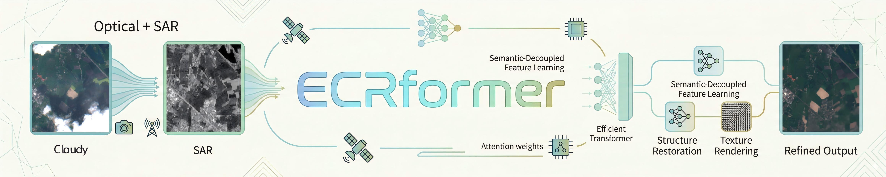
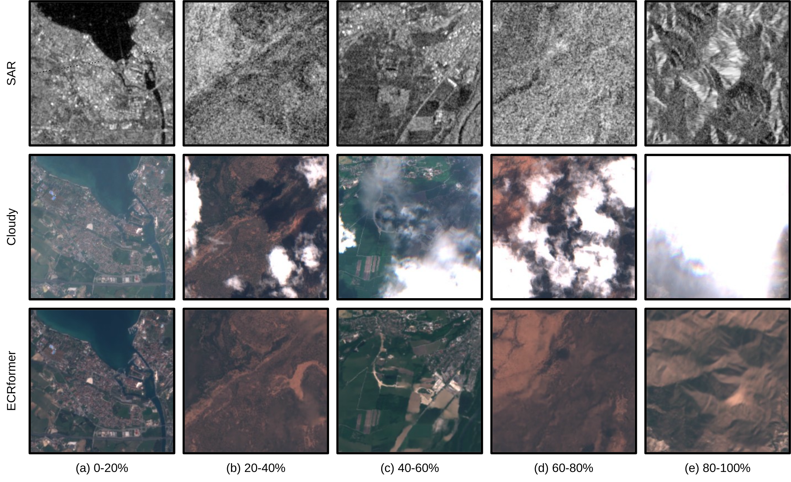

<div align="center">

  

  <h2><b> ECRformer: An Efficient Cloud Removal Transformer with Semantic-Decoupled Learning for Multimodal Satellite Imagery </b></h2>

  **[ISPRS Journal of Photogrammetry and Remote Sensing](https://www.sciencedirect.com/journal/isprs-journal-of-photogrammetry-and-remote-sensing)**

  [Zaiyan Zhang](https://zzaiyan.github.io/), Jie Li\*, Yuanqi Liang, Jining Yan, Yi Xiao, Xin Su, Qiangqiang Yuan\*

  *Wuhan University & China University of Geosciences & Zhengzhou University*

</div>

<div align="center">

[[Paper]](https://doi.org/10.1016/j.isprsjprs.2026.04.009), [[PDF]](https://zzaiyan.github.io/assets/pubs/ecrformer.pdf), [[DeepWiki]](https://deepwiki.com/zzaiyan/ECRformer)

</div>

## Updates

- 2026-05: Updated official testing script, visualization notebook, and pretrained weights.
- 2026-04: Paper accepted by ISPRS J PRS.
- 2026-03: Released the code.
- 2025-11: Created the repository.


## Overview

Remote sensing imagery is essential for environmental monitoring, but frequent cloud cover severely limits the usability of optical observations. ECRformer addresses multimodal optical-SAR cloud removal with an efficient transformer backbone and a principled training strategy.

The method combines:

1. Efficient attention mechanisms such as Cross-Covariance Attention (XCA) and Multi-Dilation Window Attention (MDWA) for multimodal feature fusion and multi-scale spatial modeling.
2. Semantic-Decoupled Feature Learning (SDFL), which separates structure recovery and texture rendering to improve optimization stability and reconstruction quality.

These design choices lead to strong performance on SEN12MS-CR and LuojiaSET-OSFCR while keeping the model lightweight and practical.

<div align="center">
  
  <p><em>The overall framework of ECRformer.</em></p>
</div>

### Results

#### Quantitative Comparison on SEN12MS-CR and LuojiaSET-OSFCR


#### Visualization under Different Cloud Cover Conditions



### Model Variants

| Variant | Embed Dim | Depth per Stage | Bottleneck | Refinement | Params | FLOPs |
|---------|-----------|-----------------|------------|------------|--------|-------|
| ECRformer | 48 | [2, 3, 2] | 2 | 4 | 11.29M | 102.47G |
| ECRformer-Light | 32 | [2, 2, 1] | 1 | 2 | 3.70M | 35.78G |

## Quick Start

### Environment Setup

- Python >= 3.10
- PyTorch >= 2.0
- PyTorch Lightning >= 2.0

```bash
conda create -n ecrformer python=3.10 gdal rasterio
conda activate ecrformer && pip install -r requirements.txt
```

### Dataset Preparation

The default configs already use the raw SEN12MS-CR dataset loader. Update the dataset root in `config/base_config.py`:

```python
self.dataset.root = "/path/to/SEN12MSCR"
```

The default split is:

```python
self.dataset.split = ["train", "val", "test"]
```

This means:

- `train.py` uses `train` and `val` by default.
- `test.py` uses `test` by default.

Expected SEN12MS-CR directory structure:

```text
SEN12MSCR/
├── ROIs1158_spring_s1/
│   └── s1_1/
│       └── ROIs1158_spring_s1_1_p1.tif
├── ROIs1158_spring_s2/
│   └── s2_1/ ...
├── ROIs1158_spring_s2_cloudy/
│   └── s2_cloudy_1/ ...
...
```

The repository still keeps `data/npz_dataset.py` for legacy workflows, but the default documented path is raw SEN12MS-CR.

### Inference

```bash
# Auto-find the latest checkpoint under experiments/ and export to png/npz/both
python test.py --config ecrformer --gpu 0 --export-format png

# Evaluate a specific checkpoint
python test.py --config ecrformer --ckpt-path /path/to/checkpoint.ckpt --gpu 0
```

By default, outputs are written to `results/<run>/<split>/`, including:

- `metrics.csv`
- `summary.json`
- `pred_npz/` when `--export-format` includes `npz`
- `pred_rgb/` when `--export-format` includes `png`

### Training

```bash
# Train ECRformer
python train.py --config ecrformer --gpu 0

# Train ECRformer-Light
python train.py --config ecrformer_light --gpu 0

# Train with a custom experiment name
python train.py --config ecrformer --name my_experiment --gpu 0
```

Training logs are saved to `experiments/`. You can inspect them with TensorBoard:

```bash
tensorboard --logdir experiments/
```

### Visualization

Use [visualize_predictions.ipynb](visualize_predictions.ipynb) to compare exported predictions with the corresponding dataset samples.

The notebook supports:

- multiple sample indices in one run
- row-wise visualization of SAR mean, Cloudy RGB, Prediction RGB, Target RGB, and Error Map
- RGB rendering consistent with `test.py`
- optional per-band statistics when `pred_npz` is available

## Reference

### Contact

If you have any questions or suggestions, please contact:

📧 zzaiyan@whu.edu.cn, 1@zzaiyan.com

### Citation

If you find this work useful, please cite:

```bibtex
@article{zhang2026ecrformer,
    title     = {{ECRformer: An efficient cloud removal Transformer with semantic-decoupled learning for multimodal satellite imagery}},
    author    = {Zhang, Zaiyan and Li, Jie and Liang, Yuanqi and Yan, Jining and Xiao, Yi and Su, Xin and Yuan, Qiangqiang},
    journal   = {ISPRS Journal of Photogrammetry and Remote Sensing},
    volume    = {237},
    pages     = {323-338},
    year      = {2026},
    publisher = {Elsevier},
    doi       = {10.1016/j.isprsjprs.2026.04.009}
}
```

## Acknowledgement

- [Restormer](https://github.com/swz30/Restormer) — Transposed Attention and GatedFFN design.
- [SEN12MS-CR](https://patricktum.github.io/cloud_removal/sen12mscr/) — Training, validation and testing.
- [LuojiaSET-OSFCR](https://github.com/RSIIPAC/LuojiaSET-OSFCR) — Cross-domain testing.
- [PyTorch Image Models](https://github.com/huggingface/pytorch-image-models) — Useful toolkit.
- [PyTorch Lightning](https://github.com/Lightning-AI/pytorch-lightning) — Elegant training framework.
