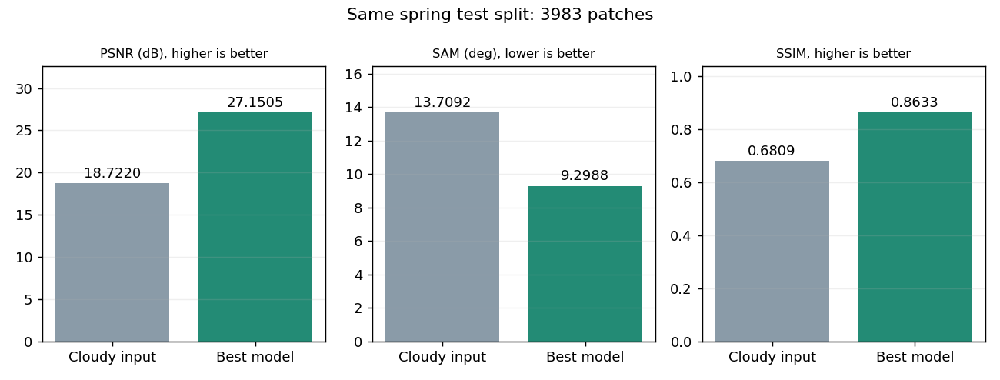
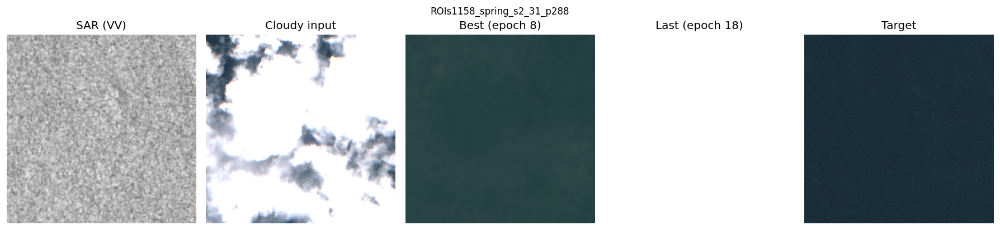
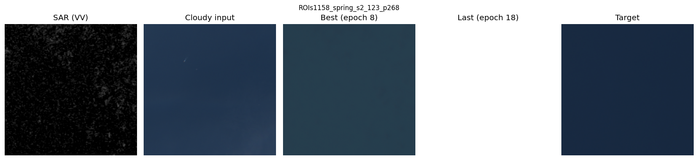
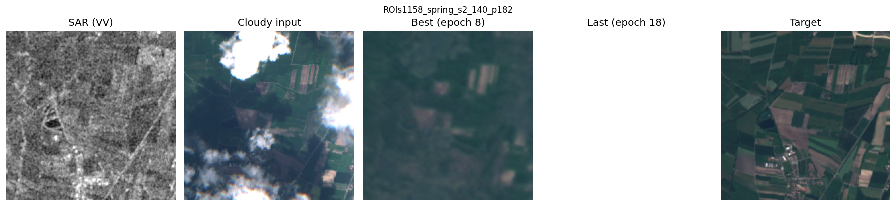
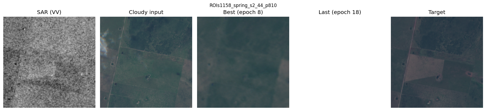
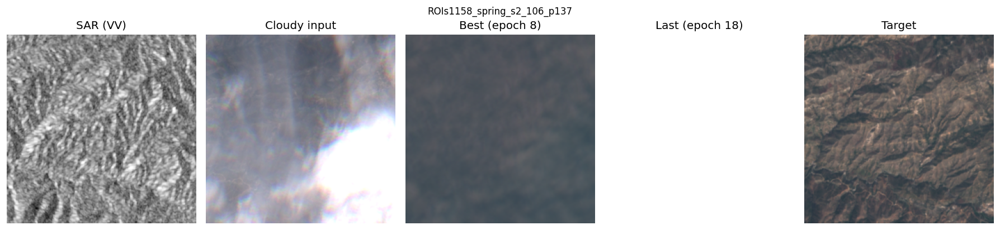
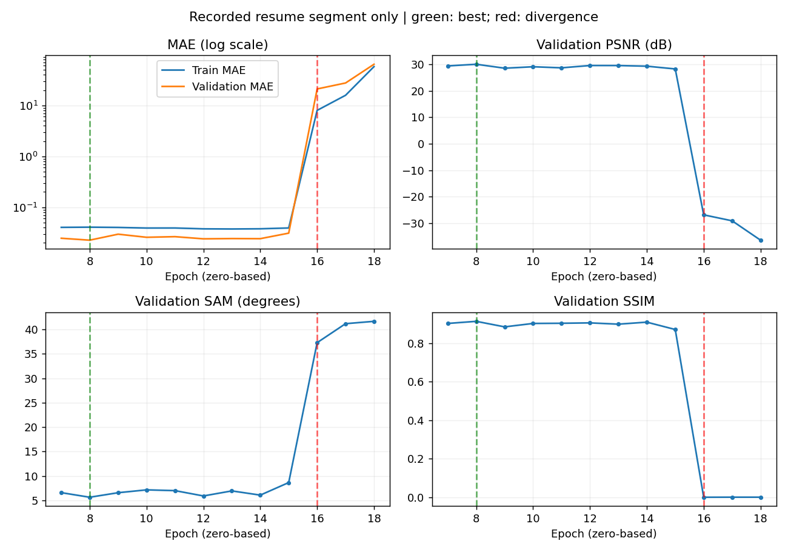

# ECRformer · SAR 기반 광학 영상 구름 제거

SAR 2밴드와 구름 낀 Sentinel-2 13밴드로 구름 없는 13밴드 광학 영상을 복원합니다. RGB 그림은 표시용이며 분광 성능은 전체 밴드 지표로 확인합니다.

## 연구 문서

- [기준 모델 재현 · 설정과 재실행 방법](docs/reproduction.md)
- [실험 이력 · 겨울 평가와 봄 학습](docs/previous_experiments.md)
- [결과 정리 기준](docs/reporting.md) · [체크포인트 평가·이미지 내보내기](docs/test_report_export.md)
- [다음 안정화 실행 방법](docs/stable_training.md)

## 최신 완료 평가 · spring 고정 6,000개 학습의 best 모델

2026-10-04 학습의 **best epoch 8**을 2026-10-05에 전체 spring test **3,983패치·5 ROI**로 평가했습니다. 학습은 새로 진행하지 않았습니다. 평가는 FP32, 전체 256×256, batch 1, TTA 없음입니다. 패치 수는 독립 위성 장면 수가 아닙니다.

| 전체 test 평균 | 구름 입력 baseline | best 모델 | 차이(best − baseline) |
| --- | ---: | ---: | ---: |
| RMSE ↓ | 0.159714 | 0.047767 | −0.111947 |
| MAE ↓ | 0.122987 | 0.033674 | −0.089313 |
| PSNR dB ↑ | 18.722031 | 27.150506 | +8.428475 |
| SAM ° ↓ | 13.709208 | 9.298802 | −4.410406 |
| SSIM ↑ | 0.680919 | 0.863298 | +0.182380 |
| LPIPS ↓ | 0.420266 | 0.434178 | **+0.013912 (악화)** |

baseline은 이전 학습 모델이 아니라 **구름 입력을 그대로 정답과 비교한 값**입니다. 동일 test 목록으로 비교했습니다. 평균 복원 오차는 줄었으나 LPIPS는 악화했고 그림에도 흐림·세부 손실이 남습니다. 모든 품질이 개선됐다고 해석하지 않습니다.

[상세 보고서](docs/experiments/spring_subset6000_test.md) · [평균/설정](reproduction/spring_subset6000_test_20261005/summary.json) · [3,983개 패치 지표](reproduction/spring_subset6000_test_20261005/metrics.csv)

그래프에 없는 LPIPS 악화도 위 표와 함께 확인합니다. 겨울 test·spring validation과는 조건이 달라 직접 개선량을 비교하지 않습니다.

### 사전 고정 5사례 · best와 발산한 last 비교

평가 수치를 보기 전에 seed 42로 서로 다른 test ROI에서 한 패치씩 선택했습니다. 왼쪽부터 **SAR(VV) · 구름 입력 · best epoch 8 · last epoch 18 · 정답**입니다. RGB 밴드는 0-based `(3,2,1)`, 동일 밝기 3.0이며 SAR는 공통 0~1 회색조입니다.

**last 열의 흰색은 누락 이미지가 아닙니다.** 마지막 모델의 출력이 정상 범위를 크게 벗어나 표시할 때 포화됐습니다. last는 이 5사례에만 평가했고, 그 숫자를 전체 test 평균으로 사용하지 않았습니다. 새 안정화 모델의 전후 비교도 아닙니다.

[선정 목록](reproduction/spring_subset6000_test_20261005/selection.json) · [5사례의 지표·출력 범위](reproduction/spring_subset6000_test_20261005/selected_metrics.json). 결과를 본 뒤 더 좋은 사례로 교체하지 않았습니다.

## 학습 로그 · epoch 16 발산

최적 검증 손실은 epoch 8에서 나왔고 epoch 16부터 학습·검증 오차가 폭증했습니다. epoch 18 이후 10회 미개선으로 조기 종료됐습니다. 정상 종료 코드와 성능 안정성은 별개입니다.

실제 기록된 **epoch 7~18만** 그렸고 없는 0~6은 채우지 않았습니다. MAE는 로그 축, 초록 점선은 best, 빨강은 발산 시점입니다. [학습 분석](docs/experiments/spring_subset6000.md)과 [compact 기록](reproduction/spring_subset6000_test_20261005/curves.json)을 연결했습니다.

## 다음 실행 준비 상태

`train_stable.py`는 lr 1e-4, 검증 정체 기반 감소, FP32 손실·검증 지표, 배치별 진단과 FP16/FP32 출력 비교를 지원합니다. CPU 단위 테스트 8개를 통과했지만 **안정화 설정의 새 학습·성능 개선은 아직 미검증**입니다. 이번에는 기존 checkpoint의 test만 진행했습니다.

작업은 `research/ecrformer-stable-training` 브랜치와 열린 PR에 계속 커밋합니다. main 병합은 사용자가 진행합니다.

## 이전 평가와 보관 자료

겨울 두 번째 부분의 같은 784 test 패치 미세조정 전후는 [이전 보고서](docs/experiments/winter_half2_finetune.md)에 보존했습니다. 기존 수치·그림·평가용 가중치는 유지합니다.

새 spring 보고에는 작은 지표·곡선·비교 PNG·선정 목록·해시만 올렸습니다. checkpoint, TIFF, 전체 NPZ와 원시 로그는 Git에 추가하지 않았습니다. [가중치·평가 source 식별자](reproduction/spring_subset6000_test_20261005/provenance.json)와 [산출물 manifest](reproduction/spring_subset6000_test_20261005/report_manifest.json)를 남겼습니다. 서버에 미커밋 변경이 있어 평가 Git HEAD와 실제 source 해시를 구분하며, 과거 학습 commit은 미확보로 표시합니다.
