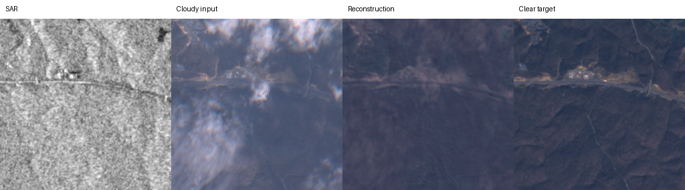
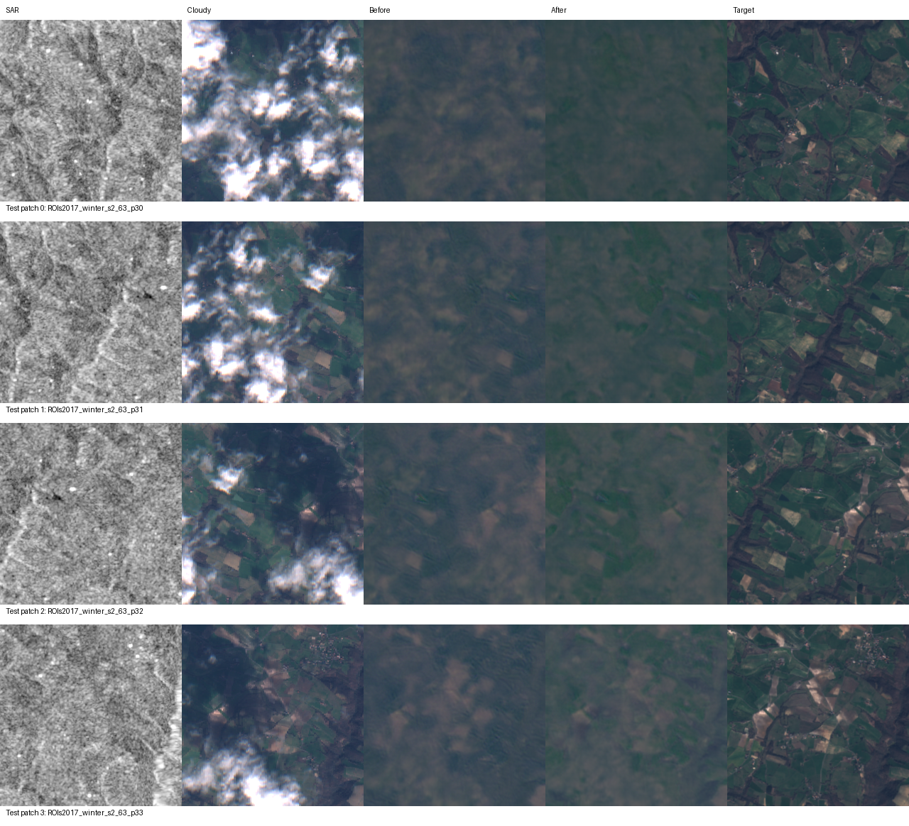

# ECRformer: 구름 제거 재현

## 연구 개요

ECRformer는 **구름 낀 광학 영상과 SAR 영상**을 입력으로 사용해 **구름 없는 Sentinel-2 13밴드 광학 영상**을 복원합니다. 이 폴더는 [원 논문](https://doi.org/10.1016/j.isprsjprs.2026.04.009)과 [공식 구현](https://github.com/zzaiyan/ECRformer)을 바탕으로 SEN12MS-CR 기준 모델의 학습·평가를 기록합니다. 이후 분광 정보 보존을 강화할 수 있는지 검토합니다.

## 현재 상태

**겨울 데이터 두 부분의 기준 실험과 두 번째 부분 미세조정 전후 평가를 완료했습니다.** 첫 번째 부분의 최고 성능 가중치를 두 번째 부분에 이어 학습했고, 같은 두 번째 부분 테스트 패치로 전후를 비교했습니다.

논문의 SEN12MS-CR 전체 테스트 세트를 동일 조건으로 평가한 단계는 아닙니다. 두 부분의 테스트 패치는 각각 한 겨울 테스트 ROI에서 나온 패치이며 독립 위성 장면 수로 해석하지 않습니다. 분광 확장 모델과 SAM 손실의 효과도 아직 검증되지 않았습니다.

## 공용 Windows 서버의 spring 학습 설정 (2026-10-04)

RTX 3060 Ti(VRAM 8GB), RAM 16GB 서버에서 다음 학습을 위해 `config/ecrformer_spring_config.py` 설정을 조정했습니다. 아래는 서버 로컬 설정이며, 이 설정 파일은 아직 Git에 추적되지 않습니다.

| 항목 | 수정 전 | 수정 후 |
| --- | --- | --- |
| 정밀도 | FP32 | FP16 혼합 정밀도 (`16-mixed`) |
| 학습 배치 크기 | 1 | 2 |
| Gradient accumulation | 16 | 8 |
| 유효 배치 크기 (단일 GPU) | 16 | 16 |

혼합 정밀도를 사용해 GPU 메모리 사용량을 줄이고 FP16 연산을 활용하도록 설정했습니다. 한 번에 처리하는 샘플 수는 2개로 늘렸으며, optimizer 업데이트당 샘플 수는 `2 × 8 = 16`으로 유지합니다. 배치 크기 증가와 accumulation 감소로 동작 특성은 달라질 수 있으며, 메모리 절감량·처리 속도·복원 성능은 실제 학습에서 측정해야 합니다. 설정 로딩은 확인했으며 **다음에 시작하는 학습부터 적용**됩니다. 이미 실행 중인 학습에는 반영되지 않습니다.

### 고정 1,000개 샘플로 소규모 학습

`Official_ECRformer/train.py`에 `--max-train-samples` 옵션을 추가했습니다. train·validation 분할을 만든 후 train에서 지정한 샘플 수를 시드 42로 한 번 선택하고, 각 epoch에서는 같은 샘플들의 처리 순서만 섞습니다. 검증 데이터 수는 유지하며 옵션을 생략하면 기존처럼 전체 train 분할을 사용합니다. 원본 TIFF를 별도 폴더로 복사하지 않습니다.

서버 spring 데이터에서 train **24,378개 중 1,000개 선택**, validation **756개 유지**, 선택된 샘플의 실제 TIFF 로딩을 확인했습니다. 1,000개는 S1·cloudy S2·정답 S2 묶음 1,000개(총 TIFF 3,000개)입니다. 현재 서버 데이터가 spring만 있으므로 전체 계절에서 고른 샘플은 아닙니다. 모델·전처리·손실·학습률 스케줄러는 변경하지 않았습니다.

선택 번호와 가능한 경우 원본 TIFF 경로를 TensorBoard 로그 폴더의 `train_subset.json`에 기록합니다. 중첩 `Subset`도 원본 경로로 해석하며, 동일 로그 폴더에 저장된 목록과 현재 선택이 다르면 오류로 알립니다. JSON을 읽어 목록을 복원하는 기능은 아니므로 재개할 때 데이터 구성·시드·샘플 수를 유지해야 합니다. 랜덤 crop과 회전·뒤집기는 계속 적용되므로 샘플이 고정돼도 모델이 보는 영상 영역과 방향은 달라질 수 있습니다. `--num-workers 0`도 지원합니다.

서버 로컬 spring 설정으로 새 실험을 시작하는 PowerShell 명령은 다음과 같습니다.

```powershell
cd C:\CtrS\ECRformer\Official_ECRformer
C:\CtrS\.venv\Scripts\python.exe train.py --config ecrformer_spring --name spring_fixed1000 --max-train-samples 1000 --max-epochs 100 --no-resume
```

배치 크기 2에서 epoch당 500배치이며, 최대 100 epoch 이전에 조기 종료될 수 있습니다. 새 실험에는 기존 로그와 겹치지 않는 이름을 사용합니다. 기존 MultiStepLR의 첫 감소 시점은 epoch 120이므로 새 100 epoch 실험에서는 해당 학습률 감소가 발생하지 않습니다. 이 절의 검증은 선택·로딩·설정 확인까지이며, **새 설정의 학습 결과나 성능 개선을 확인한 것은 아닙니다.** 원본 데이터·실험 로그·샘플 목록은 이번 문서 커밋에 포함하지 않습니다.

## 실험 결과

### 겨울 첫 번째 부분: 기준 모델

RTX A6000에서 학습 6,833개·검증 1,386개 패치를 사용했습니다. 시드 42, AdamW, 학습률 4e-4, 배치 4와 gradient accumulation 4(유효 배치 16), 최대 200 epochs, early stopping patience 10으로 설정했습니다. 검증 손실이 가장 낮은 가중치는 epoch 3이며, 실제 실행은 조기 종료까지 **14 epochs**였습니다.

최고 성능 가중치로 별도 테스트 패치 **783개**를 평가한 평균입니다.

| MAE↓ | PSNR↑ | SAM↓ | SSIM↑ | LPIPS↓ |
| ---: | ---: | ---: | ---: | ---: |
| 0.02544 | 29.61 dB | 11.250° | 0.84656 | 0.39683 |

RMSE는 0.03438입니다. [평균 지표와 평가 설정](./reproduction/winter_half1/summary.json), [샘플별 지표](./reproduction/winter_half1/metrics.csv), [학습 설정](./reproduction/winter_half1/hparams.yaml)을 보관했습니다.



### 겨울 두 번째 부분: 미세조정 전후

첫 번째 부분의 모델 가중치에서 **새 optimizer**로 시작했습니다. 두 번째 부분에서 학습 7,162개·검증 1,385개 패치를 인식했고, 학습률 1e-4, 시드 42, 유효 배치 16으로 **13 epochs** 실행했습니다. 검증 손실이 가장 낮은 가중치는 epoch 2입니다.

아래 값은 두 번째 부분의 **같은 테스트 패치 784개**를 같은 코드와 설정으로 평가한 평균입니다. 전후의 차이만 이 표에서 비교할 수 있습니다.

| 지표 | 미세조정 전 | 미세조정 후 | 변화 (후 − 전) |
| --- | ---: | ---: | ---: |
| RMSE↓ | 0.05518 | 0.05146 | −0.00372 |
| MAE↓ | 0.03932 | 0.03661 | −0.00271 |
| PSNR↑ | 25.245 dB | 25.888 dB | +0.643 dB |
| SAM↓ | 11.478° | 10.779° | −0.698° |
| SSIM↑ | 0.81873 | 0.82994 | +0.01121 |
| LPIPS↓ | 0.48422 | 0.47428 | −0.00994 |

평균 지표([전](./reproduction/winter_half2/before_summary.json)·[후](./reproduction/winter_half2/after_summary.json))와 샘플별 지표(`reproduction/winter_half2/before_metrics.csv`, `after_metrics.csv`)와 [학습 설정](./reproduction/winter_half2/hparams.yaml)을 보관했습니다. 첫 번째 부분의 전체 학습 샘플 명세가 없어 **두 부분 전체의 중복 여부는 확정하지 못했습니다.**



두 그림은 일부 패치의 표시용 예시입니다. SAR는 첫 밴드를 회색조로, 광학 영상은 밴드 인덱스 `(3, 2, 1)`에 밝기 배율 3.0을 적용했습니다. 13밴드 원본이나 전체 테스트의 대표 사례로 해석하지 않습니다.

## 논문과의 차이 및 해석 범위

| 항목 | 논문 | 현재 실험 |
| --- | --- | --- |
| 평가 범위 | SEN12MS-CR 전체 테스트 세트 | 겨울의 각 테스트 ROI에서 783개·784개 패치 |
| 학습률 조정 | 검증 손실이 5 epochs 개선되지 않으면 0.1배 | 공개 코드의 고정 epoch 스케줄러; 이번 조기 종료 전 감소 없음 |
| SAR 전처리 | VV `[-25, 0]` dB, VH `[-35, 0]` dB | 두 채널 모두 `[-25, 0]` dB |

논문 Table 1의 MAE 0.0164, SAM 4.693°, PSNR 33.37 dB, SSIM 0.932, LPIPS 0.188은 **전체 테스트 세트**의 수치입니다. 위 두 겨울 부분의 값과 나란히 볼 수는 있지만, 데이터 범위와 설정이 달라 동일 조건의 재현 오차나 모델의 우열로 해석할 수 없습니다. 첫 번째 부분과 두 번째 부분의 절댓값도 테스트 패치가 달라 직접적인 전후 비교가 아닙니다.

결과의 근거는 각 `summary.json`과 `metrics.csv`이며, 평가용 `model_weights.pt`는 각 결과 폴더에 있습니다. 이 파일은 optimizer·scheduler 상태가 없는 **모델 가중치만** 담고 있습니다. 학습 재개용 Lightning 체크포인트와 원본 TIFF는 Git에 포함하지 않았습니다.

## 재실행 방법

[공식 SEN12MS-CR 안내](https://patricktum.github.io/cloud_removal/sen12mscr/)에 따라 원본 데이터를 준비해야 합니다. TIFF 데이터는 Git에 없으며, 아래 경로에는 평가하려는 부분과 동일한 데이터 분할이 있어야 합니다. 공식 구현 의존성을 설치한 후 저장소 루트에서 실행합니다.

```bash
cd ECRformer/Official_ECRformer
python -m pip install -r requirements.txt rasterio
python test.py --config ecrformer --name winter_half1 \
  --data-root datasets/sen12mscr_winter --split test \
  --ckpt-path ../reproduction/winter_half1/model_weights.pt \
  --export-format none --output-dir results/winter_half1_test
```

두 번째 부분의 미세조정 후 결과를 재계산할 때는 **두 번째 부분의 원본 TIFF**를 같은 데이터 경로에 준비하고 다음 명령을 사용합니다.

```bash
python test.py --config ecrformer \
  --data-root datasets/sen12mscr_winter --split test \
  --ckpt-path ../reproduction/winter_half2/model_weights.pt \
  --export-format none --output-dir results/winter_half2_after_finetune
```

출력 폴더를 새 이름으로 지정해 저장소에 포함된 결과를 덮어쓰지 않도록 합니다. 두 부분의 데이터 분할을 혼용하면 위 결과가 재현되지 않습니다.

## 후속 연구

먼저 전체 데이터와 논문 설정의 차이를 줄여 기준 성능을 다시 평가합니다. 이후 다음 질문을 **같은 데이터 분할·학습 조건**에서 검증합니다.

> 구조와 질감을 복원하는 ECRformer에 분광 정보 보존 단계를 더하면, 시각 품질을 유지하면서 13밴드의 분광 충실도를 높일 수 있는가?

후보는 구조→분광→질감의 SSDFL(Spectral-Semantic Decoupled Feature Learning) 구성과 SAM(Spectral Angle Mapper) 손실입니다. SAM 손실을 적용할 경우 `L_total = L_reconstruction + λ_sam · L_SAM`으로 두고, `λ_sam`은 검증 세트에서 정합니다. 이는 **계획**이며 현재 결과로 효과가 입증된 것은 아닙니다.

MAE·PSNR·SSIM과 SAM, 밴드별 오차를 함께 보고, 분광 손실 유무·가중치·단계별 기여도를 비교합니다. 얇은 구름·두꺼운 구름, 구조 경계, 대표 픽셀의 분광 곡선과 실패 사례도 확인합니다. SAR와 광학 영상의 시점·정합 차이가 결과에 미치는 영향도 기록합니다.

## 참고 자료

- [ECRformer 논문](https://doi.org/10.1016/j.isprsjprs.2026.04.009) · [공식 구현](https://github.com/zzaiyan/ECRformer)
- [SEN12MS-CR 데이터](https://patricktum.github.io/cloud_removal/sen12mscr/) · [다운로드](https://dataserv.ub.tum.de/index.php/s/m1554803)
- [초기 연구안](https://app.notion.com/p/Spectral-Semantic-Decoupled-Learning-ECRformer-3e313c366e45805fa96be3d38c8fc107?source=copy_link)
