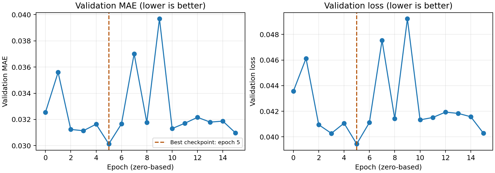
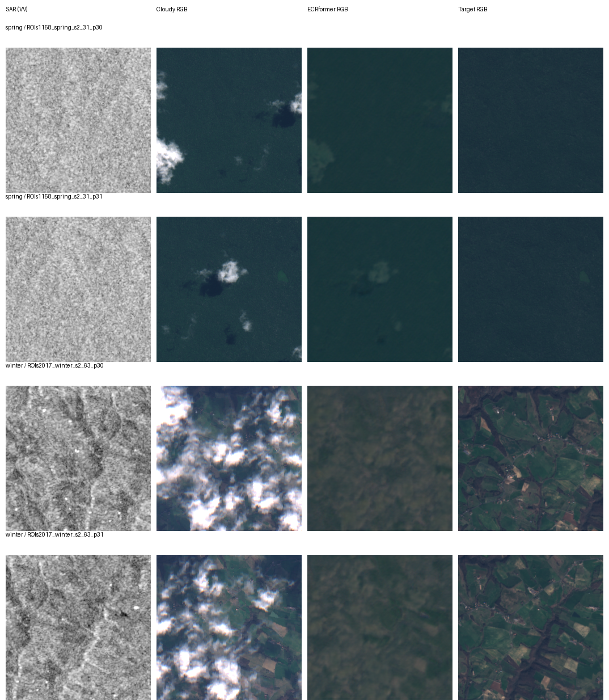

# 봄·겨울 6,000패치 혼합 실험

## 최신 학습·평가 결과 (2026-10-06)

**봄·겨울 각 3,000개 패치로 학습한 혼합 데이터 실험을 완료했습니다.** 최적 검증 체크포인트인 Epoch 5를 선택해 두 계절의 test 분할을 각각 평가했습니다. 이전 겨울 half1/half2 미세조정 실험과는 별개의 실행입니다.

### 학습 조건과 종료

| 항목 | 실행 조건 |
| --- | --- |
| 서버 GPU | RTX 3060 Ti 8GB |
| 학습 데이터 | 봄 3,000 + 겨울 3,000 = 6,000개, seed 42 고정 목록 |
| 선택 전 train 패치 | 봄 24,378 / 겨울 13,995 |
| 검증 데이터 | 봄 756 + 겨울 2,771 = 3,527개 |
| 모델 / optimizer | ECRformer / AdamW, weight decay 1e-3 |
| 정밀도 / 배치 | FP16 mixed / 배치 2 × accumulation 8 = 유효 배치 16 |
| 검증 배치 / workers | 1 / 2 |
| 학습 crop | 128×128 |
| 초기 학습률 | 4e-4 |
| 학습률 감소 | 검증 loss 기준 ReduceLROnPlateau, factor 0.5, patience 3 |
| 조기 종료 | 검증 loss가 10회 연속 개선되지 않으면 종료 |
| 실제 실행 | Epoch 0–15, 총 16 epochs; 중단 후 Epoch 4부터 체크포인트 재개 |
| 최적 체크포인트 | `epoch=5-step=2250.ckpt`, 검증 loss 0.0394439 |
| 종료 | 2026-10-06 03:41 KST, 조기 종료, 프로세스 종료 코드 0 |

검증 loss는 `0.9 × MAE + 0.1 × (1 − SSIM)`입니다. Epoch 5 이후 최적값을 갱신하지 못했고, 학습률은 Epoch 10에서 2e-4, Epoch 14에서 1e-4로 감소했습니다. 지표는 매 epoch 단조롭게 개선되지 않았습니다.

| Epoch (0부터) | 검증 MAE↓ | 검증 loss↓ | 학습률 |
| ---: | ---: | ---: | ---: |
| 0 | 0.03254 | 0.04356 | 4e-04 |
| 3 | 0.03114 | 0.04027 | 4e-04 |
| 5 | 0.03013 | 0.03944 | 4e-04 |
| 10 | 0.03130 | 0.04133 | 2e-04 |
| 15 | 0.03097 | 0.04028 | 1e-04 |



### 최적 체크포인트의 테스트 결과

**FP32, 배치 1, workers 2, crop 없이 256×256 원본 패치**를 평가했습니다. RMSE·MAE·PSNR·SAM·SSIM은 13밴드, LPIPS는 RGB 밴드 `(3, 2, 1)`와 VGG를 사용합니다. 지표는 패치별 계산값의 평균이며, 합계는 계절별 패치 수로 가중한 평균입니다. 검증에서는 학습과 같은 mixed precision을 사용했으므로 검증값과 테스트값의 절댓값을 직접 비교하지 않습니다.

| 테스트 범위 | 패치 수 | RMSE↓ | MAE↓ | PSNR↑ (dB) | SAM↓ (°) | SSIM↑ | LPIPS↓ |
| --- | ---: | ---: | ---: | ---: | ---: | ---: | ---: |
| 봄 | 3,983 | 0.04485 | 0.03065 | 27.716 | 9.669 | 0.87421 | 0.41115 |
| 겨울 | 1,567 | 0.04570 | 0.03141 | 27.199 | 11.844 | 0.84082 | 0.43569 |
| 합계 (패치 수 가중 평균) | 5,550 | 0.04509 | 0.03086 | 27.570 | 10.283 | 0.86478 | 0.41808 |

### 논문 수치와의 참고 비교

| 평가 범위 | MAE↓ | SAM↓ (°) | PSNR↑ (dB) | SSIM↑ | LPIPS↓ |
| --- | ---: | ---: | ---: | ---: | ---: |
| 논문 Table 1: SEN12MS-CR 전체 | 0.0164 | 4.693 | 33.37 | 0.932 | 0.188 |
| 이번 실행: 봄·겨울 테스트 합계 | 0.03086 | 10.283 | 27.570 | 0.86478 | 0.41808 |

논문 수치는 [저자 공개 PDF의 Table 1](https://zzaiyan.github.io/assets/pubs/ecrformer.pdf#page=7)을 확인했습니다. **평가 범위와 학습 조건이 다르므로 동일 조건의 모델 비교나 재현 성공 판정에 사용할 수 없습니다.** 논문 표에 RMSE는 없어 이 참고 표에서 제외했습니다.



각 계절의 자연 정렬된 test 목록에서 **앞 두 패치**를 표시했습니다. SAR는 VV 채널 회색조, 광학 영상은 밴드 인덱스 `(3, 2, 1)`의 RGB에 밝기 배율 3.0을 적용했습니다. 일부 RGB 예시이며, 13밴드 전체의 복원 품질이나 전체 테스트의 대표 사례로 해석하지 않습니다.

표시한 겨울 패치에서는 정답에 비해 경계와 질감이 흐리고 구름 형태의 잔여 패턴이 보입니다. 구름 제거가 완전하거나 세부 구조가 충분히 복원됐다고 해석하지 않습니다.

### 데이터 분할 확인과 해석 범위

- 저장된 학습 목록은 6,000개이며 중복 sample ID가 없습니다. 재개 시 원래 TIFF 경로와 목록의 일치를 확인했습니다.
- 현재 학습·검증·테스트 사이의 **동일 sample ID 및 동일 계절/ROI 디렉터리 중복은 각 0개**입니다. [분할 점검 결과](./split_audit.json)에 계절별 수치를 기록했습니다.
- 서로 다른 ROI 사이의 지리적 근접·공간 중첩과 이전 실험 데이터 전체의 중복은 이번 점검 범위에 포함하지 않았습니다.
- 논문은 SEN12MS-CR 전체 계절을 평가합니다. 이번 결과는 봄·겨울 데이터와 축소된 학습량을 사용하므로 **논문과 동등 조건의 재현 결과가 아닙니다.** SAR 두 채널 `[-25, 0]` dB 전처리와 학습률 조정 설정에도 차이가 있습니다.
- 이전 겨울 half1/half2와 테스트 범위가 다릅니다. 이번 결과를 이전 실험 대비 성능 향상으로 해석하지 않습니다.

### 결과 파일과 재평가

[봄 평균 지표](./spring/summary.json) · [겨울 평균 지표](./winter/summary.json) · [합계 지표](./combined_summary.json) · [검증 기록](./validation_history.csv) · [학습 샘플 목록](./train_samples.csv) · [학습 설정](./training_config.json) · [체크포인트 해시·평가 환경](./provenance.json)

샘플별 지표는 `reproduction/spring_winter6000/spring/metrics.csv`와 `winter/metrics.csv`에 있습니다. 원본 TIFF와 학습 재개용 체크포인트는 서버에 보존하며 Git에 포함하지 않습니다.

서버 PowerShell에서 평가를 다시 수행할 때는 새 출력 폴더를 지정합니다.

```powershell
cd C:\CtrS-ecrformer-winter\ECRformer\Official_ECRformer
& 'C:\CtrS\.venv\Scripts\python.exe' ..\reproduction\spring_winter6000\evaluate.py `
  --checkpoint '.\experiments\ecrformer_spring_winter_3000_each_seed42_20ep\version_1\checkpoints\epoch=5-step=2250.ckpt' `
  --output '.\results\spring_winter6000_retest'
```

`evaluate.py`는 신뢰하는 서버 체크포인트의 설정과 모델을 읽어 두 계절의 test 분할을 평가합니다. 동일 데이터·저장된 학습 목록과 체크포인트가 필요합니다.
