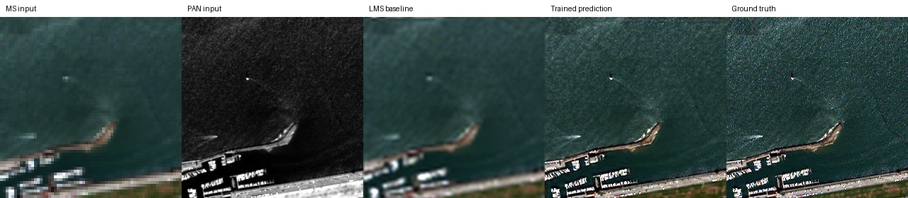
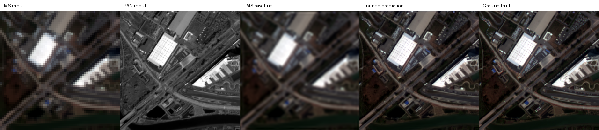
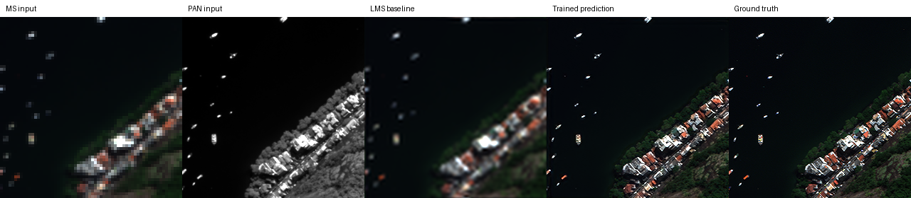

<p align="center">
  
</p>

# CtrS

동국대학교 종합설계 연구 저장소입니다. 팀원 4명이 2명씩 두 팀으로 나뉘어 SSA-MRN과 ECRformer를 연구합니다. **SSA-MRN의 공개 코드 기반 재현 실험과 논문 수치 비교는 완료**했고, ECRformer 재현은 별도로 진행합니다.

## 팀원

| 이름 | GitHub | 전공 | 역할 |
| --- | --- | --- | --- |
| 이병현 | [BIYONGHIYON](https://github.com/BIYONGHIYON) | 멀티미디어공학과 | 팀장 |
| 김경찬 | [erickks2y-jpg](https://github.com/erickks2y-jpg) | 멀티미디어공학과 | 팀원 |
| 송준현 | [choco-ssalbbang](https://github.com/choco-ssalbbang) | 멀티미디어공학과 | 팀원 |
| 김윤지 | [kimrose1015-max](https://github.com/kimrose1015-max) | 데이터사이언스전공 | 팀원 |

## 팀 운영 방식

1. SSA-MRN 담당 2명과 ECRformer 담당 2명이 각 원 논문의 데이터, 모델, 학습 및 평가 절차를 재현합니다.
2. 각 팀은 실행 환경, 공개 코드에서 빠진 부분, 논문 설정과 재현 결과의 차이를 기록합니다.
3. 중간 시점에 재현 결과와 후속 연구 가능성을 같은 기준으로 비교해 최종 주제 하나를 선택합니다.
4. 주제가 결정되면 팀원 4명이 해당 연구의 모델 개선, 추가 실험, 시연 및 보고서를 함께 진행합니다.

## 병렬 재현 연구

### [SSA-MRN 원 논문 재현](./SSA-MRN/README.md)

SSA-MRN 팀 2명이 고해상도 PAN과 저해상도 MS로 고해상도 MS를 복원하는 연구를 재현했습니다. 공식 코드를 버전 고정된 하위 모듈로 연결하고 누락된 데이터 로더·학습·체크포인트·평가 코드를 복구했습니다. **QB·GF2·WV3 100-epoch 학습, 각 센서 RR·FR 20장 평가, WV3→WV2 교차 위성 평가 및 논문 수치 비교를 완료**했습니다. 다만 공개 코드와 논문 모델 설명의 차이 및 평가 세부 설정의 미확인 사항이 있어, 논문 구현과 완전히 동일하다는 의미는 아닙니다.

저장소를 처음 내려받았거나 하위 모듈 파일이 비어 있다면 다음 명령으로 공식 코드를 가져옵니다.

```bash
git submodule update --init --recursive
```

### [ECRformer 원 논문 재현](./ECRformer/README.md)

ECRformer 팀 2명이 광학 영상과 SAR 영상을 이용한 구름 제거 모델의 원 논문 결과를 재현합니다. 현재 SEN12MS-CR 겨울 데이터 절반으로 기준 모델을 학습하고, 별도 테스트 패치 783개를 평가했습니다. 전체 데이터·논문과 동등 조건의 비교는 아직 완료하지 않았습니다. Spectral-Semantic Decoupled Learning 확장은 재현 결과를 확인한 뒤 검토합니다.

## 폴더와 현재 결과

| 위치 | 내용 |
| --- | --- |
| [SSA-MRN](./SSA-MRN/README.md) | 팬샤프닝 재현 코드·설정·문서 |
| [ECRformer](./ECRformer/README.md) | 구름 제거 재현 계획·겨울 절반 데이터 기준 결과 |
| [ECRformer 겨울 실험 결과](./ECRformer/reproduction/winter_half1/README.md) | 모델 가중치·783개 샘플 지표·비교 이미지 |
| [SSA-MRN 가중치](./SSA-MRN/experiments/checkpoints/) | QB·GF2·WV3의 epoch 100 체크포인트 |
| [SSA-MRN 학습 로그](./SSA-MRN/experiments/logs/) | 센서별 epoch 1–100 학습·검증 MSE |
| [SSA-MRN 단일 샘플 결과](./SSA-MRN/README.md#3개-센서-학습단일-샘플-테스트-현황-2026-09-28) | 각 센서의 입력·출력·정답 비교, 수치, 재실행 방법 |
| [SSA-MRN 논문 수치 비교](./SSA-MRN/README.md#재현-결과-논문과-정량-비교) | QB·GF2·WV3·WV2의 RR·FR 전체 테스트 결과와 해석 |
| [QuickBird 스모크 결과](./SSA-MRN/experiments/results/quickbird_smoke/README.md) | 무작위 초기화 모델의 배열·미리보기 (학습 결과 아님) |

### SSA-MRN 학습 모델의 첫 테스트 샘플 결과

| 센서 | LMS 기준 PSNR | 학습 모델 PSNR | 비교 이미지 |
|---|---:|---:|---|
| QuickBird | 35.45 dB | 41.35 dB |  |
| Gaofen 2 | 31.26 dB | 38.65 dB |  |
| WorldView 3 | 29.06 dB | 37.66 dB |  |

각 그림은 입력 MS·PAN·LMS·학습 모델 출력·정답 순서입니다. 테스트 H5의 **20개 중 첫 1개**만 사용했으며 입력 영상을 자르지 않았습니다. 이 수치는 단일 샘플 실행 확인용 PSNR로, 아래 20장 평균의 논문 비교 지표와 계산 조건이 다릅니다. 시각화의 RGB 밴드 순서는 가정입니다.

### SSA-MRN 논문 수치와 재현 결과

각 센서 RR·FR 테스트 20장씩 총 160장을 평가했습니다. 표는 **논문 / 현재 재현 결과** 순서이며, WV2는 WV3로 학습한 모델을 사용했습니다.

| 센서 | RR SAM↓ | RR PSNR↑ | FR QNR↑ |
|---|---:|---:|---:|
| QB | 4.8478 / 4.9557 | 37.6645 / 37.3608 | .9311 / .9147 |
| GF2 | .9434 / .9668 | 46.9734 / 46.3520 | .9137 / .9106 |
| WV3 | 3.4873 / 3.5277 | 37.5691 / 37.3894 | .9077 / .9408 |
| WV2 | 5.8845 / 5.9265 | 29.4148 / 29.0611 | .8831 / .9126 |

RR의 SAM·PSNR은 대체로 논문 수치에 근접하지만, 이 표만으로 동등한 성능을 입증할 수는 없습니다. 논문이 PSNR 계산 세부 설정을 공개하지 않아 가장 가까운 계산 방식을 사용했고, FR QNR 구현도 논문 방식과 완전히 대조되지 않았습니다. 공개 코드의 SSAI 구성 역시 논문 설명과 다릅니다. 나머지 ERGAS·SCC·Q4/Q8·Dλ·Ds 수치와 차이의 해석은 [SSA-MRN README](./SSA-MRN/README.md#재현-결과-논문과-정량-비교)에 있습니다.

### 로컬에서 확인

```bash
git clone --recurse-submodules https://github.com/BIYONGHIYON/CtrS.git
cd CtrS/SSA-MRN
python3 -m venv .venv
source .venv/bin/activate
python -m pip install torch -r requirements.txt
python scripts/test_checkpoint.py --sensor QB --checkpoint experiments/checkpoints/qb_full/latest.pt --data data/raw/QuickBird/test_qb_multiExm1.h5 --output-dir experiments/results/local_qb
```

테스트 H5는 Git에 넣지 않았습니다. 실행 전에 [PanCollection](https://github.com/liangjiandeng/PanCollection)의 센서별 ReducedData H5를 내려받아 [정해진 위치](./SSA-MRN/README.md#다른-사람이-테스트-재실행하기)에 놓아야 합니다. 체크포인트·로그·미리보기 결과는 저장소에 포함되어 있습니다.

## 중간 비교 기준

- 원 논문 설정과 결과의 재현 정도
- 데이터셋 확보 및 전처리 가능성
- 정량 성능과 실패 사례
- 후속 개선 아이디어의 효과를 검증할 수 있는지
- 남은 기간의 학습 비용과 구현 난도

## 공통 원칙

- 논문에 기재된 설정과 재현 구현에서 바꾼 설정을 구분해 기록합니다.
- SSA-MRN의 원본 학습·검증·테스트 H5는 Git에서 제외합니다. 재현 코드, 세 센서의 가중치·로그·테스트 결과는 공유합니다.
- 재현 완료는 실행 성공만으로 판단하지 않고 논문 결과와 비교한 뒤 기록합니다. SSA-MRN은 이 비교까지 완료했으나 동일 구현·평가 설정은 미확인입니다.

## 원격 저장소

- GitHub: https://github.com/BIYONGHIYON/CtrS
