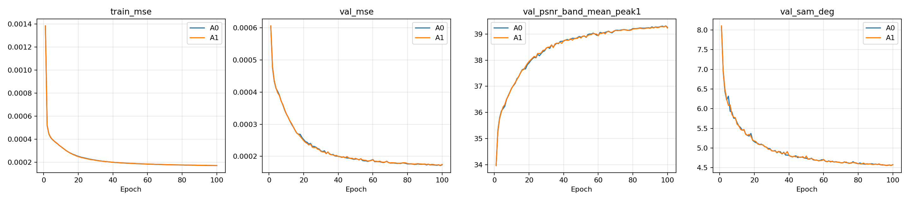
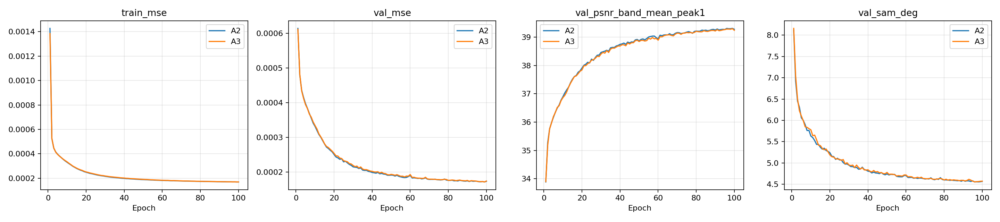
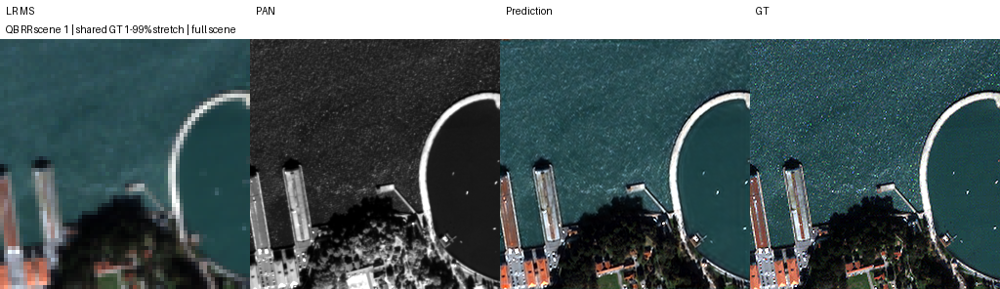
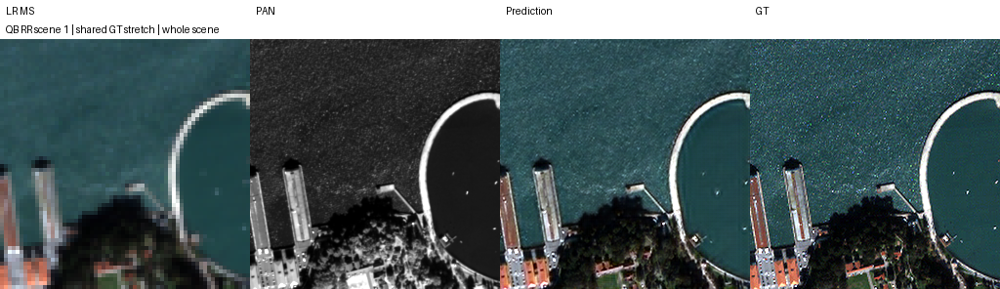

<p align="center"></p>

# CtrS · SSA-MRN 성능 개선

고해상도 흑백 위성영상 **PAN**과 저해상도 다중분광영상 **MS**를 결합해 고해상도 MS를 복원합니다. SSA-MRN을 재현하고 구조·손실·학습 데이터 변화가 복원 성능에 미치는 영향을 비교하는 연구입니다.

## 현재 결정 · K=4

**2026-10-09 현재 연구의 기본 설정은 K=4로 확정했습니다.** Windows 동일 환경에서 QB·GF2·WV3의 K4/K6를 각각 100에폭 학습하고, 센서별 best validation MSE 다수결 **2:1**로 선택했습니다. 앞으로 별도 승인된 K 비교가 아닌 신규 기준선·개선 비교는 K4를 기준으로 설계합니다.

K는 모델 내부 특징 차원이며 센서 밴드 수와 다릅니다. WV3에서는 K6가 낮았으므로 이 결정은 모든 센서·test 지표에서 K4가 우세하다는 뜻은 아닙니다. K 선택에는 test를 사용하지 않았습니다.

| 센서 | K4 best validation MSE ↓ | K6 best validation MSE ↓ | 선택 |
|---|---:|---:|---|
| QB | 0.000171861819 | 0.000172164394 | K4 |
| GF2 | 0.000080382687 | 0.000082206216 | K4 |
| WV3 | 0.000360564225 | 0.000358851370 | K6 |


[선택 근거·100에폭 곡선·원본 가중치 12개](SSA-MRN/docs/experiments/windows_k_baselines.md)

## 연구 흐름과 남은 일

**K4/K6 통제 비교 완료 → K4 확정 → K4 손실 탐색 → 최종 후보 연장 → 같은 조건의 기준선과 RR/FR 평가** 순서입니다.

2026-10-09 21:11 KST Windows 확인 기록에서는 spectral·consistency 6개가 완료되고 edge 0.001이 학습 중이었습니다. 이는 마지막 확인 기록이며 실시간 진행률이 아닙니다. 최종 손실 선택과 구조+손실 결합 효과는 아직 미확정입니다.

이전 K6 구조·증강 연구는 후보와 한계를 파악한 근거입니다. 그 결과를 K4 성능으로 바꾸어 해석하지 않으며, K4에 적용할 후보는 K4 기준선과 다시 비교해야 합니다.

## 최근 학습 완료 · SSA 핵심 융합 A0–A3

QB K6·seed46에서 네 구조를 각100에폭 학습하고 원본 체크포인트·이력·설정·해시를 보관했습니다. validation 최저 MSE는 A0 **0.000171331**, A1 0.000172063, A2 0.000171955, A3 0.000171885입니다. 이 단일 시드에서는 기존 A0가 가장 낮았고, RR/FR 평가 전이므로 구조 채택을 보류합니다. [구조·전체 지표·가중치·보관 검증](SSA-MRN/docs/experiments/ssa_fusion_local.md).





## K6 완료 결과 · QB 3단계 공유 복원 B1/B2

**2026-10-09 05:59 KST 다운로드 검증 기준**, T4×2에서 B1·B2 각각100에폭과 RR20장·FR20장 전체 평가를 마쳤습니다. B2는 관측 오차를 전달하며, B1은 같은 3단계 공유 복원을 오차 없이 실행합니다. best는 validation MSE로 선택했고 B1은90에폭, B2는99에폭입니다.

| 지표 | B1 | B2 | B2−B1 |
|---|---:|---:|---:|
| RR PSNR dB ↑ | 37.604745 | 37.720504 | +0.115759 |
| RR SAM ° ↓ | 4.832698 | 4.814416 | -0.018282 |
| RR MSE peak1 ↓ | 0.000205615557702 | 0.00020025117562 | -5.36438208154e-06 |
| FR QNR ↑ · 잠정 | 0.904310 | 0.886089 | -0.018221 |

**RR 개선 후보 유지, FR 포함 최종 채택 보류.** RR 지표는 전반 개선됐지만 FR 왜곡과 입력 MS 일치도는 악화했습니다. 단일seed42이며 기존 B0은 재실행하지 않았습니다. 초기 가중치·100에폭 샘플 순서 일치, 원본 best/latest4개·전체 예측80개·원본 manifest152개 해시를 검증했습니다.

왼쪽부터 **LR MS · PAN · B2 예측 · 정답**입니다. 사전 고정 RR index1이며 같은 장면의 MS 패널에는 공통 대비를 적용했습니다.



[완료 보고서](SSA-MRN/docs/experiments/kaggle_b1_b2.md) · [한 셀 재현·복구](SSA-MRN/docs/operations/kaggle_b1_b2.md)

## K6 완료 결과 · QB 단계적 Haar 복원 A0/A1

2026-10-09 06:28 KST부터 다운로드 산출물을 검증했습니다. T4×2에서 A0·A1을 각각100에폭 학습하고 각 RR20장·FR20장 전체를 평가했습니다. A0는 gate=1, A1은 밴드·방향·위치별 gate입니다.

| 비교 | RR ΔPSNR dB | RR ΔSAM ° | RR ΔMSE peak1 | FR ΔQNR · 잠정 |
|---|---:|---:|---:|---:|
| A0 − 기존 B0 | −2.799468 | +0.859341 | +2.07106e−4 | +0.022286 |
| A1 − 기존 B0 | −3.052997 | +0.941778 | +2.33414e−4 | +0.020670 |
| A1 − A0 | −0.253529 | +0.082437 | +2.63082e−5 | −0.001616 |

**RR가 크게 악화해 현재 구조 채택을 보류합니다.** 학습 gate의 추가 이득도 확인되지 않았습니다. 이전 B0와 데이터·nominal 학습 조건·환경·순서를 사후 대조했지만 구조·MS 입력·용량과 AMP의 실제 업데이트 수는 다릅니다. 단일 시드이며 잠정 FR 상승을 HR 정확도 개선으로 해석하지 않습니다.

[조건·전체 결과·가중치·검증 근거](SSA-MRN/docs/experiments/kaggle_wavelet_a0_a1.md)에 실제 best/latest4개와 예측80개를 보존했습니다. 왼쪽부터 **LR MS · PAN · A1 예측 · GT**이며 사전 고정한 RR scene1과 공통 MS 대비를 사용했습니다.



## 최근 완료 · QB B1/B2 100에폭 재개

2026-10-09 22:16 KST 다운로드 확인: 중간 200 셀의 B1 12/B2 11에폭 체크포인트를 이어서 각각 **총100에폭** 학습하고 RR·FR 각20장을 평가했습니다. 실제 K6 실험이며 현재 K4 기본값과 구분합니다. B2는 B1보다 RR PSNR **−0.119919 dB**, 잠정 FR QNR **+0.019136**으로 지표 개선이 엇갈렸습니다. 이전 B1/B2 실행과도 방향이 달라 종합 채택을 보류합니다.

왼쪽부터 LR MS · PAN · B2 예측 · 정답입니다. [8절 보고서·전체 지표·재개 이력·원본 가중치](SSA-MRN/docs/experiments/kaggle_b1_b2_100_resume.md)


## 실험 바로 보기

각 보고서에서 **목적·조건·수치·기준선 대비·그래프·이미지·가중치·판단**을 함께 볼 수 있습니다.

| 단계 | 실험 | 실제 K | 확인된 결과·상태 |
|---|---|---|---|
| 현재 기준 | [Windows K4/K6 통제 비교](SSA-MRN/docs/experiments/windows_k_baselines.md) | 4·6 | 6개 × 100에폭 완료, 원본 12개 보관. 다수결로 **K4 확정**, test 평가 대기 |
| 현재 진행 | [Windows 손실 탐색](SSA-MRN/docs/experiments/windows_controlled.md) | **4** | spectral·consistency 완료, edge 진행 기록. 최종 손실 효과 미확정 |
| 이전 재현 | [공개 코드 K4 재현](SSA-MRN/docs/experiments/pan_k4.md) | 4 | RR/FR 평가 완료, 초기 기준 |
| 이전 재현 | [논문 설정 K6 재현](SSA-MRN/docs/experiments/pan_k6.md) | 6 | RR/FR 평가 완료, K4와 장치도 달랐음 |
| 구조 탐색 | [QB 23탭·LR 보정·고주파](SSA-MRN/docs/experiments/a6000_architecture_qb.md) | 6 | 단일 시드에서 23탭을 후속 후보로 선정 |
| 구조 검증 | [23탭 반복·위치·센서 확장](SSA-MRN/docs/experiments/a6000_followup_123.md) | 6 | QB RR 이득·FR 혼재, GF2 개선·WV3 악화 |
| 구조 검증 | [GF2 반복·QB 입력 23탭](SSA-MRN/docs/experiments/a6000_gf2_repeat_qb_input.md) | 6 | 3시드 평가 완료, GF2 PSNR/QNR 개선·SAM 혼재 |
| 구조 탐색 | [QB 밴드별 게이트 고주파](SSA-MRN/docs/experiments/kaggle_band_gated_hf.md) | 6 | RR 악화로 채택 보류 |
| 증강 탐색 | [QB MTF 변화량 증강](SSA-MRN/docs/experiments/kaggle_mtf_pair.md) | 6 | 100에폭·원본 4개 보관, validation만 확인·RR/FR 대기 |
| 구조 진단 | [QB SSA 핵심 융합 A0–A3](SSA-MRN/docs/experiments/ssa_fusion_local.md) | 6 | 각100에폭·원본 16개 보관, validation A0 최저 MSE·RR/FR 대기 |
| 구조 탐색 | [QB 3단계 관측 복원](SSA-MRN/docs/experiments/kaggle_b1_b2.md) | 6 | B1/B2 각100에폭·RR/FR 평가 완료, RR 개선·FR 악화로 채택 보류 |
| 구조 탐색 | [QB 단계적 Haar A0/A1](SSA-MRN/docs/experiments/kaggle_wavelet_a0_a1.md) | 6 | 각100에폭·RR/FR 평가 완료, RR 악화·학습 gate 추가 이득 없어 채택 보류 |
| 구조 검증 | [QB B1/B2 100에폭 재개](SSA-MRN/docs/experiments/kaggle_b1_b2_100_resume.md) | 6 | RR/FR 각20장 완료, B2 RR PSNR −0.119919 dB·잠정 FR QNR +0.019136, 종합 채택 보류 |
| 사전 검증 | [QB 관측 연산자](SSA-MRN/docs/experiments/observation_validation.md) | 해당 없음 | consistency 관측 구현 검증, 학습 성능 결과와 구분 |

## 문서와 실행 안내

| 필요한 내용 | 바로가기 |
|---|---|
| 현재 기준·이전 연구의 결론·다음 판단 | [SSA-MRN 연구 안내](SSA-MRN/README.md) |
| PAN/MS·K·23탭·평가 지표 설명 | [알고리즘과 평가](SSA-MRN/docs/research.md) |
| Windows 상태 확인·로그·재개 | [Windows 관리 스크립트](SSA-MRN/docs/operations/controlled_suite.md) |
| 환경 설정·기존 모델 재평가 | [기본 실행 안내](SSA-MRN/docs/operations/pan_ms.md) |

## 코드와 결과 받기

```bash
git clone --recurse-submodules https://github.com/BIYONGHIYON/CtrS.git
cd CtrS
```

실제 학습된 best/latest 원본과 에폭·SHA-256·복구 검증은 각 보고서 **7절**에 있습니다. 학습 완료·test 평가 완료·가중치 보관을 구분합니다. 원본 데이터는 Git에 포함하지 않습니다. RGB–HSI 연구는 [별도 저장소](https://github.com/BIYONGHIYON/RGB-HSI-SR)에서 관리합니다.

## 팀원

| 이름 | GitHub | 전공 | 역할 |
|---|---|---|---|
| 이병현 | [BIYONGHIYON](https://github.com/BIYONGHIYON) | 멀티미디어공학과 | 팀장 |
| 김경찬 | [erickks2y-jpg](https://github.com/erickks2y-jpg) | 멀티미디어공학과 | 팀원 |
| 송준현 | [choco-ssalbbang](https://github.com/choco-ssalbbang) | 멀티미디어공학과 | 팀원 |
| 김윤지 | [kimrose1015-max](https://github.com/kimrose1015-max) | 데이터사이언스전공 | 팀원 |
