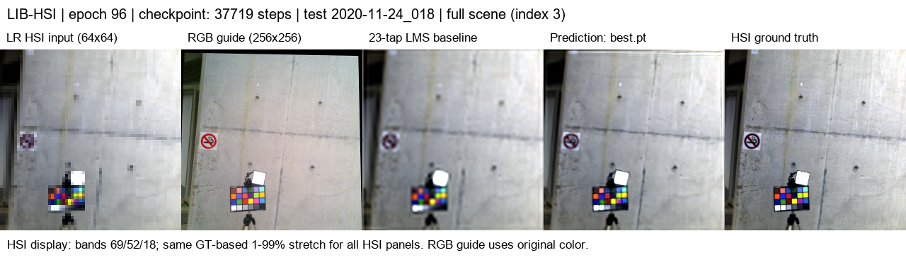
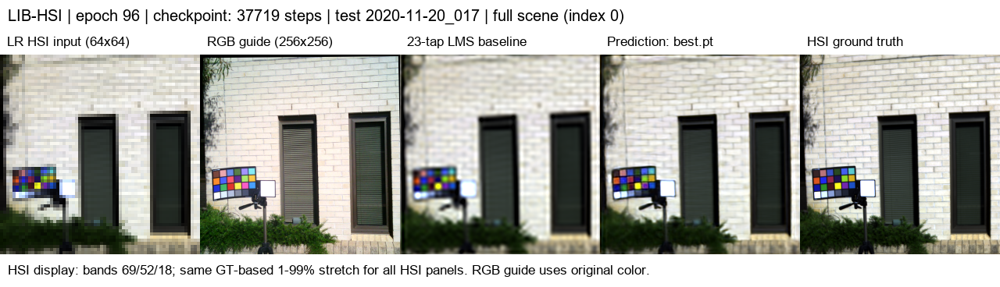
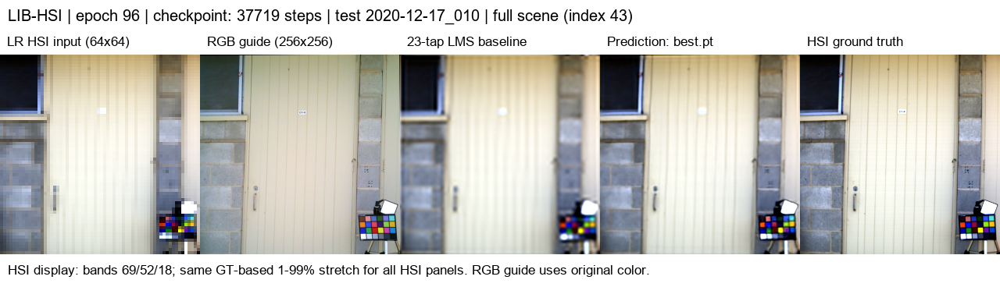
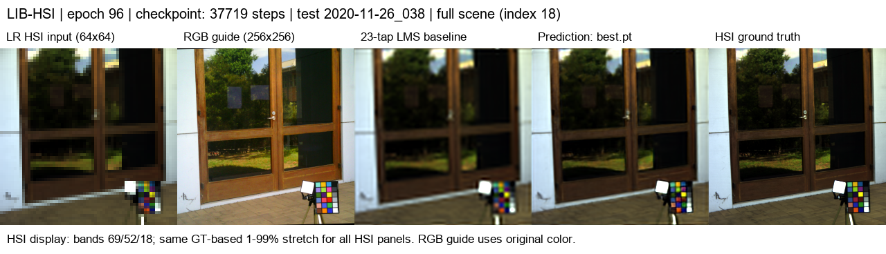
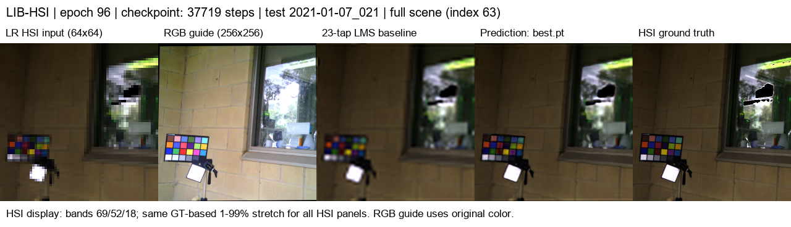

# SSA-MRN: RGB 유도 HSI 초해상도

## 최신 실험 — RGB별 4그룹 · K=4 · 23탭

LIB-HSI의 RGB 3채널과 저해상도 HSI 204밴드를 사용한 합성 x4 공간 초해상도 연구입니다.
기존 PAN–MS 재현과 latent 8/K=6/Bicubic 실험의 지표·이미지는 [기존 실험 기록](./docs/experiment_history.md)에 모았습니다.


현재 [실험 설정](./configs/lib_rgb_hsi_grouped12_k4_23tap.json)을 사용합니다. 기존 실험과 별도 학습·평가 프로토콜을 사용합니다.

| 항목 | 새 구성 |
|---|---|
| HSI 압축·출력 | 연속 17밴드씩 12그룹 → 그룹별 feature 1개 → 최종 204밴드 |
| SSA guide | feature 1–4는 R, 5–8은 G, 9–12는 B; 분기별 guide 1채널 |
| SSA 내부 차원 | K=4 |
| HSI 확대 | 채널별 23탭 LMS 보간; 모델의 중간 확대도 동일 방식 |
| 정합 | RGB에 제한된 homography를 적용해 이동·회전·원근 기울기를 보정했습니다. |
| 학습 | 원본 512×512 장면을 비중첩 256×256 네 조각으로 사용했습니다. |
| 검증·시험 | 전체 512×512 시야를 area 평균으로 256×256으로 축소하며 조각으로 나누지 않습니다. |
| 합성 LR | 256×256 GT를 area 평균으로 64×64로 축소했습니다. |

학습 RGB는 원본에서 동일 위치를 자른 guide이며 HSI만 23탭으로 확대합니다. 검증·시험 RGB도 전체 시야를 256×256으로 축소해 GT와 맞춥니다. 정합으로 생긴 유효하지 않은 테두리는 loss와 양쪽 평가 지표에서 제외했습니다. 그룹과 RGB의 연결은 실험적 분기 배정이며 센서의 실제 파장 응답을 뜻하지 않습니다.

정합은 학습 전에 [장면별 manifest](./experiments/results/lib_registration/projective_alignment.json)로 고정했으며, 실제 3D 회전각·깊이·시차를 복원하지는 않습니다. 정합 추정에 HR HSI를 사용하므로 GT 기반 전처리입니다. 확대·열화·평가 영역이 바뀌었으므로 기존 Bicubic 결과와 직접적인 ablation 비교로 해석하지 않습니다. 새 지표의 비교 기준은 `interp23_*`이며 기존 `bicubic_*`와 구분했습니다.

## 최신 시험 결과

100 epoch까지 완료한 원격 실행 `20261003-022329-72b8a17b50de`의 **96 epoch best.pt**를
시험 75개 장면 전체에 평가했습니다. latest는 100 epoch이며 시험 평가에 사용하지 않았습니다.
검증 장면 평균 MSE로 best를 선택했으며, 지표는 **유효 영역·204밴드에서 계산한 장면별 값의 평균**입니다.
시험은 각 장면의 전체 512×512 시야를 256×256으로 축소하므로 장면당 1개, 총 75개 입력입니다.

| 시험 지표 | 23탭 LMS | grouped12 SSA-MRN | 변화 |
|---|---:|---:|---:|
| MSE ↓ | 0.00272008 | 0.00104667 | 61.5% 감소 |
| PSNR ↑ | 26.3846 dB | 30.7574 dB | +4.3728 dB |
| SAM ↓ | 2.4595° | 2.0893° | −0.3703° |

PSNR과 SAM 모두 시험 75개 장면에서 기준 영상보다 개선됐습니다. 단일 seed 결과이며,
RGB guide의 기여와 그룹 구성을 분리하려면 HSI-only 및 조건을 통제한 ablation이 필요합니다.
기존 Bicubic 실험과는 열화·정합·평가 시야가 달라 위 수치를 직접 비교하지 않습니다.

PSNR은 range=1의 전체 밴드 MSE에서 계산하고, 예측값은 clip하지 않습니다.
SAM은 영벡터 GT 픽셀을 제외합니다. HR HSI 기반 정합과 유효 테두리 마스크를 사용했으므로
이 결과는 **합성 area x4 초해상도 평가**이며 실제 LR 센서 성능을 입증하지 않습니다.

## 시험 결과 이미지 5세트

시험 75장 중 seed `20261003`으로 서로 다른 5개 장면을 선택했습니다.
샘플별 성능에 따른 재선택은 하지 않았습니다. 모두 전체 시야의 256×256 영상이며 타일 예시가 아닙니다.
왼쪽부터 **LR HSI · RGB guide · 23탭 LMS · Prediction · HSI GT**입니다.
HSI 표시는 0-based bands 69/52/18과 GT 기반 공통 1–99% stretch를 사용하고,
RGB는 원래 색을 사용합니다. 아래 PSNR은 개별 장면 값으로 전체 평균과 구분합니다.

| 세트 | 장면 | 시험 index | 23탭 PSNR | 모델 PSNR |
|---|---|---:|---:|---:|
| 1 | 2020-11-24_018 | 3 | 31.0614 dB | 36.2557 dB |
| 2 | 2020-11-20_017 | 0 | 23.1492 dB | 26.2505 dB |
| 3 | 2020-12-17_010 | 43 | 30.3467 dB | 35.8670 dB |
| 4 | 2020-11-26_038 | 18 | 28.1126 dB | 32.7925 dB |
| 5 | 2021-01-07_021 | 63 | 25.9442 dB | 28.8199 dB |

**세트 1 — 2020-11-24_018**



**세트 2 — 2020-11-20_017**



**세트 3 — 2020-12-17_010**



**세트 4 — 2020-11-26_038**



**세트 5 — 2021-01-07_021**



## 실행 기록과 재현

- [전체 시험·장면별 지표](./experiments/results/lib_grouped12_20261003_pr13/test/metrics.json)
- [시험 실행 설정](./experiments/results/lib_grouped12_20261003_pr13/test/run_config.json)
- [5장 선택 기록](./experiments/results/lib_grouped12_20261003_pr13/selection.json)
- [best/latest epoch와 SHA-256](./experiments/results/lib_grouped12_20261003_pr13/checkpoint_metadata.json)
- [재개 실행의 학습 기록](./experiments/results/lib_grouped12_20261003_pr13/history.jsonl): epoch 5–100이며 최초 실행의 epoch 1–4 기록은 포함하지 않습니다.

학습 프로세스는 서버 기록상 2026-10-03 02:23:37–06:59:59에 실행됐습니다.
이번 시험 평가와 5세트 이미지는 RTX 3060 Ti / PyTorch 2.7.1+cu128 / AMP에서 생성했습니다.
원본 데이터와 체크포인트는 변경하지 않았습니다. 가중치는 서버의 다음 폴더에 있으며 이번 PR에 추가하지 않았습니다.

```text
C:\CtrS\SSA-MRN\experiments\checkpoints\remote-runs\20261003-022329-72b8a17b50de
```

[결과 내보내기 스크립트](./scripts/export_latest_results.ps1)는 별도 폴더에서 전체 시험 평가와 동일한 seed의 5세트를 생성합니다.
이번 검증은 해당 train_lib.py·preview_lib.py 명령을 SSH로 실행한 결과이며, PowerShell 래퍼 자체는 실행하지 않았습니다.

## 자료

- [모델·전처리·정합과 한계](./docs/rgb_hsi_extension.md#12그룹k423탭-신규-프로토콜)
- [RGB–HSI 데이터셋 비교](./docs/rgb_hsi_datasets.md)
- [기존 PAN–MS 및 RGB–HSI 실험 기록](./docs/experiment_history.md)

정합 추정에 HR HSI를 사용합니다. 현재 결과를 실제 LR 센서 환경의 성능으로 해석하지 않으며,
독립 장면·촬영 위치의 분할과 RGB 기여는 추가 검증이 필요합니다.
