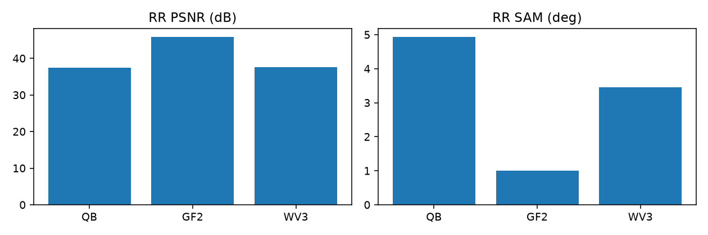
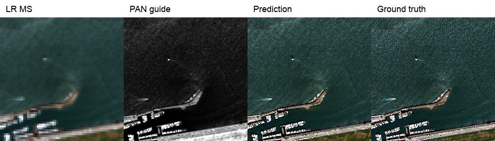

# SSA-MRN · PAN–MS 팬샤프닝 재현과 개선

고해상도 PAN 1채널과 저해상도 MS(QB/GF2 4밴드, WV3 8밴드)를 결합해 고해상도 MS를 복원합니다. 연구 목표는 **재현된 SSA-MRN을 동일 조건의 기준선으로 삼아 공간·분광 성능을 개선**하는 것입니다.

[연구 설명](docs/research.md) · [재현 연구](docs/reproduction.md) · [실험 이력](docs/previous_experiments.md) · [개선 실험 계획](docs/improvement_plan.md) · [실행 방법](docs/operations/pan_ms.md)

## 현재 기준 · K4/K6 재현

RR 20장·FR 20장/센서 평가 기록입니다. 센서 간 숫자를 평균내어 우열을 정하지 않습니다.

| 센서 | K4 RR PSNR dB ↑ | K6 RR PSNR dB ↑ | K4 RR SAM ° ↓ | K6 RR SAM ° ↓ | K4/K6 FR QNR ↑ |
|---|---:|---:|---:|---:|---|
| QB | 37.3608 | 37.5040 | 4.9557 | 4.9350 | 0.9147 / 0.9072 |
| GF2 | 46.3520 | 45.8631 | 0.9668 | 1.0035 | 0.9106 / 0.9161 |
| WV3 | 37.3894 | 37.6326 | 3.5277 | 3.4504 | 0.9408 / 0.9522 |

K4는 CUDA/A6000, K6는 DirectML/Radeon입니다. K6가 모든 센서·프로토콜에서 낫지는 않으며, K만의 효과로 확정하지 않습니다. 논문 수식과 공개 코드의 attention 연산 차이도 유지된 재현입니다. [상세 비교](docs/experiments/reproduction/pan_k6.md)

아래는 QB 예시이며 왼쪽부터 LR MS · PAN · 예측 · 정답입니다. 나머지 센서와 K4 예시는 재현 보고서에 있습니다.

## 현재 진행 중인 학습

2026-10-08 확인. 두 서버에서 성능 개선 실험을 진행 중이며 최종 평가는 아직 완료되지 않았습니다.

| 서버 | 연구 내용 | 실행 |
|---|---|---|
| Windows · RTX 3060 Ti | K4/K6 기준선 6회 → 보조 손실 후보 9회 → 최종 후보 이어 학습, 총 940에폭 | 직렬 |
| 학교 · RTX A6000 | QB·K=6에서 기준선 / 내부 23탭 / LR 출력 보정 / PAN 고주파 잔차, 각각 100에폭 | 4개 병렬 |

시드 42의 탐색 비교이며 개선 후보의 반복 검증은 후속 작업입니다. 효과는 같은 서버의 기준선과 비교합니다.

[현재 학습 현황·판단 기준](docs/current_training.md) · [Windows 실행 명령](docs/operations/controlled_suite.md) · [학교 실행 명령](docs/operations/a6000_suite.md)

K4/K6 가중치, 전체 평가 JSON, 그래프와 결과 예시는 각 재현 보고서에서 확인할 수 있습니다.
