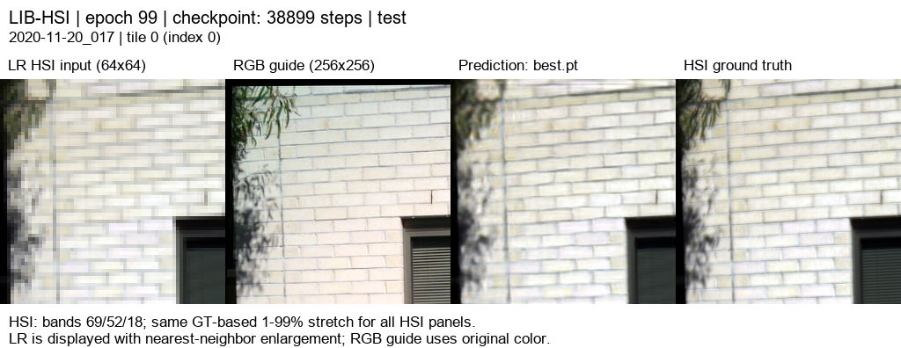
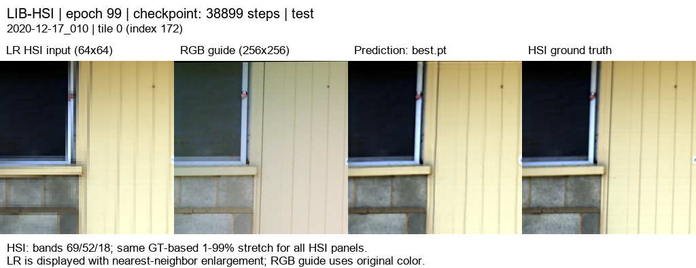
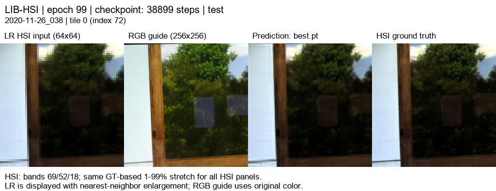
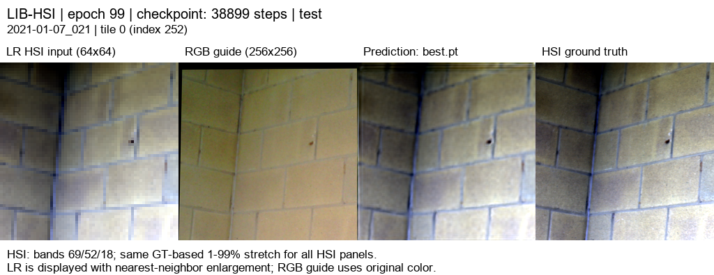

# SSA-MRN · RGB 유도 HSI 초해상도

고해상도 RGB와 저해상도 HSI에서 ×4 HSI 복원을 연구합니다. 아래 결과는 LIB-HSI의 관측 HSI를 합성 축소한 평가이며 실제 센서의 HR-HSI 정답 성능과 구분합니다.

## 연구 개요

204밴드 HSI를 17특징으로 학습 압축하고 R·G·B 각각의 SSA-MRN 경로에서 공간 특징을 추정합니다. 최신 모델은 세 경로의 51개 특징을 **공동 디코더**에 넣어 204밴드 보정량을 만들고, 23탭 보간 결과에 더합니다. 합성 `area` 축소로 만든 LR HSI와 출력의 4×4 평균을 맞춘 뒤 MSE + 0.01(1−cos) 손실로 학습했습니다.

[연구 설명 · 재현부터 17특징·분광 손실까지](docs/guide/research_overview.md)에서 단계별 연산, 텐서 크기, 결과 해석을 확인할 수 있습니다.

## 연구 문서

- [기존 PAN–MS 재현 정리](docs/reproduction.md)
- [이전 RGB–HSI 실험 정리](docs/previous_experiments.md)

## 가장 최근 완료 연구 · RGB별 17특징 공동 디코더 + LR 평균 일관성 보정

LIB-HSI 합성 ×4 평가입니다. 204→17 grouped 압축(인접 12밴드/특징), R/G/B 독립 core, 공동 디코더, K=4, **2,616,274개 파라미터**를 사용했습니다. HR256/LR64, 내부 평균 축소·23탭 확대, 정합 유효 마스크, 17특징 및 분광 손실 가중치 0.01을 유지했습니다. 이번에는 LR 평균 보정을 **학습 손실과 검증·테스트 모두에 적용**했습니다. best는 100에폭 중 검증 MSE가 가장 낮은 **99에폭**입니다.

| test 75장면 평균 · 300타일 | MSE ↓ | PSNR dB ↑ | SAM ° ↓ |
|---|---:|---:|---:|
| 23탭 baseline + LR 보정 | 0.0011539606 | 30.0649 | 2.4450 |
| 직전 RGB06 + LR 보정 | 0.0004559785 | 34.2173 | 2.1625 |
| **공동 디코더 17특징 + LR 보정** | **0.0004482036** | **34.2831** | **2.1570** |

직전 RGB06의 **보정 후 출력**과 같은 75개 테스트 장면·정합 마스크를 비교하면 PSNR **+0.0658 dB**, SAM **−0.0055°**, MSE **−0.000007775**입니다. 장면별 PSNR은 **44/75개 개선, 31/75개 하락**으로 차이가 작고 균일하지 않습니다. 구조 변경과 학습 중 보정 적용이 함께 바뀌었으므로 개선 원인을 하나로 분리할 수 없습니다. [새 실험 보고서](docs/experiments/rgb07_joint17_consistency.md)에 조건과 한계를 기록했습니다.


기존 RGB06과 LR 보정 후처리 결과는 [이전 실험 목록](docs/previous_experiments.md)에서 볼 수 있습니다.

### test 예시 5종

아래는 수치 확인 전 고정한 서로 다른 테스트 장면 5개입니다. 장면 인덱스 `[3, 0, 43, 18, 63]`의 tile0을 사용했습니다. 이번 결과의 [204밴드 웹 뷰어](https://biyonghiyon.github.io/CtrS/ssa-mrn/)에서 각 장면의 모든 밴드를 볼 수 있습니다. 서버 결과 폴더에도 동일한 오프라인 HTML을 보존했습니다.

왼쪽부터 **LR HSI · RGB 입력 · 공동 디코더 예측 · 정답**입니다. HSI 패널에는 밴드별 동일한 표시 대비를 사용했고, 정량 지표는 원래 204밴드 값을 계산했습니다.










## 현재 학습 상태

[6단계 예비 실험 환경](docs/guide/six_stage_pilot.md)을 별도 서버 폴더 `C:\CtrS-pilot-suite`에 준비했습니다. RGB 진단과 10에폭 비교 설정을 사용할 수 있으며 학습은 아직 시작하지 않았습니다.

run `20261005-061505-8be6241e5a6c`은 2026-10-05 11:26(KST)에 종료 코드 0으로 완료됐습니다. 서버의 `C:\CtrS-joint17\SSA-MRN\experiments\checkpoints\remote-runs-joint17\<run ID>`에 best/latest를 보존했습니다. 가중치는 Git에 넣지 않았습니다.

최신 가중치의 설정에는 LR 보정이 포함되어 있어 평가·5개 예시·오프라인 뷰어에 자동 적용됩니다. 이 보정은 합성 ×4 `area` 축소 조건에만 검증됐습니다. 결과와 체크포인트 해시는 [실험 보고서](docs/experiments/rgb07_joint17_consistency.md)에서 확인할 수 있습니다.

## 결과 보고와 파일 보관

완료 실험에는 공통 보고서, 학습/검증 및 비교 그래프, 사전에 선택한 서로 다른 test 5장면의 4패널 이미지를 반드시 남깁니다. 성능이 좋은 장면을 보고 골라서는 안 됩니다.

```powershell
& $py SSA-MRN\scripts\export_results.py --checkpoint '<run>\best.pt' --data-root 'C:\CtrS\SSA-MRN\data\dataset\RGB-HSI\LIB-HSI' --output-dir '<새 결과 폴더>' --previous-metrics '<직전 결과>\test\metrics.json'
```

실행 환경에 `requirements.txt`를 설치해야 합니다. exporter는 체크포인트에 저장된 평가 조건을 사용합니다. [공통 보고서 양식](docs/experiments/template.md), [작업 규칙](AGENTS.md), [데이터셋 감사 자료](references/rgb_hsi_datasets.md)를 참고합니다.

새 실험 시작 전 `cleanup_experiment.py --run-dir <완료 run>`의 목록을 검토하고 `--completed --apply`로 적용합니다. 가중치·숫자 결과는 보존하고 과거 설정·원시 로그·캐시는 정리합니다. 현재 학습의 run에는 적용하지 않습니다.
