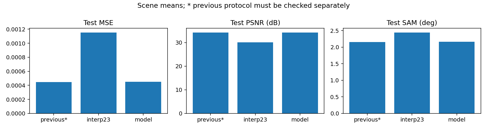
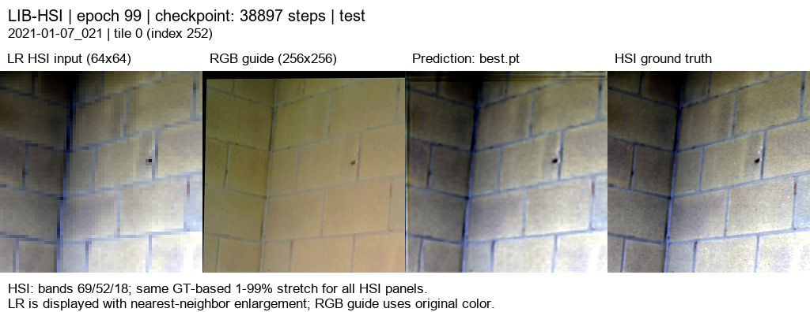

# SSA-MRN · RGB 유도 HSI 초해상도

고해상도 RGB 와 저해상도 HSI 에서 ×4 HSI 복원을 연구합니다. 아래는 LIB-HSI 의 관측 HSI 를 합성 area 축소한 평가이며, 실제 센서 HR-HSI 정답 성능과 구분합니다.

## 연구 문서

- [연구 설명 · 재현부터 17 특징·분광 손실까지](docs/guide/research_overview.md)
- [기존 PAN–MS 재현 정리](docs/reproduction.md)
- [이전 RGB–HSI 실험과 pilot 정리](docs/previous_experiments.md)

## 최신 완료 · RGB08 고주파 보정

RGB07 의 17 특징·R/G/B 독립 core·공동 디코더에 **RGB 윤곽·무늬를 추가하는 고주파 보정 경로**를 붙였습니다. 전체 train393 으로 100 에폭 학습하고 validation45 의 MSE 가 최소인 **99 에폭**을 선택했습니다.204 밴드, HR256/LR64, area×4,23 탭, K4, 분광 손실 0.01, 정합 유효 마스크와 LR 평균 일관성 보정을 유지했습니다.2,623,454 파라미터입니다.

|test75 장면 ·300 타일|MSE ↓|PSNR dB ↑|SAM ° ↓|
|---|---:|---:|---:|
|23 탭+LR 보정|0.0011539606|30.0649|2.4450|
|기존 RGB07|0.0004482035|**34.2831**|**2.1570**|
|RGB08 고주파 보정|0.0004508862|34.2533|2.1593|

**RGB07 대비 PSNR−0.0299dB, SAM+0.00235°, MSE 약 0.60% 증가**로 평균 성능이 조금 낮았습니다. PSNR 은 38/75 장면에서 개선됐지만 전체 평균 개선은 확인되지 않았습니다. 공간 gradient 오차도 조금 높아져 **기존 RGB07 을 기준 모델로 유지**합니다. [조건·장면별 차이·가중치 해시·결과 보고서](docs/experiments/rgb08_gated_detail.md).

## test 예시 5 종

서로 다른 test 장면 5 개의 tile0 을 수치 확인 전에 고정했습니다. 왼쪽부터 **LR HSI · RGB 입력 · RGB08 예측 · 정답**입니다. HSI 패널은 같은 3 밴드·같은 정답 기반 대비를 사용하며 지표는 전체 204 밴드로 계산했습니다.

[RGB08 204 밴드오프라인 HTML](docs/assets/rgb08_gated_detail/band_viewer/index.html)에서 모든밴드를 볼 수 있습니다. HTML 을 다운로드해 브라우저에서 열면 됩니다. 기존[공개 웹뷰어](https://biyonghiyon.github.io/CtrS/ssa-mrn/)는 RGB07 결과이므로이번 RGB08 이미지와 구분합니다.

## 실행 상태와 보관

100 에폭 run `20261006-053053-ea63614f1e45`는 2026-10-06 10:38(KST)에 exit0 으로 종료됐습니다. 현재 학습은 없고, LR1e-5 의추가 10 에폭 미세조정은 미실행입니다. 서버 `C:\CtrS-rgb-detail`에 best/latest·전체 결과·HTML 을 보존했습니다. 원본 데이터와 pt 는 Git 에 넣지 않았습니다.

완료 결과에는 공통 보고서·학습/검증 및 비교 그래프·test5 장면의 4 패널·204 밴드 HTML 을 보관합니다. [보고서 양식](docs/experiments/template.md), [작업 규칙](AGENTS.md), [데이터셋 감사 자료](references/rgb_hsi_datasets.md)를 참고합니다.
