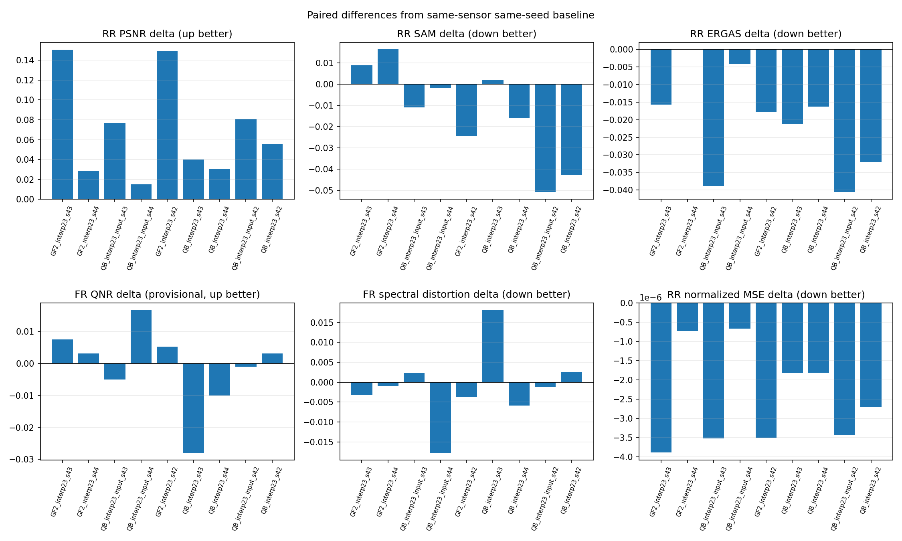
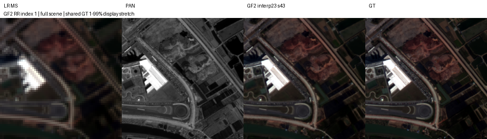
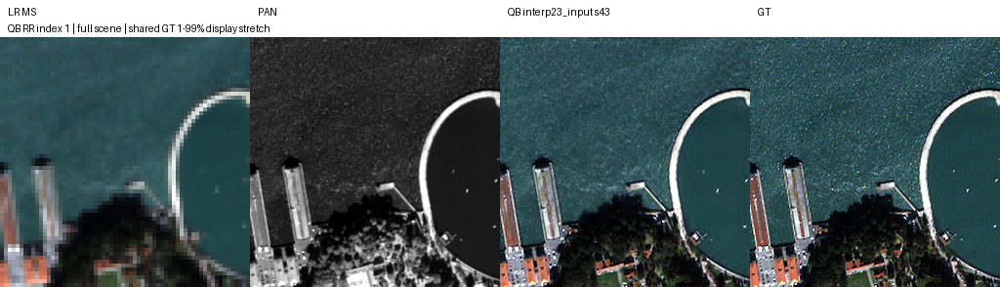

# SSA-MRN · PAN–MS 재현과 성능 개선

[저장소 홈](../README.md) · [알고리즘과 평가](docs/research.md)

PAN의 공간 정보와 MS의 분광 정보를 결합해 고해상도 MS를 복원합니다. QB·GF2는 4밴드, WV3는 8밴드이며 **K는 관측 밴드 수가 아니라 모델 내부 특징 차원**입니다.

## 실험 한눈에 보기

실험명을 누르면 중간 안내 페이지 없이 보고서가 열립니다. 모든 보고서는 **목적 → 조건 → 수치 → 기준선 대비 → 그래프 → 이미지 → 가중치·근거 → 판단** 순서입니다.

| 실험 | 바꾼 점 / 확인할 내용 | 상태와 판단 |
|---|---|---|
| [K4 재현](docs/experiments/pan_k4.md) | 공개 코드의 학습·평가 복원 | RR/FR 평가 완료, 첫 기준 결과 |
| [K6 재현](docs/experiments/pan_k6.md) | SSAI 내부 차원 4→6 | 평가 완료, 장치도 달라 K만의 효과는 미확정 |
| [QB 구조 비교](docs/experiments/a6000_architecture_qb.md) | 23탭 확대·LR 보정·고주파 경로 | 평가 완료, 단일 시드에서 23탭을 후속 후보로 선정 |
| [QB 게이트 고주파](docs/experiments/kaggle_band_gated_hf.md) | PAN 고주파를 MS 밴드·위치별로 게이트 | Kaggle 두 모델 RR/FR 전체 평가 완료, RR 악화로 채택 보류 |
| [23탭 후속 검증](docs/experiments/a6000_followup_123.md) | QB 3시드·확대 위치·GF2/WV3 | 평가 완료, 모든 센서에 적용하는 최종 채택은 보류 |
| [GF2 반복·QB 입력 검증](docs/experiments/a6000_gf2_repeat_qb_input.md) | GF2 전체/QB 입력 23탭 각각 3시드 | 전체 평가 완료, GF2 PSNR/QNR 개선 반복·SAM 혼재 |
| [Windows K·손실 비교](docs/experiments/windows_controlled.md) | 같은 장치의 K4/K6 → 손실 9개 → 후보 연장 | 마지막 확인 시 학습 중, 손실 효과 미확정 |
| [QB 관측 연산자 검증](docs/experiments/observation_validation.md) | consistency 손실의 MTF·패치 위상 검증 | 구현 검증 완료, 모델 성능 평가와 구분 |

## 최신 완료 결과 · GF2 반복 시드·QB 입력 23탭

2026-10-08 23:17 KST에 새 학습 6개와 자동 평가가 완료됐습니다. 기존 9개 포함 15개 모델 각각 RR 20장·FR 20장 전체를 평가했고 best는 validation MSE로 선택했습니다.

| 검증 | ΔPSNR (dB) | ΔSAM (°) | ΔMSE (peak=1) | ΔQNR | 판단 |
|---|---:|---:|---:|---:|---|
| GF2 전체 23탭 · 3시드 | +0.1095 ± 0.0698 | +0.00029 ± 0.02157 | -2.711e-06 | +0.005261 ± 0.002222 | PSNR/QNR 3/3 개선, SAM 2/3 악화 |
| QB 입력 23탭 · 3시드 | +0.0575 ± 0.0369 | -0.02123 ± 0.02598 | -2.543e-06 | +0.003569 ± 0.011528 | PSNR/SAM 3/3 개선, QNR 2/3 악화 |
| QB 전체 23탭 · 3시드 (재사용) | +0.0421 ± 0.0127 | -0.01894 ± 0.02250 | -2.116e-06 | -0.011602 ± 0.015583 | PSNR 3/3 개선, QNR 2/3 악화 |

GF2 PSNR·QNR은 3/3 개선했지만 SAM은 2/3 악화했습니다. QB 입력은 PSNR·SAM이 3/3 개선했지만 QNR은 2/3 악화했습니다. 전체 적용은 보류하고 FR 구현 검증과 Windows 손실 결과를 먼저 확인합니다. ±는 시드별 차이의 표본 표준편차이며 유의성을 뜻하지 않습니다. 재사용 test이고 QNR은 MATLAB 일치성 미검증입니다.

[최신 보고서](docs/experiments/a6000_gf2_repeat_qb_input.md)에서 조건·절대 수치·실측 곡선·고정 45개 이미지·원본 가중치 30개를 확인합니다. 없는 과거 QB 시드 42 validation SAM 곡선은 생성하지 않았습니다.

## 병행 완료 · QB 밴드별 게이트 고주파

2026-10-08 다운로드 결과 검증 기준, Kaggle T4 ×2에서 baseline과 band_gated_hf를 같은 **QB K6·seed42·100에폭·AMP·batch32**로 학습하고 각 모델의 **RR 20장·FR 20장 전체**를 FP32로 평가했습니다. best는 validation MSE로 선택했고 baseline epoch100, 후보 epoch99입니다.

| 지표 | baseline | band_gated_hf | 후보−baseline |
|---|---:|---:|---:|
| RR PSNR dB ↑ | 37.453879 | 37.278888 | −0.174992 |
| RR SAM ° ↓ | 4.955443 | 4.964272 | +0.008829 |
| RR MSE peak1 ↓ | 0.000215111127 | 0.000222832780 | +7.72165e−6 |
| FR QNR ↑ · 잠정 | 0.919756 | 0.920742 | +0.000986 |

후보는 PAN 고주파와 기준 출력의 밴드별 공간 기울기로 픽셀별 gate를 학습합니다. 두 모델의 본체 초기화와 100에폭 샘플 순서 해시가 일치했고 실제 best/latest 원본 4개·전체 예측 80개·장면별 수치와 재현 소스를 보존했습니다.

**판단:** RR PSNR·SAM·MSE·ERGAS·SCC·Q2n이 모두 악화해 채택을 보류합니다. FR은 Dλ 개선과 Ds 악화가 섞였고 QNR의 작은 상승은 잠정 값입니다. 단일 시드·선행 탐색에 쓰인 QB test·MATLAB 정합성 미검증 제한이 있습니다. 이번에는 고정 high_frequency를 학습하지 않았습니다.

왼쪽부터 **LR MS · PAN · band_gated_hf 예측 · 정답**입니다. seed42로 수치 평가 전에 고정한 RR 장면1이며 RGB [2,1,0]과 공통 GT 대비를 사용했습니다.

[완료 보고서](docs/experiments/kaggle_band_gated_hf.md)에 5장면·학습 곡선·test 비교 그래프·이전 A6000 연구와의 관측 차이·가중치와 검증 근거를 정리했습니다.

## 서버별 마지막 확인 기록

아래는 시각이 명시된 기록이며 실시간 상태가 아닙니다.

| 서버 | 마지막 확인 | 확인된 상태 | 남은 판단 |
|---|---|---|---|
| Linux · RTX A6000 | 2026-10-08 23:26 KST · SSH 확인 | GF2/QB 추가 6개 100에폭, 15개 모델 평가·해시 검증 완료. GPU 유휴 | FR 구현 검증·Windows 결과 확인 |
| Windows · RTX 3060 Ti | 2026-10-08 16:24 KST · SSH 확인 | QB K4/K6 각각 100에폭, GF2 K4 49/100에폭 완료 후 학습 중 | 나머지 기준선 → 손실 9개 → 최종 후보 연장 → 평가 |
| Kaggle · Tesla T4 ×2 | 2026-10-08 23:20 KST부터 다운로드 산출물 검증 | baseline·gate 각 100에폭, 각 RR/FR 20장 전체 평가 완료 | gate 채택 보류; 다른 seed·독립 장면 반복 필요 |

Windows 계획은 총 **940에폭 직렬 실행**입니다. 각 실행 환경은 장치·환경·micro batch가 달라 자체 기준선과 비교합니다. 구조+손실 결합의 효과는 아직 미확인입니다. 진행 확인 명령과 복구 절차는 아래 실행 안내에 있습니다.

## 실행과 파일 위치

| 필요한 작업 | 안내 |
|---|---|
| 기본 환경·기존 모델 평가 | [PAN–MS 실행](docs/operations/pan_ms.md) |
| Kaggle 원본·게이트 병렬 실행과 결과 검증 | [Kaggle 두 모델 비교](docs/operations/kaggle_gpu_comparison.md) |
| Windows 진행 확인·재개 | [K·손실 실행](docs/operations/controlled_suite.md) |
| Linux GF2 반복·QB 입력·복구 | [최신 A6000 실행](docs/operations/a6000_next_6h.md) |
| Linux 후속 검증·평가·복구 | [A6000 후속 실행](docs/operations/a6000_followup.md) |
| 최초 QB 구조 비교 재현 | [A6000 구조 비교 실행](docs/operations/a6000_suite.md) |
| 새 실험 기록 | [공통 보고서 양식](docs/experiments/template.md) |

보고서는 `docs/experiments/실험명.md`에, 이미지·수치·가중치는 기존 `docs/assets/실험ID/` 또는 `experiments/` 경로에 보관합니다. **새 실험의 실제 best/latest 가중치도 커밋 대상에 포함**하고 에폭·SHA-256을 함께 기록합니다. 원본 데이터·공식 하위 모듈·실행 중인 학습 파일은 별도로 보존합니다.
