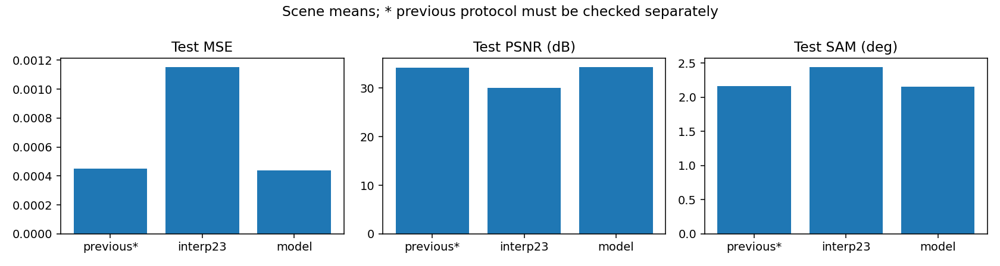
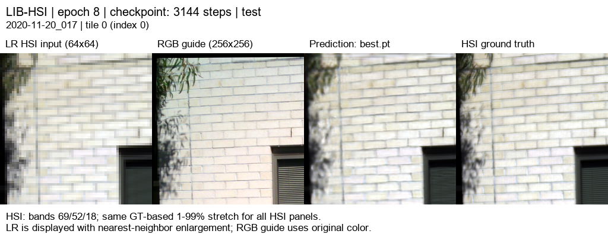
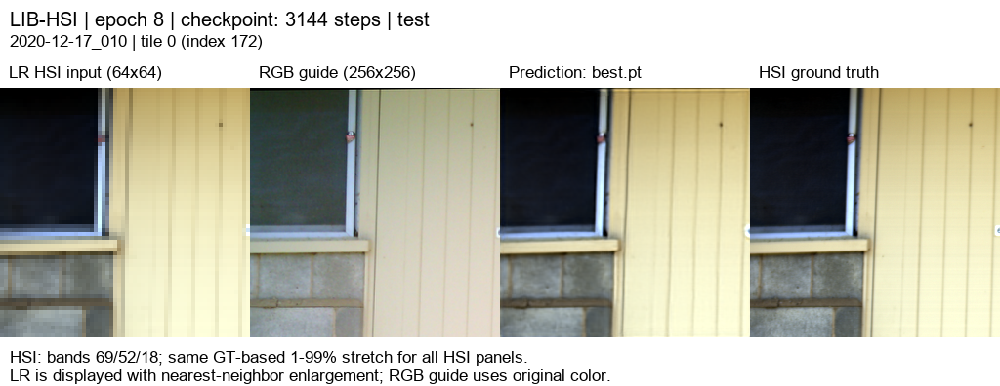
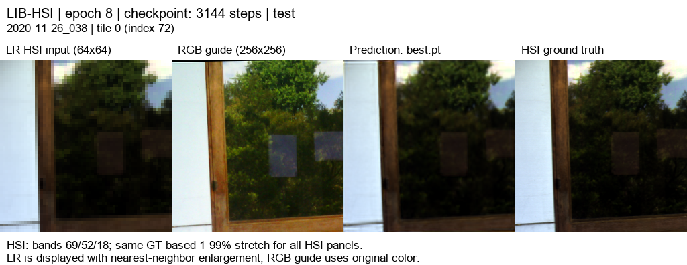

# SSA-MRN · RGB 유도 HSI 초해상도

고해상도 RGB와 저해상도 HSI에서 ×4 HSI 복원을 연구합니다. LIB-HSI의 관측 HSI를 합성 area 축소한 평가이며 실제 센서 HR-HSI 정답 성능과 구분합니다.

## 연구 문서

- [연구 설명](docs/guide/research_overview.md)
- [기존 PAN–MS 재현](docs/reproduction.md)
- [이전 RGB–HSI 실험](docs/previous_experiments.md)

## 최신 완료 · RGB09 저학습률 추가 학습

RGB08 고주파 보정 모델의 best 99에폭에서 학습률을 **1e-5로 낮춰 10에폭** 추가 학습했습니다. 모델 가중치만 로드하고 optimizer를 초기화했습니다. 검증 MSE로 선택한 **추가 8에폭** 가중치의 결과입니다. 17특징·K=4·공동 디코더·204밴드·23탭·분광 손실·LR 평균 일관성 보정을 유지했습니다.

| test 75장면 · 300타일 | MSE ↓ | PSNR dB ↑ | SAM ° ↓ |
|---|---:|---:|---:|
| 23탭 + LR 보정 | 0.0011539606 | 30.0649 | 2.4450 |
| RGB07 | 0.0004482035 | 34.2831 | 2.1570 |
| RGB08 | 0.0004508862 | 34.2533 | 2.1593 |
| **RGB09 추가 학습** | **0.0004371593** | **34.3929** | **2.1532** |

직전 RGB08 대비 **PSNR +0.1396 dB, SAM −0.00612°, MSE 약 3.04% 감소**했습니다. PSNR은 70/75장면에서 개선됐습니다. RGB07보다도 평균 수치는 나아졌지만 학습량이 달라 고주파 경로 자체의 효과로 단정하지 않습니다. [조건·차이·가중치·결과 보고서](docs/experiments/rgb09_detail_finetune.md).

## test 예시 5종

서로 다른 고정 5장면이며 왼쪽부터 **LR HSI · RGB 입력 · RGB09 예측 · 정답**입니다. HSI 패널의 표시 대비는 동일하며 지표는 전체 204밴드로 계산했습니다.

[204밴드 오프라인 HTML](docs/assets/rgb09_detail_finetune/band_viewer/index.html)을 다운로드해 브라우저에서 열 수 있습니다. 기존 [공개 웹뷰어](https://biyonghiyon.github.io/CtrS/ssa-mrn/)는 RGB07 결과입니다.

## 가중치와 실행 상태

[best 8에폭](experiments/checkpoints/rgb09_detail_finetune/best.pt) · [latest 10에폭](experiments/checkpoints/rgb09_detail_finetune/latest.pt) · [시작 RGB08 가중치](experiments/checkpoints/rgb09_detail_finetune/init-source.pt) · [체크섬](experiments/checkpoints/rgb09_detail_finetune/sha256.json)

추가 학습은 **2026-10-06 15:47:37(KST), exit 0**으로 완료됐습니다. 약 31분 26초이며 이 실험의 학습 프로세스는 종료됐습니다. 서버 원본·가중치와 이전 결과는 보존했습니다. 원본 데이터는 Git에 포함하지 않습니다.

[보고서 양식](docs/experiments/template.md) · [작업 규칙](AGENTS.md) · [데이터셋 감사 자료](references/rgb_hsi_datasets.md)
