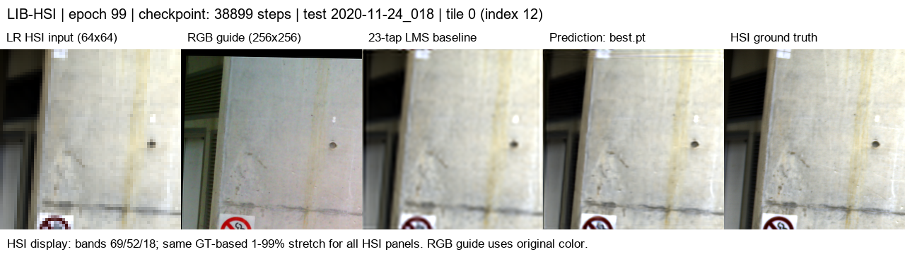
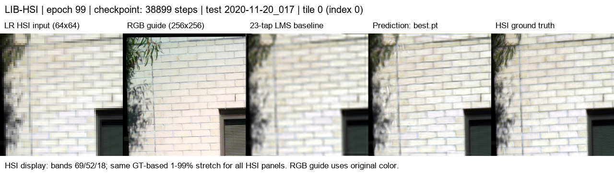
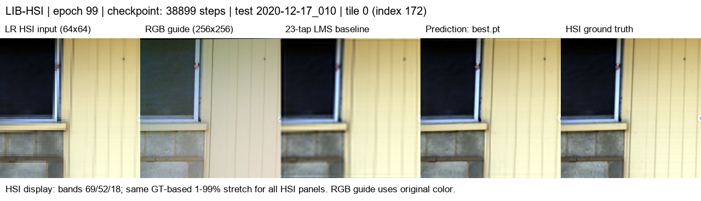
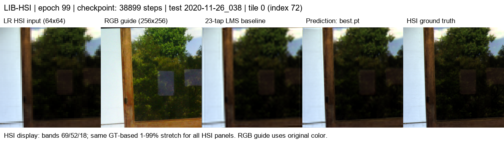
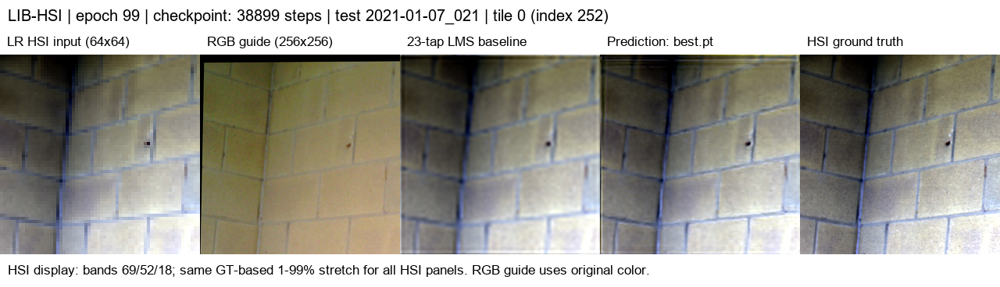

# SSA-MRN: RGB 유도 HSI 초해상도

## 최신 실험 — RGB 각각 12특징 · K=4 · 23탭 · 타일 평가

LIB-HSI의 RGB 3채널과 저해상도 HSI 204밴드로 HSI의 공간 해상도를 4배 높이는 연구입니다.
이전 grouped12/full256, Bicubic 및 PAN–MS 재현 결과와 이미지 5세트는 [이전 실험 기록](./docs/experiment_history.md)에 보존했습니다.

| 항목 | 현재 구성 |
|---|---|
| HSI 입력·출력 | 원본 204밴드 전체를 입력받아 최종 204밴드 복원 |
| 중간 특징 | 연속 17밴드씩 12그룹으로 압축; 공유 encoder가 그룹별 특징 1개 생성 |
| RGB별 처리 | R·G·B 각각 독립 SSA-MRN 코어가 12특징 모두 처리; 총 3코어 |
| 결과 결합 | 코어별 204밴드 잔차 복원 → 밴드별 학습 가능한 RGB 결합 → 23탭 baseline에 더함 |
| 파라미터·SSAI | 1,950,186개 · K=4 |
| 학습·검증·시험 | 원본 512×512 장면을 동일한 비중첩 256×256 네 타일로 분할 |
| 합성 LR | 타일별 HSI GT 256×256 → area 평균 64×64; RGB는 동일 위치 256×256 |
| 확대 | 입력 HSI 및 모델 내부 확대 모두 23탭 LMS 보간 |
| 분할 | train 393 / validation 45 / test 75장면; 타일 1,572 / 180 / 300개 |
| 정합 | 고정 homography manifest 사용; 유효하지 않은 테두리는 loss·평가에서 제외 |

12개는 원본 밴드 수가 아니라 압축된 중간 특징 수입니다. 각 RGB 분기가 12특징을 모두 처리하지만,
특징 번호를 센서의 실제 파장 응답과 대응시키지는 않습니다. [모델 구성 상세](./docs/triple_rgb_tiles.md)와
[실험 설정](./configs/lib_rgb_hsi_triple12_k4_23tap_tiles.json)을 참고하세요.

## 최신 시험 결과

원격 실행 `20261003-162417-e46b8079c798`은 **100 epoch까지 정상 종료**했습니다.
검증 장면 평균 MSE로 선택된 **99 epoch best.pt**를 시험 75장면·300타일 전체에 평가했습니다.
100 epoch latest.pt는 이번 시험에 사용하지 않았습니다.

타일별 오차를 먼저 원래 장면 단위로 합산한 뒤 **75개 장면 지표의 평균**을 보고합니다.
300타일을 300개의 독립 장면으로 해석하지 않습니다. 204밴드·정합 유효 영역에서 계산했습니다.

| 시험 지표 | 23탭 LMS | triple12 SSA-MRN | 변화 |
|---|---:|---:|---:|
| MSE ↓ | 0.00139447 | 0.00047336 | 66.1% 감소 |
| PSNR ↑ | 29.2259 dB | 34.0530 dB | +4.8272 dB |
| SAM ↓ | 2.4790° | 2.2057° | −0.2733° |

PSNR과 SAM 모두 **시험 75장면에서 23탭 baseline보다 개선**됐습니다.
단일 seed 결과이며, RGB 기여와 triple 구조의 효과는 조건을 통제한 비교 실험이 필요합니다.

**직전 grouped12 결과와 직접적인 성능 비교는 불가합니다.** 이전 시험은 전체 512×512 시야를
256×256으로 축소한 `full256`이고, 이번 시험은 원본 공간 크기의 `tiles`입니다.
동일한 장면이어도 GT 공간 크기·LR·평가 시야가 달라졌습니다. 구조 개선 효과를 확정하려면
이전 가중치도 같은 타일과 정합 마스크로 재평가해야 합니다.

PSNR은 range=1의 장면 전체 밴드 MSE로 계산하며, 예측값은 clip하지 않습니다.
GT reflectance는 [0,1]로 clip하고, SAM은 영벡터 GT 픽셀을 제외합니다.
HR HSI를 이용한 정합 전처리를 포함한 **합성 area x4 평가**로, 실제 저해상도 센서 쌍에서의 성능을 입증하지 않습니다.

## 시험 결과 이미지 5세트

이전 README와 같은 5장면을 사용했습니다. 해당 장면은 seed `20261003`으로 시험 75장 중 선택됐으며,
이번에는 성능 확인 전에 각 장면의 **좌상단 타일 0**으로 고정했습니다. 타일 index는 `장면 index × 4`입니다.
이전 이미지가 전체 시야였으므로 같은 장면이라는 이유로 두 이미지를 직접 비교하지 않습니다.

왼쪽부터 **LR HSI · RGB guide · 23탭 LMS · Prediction · HSI GT**입니다.
HSI 표시는 0-based bands 69/52/18을 사용하며, 같은 타일 GT의 1–99% 범위를 모든 HSI 패널에 공통 적용합니다.
RGB는 원래 색을 사용합니다. 아래 값은 단일 타일 PSNR이며 위 장면 평균과 구분합니다.

| 세트 | 장면 | 시험 타일 index | 23탭 PSNR | 모델 PSNR |
|---|---|---:|---:|---:|
| 1 | 2020-11-24_018 | 12 | 35.8247 dB | 37.2808 dB |
| 2 | 2020-11-20_017 | 0 | 27.1377 dB | 29.4704 dB |
| 3 | 2020-12-17_010 | 172 | 33.6497 dB | 40.3268 dB |
| 4 | 2020-11-26_038 | 72 | 32.3032 dB | 36.0327 dB |
| 5 | 2021-01-07_021 | 252 | 41.1761 dB | 42.2112 dB |

**세트 1 — 2020-11-24_018 · 타일 0**



**세트 2 — 2020-11-20_017 · 타일 0**



**세트 3 — 2020-12-17_010 · 타일 0**



**세트 4 — 2020-11-26_038 · 타일 0**



**세트 5 — 2021-01-07_021 · 타일 0**



## 실행 기록과 재현

- [전체 시험 및 75장면별 지표](./experiments/results/lib_triple12_20261003/test/metrics.json)
- [시험 실행 설정](./experiments/results/lib_triple12_20261003/test/run_config.json)
- [5세트 선택 기록](./experiments/results/lib_triple12_20261003/selection.json)
- [best/latest epoch와 SHA-256](./experiments/results/lib_triple12_20261003/checkpoint_metadata.json)
- [학습 기록](./experiments/results/lib_triple12_20261003/history.jsonl): 재개한 epoch 5–100 기록; 최초 실행 epoch 1–4는 포함하지 않습니다.
- [학습 실행 설정](./experiments/results/lib_triple12_20261003/run_config.json)
- [최종 검증 기록](./experiments/results/lib_triple12_20261003/validation_metrics.json)

서버에서 2026-10-03 16:24:21–21:20:52에 epoch 5–100을 실행했습니다.
시험과 예시도 RTX 3060 Ti / PyTorch 2.7.1+cu128 / AMP에서 생성했습니다.
체크포인트와 원본 데이터는 보존했고, 문서용 PNG·지표·설정·학습 로그 약 4MB만 복사했습니다.
가중치와 원본 데이터는 Git에 추가하지 않습니다.

```text
C:\CtrS-triple\SSA-MRN\experiments\checkpoints\remote-runs\20261003-162417-e46b8079c798
```

서버에 SSH로 접속한 클라이언트의 PowerShell에서 시험 재실행:

```powershell
cd C:\CtrS-triple
$run = 'C:\CtrS-triple\SSA-MRN\experiments\checkpoints\remote-runs\20261003-162417-e46b8079c798'
& C:\CtrS\.venv\Scripts\python.exe SSA-MRN\scripts\train_lib.py `
  --config "$run\run_config.json" `
  --checkpoint "$run\best.pt" `
  --data-root 'C:\CtrS\SSA-MRN\data\dataset\RGB-HSI\LIB-HSI' `
  --output-dir 'SSA-MRN\experiments\results\triple12_test_recheck' `
  --evaluate
```

기존 결과와 다른 새 출력 폴더를 지정하세요. 평가 코드는 출력 폴더 아래 `test`에 지표를 저장합니다.
5세트는 [preview_lib.py](./scripts/preview_lib.py)에 `--split test --sample-index`로
12, 0, 172, 72, 252를 각각 지정하여 생성했습니다.

## 자료와 해석 범위

- [triple RGB와 타일 구성](./docs/triple_rgb_tiles.md)
- [전처리·정합과 한계](./docs/rgb_hsi_extension.md)
- [RGB–HSI 데이터셋 비교](./docs/rgb_hsi_datasets.md)
- [이전 실험 기록](./docs/experiment_history.md)

데이터셋의 제공 train/validation/test 분할을 사용했습니다. 제공 분할의 장면 수와 별개로,
같은 촬영 위치·건물의 중복 여부는 추가 확인이 필요합니다. RGB의 기여, 구조 변경 효과,
실제 센서 환경에서의 일반화는 이번 baseline 비교만으로 확정하지 않습니다.
