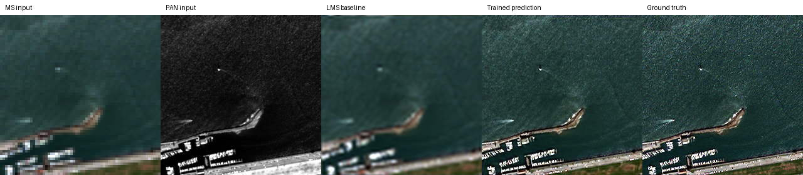
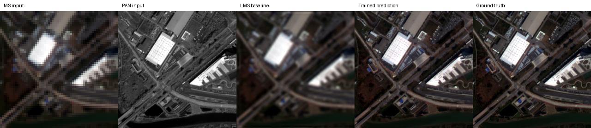
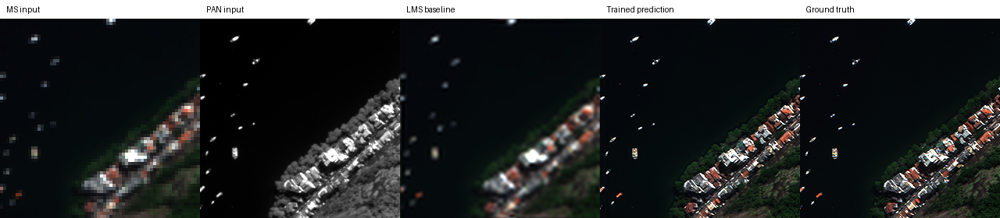

# SSA-MRN: 팬샤프닝 재현

## 연구 개요

SSA-MRN은 **고해상도 PAN 영상**과 **저해상도 다중분광(MS) 영상**을 사용해 고해상도 MS 영상을 복원합니다. 이 폴더는 [원 논문](https://doi.org/10.1109/JSTARS.2025.3543827)과 [공식 코드](https://github.com/zhouchuanxu/SSA-MRN)를 출발점으로 누락된 학습·평가 절차를 구현한 기록입니다. 입력에는 저해상도 PAN(LRPAN)도 사용하며, 해상도 비율은 4배입니다.

## 현재 상태

**후속 실험의 기본 설정은 K=6이며, K=4는 비교 기준으로 보관합니다.** QuickBird(QB), Gaofen 2(GF2), WorldView 3(WV3)를 두 설정으로 각각 100 epochs 학습하고 축소 해상도(RR)·원 해상도(FR) 테스트를 마쳤습니다. K=4의 WorldView 2(WV2) 교차 평가에는 WV3 모델을 적용했습니다.

**왜 두 설정을 사용했나?** 공식 `network.py`는 SSAI 내부 차원 `K=4`로 공개돼 있어 먼저 코드를 보존한 상태로 재현했습니다. 논문에는 `K=6`이 명시돼 있어 그 차원을 구현해 다시 학습했습니다. K=6을 후속 실험의 기본 설정으로 선택했지만, 센서마다 개선 방향이 달라 K=4 가중치와 결과도 비교 기준으로 유지합니다.

K=6 실험과 K=4 비교 결과는 [별도 실험 기록](./docs/experiment_k6.md)에 있습니다. 두 설정 모두 공개 코드의 어텐션 연산을 따르므로 논문 구현과 완전히 동일하다는 뜻은 아닙니다. 또한 K=4는 RTX A6000, K=6은 Radeon DirectML 환경에서 학습해 관측된 차이를 K만의 효과로 단정할 수 없습니다.

## 실험 결과

### K=6 기본 설정과 K=4 비교

아래는 각 센서의 RR·FR 테스트 20장 평균에서 대표 지표를 뽑은 값입니다. 각 셀은 **K=4 → K=6** 순서입니다. WV2의 K=6 교차 평가는 아직 기록되지 않았습니다.

| 센서 | RR SAM↓ | RR PSNR↑ | FR QNR↑ |
| --- | ---: | ---: | ---: |
| QB | 4.9557 → 4.9350 | 37.3608 → 37.5040 | .9147 → .9072 |
| GF2 | .9668 → 1.0035 | 46.3520 → 45.8631 | .9106 → .9161 |
| WV3 | 3.5277 → 3.4504 | 37.3894 → 37.6326 | .9408 → .9522 |

WV3는 보고된 RR·FR 지표 모두 개선됐고, QB는 RR 개선·FR 악화, GF2는 RR 악화·FR 일부 개선으로 나타났습니다. 전체 지표와 K=6 평가 JSON은 [K=6 실험 기록](./docs/experiment_k6.md)에 있습니다.

### K=6과 논문 수치 비교

PanCollection의 QB·GF2·WV3 RR·FR 테스트를 각각 20장씩 **총 120장** 평가했습니다. 표의 값은 이미지별 지표의 평균이며, 각 셀은 **논문 / K=6 재현** 순서입니다. RR에는 참조 영상이 있고 FR에는 없습니다. K=6의 WV2 교차 위성 평가는 아직 없어 이 표에 넣지 않았습니다.

**RR: 참조 영상 기반 평가**

| 센서 | SAM↓ | ERGAS↓ | PSNR↑ | SCC↑ | Q4·Q8↑ |
| --- | ---: | ---: | ---: | ---: | ---: |
| QB | 4.8478 / 4.9350 | 4.0726 / 4.0875 | 37.6645 / 37.5040 | .9702 / .9774 | .9243 / .9256 |
| GF2 | .9434 / 1.0035 | .8755 / .9693 | 46.9734 / 45.8631 | .9898 / .9793 | .9688 / .9632 |
| WV3 | 3.4873 / 3.4504 | 2.5866 / 2.5329 | 37.5691 / 37.6326 | .9735 / .9789 | .8930 / .8829 |

**FR: 참조 영상 없는 평가**

| 센서 | Dλ↓ | Ds↓ | QNR↑ |
| --- | ---: | ---: | ---: |
| QB | .0341 / .0484 | .0360 / .0470 | .9311 / .9072 |
| GF2 | .0395 / .0355 | .0487 / .0502 | .9137 / .9161 |
| WV3 | .0329 / .0155 | .0617 / .0330 | .9077 / .9522 |

K=6도 논문과 동일한 구현·평가 조건으로 확인된 결과는 아닙니다. 공개 코드의 어텐션 연산 차이와 PSNR·FR 지표의 미확인 계산 조건을 고려해야 합니다. [K=6 샘플별 결과와 해석](./docs/experiment_k6.md)을 함께 보세요. 기존 K=4의 전체 논문 비교와 WV2 교차 평가는 [K=4 비교 기록](./docs/paper_metric_comparison.md)에 보관합니다.

### K=6 모델의 단일 샘플 확인

아래는 **K=6**에서 각 센서 테스트 20장 중 첫 1장의 실행 확인입니다. epoch 100의 `latest.pt` 가중치를 사용했습니다. 단일 샘플의 peak 1 PSNR이므로 위 20장 평균의 논문 비교 PSNR과 직접 비교하지 않습니다.

| 센서 | LMS PSNR | 모델 PSNR |
| --- | ---: | ---: |
| QB | 35.45 dB | 41.53 dB |
| GF2 | 31.26 dB | 38.51 dB |
| WV3 | 29.06 dB | 37.79 dB |

세 그림 모두 입력 MS·PAN·LMS·출력·정답 순서입니다. 입력을 자르지 않았고, MS만 표시를 위해 확대했습니다. RGB 밴드 순서는 가정이며 표시 대비를 조정했습니다.

**QuickBird (QB)**



**Gaofen 2 (GF2)**



**WorldView 3 (WV3)**



## 논문과의 차이 및 해석 범위

- 논문은 SSAI 내부 차원 **K=6**과 행렬곱 기반 어텐션을 설명하지만, 공개 `network.py`는 `SSA.fixed=4`와 원소별 곱을 사용합니다. 현재 K=6 변형도 차원만 바꾸고 공개 코드의 어텐션 연산을 유지합니다.
- 공식 저장소에는 모델 정의와 README만 있어 데이터 로더, 학습·체크포인트·평가 코드를 추가했습니다. 논문 설정인 MSE, Adam, 배치 32, 초기 학습률 1e-4, 100 epochs를 적용했으며 시드는 42입니다.
- 논문의 PSNR 계산 세부 조건은 미공개입니다. 현재 값은 전 센서 peak 2047·밴드별 평균으로 계산했습니다. FR의 PAN 축소·보간이 MATLAB 평가 코드와 동일한지도 미확인입니다. 따라서 표의 차이를 모델 성능 차이만으로 설명할 수 없습니다.
- 논문 ablation은 이번 재현 범위에 포함하지 않았습니다. [재현 상태 기록](./docs/reproduction_status.md)에 공개 자료와 구현 범위를 구분했습니다.

## 재실행 방법

먼저 저장소 루트에서 `git submodule update --init --recursive`로 공식 코드를 받고, `SSA-MRN/`에서 환경을 준비합니다. PyTorch는 장비의 운영체제·CUDA에 맞는 버전을 설치합니다.

```bash
cd SSA-MRN
python -m venv .venv
source .venv/bin/activate
python -m pip install torch
python -m pip install -r requirements.txt
```

**테스트 H5는 Git에 없습니다.** [PanCollection](https://github.com/liangjiandeng/PanCollection)의 각 센서별 RR용 ReducedData H5와 FR용 FullData H5를 내려받아 다음 이름으로 둡니다.

| 센서 | 폴더 | RR 파일 | FR 파일 |
| --- | --- | --- | --- |
| QB | `data/raw/QuickBird/` | `test_qb_multiExm1.h5` | `test_qb_OrigScale_multiExm1.h5` |
| GF2 | `data/raw/Gaofen2/` | `test_gf2_multiExm1.h5` | `test_gf2_OrigScale_multiExm1.h5` |
| WV3 | `data/raw/WorldView3/` | `test_wv3_multiExm1.h5` | `test_wv3_OrigScale_multiExm1.h5` |
| WV2 | `data/raw/WorldView2/` | `test_wv2_multiExm1.h5` | `test_wv2_OrigScale_multiExm1.h5` |

<details>
<summary>검증에 사용한 RR 파일의 SHA-256</summary>

| 센서 | SHA-256 |
| --- | --- |
| QB | `9842a1232ad2d5b9a61c9fd7fb353e8fc6214eeac6e947d888f221ad6ecdda35` |
| GF2 | `709a9a53b2e0f29d3dcd5c6ca4410c2913b62cc03c104fed6c049911dbe1c8ea` |
| WV3 | `00db0d62f63693410935208e287aea21a736d11840d92eedd2d093c99be5314a` |

</details>

```bash
python scripts/evaluate_paper.py --sensor all --protocol both
python scripts/evaluate_paper.py --sensor all --protocol both \
  --checkpoint-root experiments/checkpoints \
  --output-dir experiments/results/local_k4_eval
python scripts/test_checkpoint.py --sensor QB \
  --checkpoint experiments/checkpoints/k6/qb_full/latest.pt \
  --data data/raw/QuickBird/test_qb_multiExm1.h5 \
  --output-dir experiments/results/local_qb
```

첫 번째 명령은 K=6, 두 번째는 K=4의 전체 평가입니다. 마지막 명령은 K=6 QB 단일 샘플 확인입니다. 기본 출력은 공유 결과를 덮어쓰지 않는 로컬 폴더를 사용합니다. K=6 가중치는 `experiments/checkpoints/k6/`, K=4 가중치는 `experiments/checkpoints/`의 센서별 폴더에 있습니다. **새 학습의 기본 K는 6**이며, K=4는 `python scripts/train.py ... --ssai-dimension 4`로 선택합니다. 새 학습의 기본 체크포인트 경로는 `experiments/checkpoints/local/k{K}/{sensor}_full/`입니다. 학습을 다시 실행하려면 Git에 없는 원본 `train_*.h5`·`valid_*.h5`도 필요합니다. 원본 H5는 수정하거나 Git에 추가하지 않습니다.

## 후속 연구

팬샤프닝 재현과 별도로 **고해상도 RGB로 저해상도 HSI의 공간 정보를 보완하는 연구**를 검토합니다. 실제 RGB–HSI 센서 쌍과 HSI에서 만든 합성 RGB를 구분하고, 패치가 아닌 촬영 장면 단위로 데이터를 나눠야 합니다. 실제 센서 쌍에 고해상도 HSI 정답이 없으면 PSNR·SAM을 실제 성능으로 주장할 수 없습니다.

[RGB–HSI 데이터셋 비교](./docs/rgb_hsi_datasets.md)에는 후보의 촬영 방식과 공개 규모를 정리했습니다. RGB–HSI 확장은 위 팬샤프닝 재현 결과와 별도 연구로 다룹니다.

## 참고 자료

- [SSA-MRN 논문](https://doi.org/10.1109/JSTARS.2025.3543827) · [공식 코드](https://github.com/zhouchuanxu/SSA-MRN)
- [PanCollection 데이터](https://github.com/liangjiandeng/PanCollection)
- [무작위 초기화 QuickBird 스모크 테스트](./experiments/results/quickbird_smoke/README.md): 학습 성능 자료가 아닌 실행 확인 자료

## LIB-HSI RGB–HSI 확장

RGB 3채널과 LR HSI 204밴드를 융합하는 8채널 latent SSA-MRN과
204밴드 residual decoder를 구현했습니다. 기존 PAN–MS 재현과 별도로 LIB의 합성 x4
공간 초해상도를 실험했습니다.

BIL 부분 읽기, 병렬 데이터 로더, grouped SSA, GPU 열화와 AMP로 학습 속도를
최적화했습니다. 전체 데이터 검증에서 약 109–115초/epoch를 확인했으며,
최종 시험 성능은 아직 검증하지 않았습니다.
모델 변경, 실험 구성, 최적화 방법과 측정 한계는 [확장 연구 정리](docs/rgb_hsi_extension.md)에 정리했습니다.