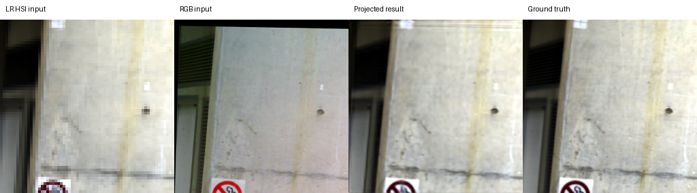
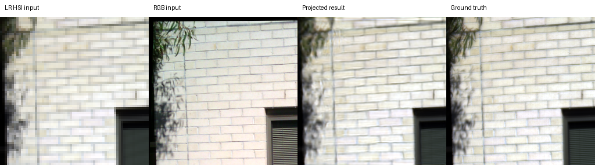
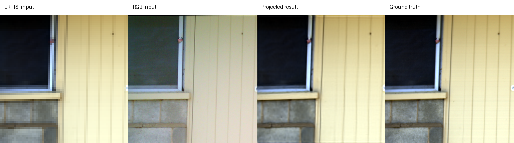
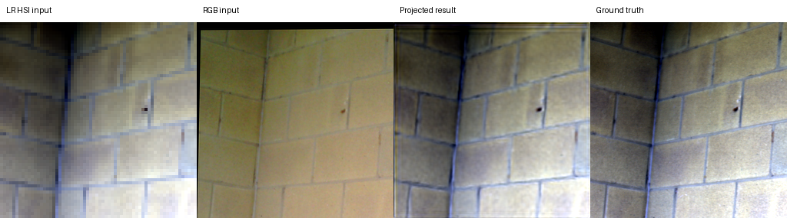

# SSA-MRN · RGB 유도 HSI 초해상도

고해상도 RGB와 저해상도 HSI에서 ×4 HSI 복원을 연구합니다. 아래 결과는 LIB-HSI의 관측 HSI를 합성 축소한 평가이며 실제 센서의 HR-HSI 정답 성능과 구분합니다.

## 연구 개요

204밴드 HSI의 보간 결과를 유지하면서, 인접한 12밴드씩 학습 압축한 17특징에서 공간 보정량을 추정합니다. R·G·B 각각의 독립 SSA-MRN 경로와 밴드별 학습 fusion으로 보정량을 결합합니다. 내부 평균 축소·23탭 확대를 사용하고, MSE에 분광 방향 손실(1−cos)을 λ=0.01로 더해 학습했습니다. 완료된 가중치의 출력에는 합성 LR 입력과 4×4 블록 평균을 일치시키는 후처리를 적용할 수 있습니다.

[연구 설명 · 재현부터 17특징·분광 손실까지](docs/guide/research_overview.md)에서 단계별 연산, 텐서 크기, 결과 해석을 확인할 수 있습니다.

## 연구 문서

- [기존 PAN–MS 재현 정리](docs/reproduction.md)
- [이전 RGB–HSI 실험 정리](docs/previous_experiments.md)

## 가장 최근 완료 연구 · 17특징 23탭 + LR 평균 일관성 보정

204→17 grouped 학습 압축(12밴드/특징), R/G/B 독립 core, K=4, 2,601,086 parameters. 내부 평균 축소·23탭 확대, 입력 area ×4·23탭 baseline, HR256/LR64. MSE에는 정합 유효 마스크를 적용하고, 분광 항은 GT·예측 norm >1e−6 픽셀만 사용해 MSE + 0.01(1−cos)을 학습했습니다.

| test 75장면 평균 | MSE ↓ | PSNR dB ↑ | SAM ° ↓ |
|---|---:|---:|---:|
| 23탭 baseline | 0.0013944695 | 29.2259 | 2.4790 |
| 23탭 baseline + LR 보정 | 0.0011539606 | 30.0649 | 2.4450 |
| 17특징 + 분광 손실 | 0.0004716392 | 34.0611 | 2.2006 |
| **17특징 + 분광 손실 + LR 보정** | **0.0004559785** | **34.2173** | **2.1625** |

best epoch 99의 **같은 가중치**를 사용했습니다. 재학습 없이 4×4 블록의 출력 평균을 LR HSI 입력과 맞췄습니다. 보정 전 대비 테스트 PSNR **+0.1562 dB**, SAM **−0.0381°**이며 75개 독립 장면 모두 MSE가 개선됐습니다. [LR 보정 결과·적용 조건](docs/experiments/rgb06_lr_consistency.md)과 [원래 RGB06 연구](docs/experiments/rgb06_triple17_spectral.md)를 구분해 기록했습니다. 실제 센서 입력에 대한 성능 보장은 별도 검증이 필요합니다.


### test 예시 5종

[204밴드 웹 뷰어](https://biyonghiyon.github.io/CtrS/ssa-mrn/)와 [기존 오프라인 HTML](docs/assets/rgb06_triple17_spectral/band_viewer/index.html)은 **보정 전** RGB06 결과입니다. 아래 다섯 이미지는 **보정 후** 결과입니다.

왼쪽부터 **LR HSI · RGB 입력 · LR 보정 결과 · 정답**입니다. 이전과 동일한 사전 고정 5장면 tile0입니다. HSI 표시는 공통 대비이며 정량 지표는 204밴드 원래 값으로 계산합니다.










## 현재 학습 상태

보고 대상 run `20261004-235831-565c8ba31ed7`은 2026-10-05 05:10(KST), 종료 코드 0으로 완료됐습니다. best/latest를 서버에 보존했으며 새 학습은 실행하지 않았습니다.

기존 체크포인트로 보정된 새 평가 결과를 생성할 때는 `export_results.py`에 `--area-consistency --alignment-manifest SSA-MRN/experiments/results/rgb06_lr_consistency/alignment_manifest.json`을 추가합니다. 이 옵션은 입력이 ×4 `area` 축소일 때만 사용할 수 있고, 평가·5개 예시·오프라인 밴드 뷰어에 동일하게 적용됩니다. 새 출력 폴더를 지정해 보정 전 결과를 보존합니다. 정합 manifest 지정 이유는 [결과 보고서](docs/experiments/rgb06_lr_consistency.md)에 기록했습니다.

## 결과 보고와 파일 보관

완료 실험에는 공통 보고서, 학습/검증 및 비교 그래프, 사전에 선택한 서로 다른 test 5장면의 4패널 이미지를 반드시 남깁니다. 성능이 좋은 장면을 보고 골라서는 안 됩니다.

```powershell
& $py SSA-MRN\scripts\export_results.py --checkpoint '<run>\best.pt' --data-root 'C:\CtrS\SSA-MRN\data\dataset\RGB-HSI\LIB-HSI' --output-dir '<새 결과 폴더>' --previous-metrics '<직전 결과>\test\metrics.json'
```

실행 환경에 `requirements.txt`를 설치해야 합니다. exporter는 체크포인트에 저장된 평가 조건을 사용합니다. [공통 보고서 양식](docs/experiments/template.md), [작업 규칙](AGENTS.md), [데이터셋 감사 자료](references/rgb_hsi_datasets.md)를 참고합니다.

새 실험 시작 전 `cleanup_experiment.py --run-dir <완료 run>`의 목록을 검토하고 `--completed --apply`로 적용합니다. 가중치·숫자 결과는 보존하고 과거 설정·원시 로그·캐시는 정리합니다. 현재 학습의 run에는 적용하지 않습니다.
