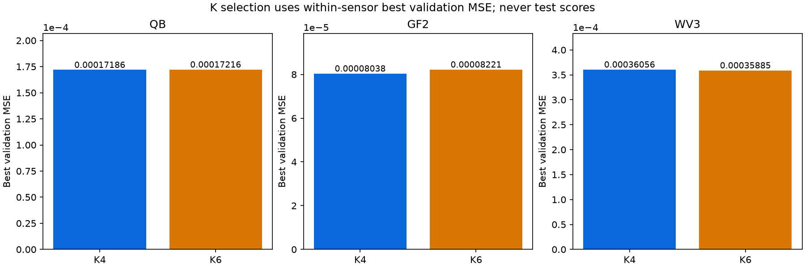
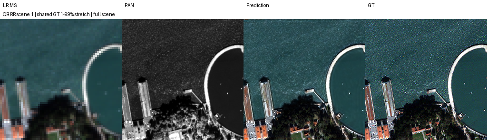

# SSA-MRN · K4 기준 성능 개선 연구

[저장소 홈](../README.md) · [알고리즘과 평가](docs/research.md) · [실험 목록](#experiments) · [진행 기록](#status) · [실행·보관](#files)

고해상도 흑백 위성영상 **PAN**과 저해상도 다중분광영상 **MS**를 결합해 고해상도 MS를 복원합니다. SSA-MRN을 재현하고 구조·손실·학습 데이터 변화가 복원 성능에 미치는 영향을 비교하는 연구입니다.

## 1. 현재 연구 기준 · K=4 확정

**2026-10-09 현재 연구의 기본 설정은 K=4로 확정했습니다.** Windows 동일 환경에서 QB·GF2·WV3의 K4/K6를 각각 100에폭 학습하고, 센서별 best validation MSE 다수결 **2:1**로 선택했습니다. 앞으로 별도 승인된 K 비교가 아닌 신규 기준선·개선 비교는 K4를 기준으로 설계합니다.

K는 모델 내부 특징 차원이며 센서 밴드 수와 다릅니다. WV3에서는 K6가 낮았으므로 이 결정은 모든 센서·test 지표에서 K4가 우세하다는 뜻은 아닙니다. K 선택에는 test를 사용하지 않았습니다.
| 센서 | K4 best validation MSE ↓ | K6 best validation MSE ↓ | 선택 |
|---|---:|---:|---|
| QB | 0.000171861819 | 0.000172164394 | K4 |
| GF2 | 0.000080382687 | 0.000082206216 | K4 |
| WV3 | 0.000360564225 | 0.000358851370 | K6 |

공통 조건은 Windows RTX 3060 Ti·시드 42·Adam lr=1e-4·effective batch 32·micro batch 4·100에폭입니다. 원본 best/latest 12개와 600에폭 기록을 보관하고 원격 복구를 검증했습니다. [K4/K6 상세 보고서](docs/experiments/windows_k_baselines.md)

## 2. 진행 기록과 다음 판단

| 항목 | 확인된 상태 | 다음 단계 |
|---|---|---|
| Windows 기준선 | 6개 × 100에폭 완료, K4 선택 | 기준선의 전체 RR/FR 평가 |
| Windows K4 손실 | 2026-10-09 21:11 KST: spectral·consistency 완료, edge 0.001 실행 중 | 손실 9개 선별 → 후보 30→100에폭 연장 → 기준선 비교 |
| 이전 Linux K6 구조 연구 | 저장소 보고서 기준 반복 시드·센서 평가 완료 | 후보의 K4 적용 여부 검토, 필요 시 K4 대조 검증 |
| Kaggle K6 B1/B2 재개 | 2026-10-09 22:16 KST: 두 모델100에폭·RR/FR 각20장 확인 | RR 악화·FR 개선 혼재, 이전 실행과 비교한 통제 반복 필요 |
| 이전 Kaggle K6 MTF 증강 | 100에폭·원본 가중치 보관 완료 | 해당 K6 실험의 RR/FR 평가 대기 |

Windows 계획은 940에폭 직렬 실행이며, 위 시각은 마지막 확인 기록입니다. loss 선택은 validation으로 하고 test로 선택을 바꾸지 않습니다. GPU·환경·micro batch가 다른 서버의 결과를 하나의 반복시드 평균으로 합치지 않습니다. 실행 중인 K6 실험을 문서 결정만으로 K4로 변경하거나 재시작하지 않습니다.

## 3. 전체 실험 지도

보고서 이름을 누르면 중간 안내 페이지 없이 조건·수치·이미지·가중치에 접근합니다. **실제 K**는 해당 실험이 수행된 설정이며 현재 기본값과 구분합니다.

| 단계 | 실험 | 실제 K | 확인된 결과·상태 |
|---|---|---|---|
| 현재 기준 | [Windows K4/K6 통제 비교](docs/experiments/windows_k_baselines.md) | 4·6 | 6개 × 100에폭 완료, 원본 12개 보관. 다수결로 **K4 확정**, test 평가 대기 |
| 현재 진행 | [Windows 손실 탐색](docs/experiments/windows_controlled.md) | **4** | spectral·consistency 완료, edge 진행 기록. 최종 손실 효과 미확정 |
| 이전 재현 | [공개 코드 K4 재현](docs/experiments/pan_k4.md) | 4 | RR/FR 평가 완료, 초기 기준 |
| 이전 재현 | [논문 설정 K6 재현](docs/experiments/pan_k6.md) | 6 | RR/FR 평가 완료, K4와 장치도 달랐음 |
| 구조 탐색 | [QB 23탭·LR 보정·고주파](docs/experiments/a6000_architecture_qb.md) | 6 | 단일 시드에서 23탭을 후속 후보로 선정 |
| 구조 검증 | [23탭 반복·위치·센서 확장](docs/experiments/a6000_followup_123.md) | 6 | QB RR 이득·FR 혼재, GF2 개선·WV3 악화 |
| 구조 검증 | [GF2 반복·QB 입력 23탭](docs/experiments/a6000_gf2_repeat_qb_input.md) | 6 | 3시드 평가 완료, GF2 PSNR/QNR 개선·SAM 혼재 |
| 구조 탐색 | [QB 밴드별 게이트 고주파](docs/experiments/kaggle_band_gated_hf.md) | 6 | RR 악화로 채택 보류 |
| 증강 탐색 | [QB MTF 변화량 증강](docs/experiments/kaggle_mtf_pair.md) | 6 | 100에폭·원본 4개 보관, validation만 확인·RR/FR 대기 |
| 구조 검증 | [QB B1/B2 100에폭 재개](docs/experiments/kaggle_b1_b2_100_resume.md) | 6 | RR/FR 각20장 완료, B2 RR PSNR −0.119919 dB·잠정 FR QNR +0.019136, 종합 채택 보류 |
| 사전 검증 | [QB 관측 연산자](docs/experiments/observation_validation.md) | 해당 없음 | consistency 관측 구현 검증, 학습 성능 결과와 구분 |

## 4. 이전 K6 연구에서 확인한 점

아래는 K6로 수행한 실험들의 자체 기준선 대비 결과입니다. 현재 K4 모델에서 같은 효과가 확인됐다는 의미는 아닙니다. RR은 정답이 있는 축소 해상도 평가, FR은 고해상도 정답이 없는 실제 해상도 평가입니다.

| 연구·범위 | 주요 관측 | 현재 해석 |
|---|---|---|
| GF2 전체 23탭 · 3시드 | RR PSNR +0.1095 ± 0.0698 dB, QNR +0.005261 ± 0.002222; SAM 2/3 악화 | 센서별 후보, 지표 전체 개선은 아님 |
| QB 입력 23탭 · 3시드 | PSNR +0.0575 ± 0.0369 dB, SAM −0.02123 ± 0.02598°; QNR 2/3 악화 | 공간·분광 RR 이득과 FR 한계를 함께 기록 |
| QB 전체 23탭 · 3시드 | PSNR +0.0421 ± 0.0127 dB, QNR 평균 −0.011602 | RR 이득은 반복, FR 개선 불안정 |
| WV3 전체 23탭 · 시드 42 | PSNR −0.0368 dB, SAM +0.0219°, QNR −0.001746 | 전체 센서 일괄 적용 보류 |
| QB 게이트 고주파 · 시드 42 | RR PSNR −0.174992 dB | 현재 설정 채택 보류 |
| QB MTF 증강 · 시드 46 | validation PSNR +0.005759 dB, SAM −0.004994° | validation의 작은 차이, test 평가 대기 |

±는 3시드의 기준선 대비 차이 표본 표준편차이며 유의성 검정이 아닙니다. QNR·Ds 및 일부 RR 지표의 MATLAB 구현 일치성이 미검증이고, test 재사용 이력은 각 보고서에 명시합니다. MTF의 validation PSNR과 RR test PSNR은 평가 대상·기준이 달라 같은 순위표로 비교하지 않습니다.

### 최근 K6 완료 · B1/B2 100에폭 재개

B1 대비 B2는 RR PSNR **−0.119919 dB**, SAM **+0.009337°**, 잠정 FR QNR **+0.019136**입니다. B2의 RR PSNR은 20/20장에서 낮았습니다. 중간 200 셀에서 가져온 저장 지점부터 총100에폭까지 학습한 결과이며 200에폭 완료가 아닙니다. 이전 B1/B2와 실행 조건·개선 방향이 달라 종합 채택을 보류합니다.

[상세 보고서·원본 가중치·검증](docs/experiments/kaggle_b1_b2_100_resume.md)

### 이전 K6 결과 이미지

다음은 **K6 전체 23탭**의 고정 장면 예시입니다. 왼쪽부터 LR MS · PAN · 예측 · 정답이며 동일 장면의 MS 패널에는 공통 대비를 적용했습니다. 현재 K4 통제 비교의 test 예시는 아직 없습니다.

**QB · K6 · 시드 43**

**GF2 · K6 · 시드 42**

**WV3 · K6 · 시드 42**

## 5. 실행·보고·보관 기준

| 작업 | 문서 |
|---|---|
| 현재 Windows K4 손실 학습 확인 | [Windows 실행 안내](docs/operations/controlled_suite.md) |
| 기본 환경·K4 설정·기존 가중치 평가 | [기본 실행 안내](docs/operations/pan_ms.md) |
| 과거 Linux K6 실험 재현 | [최초 구조 비교](docs/operations/a6000_suite.md) · [후속 검증](docs/operations/a6000_followup.md) · [GF2 반복·QB 입력](docs/operations/a6000_next_6h.md) |
| 과거 Kaggle K6 실험 재현 | [게이트 고주파](docs/operations/kaggle_gpu_comparison.md) · [MTF 보고서](docs/experiments/kaggle_mtf_pair.md) |
| 새 실험 기록 | [8개 절 공통 양식](docs/experiments/template.md) |

신규 실험은 K4 기준선과 변경 모델의 데이터·시드·학습량·환경을 맞춰 설계합니다. 학습 완료 후 실제 best/latest 원본·설정·실측 에폭 기록·전체 평가 JSON·그래프·고정 장면·해시를 보관합니다. 학습량은 실험별 실제 값으로 기록하고, 원격 복구 검증 전에는 유일한 결과를 삭제하지 않습니다.

보고서는 `docs/experiments/실험명.md`, 산출물은 기존 `docs/assets/실험ID/` 또는 `experiments/` 경로에 둡니다. 과거 K6 가중치·보고서·학습 설정은 당시 조건을 유지합니다.
