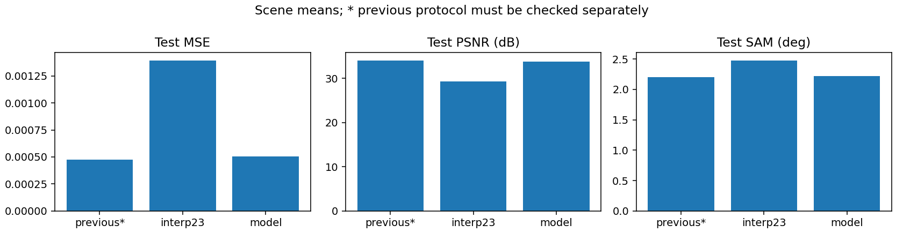

# SSA-MRN · RGB 유도 HSI 초해상도

고해상도 RGB와 저해상도 HSI에서 ×4 HSI 복원을 연구합니다. 아래 결과는 LIB-HSI의 관측 HSI를 합성 축소한 평가이며 실제 센서의 HR-HSI 정답 성능과 구분합니다.

## 연구 개요

204밴드 HSI의 보간 결과를 유지하면서, 인접한 17밴드씩 학습 압축한 12특징에서 공간 보정량을 추정합니다. R·G·B 각각의 독립 SSA-MRN 경로와 밴드별 학습 fusion으로 보정량을 결합합니다. 현재는 같은 구조에서 내부 23탭/평균 resampling과 Bilinear의 영향을 비교합니다.

[연구 설명 · 재현부터 RGB별 12특징까지](docs/guide/research_overview.md)에서 단계별 연산, 텐서 크기, 결과 해석을 확인할 수 있습니다.

## 연구 문서

- [기존 PAN–MS 재현 정리](docs/reproduction.md)
- [이전 RGB–HSI 실험 정리](docs/previous_experiments.md)

## 가장 최근 완료 연구 · RGB별 12특징 Bilinear 타일

204밴드를 17개씩 grouped 압축해 12특징으로 만들고, R/G/B 각각 독립 core·decoder의 출력을 밴드별로 결합합니다. K=4, 내부 Bilinear 축소/확대(align_corners=True), 입력 baseline 23탭. 학습·test 모두 256 타일, LR HSI 64×64입니다.

| test 75장면 평균 | MSE ↓ | PSNR dB ↑ | SAM ° ↓ |
|---|---:|---:|---:|
| 23탭 baseline | 0.0013944695 | 29.2259 | 2.4790 |
| RGB별 SSA-MRN | 0.0005064195 | 33.7897 | 2.2190 |

best epoch 100. [상세 보고서·직전 연구와 차이](docs/experiments/rgb05_triple12_bilinear.md). 동일 75장면·타일 평가에서 직전 내부 23탭 모델보다 PSNR **0.2633 dB 감소**, SAM **0.0132° 증가**했습니다. 이번 단일 학습에서는 개선되지 않았습니다. baseline 대비 PSNR은 4.5639 dB 상승했습니다.




### test 예시 5종

[204밴드 슬라이더 웹 뷰어](https://biyonghiyon.github.io/CtrS/ssa-mrn/) · [오프라인 HTML](docs/assets/rgb05_triple12_bilinear/band_viewer/index.html). 웹 링크에서 5장면을 선택해 확인할 수 있으며, 내려받은 HTML도 단독 실행됩니다. 같은 epoch 100 가중치의 CPU 추론이며, 기존 CUDA AMP 예시와 미세한 수치 차이가 있을 수 있습니다.

왼쪽부터 **LR HSI · RGB 입력 · 예측 · 정답**입니다. 동일한 HSI 대비 범위를 사용하며, 지표는 204밴드 원래 값으로 계산합니다. 이전 보고서와 같은 5장면의 tile 0입니다.

[예시 1 · 204밴드 슬라이더](https://biyonghiyon.github.io/CtrS/ssa-mrn/sample_01.html)


[예시 2 · 204밴드 슬라이더](https://biyonghiyon.github.io/CtrS/ssa-mrn/sample_02.html)


[예시 3 · 204밴드 슬라이더](https://biyonghiyon.github.io/CtrS/ssa-mrn/sample_03.html)


[예시 4 · 204밴드 슬라이더](https://biyonghiyon.github.io/CtrS/ssa-mrn/sample_04.html)


[예시 5 · 204밴드 슬라이더](https://biyonghiyon.github.io/CtrS/ssa-mrn/sample_05.html)


## 현재 학습 상태

현재 보고 대상 학습은 완료되었습니다. 100/100 epoch, 종료 코드 0, 종료 시각 2026-10-04 03:09(KST). run `20261003-220209-d4faa37d0365`의 best/latest 가중치를 보존했습니다. 새 학습은 시작하지 않았습니다.

## 결과 보고와 파일 보관

완료 실험에는 공통 보고서, 학습/검증 및 비교 그래프, 사전에 선택한 서로 다른 test 5장면의 4패널 이미지를 반드시 남깁니다. 성능이 좋은 장면을 보고 골라서는 안 됩니다.

```powershell
& $py SSA-MRN\scripts\export_results.py --checkpoint '<run>\best.pt' --data-root 'C:\CtrS\SSA-MRN\data\dataset\RGB-HSI\LIB-HSI' --output-dir '<새 결과 폴더>' --previous-metrics '<직전 결과>\test\metrics.json'
```

실행 환경에 `requirements.txt`를 설치해야 합니다. exporter는 체크포인트에 저장된 평가 조건을 사용합니다. [공통 보고서 양식](docs/experiments/template.md), [작업 규칙](AGENTS.md), [데이터셋 감사 자료](references/rgb_hsi_datasets.md)를 참고합니다.

새 실험 시작 전 `cleanup_experiment.py --run-dir <완료 run>`의 목록을 검토하고 `--completed --apply`로 적용합니다. 가중치·숫자 결과는 보존하고 과거 설정·원시 로그·캐시는 정리합니다. 현재 학습의 run에는 적용하지 않습니다.
