# Kaggle SSA-MRN B1/B2

Status: full training and RR/FR evaluation completed.
QB; K=6; epochs=100; seeds=[42]; effective batch=32; micro=32.
B0 was measured previously and is not executed or numerically reconstructed here.
B1: 3 shared stages with zero observation error; B2: same stages with MS-D(current) feedback.
Same core/error encoder/alpha initialization, sample order and final-output MSE.
Source MTF is fixed; TRAIN GT/MS phases audited before training. Validation/test phase uses observed LMS/MS only.
Feedback masks unknown patch halos; inference is FP32 on whole scenes. Best selected only by validation MSE.
FR input consistency does not establish correct HR detail. Repository QNR/Q2n/SCC MATLAB parity limitations remain.
GPU-resident FP32 data, direct H5 uploads with progress; FP64 GPU FFT audit; no normalized disk cache.
| Run | Best epoch | RR PSNR | RR SAM | FR QNR (provisional) |
|---|---:|---:|---:|---:|
| B1_QB_B1_k6_s42 | 90 | 37.604745 | 4.832698 | 0.904310 |
| B2_QB_B2_k6_s42 | 99 | 37.720504 | 4.814416 | 0.886089 |

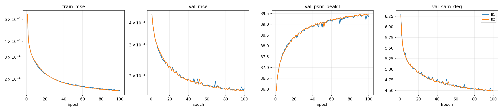
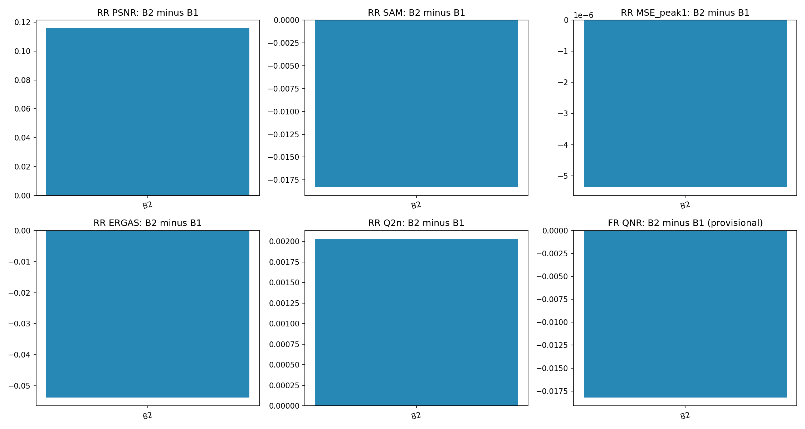

## B1_QB_B1_k6_s42 fixed RR scenes
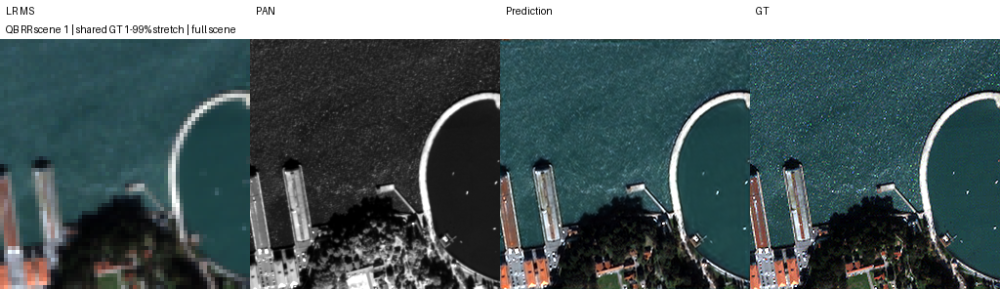
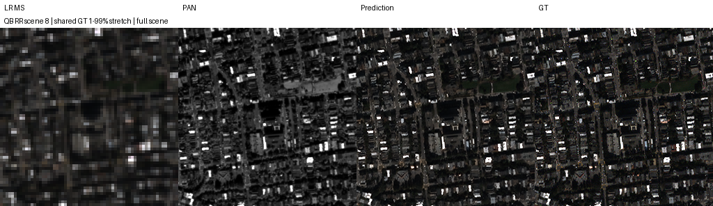
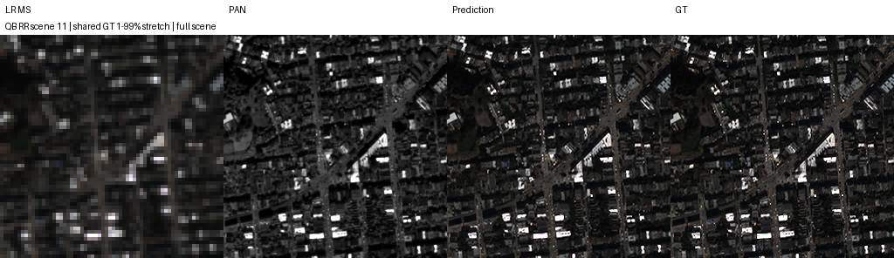
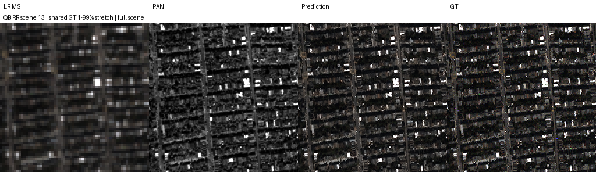
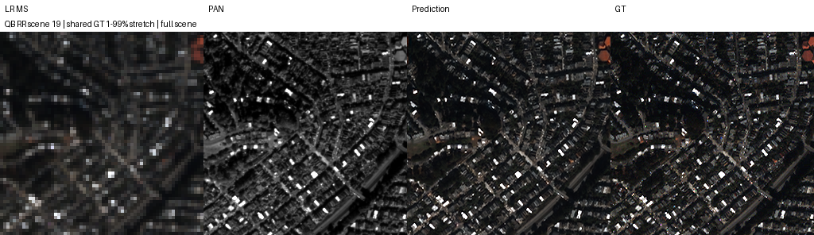

## B2_QB_B2_k6_s42 fixed RR scenes

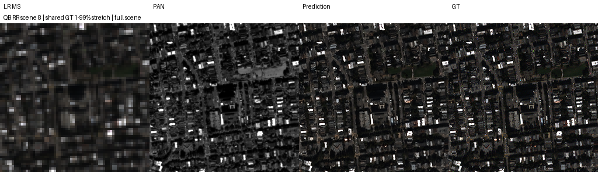
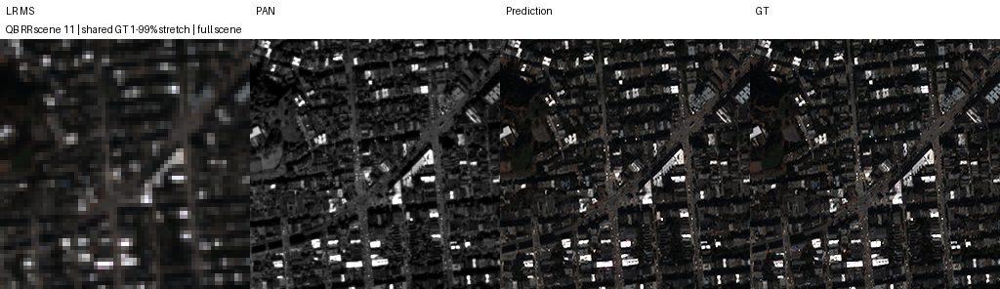
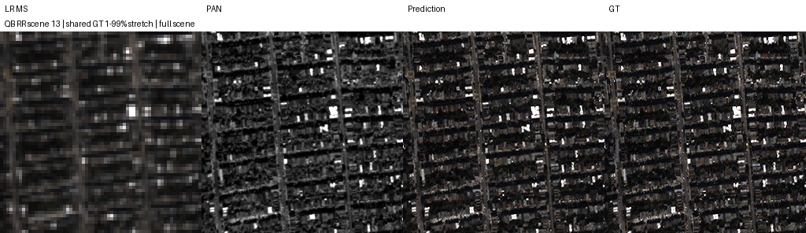
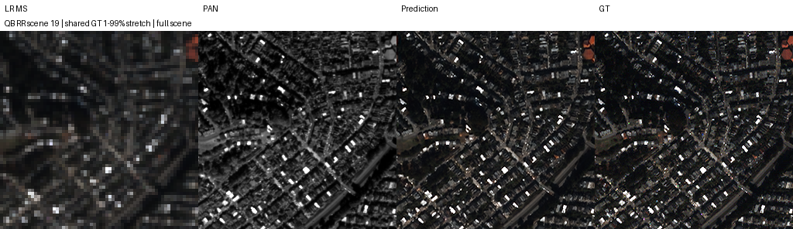
