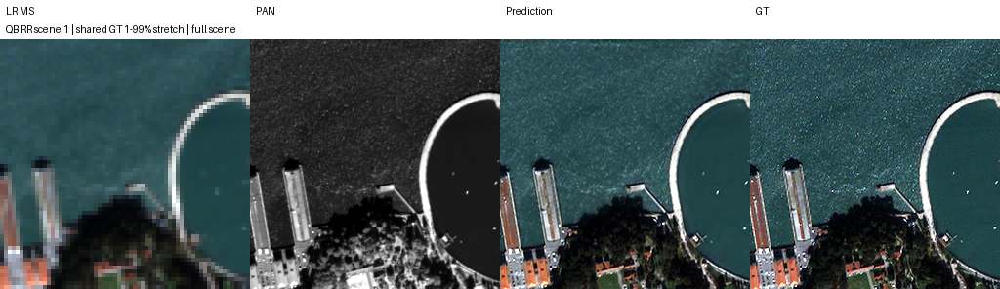
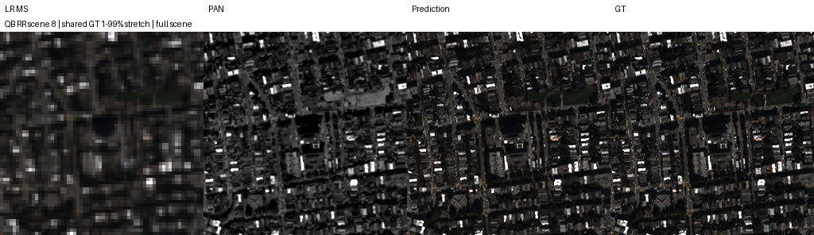
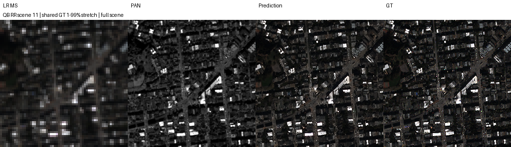
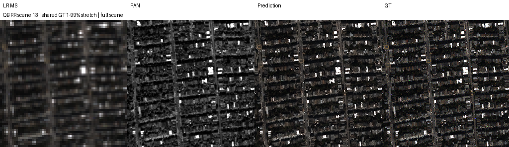
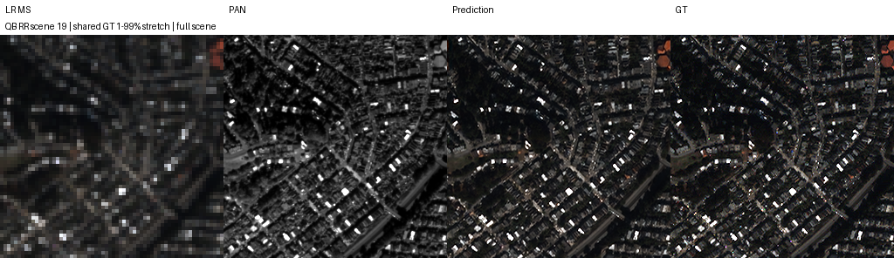

# Kaggle SSA-MRN B1/B2

Status: full training and RR/FR evaluation completed.
Learning rate: fixed 0.0001; hard maximum 100 epochs.
Sources: fresh run or explicitly audited pre-100 continuation; see bootstrap_manifest.json when imported.
QB; K=6; epochs=100; seeds=[42]; effective batch=32; micro=32.
B0 was measured previously and is not executed or numerically reconstructed here.
B1: 3 shared stages with zero observation error; B2: same stages with MS-D(current) feedback.
Same core/error encoder/alpha initialization, sample order and final-output MSE.
Source MTF is fixed; TRAIN GT/MS phases audited before training. Validation/test phase uses observed LMS/MS only.
Feedback masks unknown patch halos; inference is FP32 on whole scenes. Best selected only by validation MSE.
FR input consistency does not establish correct HR detail. Repository QNR/Q2n/SCC MATLAB parity limitations remain.
GPU-resident FP32 data, GPU sampling/batching, periodic status synchronization; no CPU DataLoader.
Mid-epoch recovery stores the permutation, batch cursor, optimizer/scaler/RNG and loss accumulator.
Best checkpoint uses validation MSE only; no epochs beyond 100 are trained.
Fused Adam and optional checked FFT observation are shared runtime settings; old runs are not bitwise reproduced.
| Run | Best epoch | RR PSNR | RR SAM | FR QNR (provisional) |
|---|---:|---:|---:|---:|
| B1_QB_B1_k6_s42 | 95 | 37.690421 | 4.822219 | 0.882708 |
| B2_QB_B2_k6_s42 | 96 | 37.570502 | 4.831556 | 0.901844 |

## B1_QB_B1_k6_s42 fixed RR scenes

## B2_QB_B2_k6_s42 fixed RR scenes

