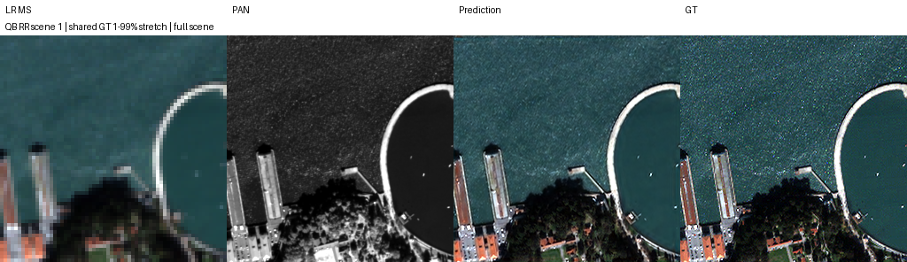
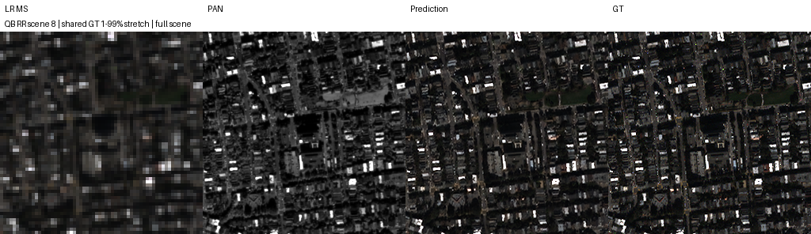
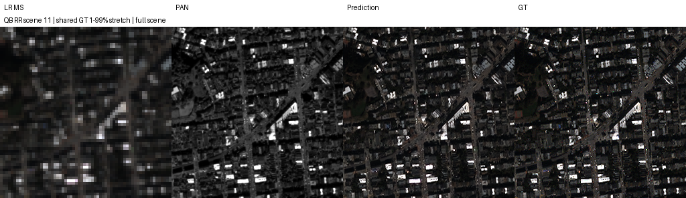
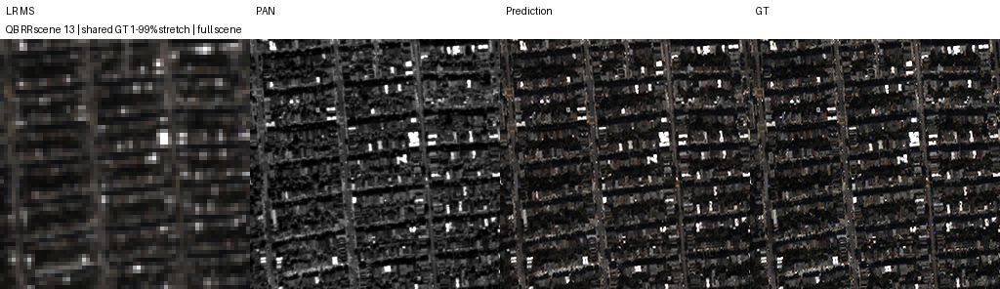
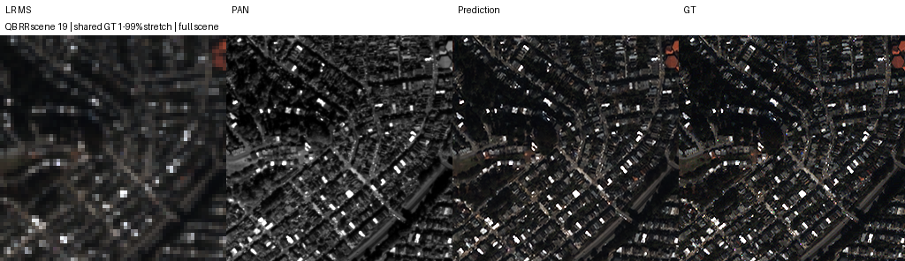

# Kaggle SSA-MRN experiment

Status: full training and RR/FR evaluation completed.
Sensor=QB; K=6; epochs=100; seeds=[42]; Adam LR=0.0001; effective batch=32.

Best selected only by FP32 validation MSE. All test scenes evaluated in FP32 without inference cropping.
GitHub baseline uses pinned RestoredPansharpeningNet; pasted arm uses build_model source recorded under code/.
Band-gated definition extracted unchanged from plan notebook commit 1b56efb54e9c200d5b497e719bb0857b25f750bf.
Plan model logic is retained; shared training AMP/micro-batch settings differ from the plan's FP32/micro4 protocol.
Fixed high_frequency comparator excluded by user request; this study compares baseline versus band_gated_hf only.
Controlled comparison=True. AMP=True; channels_last=True; equal micro batches in controlled mode.
Execution/data loading optimizations apply equally to both model arms. Model definitions are not inferred.
reference_plan_config preserves the original source's declared FP32 config; amp/micro_batch fields record actual execution.
FR D_s/QNR, RR Q2n and SCC retain the repository's MATLAB parity limitations.
Repository PSNR uses peak 2047 even for GF2; PSNR_sensor_peak is exported separately.
Example scene indices were fixed before scoring. RGB band order [2,1,0] is assumed.
FR has no GT. No FR ground truth images are generated.

Actual RR scenes=20, FR scenes=20; reference plan expects 20 each.
| Run | Best epoch | RR PSNR | RR SAM | FR QNR (provisional) |
|---|---:|---:|---:|---:|
| github_QB_baseline_k6_s42 | 100 | 37.453879 | 4.955443 | 0.919756 |
| pasted_QB_band_gated_hf_k6_s42 | 99 | 37.278888 | 4.964272 | 0.920742 |

## github_QB_baseline_k6_s42 fixed RR scenes

## pasted_QB_band_gated_hf_k6_s42 fixed RR scenes

