# QB wavelet A0/A1

Status: training and full RR/FR evaluation completed by this cell.
A0 fixed gate=1; A1 learns band/direction/position gates. Two independent x2 Haar restoration stages.
Original LR MS input; final MSE only. Best selected by validation MSE; FP32 whole-scene evaluation.
Same common initialization, epoch sample order and batch verified. A1 has extra gate parameters.
B0 artifact-audited seeds: []. Other seeds have no verified B0 comparison.
B0 is previously measured restored SSA-MRN K6, not a new reproduction of published paper numbers.
Structure, raw MS input path and model capacity are declared treatment differences.
FR QNR is provisional; repository resize/metric MATLAB parity limitations remain.
Timing measures training and validation separately; compilation/checkpoint time is excluded from training throughput.
| Run | Best epoch | RR PSNR | RR SAM | FR QNR (provisional) |
|---|---:|---:|---:|---:|
| A0_QB_s42 | 100 | 34.654411 | 5.814784 | 0.942042 |
| A1_QB_s42 | 100 | 34.400882 | 5.897221 | 0.940426 |

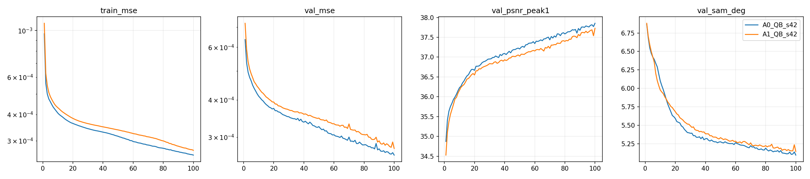
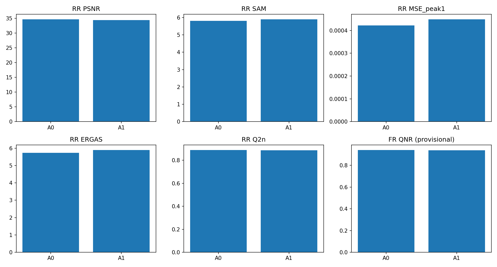

## A0_QB_s42 fixed RR examples
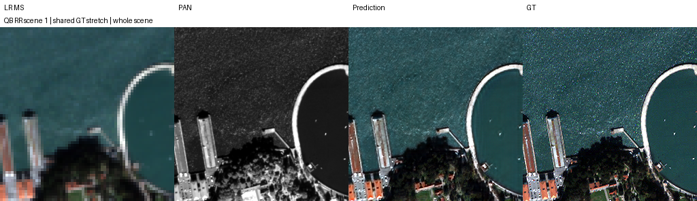
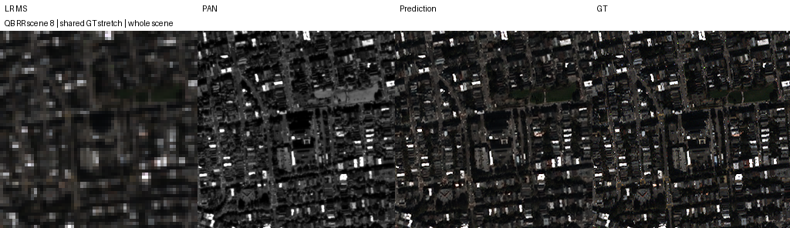
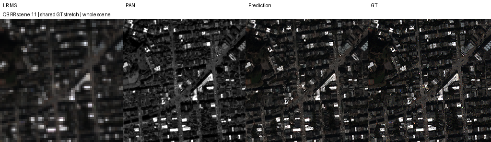
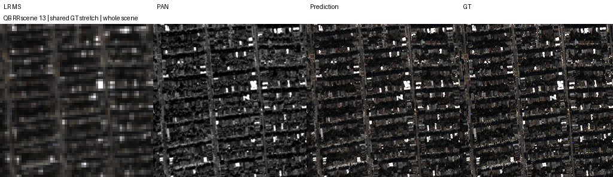
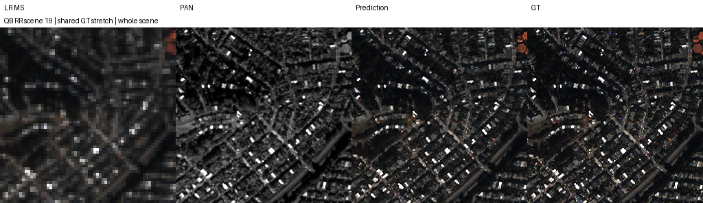

## A1_QB_s42 fixed RR examples

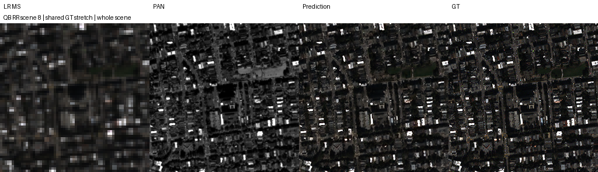
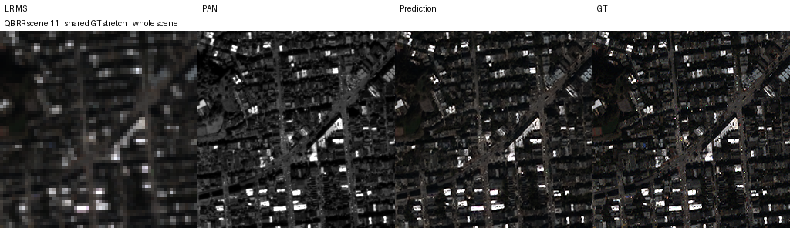
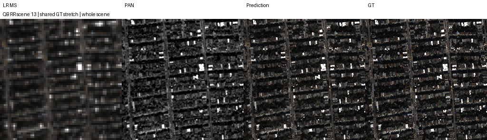
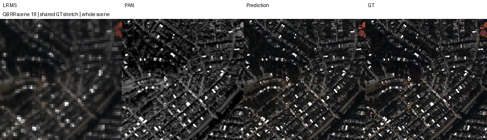
