# A6000 QB 구조 비교 · 23탭 / LR 보정 / 고주파 경로

[실험 목록](../../README.md#experiments) · [수치](#results) · [그래프](#graphs) · [이미지](#images) · [가중치](#evidence)

| 비교 기준 | 이번에 바꾼 점 | 관측된 차이 | 판단 |
|---|---|---|---|
| 같은 서버의 QB K=6 기준선 | 내부 확대 23탭 | PSNR +0.0557dB, SAM −0.0429°, 잠정 QNR +0.003143 | 후속 반복 검증 우선 후보 |
| 같은 기준선 | LR 출력 보정 gain 0.1 | PSNR −0.0403dB, 잠정 QNR −0.003150 | 현재 설정 채택 보류 |
| 같은 기준선 | PAN 고주파 잔차 | PSNR −0.0621dB, SAM −0.0231° | 현재 설정 채택 보류 |

## 1. 목적과 상태

SSA-MRN의 구조 변경을 하나씩 적용해 공간·분광 복원 성능을 개선할 후보를 찾습니다. 새로운 연구 주제로 확대하지 않습니다. 네 모델 모두 2026-10-08 05:33 KST까지 100에폭 학습을 완료했습니다. **QB RR 20장·FR 20장 전체 평가 완료**, 시드 42의 단일 반복 결과입니다.

학습 코드 commit은 `84a8de5`, 평가 스크립트는 `scripts/evaluate_a6000.py`이며 이 보고서와 함께 저장합니다. 학습 run은 `QB_{variant}_k6_s42`입니다. RR은 제공된 축소 해상도 정답 평가이고 FR에는 고해상도 정답이 없습니다.

## 2. 변경 사항과 평가 조건

- QB train 17,139 / validation 1,905패치, 고정 분할. 학습 입력은 PAN 1밴드·MS/LMS/GT 4밴드, train GT 64×64 / MS 16×16입니다. 평가 장면 크기와 파일 해시는 원본 JSON에 있습니다.
- K=6, 시드 42, Adam·lr 1e-4, 100에폭, batch=micro batch=32, A6000 CUDA·FP32·결정론 설정. 공통 계층은 같은 초기 가중치로 시작합니다.
- 네 조건 모두 기본 MSE이며 보조 손실을 추가하지 않습니다. 제공 LMS와 내부 축소 bilinear는 유지합니다.
- **23탭:** 사용되는 내부 확대 ×4 한 곳·×2 세 곳만 23탭으로 교체합니다. 주기 경계·샘플 삽입 위상도 변경점에 포함됩니다.
- **LR 보정:** QB MTF 관측과 입력 LMS/MS의 내부 오차로 고른 샘플링 위상으로 예측을 관측하고 `0.1 × bilinear(입력 MS−관측 예측)`을 출력에 더합니다. LR 경계 5픽셀은 마스킹합니다. GT나 예측을 위상 선택에 사용하지 않습니다. 위상 추정·gain은 새 연구 가정입니다.
- **고주파:** PAN에서 5×5 binomial 저주파를 빼고 1→16→4 Conv 잔차 경로로 더합니다. 마지막 Conv는 0으로 초기화합니다.
- **가중치 선택:** test를 보기 전에 validation MSE로 저장한 best를 사용했습니다. 네 모델 모두 best는 98에폭, latest는 100에폭입니다. 최신 에폭 평가와 혼동하지 않습니다.
- RR 지표는 장면별 계산 후 20장 산술평균입니다. PSNR은 기존 저장소와 동일한 **밴드별 peak 2047 PSNR의 평균**입니다. 정규화 MSE 기반 global PSNR과 다른 정의입니다. 예측값을 지표 계산 전에 0~1로 클리핑하지 않습니다.

## 3. 정량 결과

### RR · 정답 기반 20장 평균

| 모델 | PSNR dB ↑ | SAM ° ↓ | ERGAS ↓ | SCC ↑ | Q4 ↑ | MSE(peak=1) ↓ |
|---|---:|---:|---:|---:|---:|---:|
| 기준선 | 37.4242 | 4.9639 | 4.1288 | 0.976716 | 0.922771 | 0.00021548 |
| 23탭 | 37.4799 | 4.9210 | 4.0966 | 0.977300 | 0.923636 | 0.00021278 |
| LR 보정 | 37.3839 | 4.9604 | 4.1444 | 0.976455 | 0.921464 | 0.00021715 |
| 고주파 경로 | 37.3621 | 4.9408 | 4.1568 | 0.976243 | 0.922225 | 0.00021837 |

### FR · 정답 없는 20장 평균

| 모델 | Dλ ↓ | Ds ↓ | QNR ↑ |
|---|---:|---:|---:|
| 기준선 | 0.044003 | 0.043424 | 0.914868 |
| 23탭 | 0.046491 | 0.037724 | 0.918011 |
| LR 보정 | 0.046656 | 0.044143 | 0.911718 |
| 고주파 경로 | 0.041984 | 0.049736 | 0.910940 |

FR의 PAN resize는 MATLAB `imresize`가 아닌 scikit-image 구현이므로 Ds·QNR은 **잠정 지표**입니다. Q4·SCC도 MATLAB 전체 일치성이 미검증입니다. 논문 수치보다 우수하다는 결론으로 사용하지 않습니다.

[전체 장면별 수치·파일 해시·학습 기록](../assets/a6000_architecture_qb/metrics.json)

## 4. 직전 연구와 수치 차이

아래는 **같은 서버·분할·시드·학습량의 기준선 대비 현재−기준선**입니다.

| 변형 | ΔPSNR dB ↑ | ΔSAM ° ↓ | ΔERGAS ↓ | ΔMSE ↓ | ΔQNR ↑ |
|---|---:|---:|---:|---:|---:|
| 23탭 | +0.0557 | -0.0429 | -0.0321 | -0.00000270 | +0.003143 |
| LR 보정 | -0.0403 | -0.0035 | +0.0157 | +0.00000166 | -0.003150 |
| 고주파 경로 | -0.0621 | -0.0231 | +0.0280 | +0.00000289 | -0.003928 |

23탭의 RR 평균 MSE는 약 1.25% 감소했고, PSNR은 20장 중 12장에서 기준선보다 높았습니다. 평균의 작은 이득이 모든 장면의 개선을 의미하지 않습니다. LR 보정은 2/20장, 고주파는 4/20장에서 PSNR이 높았습니다.

23탭은 RR 평균 PSNR·SAM·ERGAS·SCC·Q4와 잠정 FR QNR에서 기준선보다 좋아 이번 세 변형 중 가장 균형 잡힌 후속 후보입니다. 다만 FR Dλ는 악화됐으므로 모든 분광 지표가 좋아졌다고 주장하지 않습니다.

LR 보정과 고주파는 SAM 등 일부 지표가 좋아졌으나 PSNR·ERGAS·QNR이 나빠 현재 설정의 채택을 보류합니다. 구조 자체의 가능성을 배제하는 결론은 아닙니다.

과거 Radeon/DirectML K6 재현과는 GPU·PyTorch·best/latest 선택 등 조건이 달라 직접 개선량을 확정하지 않습니다. Windows 손실 탐색 큐도 별도 대조군이며 이 표에 섞지 않습니다.

## 5. 그래프

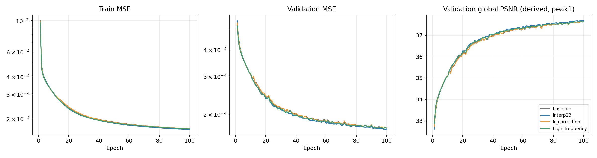

오른쪽 검증 PSNR은 기록된 전체 validation MSE에서 `−10 log10(MSE)`로 계산한 **global peak=1 파생 곡선**입니다. RR 표의 밴드별 PSNR과 다릅니다. validation SAM은 매 에폭 기록되지 않아 곡선을 만들지 않았습니다. 없는 과거 SAM을 추정하거나 합성하지 않습니다.

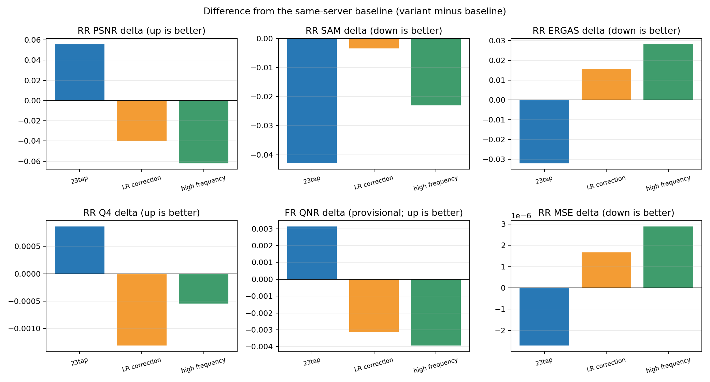

막대는 각 변형−기준선입니다. PSNR·Q4·QNR은 양수가, SAM·ERGAS·MSE는 음수가 개선 방향입니다.

## 6. 결과 이미지 예시

수치 평가 전에 seed 42로 고정한 **RR 장면 index 1·8·11·13·19**를 모두 사용합니다. 장면 번호는 0부터 시작하며 타일링·입력 자르기는 없습니다. [선택 기록](../assets/a6000_architecture_qb/selection.json)

각 그림은 **LR MS · PAN 입력 · 예측 · 정답** 순서입니다. MS만 표시를 위해 최근접 확대했습니다. RGB는 0-based 밴드 [2,1,0] 가정이며 각 장면의 정답 1~99 percentile 대비를 MS·예측·정답에 동일 적용했습니다. 세 변형 사이에도 같은 장면의 대비 범위를 유지합니다. PAN은 별도 grayscale 범위입니다. FR에 GT 이미지를 만들지 않습니다.

### 23탭 · 5장면 세트

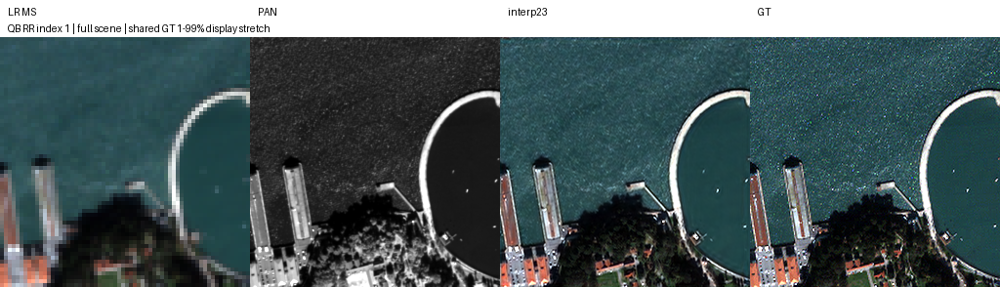

같은 조건의 나머지 고정 4장면 보기

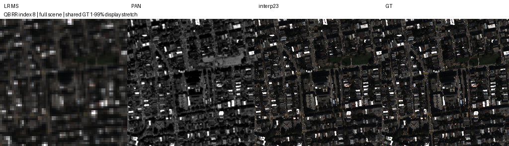

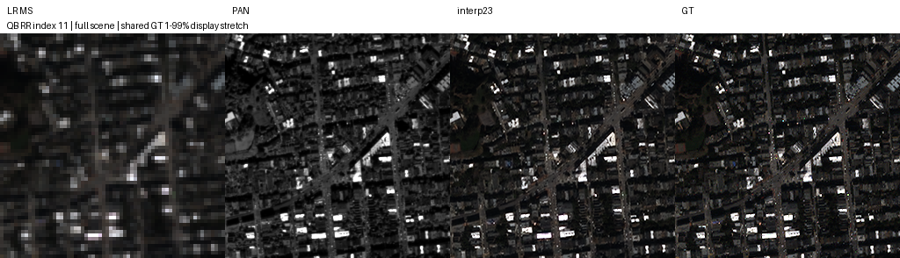

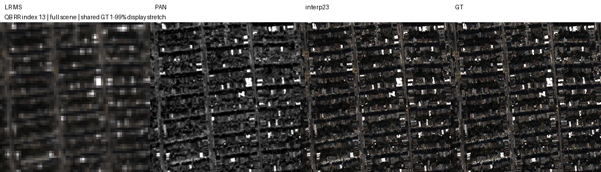

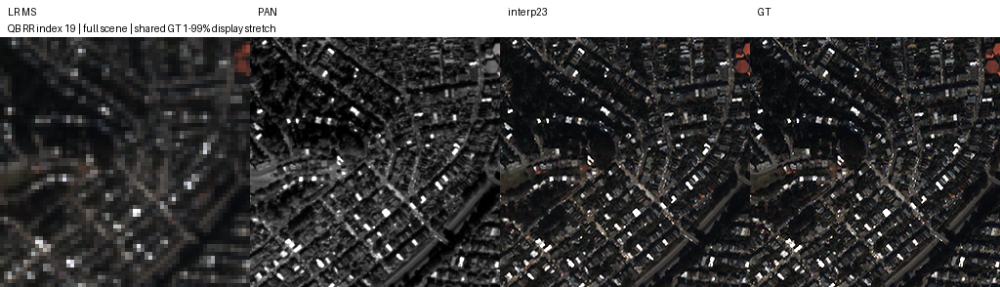

### LR 보정 · 5장면 세트

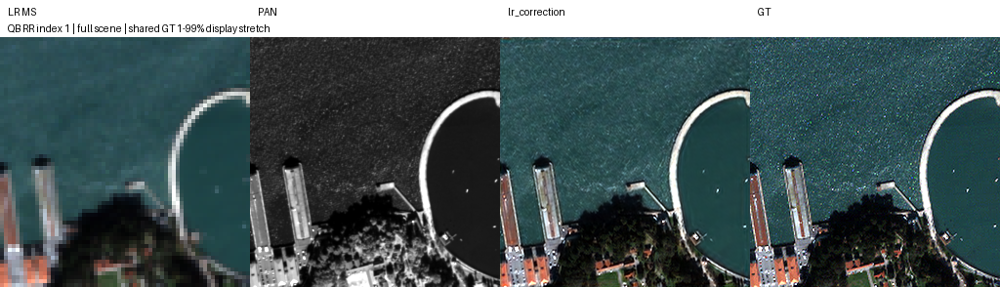

같은 조건의 나머지 고정 4장면 보기

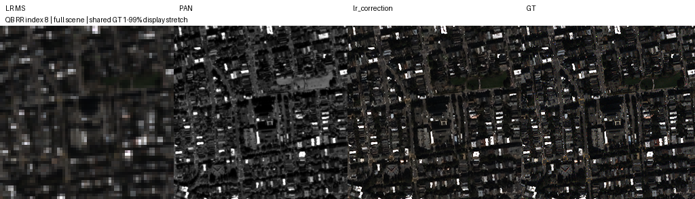

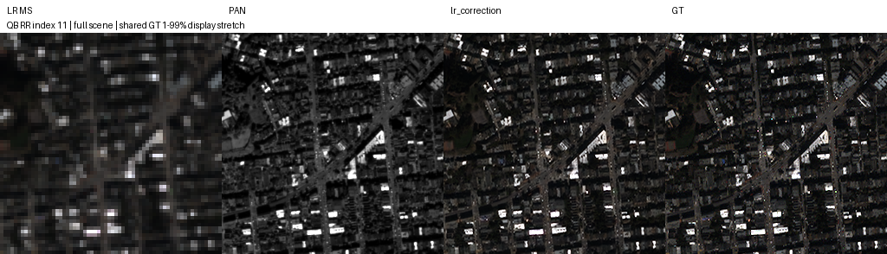

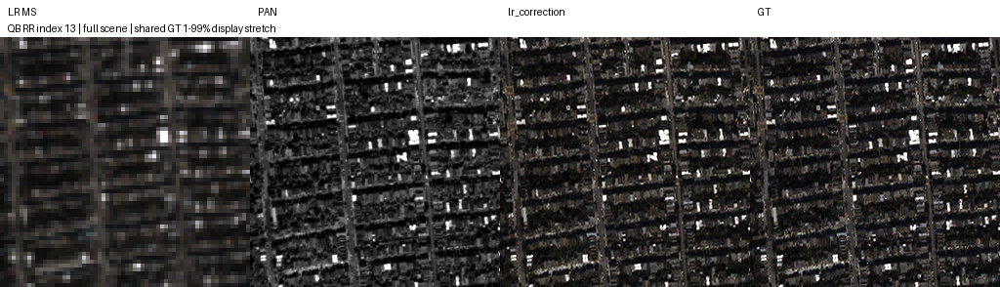

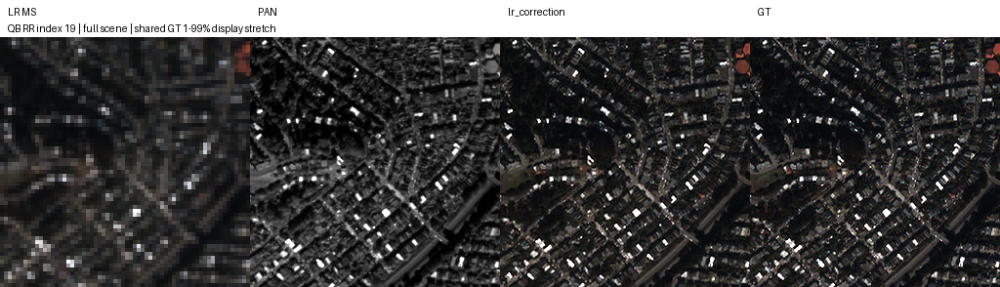

### 고주파 경로 · 5장면 세트

같은 조건의 나머지 고정 4장면 보기

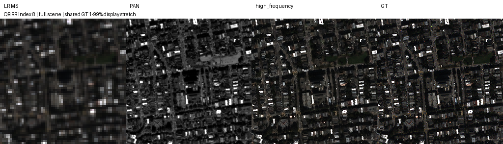

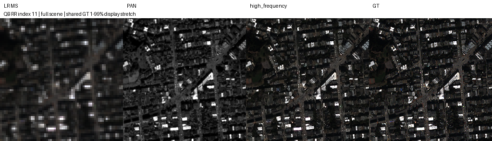

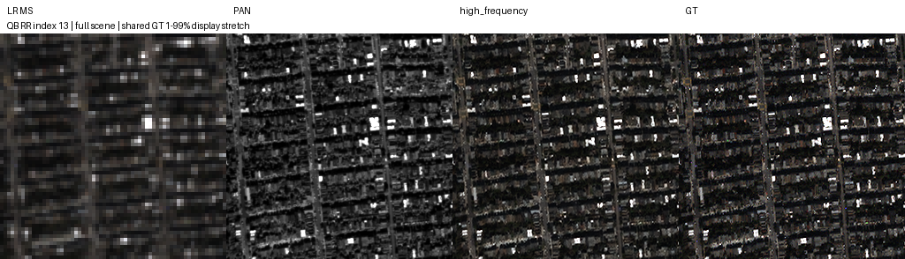

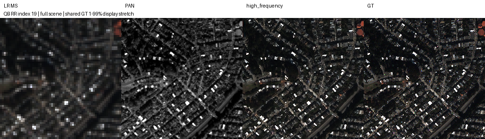

## 7. 가중치와 검증 근거

| 모델 | best / latest 에폭 | best 추론 가중치 | latest 추론 가중치 |
|---|---|---|---|
| 기준선 | 98 / 100 | [best](../assets/a6000_architecture_qb/weights/baseline_best.pt) | [latest](../assets/a6000_architecture_qb/weights/baseline_latest.pt) |
| 23탭 | 98 / 100 | [best](../assets/a6000_architecture_qb/weights/interp23_best.pt) | [latest](../assets/a6000_architecture_qb/weights/interp23_latest.pt) |
| LR 보정 | 98 / 100 | [best](../assets/a6000_architecture_qb/weights/lr_correction_best.pt) | [latest](../assets/a6000_architecture_qb/weights/lr_correction_latest.pt) |
| 고주파 경로 | 98 / 100 | [best](../assets/a6000_architecture_qb/weights/high_frequency_best.pt) | [latest](../assets/a6000_architecture_qb/weights/high_frequency_latest.pt) |

위 링크는 **실제 학습된 모델의 추론용 model/config/epoch/best MSE**를 저장합니다. Adam·RNG가 포함된 원본 best/latest는 학교 서버 `/home/gpu_04/CtrS-a6000/SSA-MRN/experiments/a6000_architecture_qb/QB_{variant}_k6_s42/`에 보존합니다. 추론 파일로 학습 재개를 할 수 있다고 주장하지 않습니다.

- [원본·추론 가중치 epoch와 SHA-256, 평가 데이터 해시, 100에폭 기록](../assets/a6000_architecture_qb/metrics.json)
- [자산 파일별 크기·SHA-256 manifest](../assets/a6000_architecture_qb/report_manifest.json)
- [실험 구현과 실행 가이드](../operations/a6000_suite.md)
- 4종 × RR20/FR20 = 160개 장면 평가 기록, 3종 × 5장면 = 15개 패널, 2개 그래프, best/latest 추론 가중치 8개를 보존합니다. 전송 후 모든 자산 해시를 검증했습니다.
- 코드 사전 검증은 23탭 SciPy 수치 일치·공통 초기화·결정론 CUDA gradient·고주파 초기 기준선 일치·LR 오차 0 항등성·4개 동시 학습/저장 통과를 확인했습니다.

## 8. 한계와 다음 판단

**23탭을 최종 채택한 상태가 아니라 후속 검증 우선 후보로 둡니다.** 시드 43·44에서 같은 기준선/23탭 쌍을 비교하고 GF2·WV3에 확장해 이득이 반복되는지 확인합니다. test는 이번 탐색 결과의 분석에 사용됐으므로 앞으로 동일 test에 반복 튜닝한 결과를 독립 검증으로 포장하지 않습니다.

LR 보정은 입력 기반 위상 추정, patch/full-scene에서 달라지는 경계 비중과 gain을 진단한 뒤 재설계 여부를 판단합니다. 고주파는 작은 SAM 이득과 공간 오차 증가를 함께 살피고 잔차의 크기·주입 위치를 진단합니다. 유효한 단일 변경을 확인하기 전에 변형을 결합하지 않습니다.

단일 시드·QB 1센서, MATLAB 지표 미검증, 누락된 validation SAM 곡선이 한계입니다. 서버 원본 재개 체크포인트의 별도 원격 백업·복구 검증은 완료로 쓰지 않으며 이번 작업에서 서버 실험 폴더를 삭제하지 않았습니다.
