# GF2 반복 시드·QB 입력 23탭 검증

> **이력 구분:** 이 보고서는 당시 **K=6**으로 수행한 실험입니다. 현재 연구 기본값은 [K=4](../../README.md#decision)로 확정했으며, 아래 실제 설정·수치·가중치는 당시 K6 기록을 유지합니다.

[실험 목록](../../README.md#experiments) · [수치](#results) · [그래프](#graphs) · [이미지](#images) · [가중치](#evidence)

| 비교 기준 | 이번에 바꾼 점 | 관측된 차이 | 판단 |
|---|---|---|---|
| [23탭 후속 검증](a6000_followup_123.md) | GF2 전체 23탭과 QB 입력 23탭에 시드 43·44 추가 | GF2 PSNR/QNR 이득 반복, SAM은 혼재. QB 입력 PSNR/SAM 개선 반복, QNR은 혼재 | GF2 후보 유지, 센서 전체 적용·QB 최종 채택 보류 |

## 1. 목적과 상태

단일 시드 이득이 반복되는지 확인했습니다. 새 학습 6개를 2026-10-08 **19:05:47~23:17:31 KST**에 학습·평가·검증까지 완료했습니다(약 4시간 12분). GF2 4개 동시 실행이 모두 끝난 뒤 QB 2개를 시작했고, 시간 예산에 따른 제외는 없었습니다. 기존 9개와 합친 15개 모델을 각각 RR 20장·FR 20장 전체 평가했습니다. 기존 모델 9개는 재학습 결과가 아닙니다.

학습 코드 기준 commit: `be02b7c`. 실행 당시 추가 관리·평가 코드는 [report manifest](../assets/a6000_gf2_repeat_qb_input/report_manifest.json)의 파일별 SHA-256으로 고정했습니다. RR은 정답이 있는 축소 해상도 평가이며, FR에는 고해상도 정답이 없습니다.

## 2. 변경 사항과 평가 조건

모델 구조와 손실은 직전 실험과 동일하며 시드만 추가했습니다. 전체 23탭은 입력·출력 확대에 모두 적용하고, 입력 23탭은 입력 확대에만 적용합니다.

| 항목 | 조건 |
|---|---|
| 새 학습 | GF2 기준선/전체 23탭 × 43·44, QB 입력 23탭 × 43·44 |
| 공통 | K=6, Adam lr=1e-4, batch=micro batch=32, 100에폭, MSE |
| 장치 | Linux RTX A6000 48GB, CUDA FP32·결정론 설정 |
| checkpoint 선택 | 각 run의 validation MSE 최저 에폭; latest는 100에폭 |
| 데이터 | QB/GF2 4밴드. RR: MS 64×64, PAN/GT 256×256. FR: MS 128×128, PAN 512×512 |
| 장면·타일 | 센서별 RR/FR H5 전체 20개 인덱스, 전체 영상 평가. 원본 촬영 ID가 없어 독립 촬영 여부 미확인 |
| 값·지표 | MSE 및 validation band-mean PSNR peak=1. SAM은 도 단위. RR PSNR은 이전 결과와 같은 고정 peak=2047; 센서 peak PSNR도 JSON에 보존 |
| 정합·분할 | 제공 H5와 기존 분할 그대로, 새 정합·마스크·데이터 변형 없음. 경로·해시·shape는 metrics.json |

GF2 입력 정규화 peak는 1023이므로 고정 peak=2047의 절대 PSNR과 구분해야 합니다. 같은 센서·시드의 PSNR 차이는 peak 변경에 영향을 받지 않습니다. 센서 간 절대값으로 우열을 판단하지 않습니다.

## 3. 정량 결과

각 모델의 전체 장면 평균에서 **후보−같은 센서·시드 기준선**을 계산한 뒤 3시드 차이의 평균·표본 표준편차를 구했습니다. PSNR/QNR은 증가, SAM/MSE는 감소가 개선입니다. ±는 통계적 유의성을 뜻하지 않습니다. QNR 및 일부 RR 구현의 MATLAB 일치성은 미검증입니다.

| 검증 | ΔPSNR (dB) | ΔSAM (°) | ΔMSE (peak=1) | ΔQNR | 판단 |
|---|---:|---:|---:|---:|---|
| GF2 전체 23탭 · 3시드 | +0.1095 ± 0.0698 | +0.00029 ± 0.02157 | -2.711e-06 | +0.005261 ± 0.002222 | PSNR/QNR 3/3 개선, SAM 2/3 악화 |
| QB 입력 23탭 · 3시드 | +0.0575 ± 0.0369 | -0.02123 ± 0.02598 | -2.543e-06 | +0.003569 ± 0.011528 | PSNR/SAM 3/3 개선, QNR 2/3 악화 |
| QB 전체 23탭 · 3시드 (재사용) | +0.0421 ± 0.0127 | -0.01894 ± 0.02250 | -2.116e-06 | -0.011602 ± 0.015583 | PSNR 3/3 개선, QNR 2/3 악화 |

### 시드별 기준선 대비

| 후보 | 시드 | ΔPSNR | ΔSAM | ΔMSE (peak=1) | ΔQNR |
|---|---:|---:|---:|---:|---:|
| GF2 전체 | 42 | +0.148955 | -0.024233 | -3.514262e-06 | +0.005198 |
| GF2 전체 | 43 | +0.150590 | +0.008767 | -3.888729e-06 | +0.007515 |
| GF2 전체 | 44 | +0.028810 | +0.016340 | -7.296235e-07 | +0.003071 |
| QB 입력 | 42 | +0.080664 | -0.050761 | -3.432147e-06 | -0.000981 |
| QB 입력 | 43 | +0.076962 | -0.011025 | -3.524013e-06 | -0.004990 |
| QB 입력 | 44 | +0.014921 | -0.001897 | -6.728456e-07 | +0.016678 |
| QB 전체 | 42 | +0.055667 | -0.042865 | -2.700518e-06 | +0.003143 |
| QB 전체 | 43 | +0.040145 | +0.001806 | -1.828141e-06 | -0.027906 |
| QB 전체 | 44 | +0.030548 | -0.015769 | -1.819371e-06 | -0.010045 |

### 전체 모델의 절대 평균과 선택 에폭

| 모델 | best 에폭 | best val MSE | RR PSNR | RR SAM | RR MSE peak=1 | FR QNR |
|---|---:|---:|---:|---:|---:|---:|
| GF2_baseline_k6_s42 | 99 | 8.22712392e-05 | 46.420897 | 0.968238 | 9.94910141e-05 | 0.904799 |
| GF2_baseline_k6_s43 | 98 | 7.72599638e-05 | 46.840544 | 0.924853 | 8.99142971e-05 | 0.904558 |
| GF2_baseline_k6_s44 | 98 | 7.94063415e-05 | 46.814838 | 0.926231 | 9.00592792e-05 | 0.908667 |
| GF2_interp23_k6_s42 | 99 | 8.05336140e-05 | 46.569851 | 0.944005 | 9.59767518e-05 | 0.909997 |
| GF2_interp23_k6_s43 | 100 | 7.79908945e-05 | 46.991134 | 0.933621 | 8.60255684e-05 | 0.912073 |
| GF2_interp23_k6_s44 | 97 | 7.83565929e-05 | 46.843648 | 0.942571 | 8.93296557e-05 | 0.911739 |
| QB_baseline_k6_s42 | 98 | 1.71738933e-04 | 37.424183 | 4.963896 | 2.15483894e-04 | 0.914868 |
| QB_baseline_k6_s43 | 100 | 1.69252069e-04 | 37.358513 | 4.897870 | 2.17688096e-04 | 0.926351 |
| QB_baseline_k6_s44 | 100 | 1.70181455e-04 | 37.584023 | 4.888897 | 2.08137524e-04 | 0.882903 |
| QB_interp23_input_k6_s42 | 98 | 1.70411880e-04 | 37.504847 | 4.913135 | 2.12051748e-04 | 0.913887 |
| QB_interp23_input_k6_s43 | 100 | 1.68070955e-04 | 37.435475 | 4.886845 | 2.14164083e-04 | 0.921361 |
| QB_interp23_input_k6_s44 | 100 | 1.67855270e-04 | 37.598944 | 4.887001 | 2.07464679e-04 | 0.899582 |
| QB_interp23_k6_s42 | 98 | 1.69592376e-04 | 37.479851 | 4.921031 | 2.12783376e-04 | 0.918011 |
| QB_interp23_k6_s43 | 100 | 1.68425771e-04 | 37.398658 | 4.899676 | 2.15859955e-04 | 0.898445 |
| QB_interp23_k6_s44 | 100 | 1.68335392e-04 | 37.614571 | 4.873129 | 2.06318154e-04 | 0.872858 |

QB 입력 모델의 validation MSE는 전체 23탭 대비 시드 42에서는 높고, 43·44에서는 낮았습니다. test PSNR도 입력−전체가 각각 +0.0250, +0.0368, −0.0156 dB로 혼재합니다. test를 보고 시드별 모델을 골라 합산하지 않습니다.

장면별 수치와 차이는 [metrics.json](../assets/a6000_gf2_repeat_qb_input/metrics.json), validation 선택 근거는 [validation_scores.json](../assets/a6000_gf2_repeat_qb_input/validation_scores.json)에 있습니다.

## 4. 직전 연구와 수치 차이

동일한 기존 test를 사용한 반복 시드 확장입니다. 아래는 후보의 baseline 대비 차이 집계가 어떻게 바뀌었는지 보여주며, 새 구조가 이전 모델을 그만큼 개선했다는 의미가 아닙니다.

| 항목 | 직전 시드 42 | 현재 3시드 평균 | 집계 차이 |
|---|---:|---:|---:|
| GF2 전체 ΔPSNR | +0.14895456 | +0.1094516 | -0.039502963 |
| GF2 전체 ΔSAM | -0.024233144 | +0.00029127241 | +0.024524416 |
| GF2 전체 ΔMSE_peak1 | -3.5142623e-06 | -2.7108715e-06 | +8.0339083e-07 |
| QB 입력 ΔPSNR | +0.080663624 | +0.057515644 | -0.02314798 |
| QB 입력 ΔSAM | -0.050761371 | -0.021227694 | +0.029533678 |
| QB 입력 ΔMSE_peak1 | -3.4321466e-06 | -2.5430016e-06 | +8.8914498e-07 |

QB 전체 23탭 3시드 결과는 직전 연구와 동일합니다(재사용). GF2 새 시드 43의 best validation MSE도 기준선보다 높고(7.79909e-5 대 7.72600e-5), 44에서는 낮습니다. 따라서 사전 설계의 두 새 시드 모두 validation MSE·SAM 개선이라는 강한 채택 조건은 충족하지 않았습니다. GF2 시드 42의 SAM 이득은 43·44에서 반복되지 않아 분광 각도 개선 주장을 축소했습니다. WV3는 새 학습 없이 기존 best만 밴드별로 재분석했습니다: [진단 JSON](../assets/a6000_gf2_repeat_qb_input/wv3_band_diagnostic.json). 8밴드 모두 장면별 PSNR 평균 차이가 음수이며, 밴드 평균 MSE는 4밴드 개선·4밴드 악화했습니다. 밴드별 로그 평균과 MSE 평균이 달라 방향이 어긋날 수 있습니다. 사후 탐색이며 새 검증 결과나 학습 곡선으로 해석하지 않습니다.

## 5. 그래프

실측 train/validation MSE와 validation band-mean PSNR(peak=1)·SAM을 표시했습니다. 과거 QB 기준선/전체 시드 42에는 validation SAM·band-mean PSNR 기록이 없어 해당 곡선을 만들지 않았습니다.

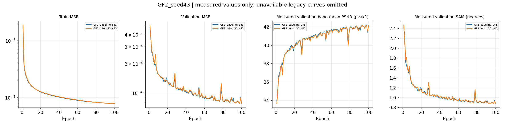

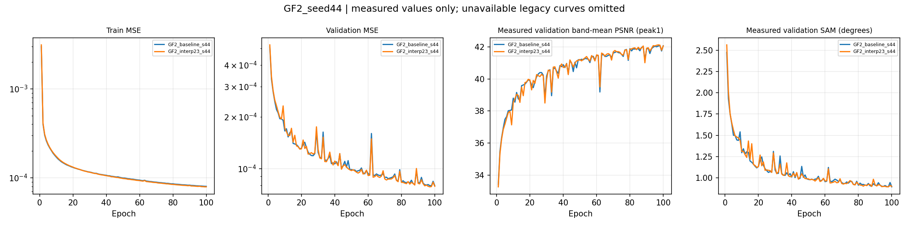

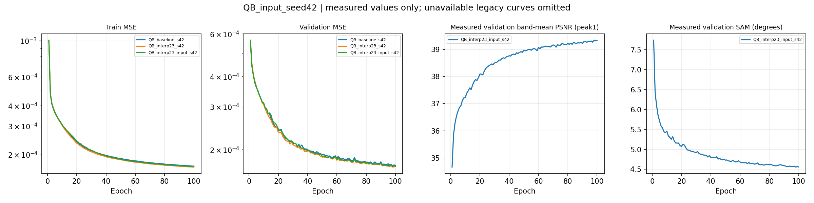

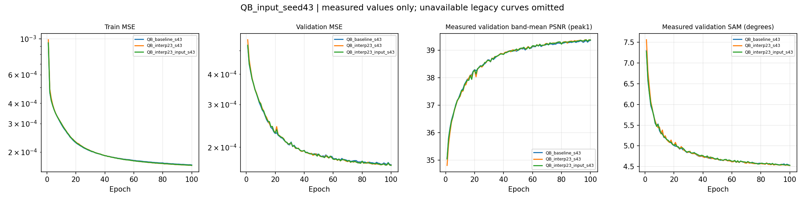

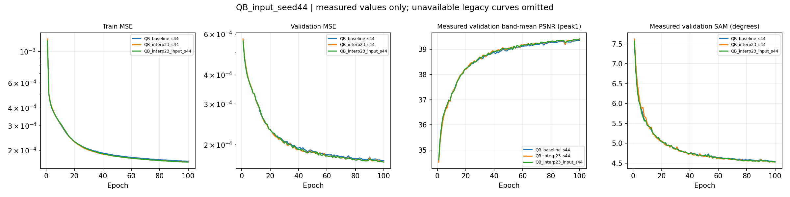

## 6. 결과 이미지 예시

사전 고정 selection seed=42, H5 인덱스 **1·8·11·13·19**, 전체 영상이며 원본 촬영 ID는 알 수 없습니다. 모든 이미지는 **LR MS · PAN 입력 · 예측 · 정답** 순서입니다. MS 패널은 같은 장면의 공통 대비 범위, LR 표시는 최근접 확대, RGB 표시 밴드 [2,1,0]을 사용했습니다. FR에는 정답을 만들지 않았습니다. 기준선은 숫자 비교에 포함했고 이미지 패널에는 넣지 않았습니다.

### GF2_interp23_k6_s42

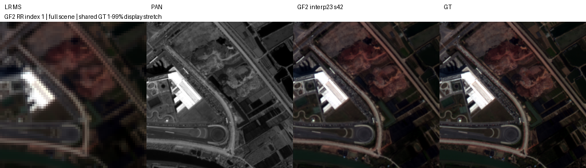

나머지 고정 4장면

### GF2_interp23_k6_s43

나머지 고정 4장면

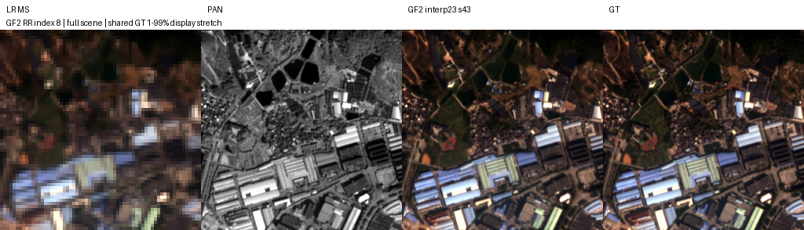

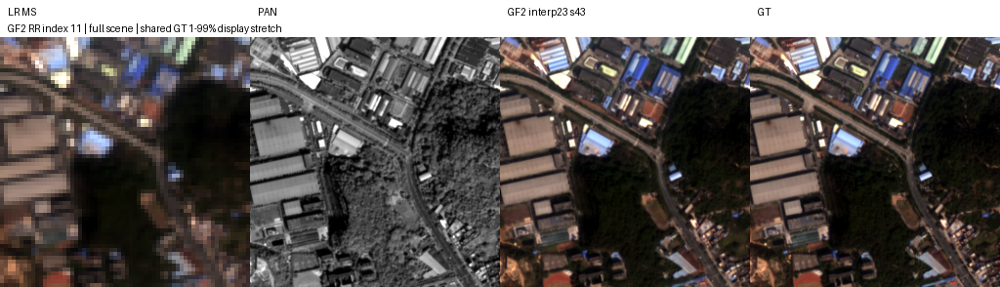

### GF2_interp23_k6_s44

나머지 고정 4장면

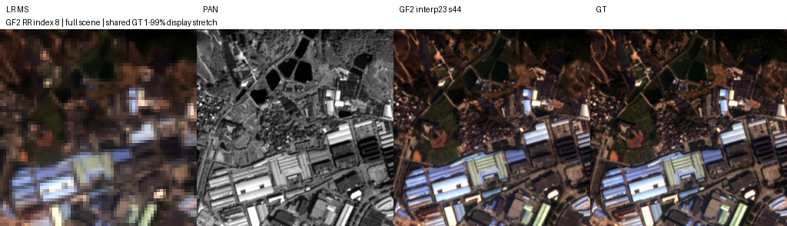

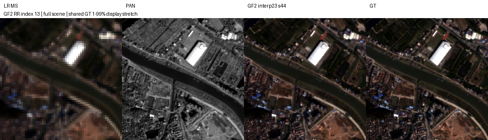

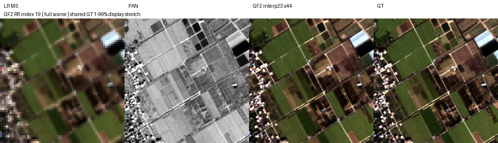

### QB_interp23_input_k6_s42

나머지 고정 4장면

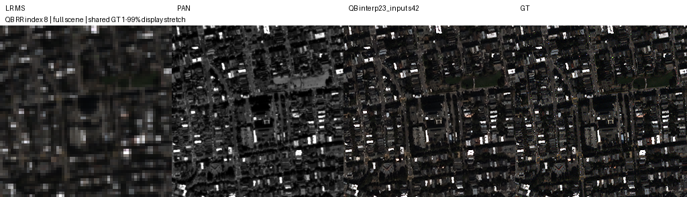

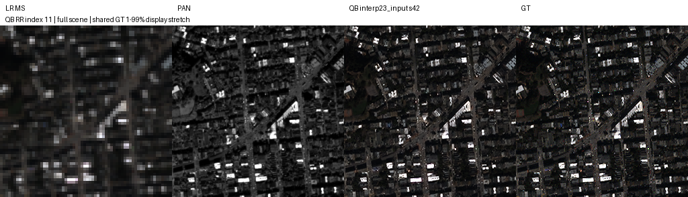

### QB_interp23_input_k6_s43

나머지 고정 4장면

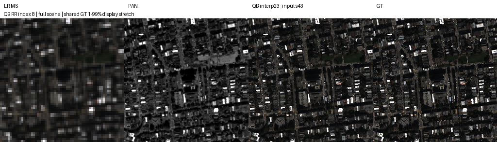

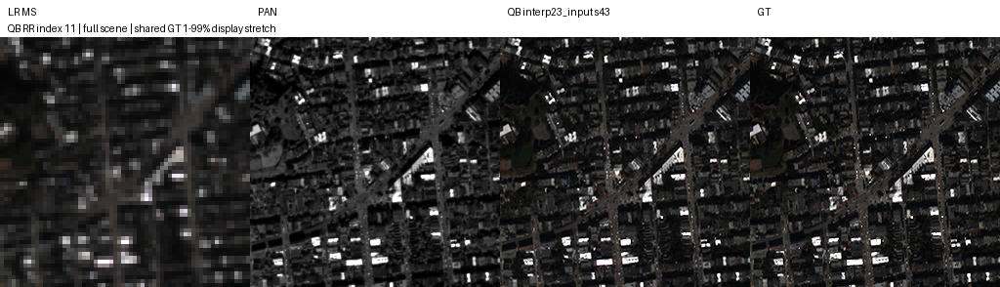

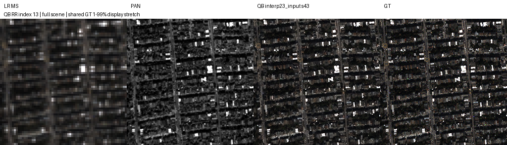

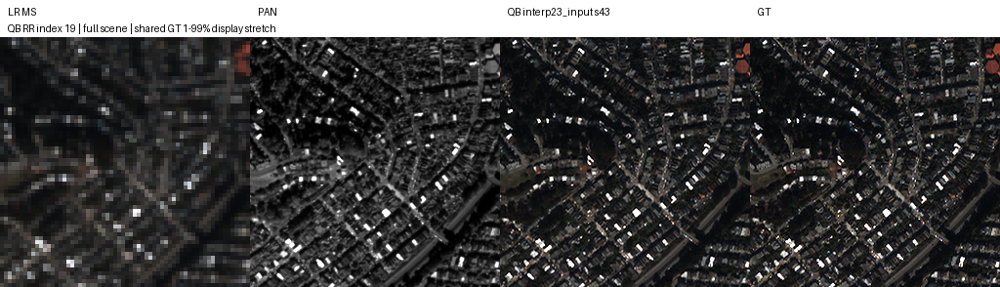

### QB_interp23_input_k6_s44

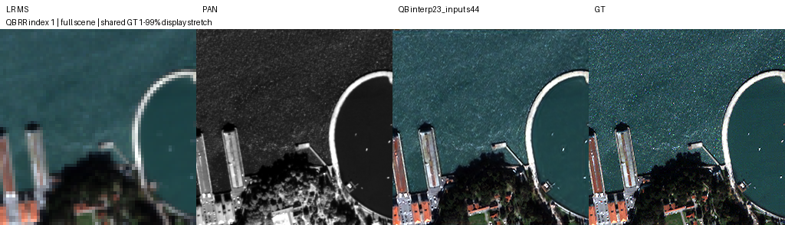

나머지 고정 4장면

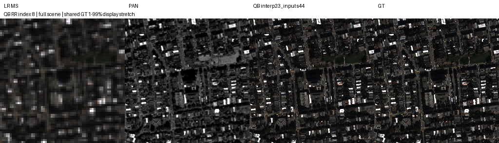

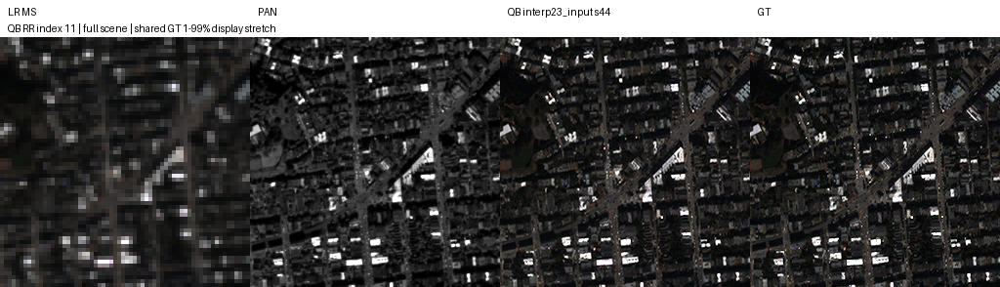

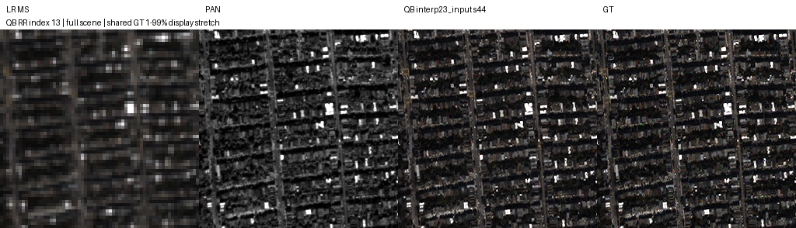

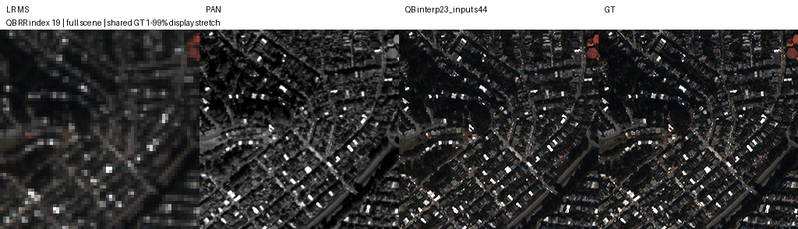

### QB_interp23_k6_s42

나머지 고정 4장면

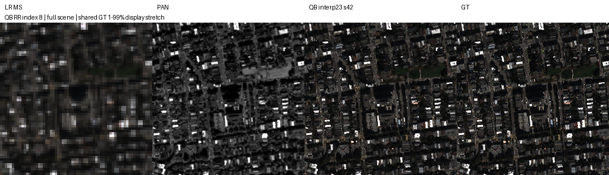

### QB_interp23_k6_s43

나머지 고정 4장면

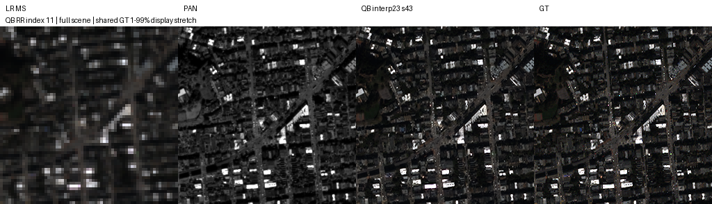

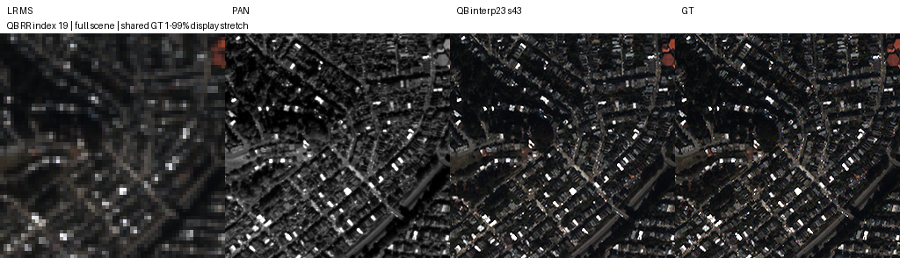

### QB_interp23_k6_s44

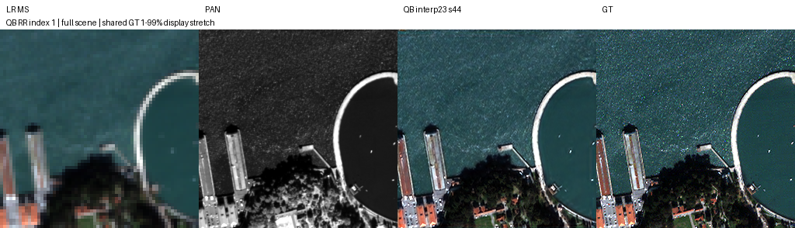

나머지 고정 4장면

## 7. 가중치와 검증 근거

원본 best/latest **30개**를 [weights](../assets/a6000_gf2_repeat_qb_input/weights)에 보존합니다. 모델·config·Adam·RNG를 포함한 재개 checkpoint이며 추론용 축소본이 아닙니다. 각 파일의 정확한 epoch·크기·SHA-256은 metrics.json의 checkpoints와 report_manifest.json에 있습니다. 6개 새 run과 재사용 9개 모두 latest는 100에폭입니다.

- [전체 지표·100에폭 compact 기록](../assets/a6000_gf2_repeat_qb_input/metrics.json)
- [고정 장면 selection](../assets/a6000_gf2_repeat_qb_input/selection.json)
- [90개 산출물 해시·코드 근거](../assets/a6000_gf2_repeat_qb_input/report_manifest.json)
- [실행 당시 코드·데이터 inventory](../assets/a6000_gf2_repeat_qb_input/training_inventory.json)
- [실행 계획](../assets/a6000_gf2_repeat_qb_input/training_plan.json) · [참조 가중치 복구 manifest](../assets/a6000_gf2_repeat_qb_input/reference_manifest.json)
- [실행·복구 안내](../operations/a6000_next_6h.md) · [이전 폴더 정리 기록](../operations/a6000_next6h_cleanup.json)

서버와 전송 후 로컬에서 검증기를 통과했습니다: 15 models, 30 full weights, 45 fixed images, 90 hashed artifacts. [GitHub 복구 검증](../operations/a6000_next6h_remote_recovery.json): 독립 복제본에서 90개 산출물의 해시·크기를 대조하고 원본 가중치 30개를 실제 파일로 복원해 모두 일치했습니다. 이번 서버 실행 폴더는 유지했습니다.

## 8. 한계와 다음 판단

**GF2 전체 23탭은 PSNR·MSE·잠정 QNR 개선 후보로 유지**하되 SAM의 일관된 이득은 주장하지 않습니다. **QB 입력 23탭은 RR 개선 후보**지만 QNR 2/3 악화 때문에 최종 채택을 보류합니다. 시드 44의 QNR 큰 이득 하나가 평균을 양수로 만들었습니다.

다음 판단은 (1) FR resize/QNR 및 RR 지표의 MATLAB 일치성 검증, (2) Windows 손실 비교 결과 확인, (3) 통제된 센서별 구조+손실 후보 설계 순서입니다. 이번 PR은 다음 학습을 시작하지 않습니다. 3시드·재사용 test의 작은 차이이며, 새 독립 test나 통계적 유의성·실제 센서 정답 정확도의 증거가 아닙니다.
