# A6000 후속 검증 · 반복 시드·확대 위치·센서 확장

[현재 연구](../../../README.md) · [실험 이력](../../previous_experiments.md) · [실행 안내](../../operations/a6000_followup.md)

| 비교 기준 | 이번에 바꾼 점 | 관측된 차이 | 판단 |
| --- | --- | --- | --- |
| A6000 QB 구조 비교 s42 | s43·44 반복, 입력/출력 위치 분리, GF2·WV3 확장 | QB RR PSNR 평균 +0.0421dB, FR QNR 평균 −0.011602; GF2 개선·WV3 악화 | 전체 23탭의 보편적 채택은 보류 |

## 1. 목적과 상태

새 주제 대신 SSA-MRN 내부 확대를 개선하는 실험입니다. 기존 QB 시드42에서 보인 작은 이득이 반복되는지, 어느 확대 위치와 센서에서 유지되는지 확인했습니다. 새 학습 **10개 모두 100에폭 완료**, 2026-10-08 18:05 KST경 관리 큐 종료를 확인했습니다. 기존 QB 기준선/전체23탭 시드42 2개를 재사용해 **12개 모델 각각 RR20장·FR20장 전체**를 best 가중치로 평가했습니다. 학습 완료와 전체 test 평가 완료를 구분해 검증했습니다.

run ID는 `a6000_followup_123`입니다. 학습의 기반 commit은 `c5e92796bd0ade9518bdd663dd2fe499161d4a2d`이며, 학습 당시 미커밋 후속 코드도 이번 결과와 함께 보관합니다. [학습 코드 해시](../../assets/a6000_followup_123/training_inventory.json)와 [평가 코드·산출물 해시](../../assets/a6000_followup_123/report_manifest.json)로 실제 사용 코드를 확인할 수 있습니다. 이 보고서·코드·가중치를 포함한 Git commit이 전달 버전입니다.

## 2. 변경 사항과 평가 조건

- 기준선은 복구된 SSA-MRN입니다. 전체23탭은 `upsample1` ×4와 `upsample100/101/102` ×2를 바꿉니다. 입력만은 `upsample1/100`, 출력만은 `upsample101/102`입니다. 제공 LMS, bilinear 축소, SSA 내부 연산은 유지합니다.
- K=6, Adam lr=1e-4, batch=micro batch=32, 기본 MSE, 100에폭, CUDA FP32·결정론입니다. 같은 센서·시드 쌍은 공통 계층 초기화와 데이터 순서를 맞췄습니다. GPU는 RTX A6000 48GB입니다.
- 1단계 QB s43·44 4개 → 2단계 위치 s42 2개 → 3단계 GF2/WV3 s42 4개, 최대4개 병렬이며 단계 사이에 겹침을 허용하지 않습니다. Windows 손실 결합 4단계는 제외했습니다.
- QB/GF2는 4밴드, WV3는 8밴드입니다. 학습·추론 정규화 peak는 QB/WV3=2047, GF2=1023입니다. validation PSNR은 peak1의 **이미지별 밴드 평균 후 이미지 평균**이며 SAM은 유효 픽셀 평균 후 이미지 평균입니다. best는 validation MSE로만 선택합니다.
- RR은 GT가 있는 합성 축소 평가, FR은 고해상도 GT가 없는 실제 해상도 평가입니다. 예측값을 임의로 clip하거나 시각화 대비를 지표에 적용하지 않습니다. RR PSNR은 직전 보고서와 비교하기 위해 고정 peak2047로 계산합니다. GF2의 센서 peak1023 PSNR도 별도 기록했습니다.
- train/validation/test H5 경로는 분리돼 있습니다. 원래 지리·촬영 ID가 H5에 없으므로 촬영 단위의 완전한 독립성은 추가 확인이 필요합니다. QB test는 앞선 구조 탐색에 이미 사용했으므로 새로운 독립 검증으로 주장하지 않습니다.

| 센서 | RR/FR 장면 수 | RR GT / LR MS | FR LMS / LR MS | 정규화 peak |
| --- | --- | --- | --- | --- |
| QB | 20 / 20 | [4, 256, 256] / [4, 64, 64] | [4, 512, 512] / [4, 128, 128] | 2047 |
| GF2 | 20 / 20 | [4, 256, 256] / [4, 64, 64] | [4, 512, 512] / [4, 128, 128] | 1023 |
| WV3 | 20 / 20 | [8, 256, 256] / [8, 64, 64] | [8, 512, 512] / [8, 128, 128] | 2047 |

장면은 H5의 0번부터 마지막 index까지 순서대로 평가하며 추론 crop이나 타일링을 하지 않습니다. PAN은 1채널이고 목표 크기와 같으며 LR MS는 가로·세로 각각 1/4입니다. 추가 정합·마스크는 적용하지 않았고 SAM의 0-norm 픽셀만 제외합니다. 데이터 바이트·shape·SHA-256은 [전체 지표 JSON](../../assets/a6000_followup_123/metrics.json)에 있습니다.

| 모델 | best epoch / 총 epoch | best validation MSE |
| --- | --- | --- |
| QB · 기준선 · s42 | 98 / 100 | 0.0001717389 |
| QB · 전체 23탭 · s42 | 98 / 100 | 0.0001695924 |
| QB · 기준선 · s43 | 100 / 100 | 0.0001692521 |
| QB · 전체 23탭 · s43 | 100 / 100 | 0.0001684258 |
| QB · 기준선 · s44 | 100 / 100 | 0.0001701815 |
| QB · 전체 23탭 · s44 | 100 / 100 | 0.0001683354 |
| QB · 입력만 23탭 · s42 | 98 / 100 | 0.0001704119 |
| QB · 출력만 23탭 · s42 | 98 / 100 | 0.0001722096 |
| GF2 · 기준선 · s42 | 99 / 100 | 0.0000822712 |
| GF2 · 전체 23탭 · s42 | 99 / 100 | 0.0000805336 |
| WV3 · 기준선 · s42 | 98 / 100 | 0.0003614371 |
| WV3 · 전체 23탭 · s42 | 98 / 100 | 0.0003597658 |

## 3. 정량 결과

각 숫자는 같은 모델의 전체 RR20장 또는 FR20장의 **장면별 지표 산술평균**입니다. PSNR·SAM은 값의 방향이 서로 다릅니다(PSNR↑, SAM↓). QNR은 잠정 구현 수치입니다.

| 모델 | RR PSNR dB ↑ | RR SAM ° ↓ | RR ERGAS ↓ | RR Q4/Q8 ↑* | FR QNR ↑* |
| --- | --- | --- | --- | --- | --- |
| QB · 기준선 · s42 | 37.4242 | 4.9639 | 4.1288 | 0.922771 | 0.914868 |
| QB · 전체 23탭 · s42 | 37.4799 | 4.9210 | 4.0966 | 0.923636 | 0.918011 |
| QB · 기준선 · s43 | 37.3585 | 4.8979 | 4.1517 | 0.921898 | 0.926351 |
| QB · 전체 23탭 · s43 | 37.3987 | 4.8997 | 4.1305 | 0.922358 | 0.898445 |
| QB · 기준선 · s44 | 37.5840 | 4.8889 | 4.0510 | 0.925280 | 0.882903 |
| QB · 전체 23탭 · s44 | 37.6146 | 4.8731 | 4.0348 | 0.925735 | 0.872858 |
| QB · 입력만 23탭 · s42 | 37.5048 | 4.9131 | 4.0882 | 0.923554 | 0.913887 |
| QB · 출력만 23탭 · s42 | 37.4104 | 4.9599 | 4.1357 | 0.922923 | 0.915161 |
| GF2 · 기준선 · s42 | 46.4209 | 0.9682 | 0.9085 | 0.968126 | 0.904799 |
| GF2 · 전체 23탭 · s42 | 46.5699 | 0.9440 | 0.8907 | 0.969048 | 0.909997 |
| WV3 · 기준선 · s42 | 37.4064 | 3.5259 | 2.6144 | 0.875497 | 0.950521 |
| WV3 · 전체 23탭 · s42 | 37.3696 | 3.5478 | 2.6285 | 0.877084 | 0.948775 |

*Q4/Q8는 밴드 수에 따라 정한 Q2n이며 MATLAB 대조 검증이 남아 있습니다. FR의 PAN resize가 MATLAB과 일치하는지 미검증이므로 QNR·Ds도 잠정 값입니다. 장면별 SCC·Q2n·Dλ·Ds·정규화 MSE 등 전체 지표는 [metrics.json](../../assets/a6000_followup_123/metrics.json)에 보관했습니다. 센서 간 절대 PSNR의 순위로 구조 우열을 판단하지 않습니다. GF2의 peak1023 RR PSNR은 기준선 40.3961dB, 전체23탭 40.5450dB이며 peak2047 표와 차이는 약 6.0248dB입니다.

## 4. 직전 연구와 수치 차이

차이는 **현재 변형 − 같은 센서·시드 기준선**입니다. QB 시드42는 직전 연구의 실제 가중치를 그대로 재평가했으며 기존 수치와 일치합니다. GF2/WV3를 QB의 절대값과 직접 비교하지 않고 각각 새로 학습한 자체 기준선과 비교합니다.

| 모델 | ΔRR PSNR dB | ΔRR SAM ° | ΔRR MSE peak1 | ΔFR QNR* |
| --- | --- | --- | --- | --- |
| QB · 전체 23탭 · s42 | +0.0557 | -0.0429 | -0.00000270 | +0.003143 |
| QB · 전체 23탭 · s43 | +0.0401 | +0.0018 | -0.00000183 | -0.027906 |
| QB · 전체 23탭 · s44 | +0.0305 | -0.0158 | -0.00000182 | -0.010045 |
| QB · 입력만 23탭 · s42 | +0.0807 | -0.0508 | -0.00000343 | -0.000981 |
| QB · 출력만 23탭 · s42 | -0.0138 | -0.0040 | +0.00000102 | +0.000293 |
| GF2 · 전체 23탭 · s42 | +0.1490 | -0.0242 | -0.00000351 | +0.005198 |
| WV3 · 전체 23탭 · s42 | -0.0368 | +0.0219 | -0.00000041 | -0.001746 |

QB 전체23탭의 **시드별 paired 차이 평균 ± 표본 표준편차(ddof=1, n=3)**는 PSNR +0.0421 ± 0.0127dB, SAM -0.0189 ± 0.0225°, 정규화 MSE -0.00000212 ± 0.00000051, QNR -0.011602 ± 0.015583입니다. 이는 시드 변동 요약이며 신뢰구간이나 통계적 유의성 검정이 아닙니다. 직전 단일시드 PSNR 이득 +0.0557dB보다 이번 평균 이득이 작고, 직전 QNR 이득 +0.003143은 반복시드에서 유지되지 않았습니다.

| 검증 항목 | 변형 − 같은 센서·시드 기준선 | 판단 |
| --- | --- | --- |
| QB 반복 3시드 | RR PSNR +0.0421 ± 0.0127dB; FR QNR -0.011602 ± 0.015583 | RR PSNR은 3/3 개선, FR은 2/3 악화 |
| QB 입력만 · s42 | RR PSNR +0.0807dB; QNR -0.000981 | 전체 23탭보다 validation MSE가 높음 |
| QB 출력만 · s42 | RR PSNR -0.0138dB; QNR +0.000293 | 기준선보다 validation MSE가 높음 |
| GF2 · s42 | RR PSNR +0.1490dB; SAM -0.0242°; QNR +0.005198 | 개선 후보, 반복 시드 필요 |
| WV3 · s42 | RR PSNR -0.0368dB; SAM +0.0219°; QNR -0.001746 | validation 이득이 test로 이어지지 않음 |

## 5. 그래프

새 10개 학습의 실제 100에폭 train MSE·validation MSE·band-mean PSNR·SAM 곡선입니다. 기존 시드42 기준선/전체23탭에는 validation SAM과 측정 band-mean PSNR 기록이 없으므로 곡선을 만들어 넣지 않았습니다. 위치 분석 그림은 새 입력만/출력만 모델의 실제 기록만 보여 줍니다.

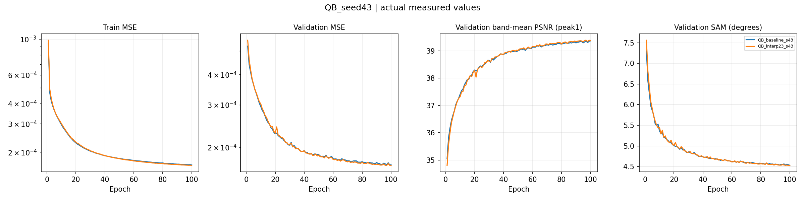

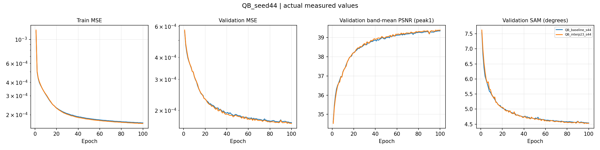

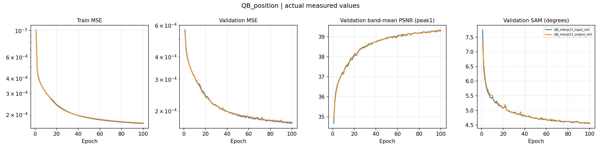

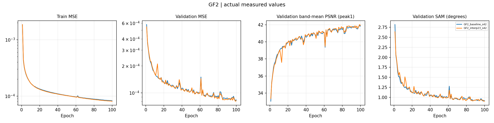

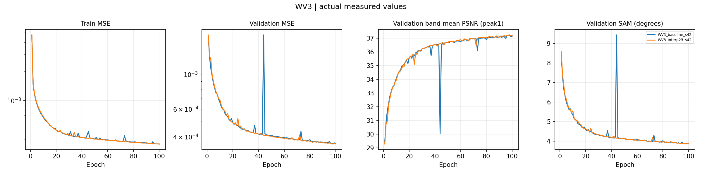

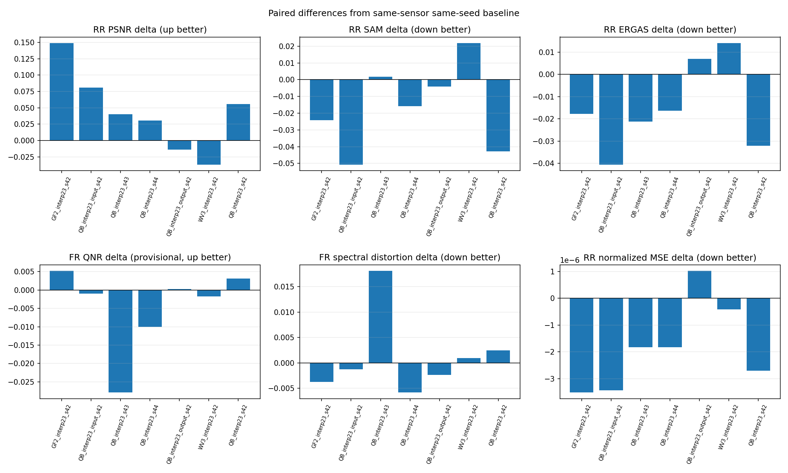

## 6. 결과 이미지 예시

평가 전에 seed42로 센서별 서로 다른 RR 장면5개를 고정했습니다. 모든 변형에서 같은 센서의 동일 index·순서를 사용하며 전체 장면을 표시합니다. 선택 seed·H5 index·full-scene tile·순서는 [selection.json](../../assets/a6000_followup_123/selection.json)에 있습니다. 패널은 **LR MS · PAN 입력 · 예측 · 정답** 순서이며 기준선은 수치 비교에만 남겼습니다. MS의 RGB 밴드 [2,1,0]은 표시 가정입니다. 같은 장면의 GT 1~99% 대비를 LR·예측·GT에 공통 적용했고, LR은 최근접 확대로 표시했습니다. PAN은 회색조 자체 대비입니다. 표시된 대비와 원래 값으로 계산한 지표는 구분됩니다. FR에는 GT 패널을 만들지 않았습니다.

### QB · 전체 23탭 · s42

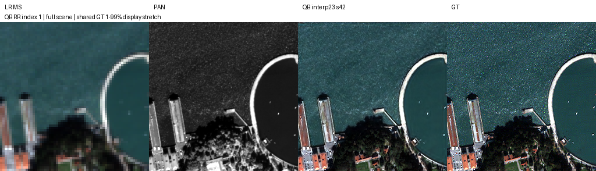

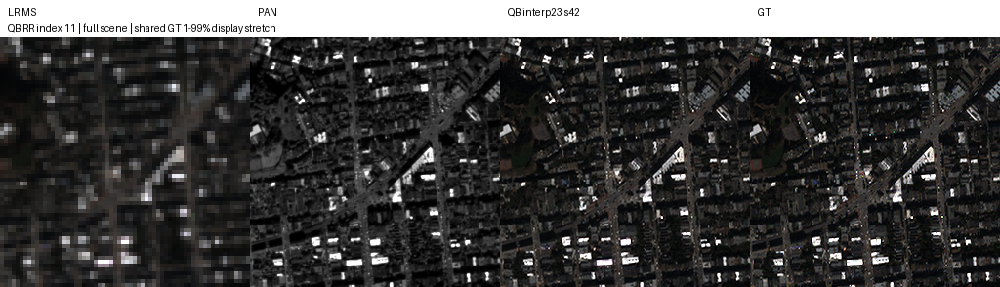

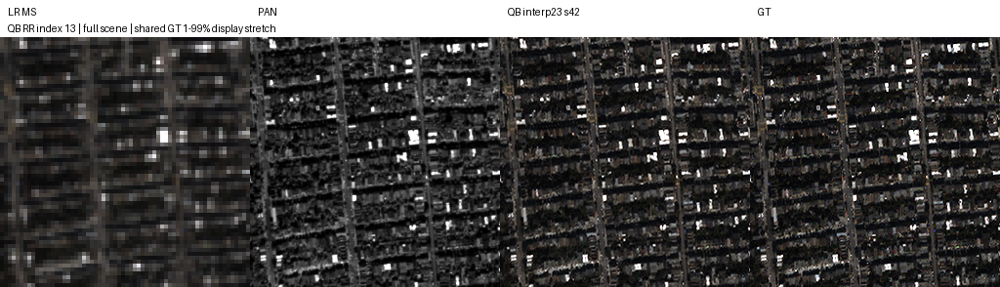

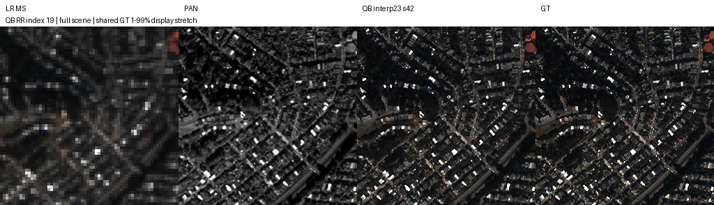

### QB · 전체 23탭 · s43

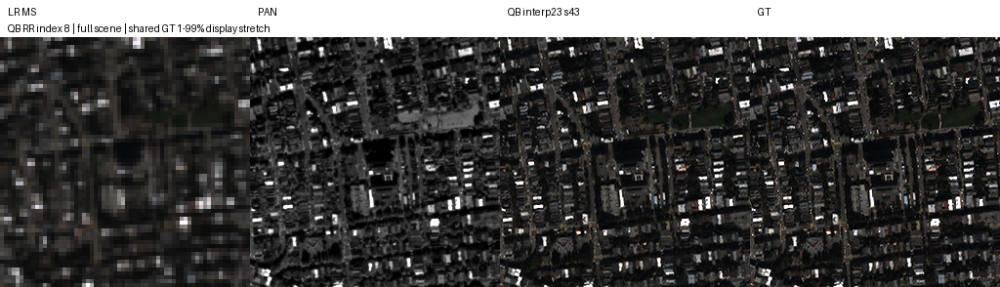

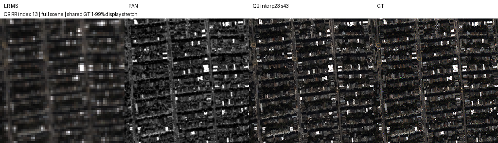

### QB · 전체 23탭 · s44

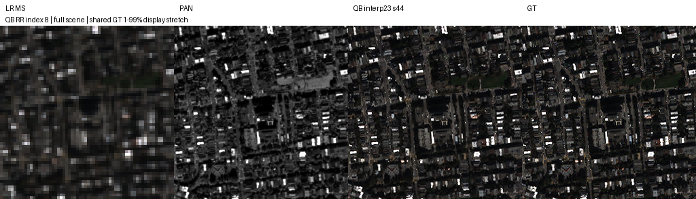

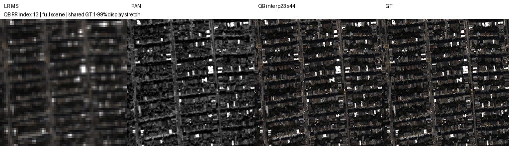

### QB · 입력만 23탭 · s42

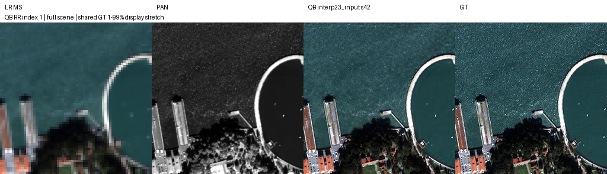

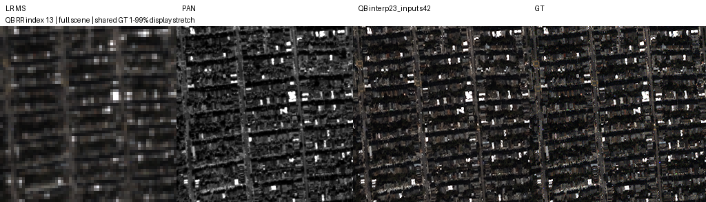

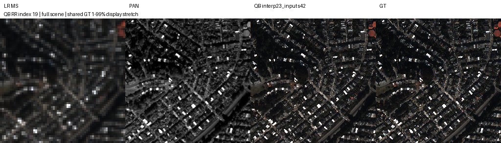

### QB · 출력만 23탭 · s42

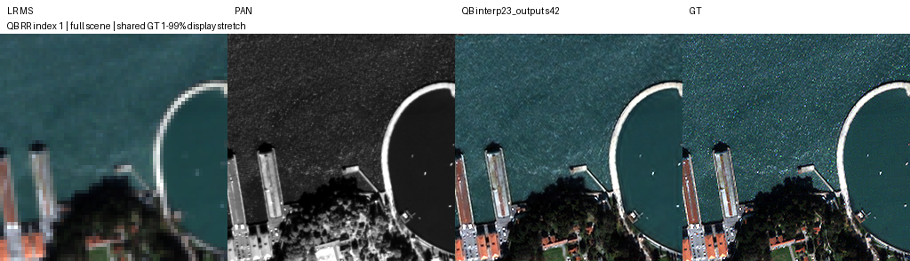

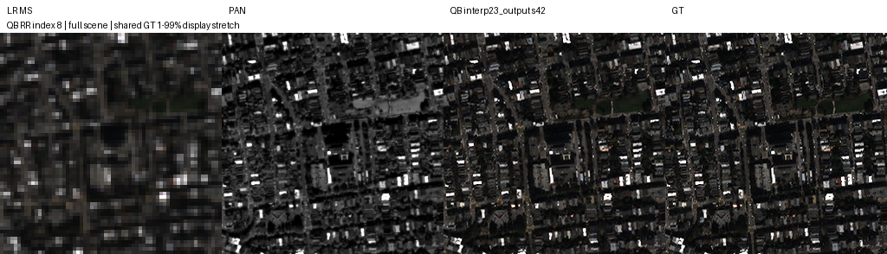

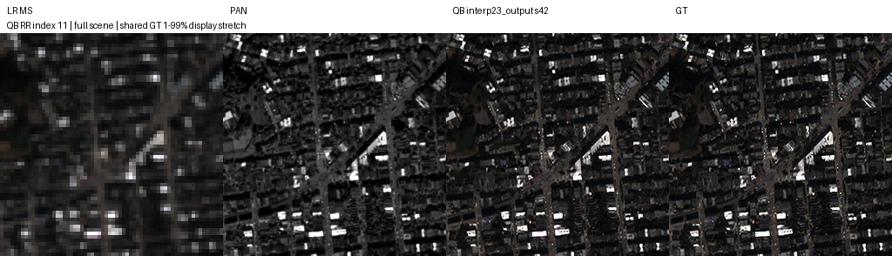

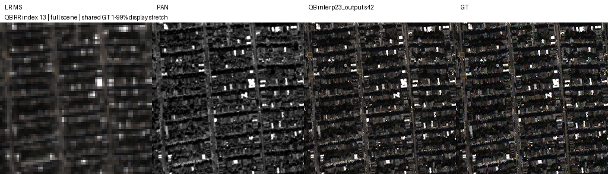

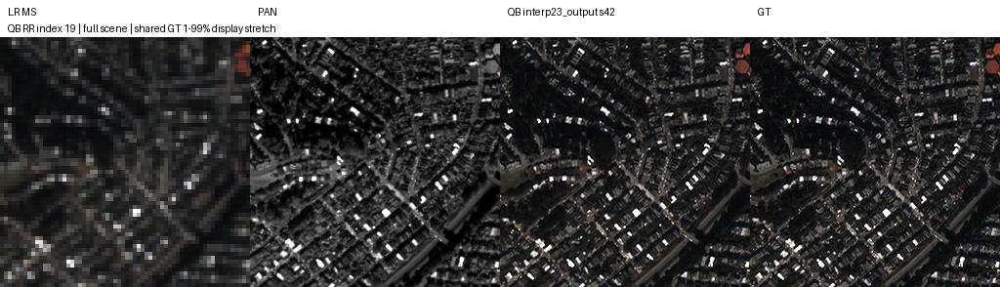

### GF2 · 전체 23탭 · s42

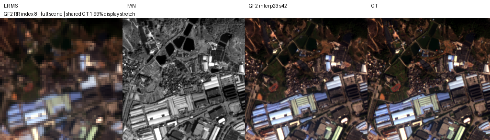

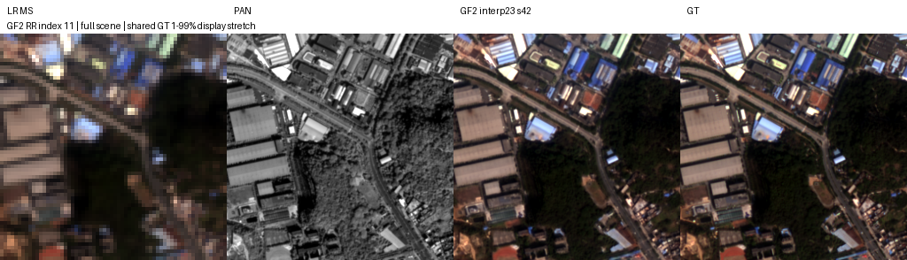

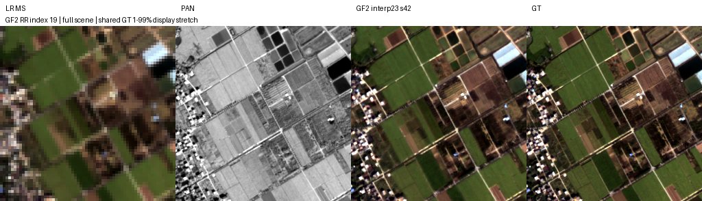

### WV3 · 전체 23탭 · s42

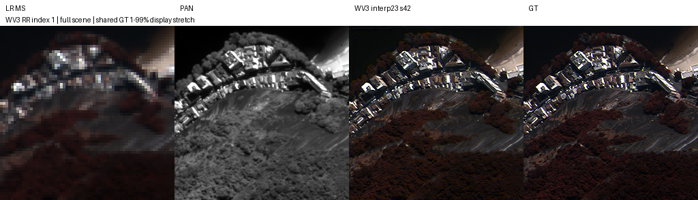

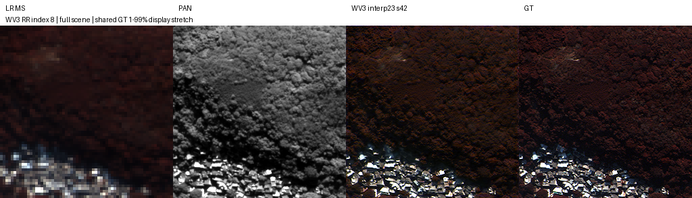

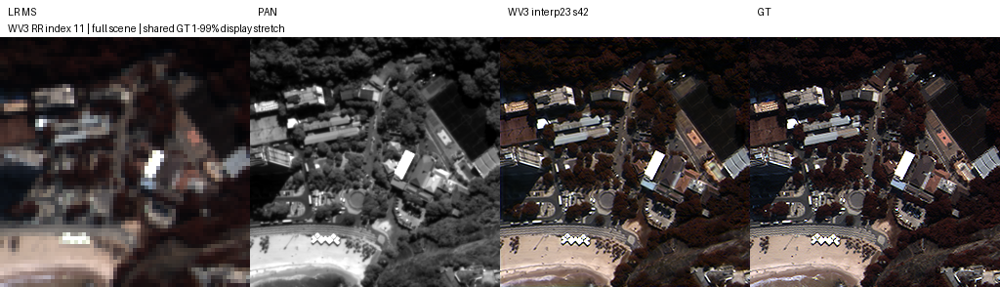

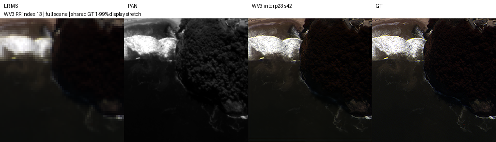

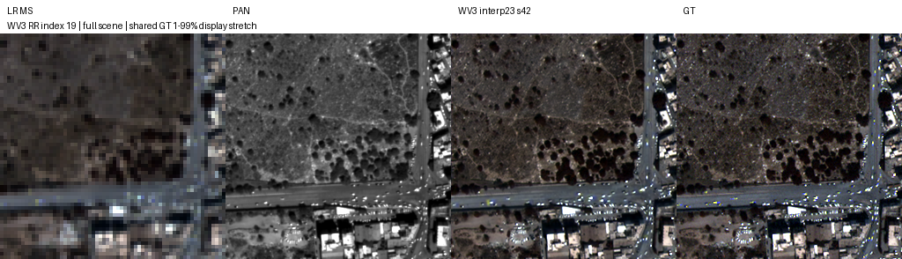

## 7. 가중치와 검증 근거

**12개 모델의 원본 best/latest 총24개를 Git에 포함**했습니다. 새 학습10개뿐 아니라 재사용 QB 시드42 두 모델의 원본도 포함합니다. 모델·config·epoch·best MSE·Adam·CPU/CUDA/loader RNG가 담긴 재개 체크포인트이며 추론용으로 축약하거나 변환하지 않았습니다. 각 파일은 약5~6MB이고 전체 약129.9MiB입니다. 원본 서버 파일과 복사본의 SHA-256 일치를 확인했습니다. 데이터와 Python 환경은 Git에 포함하지 않으며 config의 서버 경로는 복구 환경에 맞춰 준비해야 합니다. 코드/환경 전체의 이동을 보장하는 의미는 아닙니다.

| 모델 | best epoch | best 원본 | latest 원본 |
| --- | --- | --- | --- |
| QB · 기준선 · s42 | 98 | [best.pt](../../assets/a6000_followup_123/weights/QB_baseline_k6_s42/best.pt) | [latest.pt](../../assets/a6000_followup_123/weights/QB_baseline_k6_s42/latest.pt) |
| QB · 전체 23탭 · s42 | 98 | [best.pt](../../assets/a6000_followup_123/weights/QB_interp23_k6_s42/best.pt) | [latest.pt](../../assets/a6000_followup_123/weights/QB_interp23_k6_s42/latest.pt) |
| QB · 기준선 · s43 | 100 | [best.pt](../../assets/a6000_followup_123/weights/QB_baseline_k6_s43/best.pt) | [latest.pt](../../assets/a6000_followup_123/weights/QB_baseline_k6_s43/latest.pt) |
| QB · 전체 23탭 · s43 | 100 | [best.pt](../../assets/a6000_followup_123/weights/QB_interp23_k6_s43/best.pt) | [latest.pt](../../assets/a6000_followup_123/weights/QB_interp23_k6_s43/latest.pt) |
| QB · 기준선 · s44 | 100 | [best.pt](../../assets/a6000_followup_123/weights/QB_baseline_k6_s44/best.pt) | [latest.pt](../../assets/a6000_followup_123/weights/QB_baseline_k6_s44/latest.pt) |
| QB · 전체 23탭 · s44 | 100 | [best.pt](../../assets/a6000_followup_123/weights/QB_interp23_k6_s44/best.pt) | [latest.pt](../../assets/a6000_followup_123/weights/QB_interp23_k6_s44/latest.pt) |
| QB · 입력만 23탭 · s42 | 98 | [best.pt](../../assets/a6000_followup_123/weights/QB_interp23_input_k6_s42/best.pt) | [latest.pt](../../assets/a6000_followup_123/weights/QB_interp23_input_k6_s42/latest.pt) |
| QB · 출력만 23탭 · s42 | 98 | [best.pt](../../assets/a6000_followup_123/weights/QB_interp23_output_k6_s42/best.pt) | [latest.pt](../../assets/a6000_followup_123/weights/QB_interp23_output_k6_s42/latest.pt) |
| GF2 · 기준선 · s42 | 99 | [best.pt](../../assets/a6000_followup_123/weights/GF2_baseline_k6_s42/best.pt) | [latest.pt](../../assets/a6000_followup_123/weights/GF2_baseline_k6_s42/latest.pt) |
| GF2 · 전체 23탭 · s42 | 99 | [best.pt](../../assets/a6000_followup_123/weights/GF2_interp23_k6_s42/best.pt) | [latest.pt](../../assets/a6000_followup_123/weights/GF2_interp23_k6_s42/latest.pt) |
| WV3 · 기준선 · s42 | 98 | [best.pt](../../assets/a6000_followup_123/weights/WV3_baseline_k6_s42/best.pt) | [latest.pt](../../assets/a6000_followup_123/weights/WV3_baseline_k6_s42/latest.pt) |
| WV3 · 전체 23탭 · s42 | 98 | [best.pt](../../assets/a6000_followup_123/weights/WV3_interp23_k6_s42/best.pt) | [latest.pt](../../assets/a6000_followup_123/weights/WV3_interp23_k6_s42/latest.pt) |

[가중치별 epoch·SHA-256·compact 100에폭 기록·전체 장면 지표](../../assets/a6000_followup_123/metrics.json) · [모든 산출물 해시](../../assets/a6000_followup_123/report_manifest.json) · [학습 설정](../../assets/a6000_followup_123/training_plan.json) · [validation 점수](../../assets/a6000_followup_123/validation_scores.json)

검증은 12개 이력의 1~100에폭 연속성, best=min validation MSE, latest=100, strict 모델 로드, 모든 RR/FR 장면 수·유한 지표, paired 차이·평균/표준편차, 35개 고정 이미지, 24개 가중치 및 전체 산출물 해시, 학습 코드 inventory 일치를 확인합니다. [`verify_a6000_followup_report.py`](../../../scripts/verify_a6000_followup_report.py)로 재검증할 수 있습니다. 푸시 이후 원격 commit에서 실제 가중치를 받아 해시를 대조하며, 완료 전에는 원격 복구가 검증됐다고 판단하지 않습니다. 원본 서버 폴더는 유지합니다.

## 8. 한계와 다음 판단

전체23탭은 QB 세 시드와 GF2·WV3 각각에서 best validation MSE를 낮췄습니다. 그러나 QB의 RR SAM은 시드43에서 악화했고, FR QNR은 두 반복시드에서 악화했습니다. GF2는 시드42에서 RR/FR이 함께 좋아졌지만 WV3는 RR PSNR·SAM과 FR QNR이 모두 악화했습니다. 따라서 **센서 전체에 적용하는 최종 채택은 보류**합니다.

입력만23탭은 QB 시드42에서 기준선보다 validation MSE가 낮지만 전체23탭보다는 높고, 출력만23탭은 기준선보다 높습니다. 입력만 모델의 test PSNR이 더 높다는 이유로 최종 모델을 바꾸지 않습니다. 기존 test 사용 이력과 작은 개선량을 고려해 GF2 반복시드와 FR 평가 구현 검증을 우선 검토합니다. 새 학습이나 Windows 손실 결합은 자동으로 시작하지 않습니다. Windows 결과와 장치·batch 계산 차이를 무시한 통합 평균도 만들지 않습니다.
