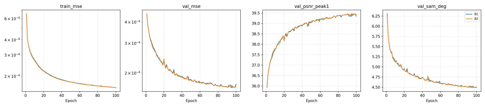
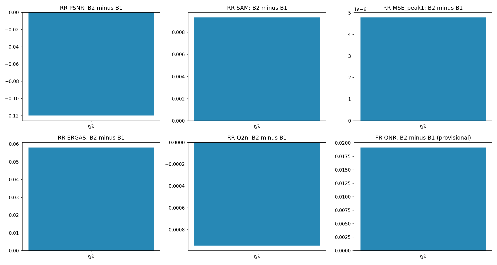
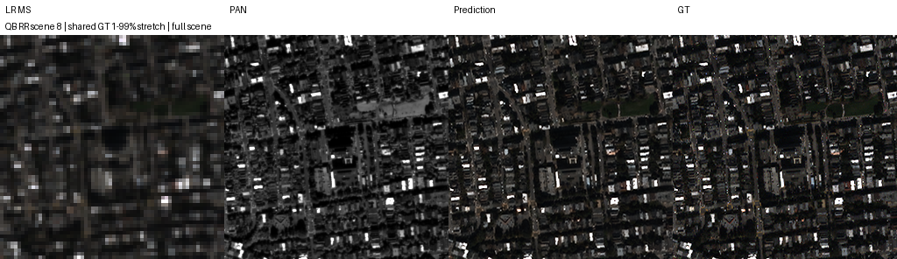
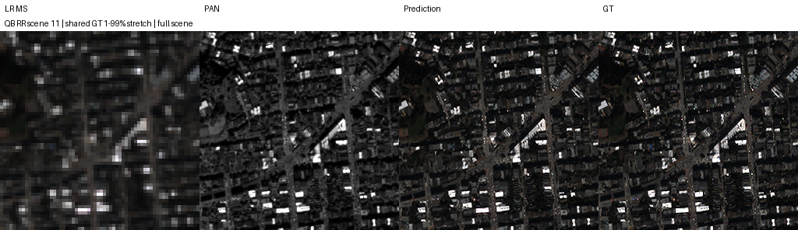
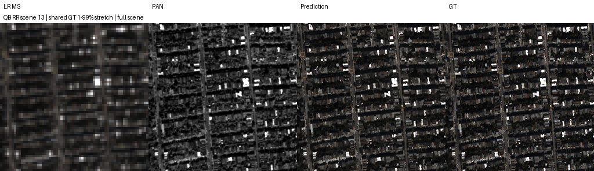
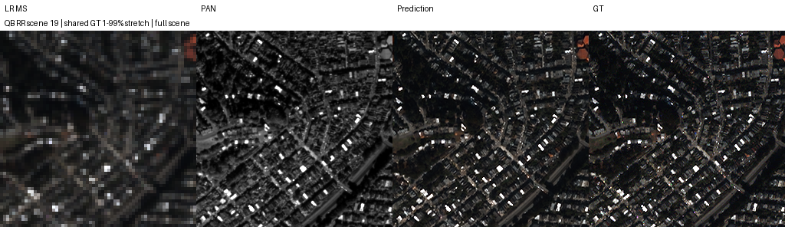

# QB · B1/B2 100에폭 재개 실행 · Kaggle 결과

[실험 목록](../../README.md#experiments) · [수치](#results) · [그래프](#graphs) · [이미지](#images) · [가중치·근거](#evidence)

| 비교 기준 | 이번에 바꾼 점 | 관측된 차이 | 판단 |
|---|---|---|---|
| 같은 실행의 B1 · 3단계 공유 복원 | B2에 MS−MTF(current) 관측 오차 전달 | RR PSNR -0.119919 dB, SAM +0.009337°, MSE +4.78585561e-06; 잠정 FR QNR +0.019136 | RR 악화·FR 개선이 엇갈려 종합 채택 보류 |
| 이전 B1/B2 100에폭 실행 | Fused Adam·검증한 FFT 관측 계산, 200 셀의 초반 체크포인트 가져오기·배치 재개 | 이전 B2−B1 PSNR +0.115759 dB에서 이번 −0.119919 dB로 방향 변경 | 단순 재현·동일 수치 반복으로 취급하지 않음 |

> **실제 K=6 기록이다.** 현재 연구 기본값 [K4](../../README.md#decision)의 성능 결과로 바꾸지 않는다. 이 보고서는 사용자 제공 Output을 보관·검증한 기록이다.

## 1. 목적과 상태

**B1·B2 각각 100에폭 학습, RR 20장·FR 20장 전체 평가 완료.** 마지막 다운로드 근거 확인은 **2026-10-09 22:16 KST**이며 실제 학습 종료 시각이나 실시간 서버 상태를 뜻하지 않는다. Notebook Version ID·정확한 종료 시각은 산출물에 없다. 로컬 재학습이나 원본 H5 재평가는 하지 않았다.

제공된 두 폴더는 독립된 두 실험이 아니라 **중간 복구본과 그 상태에서 이어진 최종 결과**다. `ssa_kaggle_B1_B2_200_cosine_v1_recovery`는 목표 200에폭이던 셀에서 B1 **12에폭**, B2 **11에폭**까지 완료한 latest를 보관한다. 최종 `ssa_kaggle_B1_B2_100_resume_v1_results`는 그 latest 전체 상태를 가져와 **각각 총 100에폭**까지 실행했다. 가져온 초반 history와 원본 history가 일치하고 source latest SHA-256이 bootstrap manifest와 일치한다. 200에폭 완료나 200+100에폭 학습으로 표시하지 않는다. 복구본 status의 epoch13/12는 진행 중 표시이며, 완료 저장 지점 12/11과 구분한다.

재현은 [단일 셀 Python](../../scripts/kaggle_b1_b2_100_resume_one_cell.py) · [동일 텍스트](../../scripts/kaggle_b1_b2_100_resume_one_cell.txt)다. CtrS 기반 commit `be02b7cbf03fe00681194ae9fc9419661f24cd56`, 공식 network commit `a4ca40e407b12bf4c30f804384405ce321d11c51`을 사용했다. 재현 셀의 내장 worker·model이 실제 [실행 snapshot](../assets/kaggle_b1_b2_100_resume/code/)과 SHA-256 일치한다. launcher의 불완전 가져오기 방지 개선은 실행 뒤 추가된 것이며, worker와 모델의 동일성이 launcher 전체의 동일성을 뜻하지 않는다.

## 2. 변경 사항과 평가 조건

| 항목 | 실제 조건 |
|---|---|
| 대상·입력 | QuickBird, PAN 1밴드·MS 4밴드, NCHW, DN2047 정규화, K6 |
| train / validation | 17,139 / 1,905 패치. HR 64×64·LR 16×16 |
| 전체 RR / FR | 각각 별도 H5 20장. RR HR256×256·LR64×64, FR HR512×512·LR128×128 |
| 공통 3단계 | 제공 LMS에서 시작, 동일 SSA-MRN core·오차 Conv encoder·공유 scalar α를 3회 사용 |
| B1 / B2 | B1 error=0; B2 error=MS−D(current), LR 경계 5픽셀 mask 후 bilinear 확대 |
| 상태 갱신 | conditioned=current+encoder(error); proposal=core(PAN,conditioned,MS); current←current+α(proposal−current) |
| 오차 encoder·계수 | 4→4 3×3 Conv, bias 포함; α 초기0.1, 학습형·범위 제한 없음. B1도 encoder bias 학습 가능 |
| 관측 연산 | QB MTF 41×41 FIR·replicate padding·×4 sampling; 이번에는 FP32 FFT로 같은 correlation 계산 |
| 위상 | TRAIN GT/MS 정합 검사에서 (2,2)/(1,2)/(2,1) 고정. validation/test는 입력 LMS/MS만으로 선택, test GT 사용 안 함 |
| 학습 | seed42, 최종 출력 MSE, Fused Adam lr1e−4 **고정**, effective/micro batch32, 총100에폭 |
| 장치·정밀도 | T4×2, GPU0=B1/GPU1=B2, AMP FP16·GradScaler, 관측·validation/test FP32, channels-last·deterministic·TF32=False |
| 병목 감소 | train/val GPU FP32 상주, GPU randperm/index_select 배치, CPU DataLoader 없음, 주기적 상태 동기화 |
| 재개 | 약1분·에폭별 저장, 모델/optimizer/scaler/RNG/배치 순서·완료 배치 cursor 저장. 가져온 epoch에는 200 셀의 이전900초 간격 기록 유지 |
| 환경 | PyTorch2.11.0+cu128, CUDA12.8, Python3.13.15 |
| 선택·평가 | 최소 FP32 validation MSE의 best. full scene, 재정합·평가 crop·추가 test 선택 없음 |

100에폭 셀은 cosine 구간을 실행하지 않았다. [데이터 경로·해시](../assets/kaggle_b1_b2_100_resume/data_manifest.json) · [환경](../assets/kaggle_b1_b2_100_resume/environment.json) · [실행 변경](../assets/kaggle_b1_b2_100_resume/plan_deviations.json) · [관측 manifest](../assets/kaggle_b1_b2_100_resume/observation_train.json) · [B1 가져오기](../assets/kaggle_b1_b2_100_resume/runs/B1_QB_B1_k6_s42/bootstrap_manifest.json) · [B2 가져오기](../assets/kaggle_b1_b2_100_resume/runs/B2_QB_B2_k6_s42/bootstrap_manifest.json)

양쪽 core 초기화 SHA-256과 100에폭 sample-order 해시가 일치한다. FFT 사전 검사 기록은 64×64 FP32 geometry에서 forward max abs **1.4305e−6**, backward **3.1948e−5**다. 수치적 FIR 일치성 검사이며 기존 학습 궤적의 bitwise 재현이나 FR 물리 타당성 검증이 아니다.

## 3. 정량 결과

모두 장면별 계산 후 **20장 산술평균**이다. RR PSNR은 peak2047 밴드 PSNR 평균, MSE는 DN2047로 정규화한 원소 MSE, SAM은 도 단위다. validation PSNR은 peak1의 밴드 평균으로 단일 global MSE 변환과 다르다. FR에는 HR GT가 없으며 QNR·Ds 및 RR Q2n/SCC의 MATLAB parity 한계가 남는다.

| 모델 | Best epoch | Best validation MSE | RR PSNR dB ↑ | RR SAM ° ↓ | RR MSE peak1 ↓ |
|---|---:|---:|---:|---:|---:|
| B1 | 95 | 0.000163388293 | 37.690421 | 4.822219 | 0.000201435063 |
| B2 | 96 | 0.000163573088 | 37.570502 | 4.831556 | 0.000206220919 |
| B2−B1 | — | +1.84794771e-07 | -0.119919 | +0.009337 | +4.78585561e-06 |

| 지표 | B1 | B2 | B2−B1 |
|---|---:|---:|---:|
| RR ERGAS | 3.98942779 | 4.0474182 | +0.0579904108 |
| RR SCC | 0.97871355 | 0.977766662 | -0.000946887995 |
| RR Q2n | 0.924877636 | 0.923930608 | -0.000947027661 |
| RR MS_consistency_MSE_peak1_interior | 1.91711129e-06 | 1.7779351e-06 | -1.39176187e-07 |
| FR D_lambda | 0.0446319256 | 0.037837592 | -0.00679433363 |
| FR D_s | 0.0759348672 | 0.062652939 | -0.0132819282 |
| FR QNR | 0.882707869 | 0.901844286 | +0.0191364167 |
| FR MS_consistency_MSE_peak1_interior | 0.000166714195 | 0.000132805593 | -3.39086022e-05 |

이번 B2는 **RR PSNR 20/20장 모두 B1보다 낮고**, RR MSE는 **2.38% 증가**했다. RR SAM·ERGAS·SCC·Q2n도 악화했다. FR에서는 Dλ·Ds 감소·잠정 QNR 증가와 입력 MS consistency MSE **20.34% 감소**를 관측했다. 입력 일치도는 HR 정답 정확도가 아니다.

[전체 지표](../assets/kaggle_b1_b2_100_resume/results.json) · [CSV](../assets/kaggle_b1_b2_100_resume/summary.csv) · [paired 차이](../assets/kaggle_b1_b2_100_resume/paired_comparison.json) · [B1 RR](../assets/kaggle_b1_b2_100_resume/runs/B1_QB_B1_k6_s42/RR_per_scene.json) · [B2 RR](../assets/kaggle_b1_b2_100_resume/runs/B2_QB_B2_k6_s42/RR_per_scene.json) · [B1 FR](../assets/kaggle_b1_b2_100_resume/runs/B1_QB_B1_k6_s42/FR_per_scene.json) · [B2 FR](../assets/kaggle_b1_b2_100_resume/runs/B2_QB_B2_k6_s42/FR_per_scene.json)

기록된 100에폭 학습+validation 누적은 B1 **139.99분**, B2 **157.64분**이다. 여기에는 주기적 recovery 저장이 포함되고 에폭 끝 저장·시동·test는 제외한다. 재개 세션 worker 전체 시간은 B1 **125.36분**, B2 **142.28분**, 최종 suite 포장 전 시간은 **144.80분**이다. 재개 전 실행과 미저장 뒤 다시 계산한 시간까지 완전히 합친 총 소요시간이 아니며 두 GPU 시간을 더하지 않는다. [세션 시간](../assets/kaggle_b1_b2_100_resume/runs/B2_QB_B2_k6_s42/session_timing.json)

## 4. 직전 연구와 수치 차이

직전 [B1/B2 보고서](https://github.com/BIYONGHIYON/CtrS/blob/36b8f569128b34f73830b16b4dfef30a46a84a22/SSA-MRN/docs/experiments/kaggle_b1_b2.md)의 값을 보관된 JSON에서 인용했다. 이전 PR42와 브랜치는 수정하지 않았다. 아래는 **현재−직전 관측 차이**로, 같은 QB·K6·seed42·100에폭이나 Fused Adam·FFT 관측 계산·checkpoint/재개 정책이 달라 단일 구조 효과나 독립 반복 시드 검증으로 해석하지 않는다. 이전과 이번 결과를 평균해 개선량을 만들지 않는다.

| 모델·지표 | 직전 | 현재 | 현재−직전 |
|---|---:|---:|---:|
| B1 RR PSNR | 37.6047447921 | 37.6904206179 | +0.0856758258 |
| B1 RR SAM | 4.83269829084 | 4.82221901162 | -0.0104792792 |
| B1 RR MSE_peak1 | 0.000205615557702 | 0.000201435063286 | -4.18049442e-06 |
| B1 FR QNR · 잠정 | 0.904310113 | 0.882707869 | -0.021602243 |
| B2 RR PSNR | 37.7205036896 | 37.5705018674 | -0.150001822 |
| B2 RR SAM | 4.81441588207 | 4.83155582262 | +0.0171399406 |
| B2 RR MSE_peak1 | 0.00020025117562 | 0.000206220918895 | +5.96974328e-06 |
| B2 FR QNR · 잠정 | 0.886088768 | 0.901844286 | +0.015755518 |

직전 B2−B1은 RR PSNR **+0.115759 dB**, FR QNR **−0.018221**였고, 이번에는 RR PSNR **−0.119919 dB**, FR QNR **+0.019136**이다. 방향 변화의 원인을 이번 두 실행만으로 Fused Adam·FFT 또는 재개의 특정 한 항목에 귀속하지 않는다. [이전 숫자 snapshot](../assets/kaggle_b1_b2_100_resume/previous_b1_b2_results.json) · [인용 출처](../assets/kaggle_b1_b2_100_resume/previous_comparison_source.json)

B0 원본 단일 출력 모델은 이번 셀에서 학습·평가하지 않았다. 논문 기준선의 같은 실행 대조군이 없으므로 **논문보다 성능이 높아졌다는 결론은 내리지 않는다.**

## 5. 그래프

실측 100에폭 train MSE·validation MSE/PSNR/SAM이다. 가져온 초반 기록을 포함하고 누락 epoch를 추정하지 않았다.

이번 실행의 B1을 기준으로 B2−B1 전체 RR/FR 평균 차이를 표시한다. QNR은 잠정 구현이다.

## 6. 결과 이미지 예시

평가 전에 seed42로 고정한 RR row index **1, 8, 11, 13, 19**, full scene·오름차순이다. [selection](../assets/kaggle_b1_b2_100_resume/selection.json)에 seed·ID·tile·순서가 있다. 아래는 **LR MS · PAN · B2 예측 · GT** 4패널이다. RGB [2,1,0]은 표시 가정이며 같은 장면 GT의 1–99% 범위를 MS·예측·GT에 공통 적용하고 LR MS만 최근접 확대한다. B1은 수치 비교와 원본 이미지 보관에 유지한다. FR GT는 생성하지 않는다.

나머지 고정 4장면

## 7. 가중치와 검증 근거

**최종 best/latest 원본4개, latest 이전 복구본2개, 200 셀의 중간 best/latest4개를 Git에 포함한다.** checkpoint 내부 config·optimizer·RNG는 수정하지 않았다. 아래 표는 최종 학습 결과이고 중간본은 별도 [checkpoint manifest](../assets/kaggle_b1_b2_100_resume/recovery_200/checkpoint_manifest.json)로 구분한다. 최종 예측80개·고정 이미지10개·전체 지표·원본 실행 source·compact epoch·정합 manifest를 보관했다.

| 모델·종류 | epoch | SHA-256 |
|---|---:|---|
| [B1 best](../assets/kaggle_b1_b2_100_resume/runs/B1_QB_B1_k6_s42/best.pt) | 95 | `a5a397058d0e8fee46259dccf02e446c16186c0a2d900d3888ed874851f4ab2e` |
| [B1 latest](../assets/kaggle_b1_b2_100_resume/runs/B1_QB_B1_k6_s42/latest.pt) | 100 | `6646d1e7b58392a39905d81b1cef737acc91252087912476d21eb7a3a67b2e0e` |
| [B2 best](../assets/kaggle_b1_b2_100_resume/runs/B2_QB_B2_k6_s42/best.pt) | 96 | `915ac71b6c10f942f8db249e8b9ac919f80e00cc07f1f437f465b38a8ba2b63c` |
| [B2 latest](../assets/kaggle_b1_b2_100_resume/runs/B2_QB_B2_k6_s42/latest.pt) | 100 | `c7aa2b8fb21e6f7d6ba8dad25105fe1e546a41feb85a8904fc032d764c1e2571` |

[검증 기록](../assets/kaggle_b1_b2_100_resume/verification.json) · [원본 manifest](../assets/kaggle_b1_b2_100_resume/artifact_manifest.json) · [실제 보관 manifest](../assets/kaggle_b1_b2_100_resume/repository_manifest.json) · [compact epochs](../assets/kaggle_b1_b2_100_resume/compact_epochs.json) · [중간 복구본](../assets/kaggle_b1_b2_100_resume/recovery_200/) · [검증 코드](../../scripts/verify_b1_b2_100_results.py) · [재개 절차](../operations/kaggle_b1_b2_100_resume.md)

원격 보관은 최초 결과 commit `689303c1769a5819f9c9f729ec9705635a9990df`에서 GitHub tree의 근거199개 blob ID·크기를 대조하고, **가중치10개를 GitHub에서 다시 내려받아 SHA-256 일치**를 확인했다. 해당 검증 시점은 verification의 remote_verification에 기록했다. 이후 추가 커밋은 이 검증 기록·문서·보관 manifest만 추가한다.

최종 manifest153개 파일 크기·SHA-256, checkpoint ZIP CRC·metadata epoch, best 선택, 공통 core 초기화·100에폭 순서, 장면별 RR/FR 평균, 전체80개 NPZ의 shape·유한값, PNG10개의 1024×296 4패널 형태를 확인했다. 중간 latest 원본 해시와 가져온 초반 history도 대조했다. PyTorch tensor 로딩·실제 forward·원본 H5에 대한 GT 지표 재산출은 하지 않았다. 다운로드 폴더·이전 실험 폴더는 삭제하지 않는다.

## 8. 한계와 다음 판단

**B2의 종합 채택을 보류한다.** 이번 같은 실행의 RR에서는 B1이 모든 장면의 PSNR 및 전체 주요 지표에서 더 좋았다. 잠정 FR 지표 개선과 이전 실행의 반대 결과가 공존하므로 일관된 복원 성능 향상을 주장할 수 없다.

QB 단일 seed42, 같은 test split의 반복 탐색, 서로 다른 best epoch, 두 물리 GPU 고정 배정·교환 반복 없음, 비트 단위 재현 미보장이라는 제한이 있다. TRAIN은 GT/MS 위상, validation/test는 관측 LMS/MS 위상을 사용한다. 정확한 합성 TRAIN 정합과 낮은 FR consistency가 실제 HR 디테일의 정확도를 보증하지 않는다. 현재 K4 기본 연구나 논문 성능 우위를 입증한 결과도 아니다.

원인 분석은 validation 중심으로 Fused Adam·FFT·재개 여부를 하나씩 통제한 실행과 독립 시드·새 장면 확인이 필요하다. 이는 후속 후보이며 이번 작업에서 새 학습을 시작하지 않았다.
