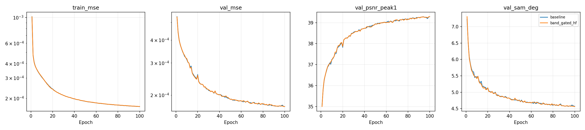
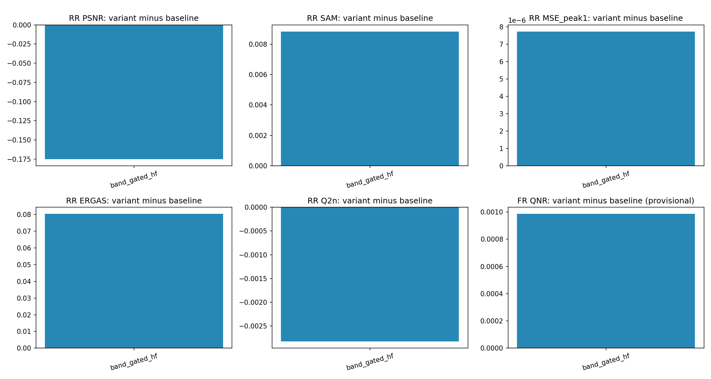
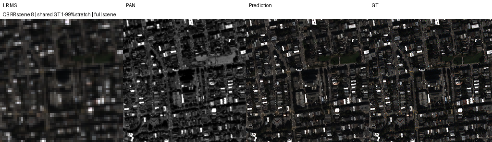
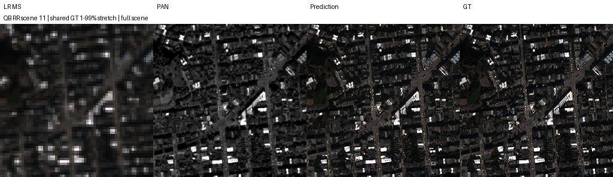
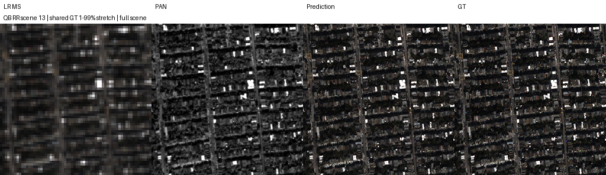
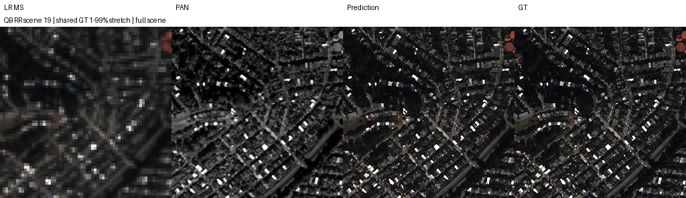

# QB · 밴드별 게이트 고주파 · Kaggle 결과

> **이력 구분:** 이 보고서는 당시 **K=6**으로 수행한 실험입니다. 현재 연구 기본값은 [K=4](../../README.md#decision)로 확정했으며, 아래 실제 설정·수치·가중치는 당시 K6 기록을 유지합니다.

[실험 목록](../../README.md#experiments) · [수치](#results) · [그래프](#graphs) · [이미지](#images) · [가중치·근거](#evidence)

| 비교 기준 | 바꾼 점 | 관측 차이 | 판단 |
|---|---|---|---|
| 같은 Kaggle 조건의 QB K6 baseline | PAN 고주파 잔차를 MS 밴드·픽셀별 게이트로 조절 | RR PSNR −0.174992 dB, SAM +0.008829°, MSE +7.72165e−6; 잠정 FR QNR +0.000986 | RR 전반 악화, FR 소폭 혼합 변화. 단일 시드에서 종합 개선이 없어 채택 보류 |

## 1. 목적과 상태

**baseline과 band_gated_hf 각각 100에폭 학습 및 RR 20장·FR 20장 전체 평가 완료.** 2026-10-08 23:20 KST부터 다운로드 산출물을 확인해 저장소에 정리했다. 로컬 재학습·원본 H5 재평가를 했다는 뜻은 아니다.

PAN 고주파가 모든 MS 밴드·위치에서 같은 정도로 유용하지 않을 수 있다는 가설을 검토했다. 후보는 기존 SSA-MRN 출력에 학습형 게이트를 곱한 고주파 잔차를 더한다. 본체·손실·데이터 분할은 기준선과 같다.

최초 계획은 baseline·기존 high_frequency·band_gated_hf의 세 모델, FP32·micro batch4였다. 실제 실행은 요청에 따라 **baseline과 band_gated_hf 두 모델만** 같은 T4 두 대에서 병렬 학습했으며, 양쪽에 동일한 AMP와 micro batch32를 적용했다. 기존 고정 high_frequency와의 같은 장치 직접 비교는 이번 결과에 없다. [변경 기록](../assets/kaggle_band_gated_hf/plan_deviations.json)에 실제 조건을 남겼다.

실행 코드는 [한 셀 Kaggle 노트북](../../scripts/kaggle_band_gated_hf.ipynb)과 [동일 Python 셀](../../scripts/kaggle_one_cell.py)이다. 기준 소스 commit은 `be02b7cbf03fe00681194ae9fc9419661f24cd56`, 후보 정의는 계획 commit `1b56efb54e9c200d5b497e719bb0857b25f750bf`에서 추출했다. 실제 실행 worker·클래스 snapshot은 [code/](../assets/kaggle_band_gated_hf/code/)에 보존했고 재현 셀의 worker 해시가 실행 snapshot과 일치함을 확인했다. Kaggle Notebook Version ID는 다운로드 산출물에 없어 미기록이며 파일 해시로 실행 근거를 남긴다.

## 2. 변경 사항과 평가 조건

| 항목 | 실제 조건 |
|---|---|
| 대상·입력 | QuickBird(QB), MS 4밴드·PAN 1밴드, NCHW, DN2047로 정규화, K6 |
| 모델 | 원본 RestoredPansharpeningNet baseline 대 계획의 BandGatedHighFrequency |
| 고주파·잔차 | PAN − 5×5 binomial blur, 가장자리 복제; Conv 1→16→4, 마지막 Conv 0 초기화 |
| 게이트 | PAN 고주파 4채널 복제 + 기준 출력의 \|dx\|·\|dy\|, 총 12→32→4 Conv + sigmoid; 출력 기울기는 detach |
| 게이트 초기화 | 마지막 weight=0, bias=−2; 잔차가 0이어서 초기 출력은 본체 출력과 같음 |
| train / validation | 17,139 / 1,905 패치. HR PAN/LMS/GT 64×64, LR MS 16×16 |
| RR / FR | 각각 별도 H5 20장 전체. RR HR 256×256 / LR 64×64, FR HR 512×512 / LR 128×128 |
| 정합·타일 | 원본 H5 PAN/LMS/MS/GT 사용. 재정합·추가 마스크·평가 crop 없이 full scene |
| 학습 | MSE, Adam LR1e−4, 100에폭, effective batch32, micro batch32, seed42 |
| 실행 최적화 | 양쪽 동일 AMP FP16/GradScaler, channels-last, train/val GPU 캐시, deterministic=True, TF32=False |
| 장치·환경 | Tesla T4 ×2, GPU0=baseline / GPU1=후보; PyTorch2.11.0+cu128, CUDA12.8, Python3.13.15 |
| 선택·평가 | 최소 FP32 validation MSE의 best. Test FP32, 모델·에폭 선택에 사용하지 않음 |
| 공통 조건 검증 | 본체 초기 가중치와 100에폭 샘플 순서 해시가 두 모델에서 일치 |

원본 H5 배열 크기·SHA-256은 [data_manifest.json](../assets/kaggle_band_gated_hf/data_manifest.json), 환경은 [environment.json](../assets/kaggle_band_gated_hf/environment.json)에 있다. 원본 데이터는 Git에 넣지 않았다. `reference_plan_config`의 FP32 선언과 실제 `config.amp`·`config.micro_batch`를 구분한다.

## 3. 정량 결과

모든 숫자는 각 모델의 RR·FR 전체 20장 평균이다. 차이는 **후보−동일 Kaggle baseline**이다. PSNR은 장면별 밴드 PSNR(peak2047) 평균, MSE는 DN2047로 정규화한 장면별 원소 MSE 평균, SAM은 도 단위다. validation PSNR은 peak1 밴드 평균, SAM은 이미지별 유효 픽셀 평균을 이미지별로 평균한다.

| 모델 | Best epoch | Best validation MSE | RR PSNR dB ↑ | RR SAM ° ↓ | RR MSE peak1 ↓ |
|---|---:|---:|---:|---:|---:|
| baseline | 100 | 0.000173089051 | 37.453879 | 4.955443 | 0.000215111127 |
| band_gated_hf | 99 | 0.000173186942 | 37.278888 | 4.964272 | 0.000222832780 |
| 후보−baseline | — | +9.78907e−8 | −0.174992 | +0.008829 | +7.72165e−6 |

| 지표 | baseline | band_gated_hf | 후보−baseline |
|---|---:|---:|---:|
| RR ERGAS ↓ | 4.117561 | 4.197870 | +0.080309 |
| RR SCC ↑ | 0.977016 | 0.975658 | −0.001358 |
| RR Q2n/Q4 ↑ | 0.924394 | 0.921570 | −0.002824 |
| FR Dλ ↓ | 0.041631 | 0.037400 | −0.004231 |
| FR Ds ↓ | 0.040765 | 0.044066 | +0.003302 |
| FR QNR ↑ · 잠정 | 0.919756 | 0.920742 | +0.000986 |

RR MSE는 약 3.59% 증가했다. FR에서는 분광 왜곡 Dλ가 감소했으나 공간 왜곡 Ds가 증가했다. QNR의 작은 상승만으로 종합 개선을 판단하지 않는다.

[전체 숫자·장면별 JSON](../assets/kaggle_band_gated_hf/results.json) · [요약 CSV](../assets/kaggle_band_gated_hf/summary.csv) · [paired 차이](../assets/kaggle_band_gated_hf/paired_comparison.json)

학습+validation 누적은 baseline **56.13분**, 후보 **60.18분**이다. 캐시 적재·benchmark·checkpoint·test를 포함한 worker 이번 세션 시간은 각각 **56.58분**, **60.62분**이다. 병렬 실행이므로 두 시간을 합해 전체 경과 시간으로 표시하지 않는다. 초기 캐시 생성·ZIP 보관은 worker 시간 밖이며 옛 노트북 대비 속도 향상 배수를 주장하지 않는다.

## 4. 직전 연구와 수치 차이

직전 [A6000 QB 구조 비교](a6000_architecture_qb.md)를 맥락으로 기록한다. 아래 차이는 현재−직전 관측값이며 **장치·소프트웨어·AMP 및 후보 구조가 달라 직접적인 구조 효과 비교가 아니다.**

| 비교 | 지표 | 직전 A6000 | 현재 Kaggle | 관측 차이 |
|---|---|---:|---:|---:|
| baseline → baseline | RR PSNR dB | 37.424183 | 37.453879 | +0.029696 |
| baseline → baseline | RR SAM ° | 4.963896 | 4.955443 | −0.008454 |
| baseline → baseline | RR MSE peak1 | 0.000215483894 | 0.000215111127 | −3.72767e−7 |
| 고정 high_frequency → band_gated_hf | RR PSNR dB | 37.362069 | 37.278888 | −0.083181 |
| 고정 high_frequency → band_gated_hf | RR SAM ° | 4.940812 | 4.964272 | +0.023460 |
| 고정 high_frequency → band_gated_hf | RR MSE peak1 | 0.000218371874 | 0.000222832780 | +4.46091e−6 |

과거 baseline 대비 고정 경로의 PSNR −0.062115 dB와 이번 gate 경로의 −0.174992 dB를 직접 비교해 gate가 더 나쁘다고 확정할 수 없다. 주 결론은 같은 Kaggle 환경의 두 모델 비교에 한정한다.

## 5. 그래프

실측 100에폭의 train MSE, validation MSE·PSNR·SAM이다. 누락 에폭을 추정해 채운 값은 없다.

기준선 대비 RR/FR 전체 test 평균 차이다. FR QNR은 잠정 구현이다.

## 6. 결과 이미지 예시

수치 평가 전에 seed42로 고정한 RR row index **1, 8, 11, 13, 19**의 전체 장면이다. 순서는 오름차순, tile은 full scene이며 [selection.json](../assets/kaggle_band_gated_hf/selection.json)에 기록했다. 왼쪽부터 **LR MS · PAN 입력 · band_gated_hf 예측 · GT**다. RGB [2,1,0]은 표시 가정이며, MS에는 같은 장면 GT의 1–99% 공통 대비를 쓰고 LR MS만 최근접 확대했다. baseline은 수치 비교에 남기며 패널에 추가하지 않는다. FR에는 GT가 없다.

나머지 고정 4장면

## 7. 가중치와 검증 근거

**실제 full best/latest 4개 원본을 Git에 보관한다.** model뿐 아니라 optimizer·scaler·RNG·history도 포함한다. latest는 두 모델 모두 epoch100이며 checkpoint 내부 config는 변경하지 않았다.

| 모델·종류 | epoch | SHA-256 |
|---|---:|---|
| [baseline best](../assets/kaggle_band_gated_hf/runs/github_QB_baseline_k6_s42/best.pt) | 100 | `40cee3e0bd1eb085b2fc3511df795ec28333fa8b5d761227b2049cc84761854c` |
| [baseline latest](../assets/kaggle_band_gated_hf/runs/github_QB_baseline_k6_s42/latest.pt) | 100 | `228b334c9c2c8dae58aec0e757e7490a3e3709fb5a2a742285ae0391a29e08c0` |
| [band_gated_hf best](../assets/kaggle_band_gated_hf/runs/pasted_QB_band_gated_hf_k6_s42/best.pt) | 99 | `76745cced5bf938b1c12e2a7cdb828c2a631f7d8f9aa6cb0cd5091993a191c47` |
| [band_gated_hf latest](../assets/kaggle_band_gated_hf/runs/pasted_QB_band_gated_hf_k6_s42/latest.pt) | 100 | `b637fb66c1020f855cc1b0d3be26d28110a6836333a68a0fc425cf2efad8cee0` |

[baseline compact epochs](../assets/kaggle_band_gated_hf/runs/github_QB_baseline_k6_s42/history.json) · [후보 compact epochs](../assets/kaggle_band_gated_hf/runs/pasted_QB_band_gated_hf_k6_s42/history.json) · [원본 manifest](../assets/kaggle_band_gated_hf/artifact_manifest.json) · [보관 검증](../assets/kaggle_band_gated_hf/verification.json)

다운로드 manifest의 149개 파일 크기·SHA-256, checkpoint ZIP CRC·epoch, 100에폭·best 선택, 공통 본체 초기화·데이터 순서, RR/FR 평균과 장면별 숫자, **전체 80개 다중밴드 예측 배열**의 형태·유한값을 확인했다. 예측은 각 run의 `predictions/RR/`·`predictions/FR/`에 있다. 원래 다운로드 report·소스·manifest도 보존한다.

로컬에는 PyTorch와 원본 H5가 없어 checkpoint tensor 로드나 GT 지표 재산출은 하지 않았다. [검증 코드](../../scripts/verify_kaggle_result.py) · [재현·경로 안내](../operations/kaggle_gpu_comparison.md) · [사전 계획 snapshot](https://github.com/BIYONGHIYON/CtrS/blob/1b56efb54e9c200d5b497e719bb0857b25f750bf/SSA-MRN/docs/experiments/kaggle_band_gated_hf.md)

## 8. 한계와 다음 판단

**후보 채택은 보류한다.** 같은 seed42 기준선보다 RR PSNR·SAM·MSE·ERGAS·SCC·Q2n이 모두 악화했고, 잠정 FR QNR의 작은 상승만으로 이를 상쇄할 근거가 없다.

QB 한 센서·단일 시드 결과다. 다른 두 물리 T4에 고정 배정했고 GPU 교환 반복은 하지 않았다. QB test는 선행 구조 탐색에 사용돼 새 독립 일반화 검증이 아니다. QNR/Ds의 MATLAB resize 일치성 및 Q2n/SCC 정합성은 미검증이다. 이전 FP32·micro4 계획과 다른 AMP·micro32 실행이며 같은 새 환경의 baseline과만 주 비교한다.

추가 판단은 paired seed43·44 또는 새 독립 장면에서의 반복 검증을 거쳐야 한다. 이번에 실행하지 않은 고정 high_frequency 대비 gate 효과는 미확정이다. 예시 장면을 교체하거나 과거 곡선을 보충하지 않았으며, 이 결과로 구조·손실·23탭 결합 실험의 완료나 성능을 주장하지 않는다.
