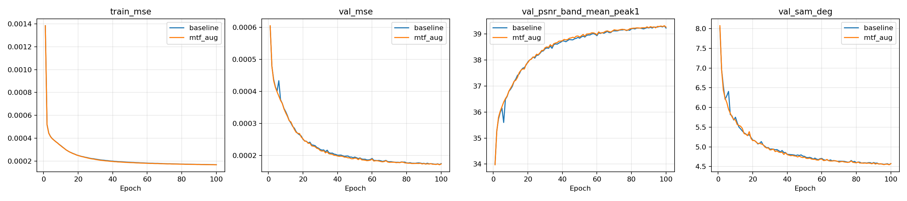

# QB · MTF 변화량 증강과 원본 기준선의 병렬 비교

> **이력 구분:** 이 보고서는 당시 **K=6**으로 수행한 실험입니다. 현재 연구 기본값은 [K=4](../../README.md#decision)로 확정했으며, 아래 실제 설정·수치·가중치는 당시 K6 기록을 유지합니다.

[실험 목록](../../README.md#experiments) · [수치](#results) · [그래프](#graphs) · [이미지](#images) · [가중치·근거](#evidence)

| 비교 기준 | 바꿀 점 | 관측 차이 | 판단 |
|---|---|---|---|
| 원본 PAN/MS/LMS로 학습하는 SSA-MRN K6 | TRAIN MS의 검증된 내부에 MTF 변화량 추가, LMS도 함께 갱신 | 100에폭 완료; best validation PSNR +0.00576 dB, SAM −0.00499° | 최종 best/latest 보관·검증, RR/FR 평가 대기 |

## 1. 목적과 상태

흐림 조건 변화에 대한 SSA-MRN의 민감도를 줄이는지 확인합니다. QB 단일 paired seed 46을 첫 탐색으로 사용하며, 개선을 확정하려면 반복 시드와 다른 조건의 평가가 필요합니다.

**완료 확인:** 2026-10-09 01:25 KST. baseline과 mtf_aug 모두100에폭·exit code0, validation MSE 최소 checkpoint는 둘 다99에폭이다. 실제 Kaggle ZIP 다운로드와 전체 파일 해시를 검증했다. 학습 완료이며 전체 RR/FR 연구 평가는 아직 미완료다.

**실행 파일:** [한 셀 Notebook](../../scripts/kaggle_mtf_pair.ipynb) 또는 [한 셀 Python 코드](../../scripts/kaggle_mtf_pair_cell.py). Notebook에는 코드 셀 하나만 있으며 모델·공식 네트워크·관측 프로파일·worker 코드 스냅샷을 포함합니다. 원격 브랜치의 미완료 변경에 의존하지 않습니다. 기본 코드 기준은 main `be02b7c`입니다.

실행 방법:

1. Kaggle의 **File → Import Notebook**으로 위 `.ipynb`를 가져옵니다.
2. **GPU T4 x2**를 선택하고 기존 `biyonghiyon/ctrs-pan-sharpening-dataset`을 Add Input으로 연결합니다.
3. 코드 셀 한 개를 실행합니다. 기본값 `SMOKE=False`는 **두 모델의 본 학습 시작**입니다. 먼저 환경 확인만 하려면 `SMOKE=True`로 32패치·1에폭을 별도 폴더에서 실행합니다.
4. 장시간 실행은 **Save Version → Save & Run All**로 시작하고 출력 저장 여부를 확인합니다. 이 기능은 새 실행을 시작하므로 인터랙티브 학습을 함께 켜두지 않습니다. 세션별 기본 학습 시간 예산은 9시간이며, 저장 후 정상 종료하고 ZIP을 생성합니다.
5. 실제 GPU 속도와 최종 완료 시각은 첫 에폭 이후 측정합니다. 9시간은 완료 보장이 아닌 세션당 실행 한도입니다.

## 2. 변경 사항과 평가 조건

| 항목 | 조건 |
|---|---|
| 데이터 | QB 원본 train/validation 전부; 수정·재업로드 없음 |
| GPU 배정 | GPU 0: baseline / GPU 1: mtf_aug, 독립 프로세스 |
| 공통 모델 | SSA-MRN K6, 내부 bilinear 유지, 구조·고주파 경로·보조 손실 추가 없음 |
| 공통 학습 | seed 46, Adam lr 1e-4, MSE, 목표 100에폭, effective batch 32, micro batch 16 |
| 속도 설정 | FP16 autocast + GradScaler, 공통 cuDNN autotune, 기본 GPU 상주 캐시; 공간 부족 시 mmap + worker 2로 fallback |
| 검증 | 원본 validation, 두 모델 모두 FP32 추론, MSE·밴드 평균 PSNR(peak=1)·SAM 기록 |
| 선택 | 최소 validation MSE의 best; 재개는 latest |
| MTF 변경 | QB 밴드별 GNyq `[0.34,0.32,0.30,0.22]`의 공통 배율 0.9 또는 1.1; 41탭 signed FIR 유지 |
| 증강 선택 | 샘플·에폭·시드로 결정하는 원본/0.9/1.1의 3개 상태. test/validation으로 선택하지 않음 |
| 경계·위상 | 공식 TRAIN의 고정 위상 `(2,2)/(1,2)/(2,1)` 사용. LR 경계 5픽셀은 증강하지 않음 |

### 잘린 학습 패치에서의 증강 정의

64×64 GT 패치에는 원래 영상의 주변 정보가 없습니다. 전체를 새 MTF로 재생성하면 원본의 필터링·잘림 순서와 경계가 달라져 기준선과의 비교를 흐릴 수 있습니다. 따라서 다음의 **패치 내부 변화량 증강**을 사용합니다.

```text
ΔMS = 내부 마스크 × [D변경(GT) − D기준(GT)]
MS증강 = 원본 MS + ΔMS
LMS증강 = 원본 LMS + interp23(ΔMS)
```

원본 상태는 MS/LMS가 완전히 동일합니다. PAN과 GT는 유지합니다. 41탭 필터의 주변 정보가 유효한 LR 중앙 6×6만 바꾸고, 동일 변화량을 선형 23탭 확대해 LMS에도 반영합니다. 23탭은 LMS 변화량 계산에만 사용하며 SSA-MRN 내부 확대층을 교체하지 않습니다.

실행 시 전체 TRAIN의 기준 관측값과 원본 MS 내부를 대조합니다. 최대 패치 RMSE가 2 DN을 넘으면 증강을 중단합니다. 0.9/1.1 캐시는 GPU FP32로 한 번 계산하고 재사용합니다. 매 배치에서 41탭 필터를 다시 실행하지 않습니다.

**한계:** 이 방식은 전체 영상에서 다시 만든 연속·비등방성 MTF 데이터와 다릅니다. 미지의 FR 센서 물리를 재현했다고 주장하지 않습니다. 경계는 원본에 고정되어 있어 일반화 효과가 제한될 수 있습니다. 전체 영상의 안전한 재생성이 가능해지면 별도 실험으로 비교합니다.

### CPU 데이터 처리 병목 개선 · 2026-10-09

`GPU_RESIDENT=True`가 기본입니다. CPU mmap 캐시를 한 번 읽어 각 GPU에 TRAIN/validation을 올립니다. 증강 모델은 MS/LMS 변화량 캐시도 함께 올립니다. 이후 샘플 선택·변화량 합산을 GPU 텐서에서 처리하여 매 배치 CPU 패치 복사·콜레이션·Host→Device 전송과 DataLoader worker 작업을 줄입니다. 모델·패치·micro/effective batch·시드·AMP·손실·순서는 유지합니다.

GPU 데이터 버퍼는 QB 전체 배열 형태 기준 baseline 약 2.69 GiB, 증강 약 4.91 GiB입니다. 이는 데이터 텐서만의 예상치이며 모델·활성값·cuDNN 공간은 추가됩니다. 로딩 전에 필요한 바이트 수와 실제 여유 메모리를 대조하고 3 GiB의 여유를 남깁니다. 부족하면 기존 CPU 경로를 사용합니다. 단순 메모리 점유율 대신 진행률 표의 `패치/초`로 속도를 비교합니다. 첫 로딩·cuDNN 준비 시간과 중간 재개 시 짧은 구간은 비교에서 구분합니다.

loss 누계를 장치 텐서로 유지해 매 micro batch마다 `.item()`을 호출하지 않습니다. AMP scale을 매 optimizer step마다 두 번 조회하던 코드는 optimizer의 실제 step hook으로 교체해 skipped step을 기록합니다. 유한 loss 검사와 실제 저장·표 갱신 때의 동기화는 유지합니다.

기존 worker SHA-256 `6d920ca4dfc03fdda0228567eeab167888d799acf471477a03717ea6f222eb9d`에서의 이관만 허용합니다. 이전·현재 코드 차이가 검증된 캐시/동기화 경로이고, 나머지 코드·데이터·학습 조건이 같을 때 기존 fingerprint를 정확히 유도해 latest를 복원합니다. 시드·batch·AMP·모델이 바뀌면 이관을 거부합니다. 기존 코드 snapshot을 남기고 새 snapshot과 `resume_migration.json`을 추가합니다. 같은 세션에 검증된 이전 mmap/증강 캐시가 있으면 재사용합니다.

**적용:** 현재 셀에서 Cancel Run을 한 번 누르고 저장·종료 메시지를 기다립니다. 세션과 `/kaggle/working`을 유지한 채 같은 셀을 새 Python 코드로 교체하고 실행하면 latest부터 재개합니다. 커널 재시작이나 새 세션 전에는 출력 보관을 먼저 확인합니다. 새 세션에서는 기존 재개 절차대로 이전 Output을 연결합니다.

실제 복원 SSA-MRN·합성 데이터의 CPU 검증에서 원본/증강 모든 선택의 상주 텐서 배치가 기존 샘플 경로와 정확히 일치했습니다. 두 모델 각각 기존 구현의 에폭 중간 체크포인트 → 새 상주 배치 경로로 이어 학습했을 때 연속 학습 가중치와 validation MSE가 정확히 일치했습니다. 이는 CUDA AMP의 비트 단위 일치나 T4 속도 개선 실측을 뜻하지 않습니다. 실제 T4×2에서 GPU 상주 경로가 적용된 채 두 모델이100에폭을 종료했다. 중간 진행 표에서 약440–465 패치/초, allocated baseline2.70 / MTF4.92 GiB를 관측했다. 이전 경로와 동일 조건의 속도 비교가 없어 최적화 배율은 주장하지 않는다.

## 3. 정량 결과

<a id="results"></a>

본 학습100에폭 완료. 원본 validation에서 각 모델의 최소 MSE checkpoint를 선택했다. 아래는 validation 결과이며 RR/FR test 결과가 아니다. PSNR은 peak1의 밴드별 평균, SAM은 유효 픽셀의 각도 평균(도)이다.

| 모델 | 완료 / best 에폭 | Best validation MSE | PSNR (dB) | SAM (°) | RR/FR |
|---|---:|---:|---:|---:|---|
| baseline | 100 / 99 | 0.000171972981 | 39.310003 | 4.550377 | 미평가 |
| mtf_aug | 100 / 99 | 0.000171249088 | 39.315762 | 4.545383 | 미평가 |
| MTF − baseline | — | −0.000000723893 | +0.005759 | −0.004994 | N/A |

[검증·수치 원본](../assets/kaggle_mtf_pair_20261009/preservation.json). validation MSE는 약0.421% 낮아졌다. 단일 seed의 작은 관측 차이이며 분광·FR 일반화 개선을 확정하지 않는다. AMP skipped step은 누적 baseline8 / MTF10으로 기록됐다. best의 optimizer·scaler·RNG 상태도 원본대로 보존했다.

## 4. 직전 연구와 수치 차이

23탭 후속 연구의 QB RR 개선이 FR에서 일관되지 않았던 관측이 출발점입니다. 새 실험의 변경점은 학습 입력의 MTF 변화량이며, 기존 23탭 구조나 밴드별 고주파 게이트와 결합하지 않습니다.

FP16·micro batch 16·T4 조건이 기존 FP32 연구와 달라 **이번 T4의 두 모델끼리만 통제 비교**합니다. BatchNorm은 실제 micro batch 단위로 동작하므로 gradient accumulation이 batch 32의 BatchNorm과 동등하다는 주장을 하지 않습니다. best validation 기준 MSE −7.23893e-7, PSNR +0.005759 dB, SAM −0.004994°를 관측했다. 기존23탭 연구의 test PSNR과 이 validation 차이는 직접 비교하지 않는다. test는 기존 탐색에 사용됐으며 모델·에폭 선택에 재사용하지 않는다.

## 5. 그래프

<a id="graphs"></a>

실제100에폭 history의 train MSE, validation MSE·PSNR·SAM 곡선을 보존했다.



[baseline 기록](../assets/kaggle_mtf_pair_20261009/baseline/history.json) · [MTF 기록](../assets/kaggle_mtf_pair_20261009/mtf_aug/history.json). 이어진 세션의 체크포인트에는 전체 이력을 포함합니다. 세션 간 부분 에폭의 소요 시간은 전체 에폭 시간으로 해석하지 않습니다.

## 6. 결과 이미지 예시

<a id="images"></a>

현재 파일은 학습·재개 실행기입니다. 전체 RR/FR test 평가 및 고정 5장면 예측 이미지는 후속 평가 단계에서 생성해야 합니다. 학습 완료만으로 연구 결과 완료를 기록하지 않습니다. FR의 QNR은 기존 MATLAB resize 일치성 검증 상태를 함께 기록합니다.

## 7. 가중치와 검증 근거

<a id="evidence"></a>

출력은 `/kaggle/working/mtf_pair_qb_k6_s46/`입니다. 두 하위 폴더에 best/latest, 이전 체크포인트, optimizer·AMP scaler·RNG, 다음 배치 위치, 부분 에폭 누계, 전체 history, 로그·상태·환경 기록을 저장합니다. 최상위에 코드 스냅샷·실험 조건·입력/코드 해시·곡선·파일 manifest를 기록하고 결과 ZIP을 생성합니다. 데이터 캐시는 `/tmp`에 두고 출력에 포함하지 않습니다.

- 체크포인트: optimizer step이 끝난 micro batch 200개마다 또는 5분마다, 매 에폭, 정상 중단 시 저장합니다. 강제 종료 시 저장 이후의 진행은 최대 한 저장 구간만큼 다시 계산합니다.
- 최신 파일 손상 시 `latest.previous.pt`로 복구합니다. 저장은 임시 파일 → 원자적 교체 순서입니다.
- 두 GPU는 같은 공통 모델 초기화와 같은 샘플 순서를 사용하고, 증강 선택도 샘플·에폭으로 재현합니다.
- 재개 전 코드·데이터·목표 에폭·batch·AMP·PyTorch/CUDA 등 실험 지문을 확인합니다. 조건 변경은 `RUN_TAG`를 바꾼 새 실험으로 시작합니다.
- 기본 cuDNN autotune에서는 CUDA 비트 단위 일치가 보장되지 않습니다. 같은 조건의 의미 있는 학습 재개를 지원합니다.

### 최종 가중치와 복구 근거 · 2026-10-09

원본 ZIP의 `artifact_manifest.json`에 기재된 모든 파일을 SHA-256·길이로 검증했고, 아래 원본 체크포인트 네 개를 CPU `weights_only=True`로 로드했다. 두 latest는100에폭 완료·next_batch0이고 두 best는 validation 최소99에폭과 일치한다. `.pt`는 ignore 대상이므로 이 네 파일을 정확한 경로로 강제 추가한다.

| 모델 | 파일 | 에폭 | SHA-256 |
|---|---|---:|---|
| baseline | [best.pt](../assets/kaggle_mtf_pair_20261009/baseline/best.pt) | 99 | `428d375b981592b2e781059291df422e1d01cabeb0529e53e2b1edbf672ce72e` |
| baseline | [latest.pt](../assets/kaggle_mtf_pair_20261009/baseline/latest.pt) | 100 | `90649cb3794e272c6edb891edddc06cb2dc80fe67a3786d6eca82aad0d2af1e0` |
| mtf_aug | [best.pt](../assets/kaggle_mtf_pair_20261009/mtf_aug/best.pt) | 99 | `6bef3763e2aafe3d8794555af2f73f813f72274258789ee8c93726051cb4b1fe` |
| mtf_aug | [latest.pt](../assets/kaggle_mtf_pair_20261009/mtf_aug/latest.pt) | 100 | `92dc084523acba155a70fddcf2fd24166c9618abb93c8a354c5602e7267d69be` |

[보관 검증](../assets/kaggle_mtf_pair_20261009/preservation.json) · [배포 파일 해시](../assets/kaggle_mtf_pair_20261009/delivery_manifest.json) · [실제 설정](../assets/kaggle_mtf_pair_20261009/pair_config.json). 실행 코드의 원본/최적화 snapshot, 이관 기록, augmentation audit, 로그·compact history·곡선을 함께 보관한다. 원본 Kaggle manifest는 다운로드 ZIP 전체를 나타내며 `.previous.pt` 및 Python bytecode는 이번 Git 배포에 포함하지 않는다. Git 복구 검증에는 `delivery_manifest.json`을 사용한다. 원본 ZIP은 `/private/tmp/ssa-mtf-final-20261009.zip`에 별도로 남겨두었다.

실행 fingerprint는 `4a3b66fcbc318b2f092be1fc5c8a41aabcd5d228c5a7498b17c7c31afcde2c58`, 최적화 worker SHA-256은 `f40d822b4415ee66b8502b182f17d27e14633689e71416b34d9fb58ffcaf0c2a`이다. 실행이 기반으로 표시하는 commit과 실제 소스 해시를 구분한다. 저장된 Kaggle Version Output은 아직 별도 검증하지 않았으며, 이번 보관은 다운로드한 원본과 Git에 전달한 파일로 확인한다. 이전 실행 폴더는 삭제하지 않는다.

**원격 복구 검증 완료:** 결과 commit `abcd67ea470392455150aab0caf45ea93d4553a7`에서43개 배포 파일을 GitHub 원격으로부터 새로 다운로드했다. 네 best/latest를 포함해 모든 SHA-256·길이가 일치하고, 복구한 체크포인트의 로드·에폭을 확인했다. [원격 검증 기록](../assets/kaggle_mtf_pair_20261009/remote_verification.json). 복구 위치는 `/private/tmp/ctrs-mtf-remote-restored-abcd67ea`이며 이번 Git 배포에 기록을 추가했다.

### 중단 후 재개

**같은 세션:** 셀을 다시 실행하면 현재 출력의 latest를 자동으로 읽습니다. 원래 worker가 살아 있으면 중복 실행을 차단합니다.

**새 세션:** 이전 Notebook의 **저장된 Output을 Add Input**으로 연결한 뒤 셀을 실행합니다. 일치하는 `pair_config.json` 하나를 자동 탐색합니다. 여러 출력이 연결됐으면 `RESUME_INPUT`에 최신 출력의 최상위 실험 폴더를 지정합니다. 각 GPU가 자기 latest의 에폭·배치부터 복원하며 완료한 모델은 재학습하지 않습니다.

```python
RESUME_INPUT = '/kaggle/input/이전-notebook-output/mtf_pair_qb_k6_s46'
```

**중요:** `/kaggle/working` 체크포인트는 세션 디스크에 저장됩니다. 출력 저장 또는 ZIP 다운로드를 완료하지 않은 채 세션이 사라지면 재개할 수 없습니다. 이 실행기는 Google Drive나 외부 저장소에 자동 업로드하지 않습니다. Save & Run All의 정상 종료·출력 보관을 확인하세요. 코드 Draft 저장만으로 가중치가 보관되는 것은 아닙니다.

### 구현 검증

실제 복원 SSA-MRN과 합성 QB 형태의 데이터로 CPU에서 다음을 확인했습니다.

- stride-4 관측이 기존 전체 해상도 필터링+위상 샘플링과 일치.
- 배율 1의 변화량이 정확히 0, 증강 MS/LMS의 선형 일관성 및 경계 마스크 유지.
- 두 학습 경로 각각 에폭 중간 중단 후 재개 시 연속 학습과 가중치·validation MSE가 정확히 일치. 마지막의 불완전 누적 배치 포함.
- 손상된 latest에서 이전 체크포인트 복원.
- 한 셀 Notebook과 Python 코드의 동일성 및 셀 문법 확인.

실제 T4×2 AMP·병렬 실행 및 원본 QB 전체 train/validation으로100에폭 완료를 확인했다. CUDA 중간 배치 재개의 비트 단위 일치나 최적화 전후 속도 배율은 별도 검증하지 않았다.

## 8. 한계와 다음 판단

첫 비교는 단일 시드 탐색입니다. validation에서 후보를 고르고 그 규칙을 고정한 뒤 전체 RR/FR, 미리 정한 흐림 변화 조건, 반복 시드를 평가합니다. QB test는 이전 탐색에서도 사용했으므로 새 독립 test라고 주장하지 않습니다. 결과를 보고 증강 강도를 반복 변경하는 방식은 피합니다.

선행 아이디어: [Spatial Data Augmentation, TGRS 2023](https://doi.org/10.1109/TGRS.2023.3262262). 본 코드는 해당 논문의 전체 증강 기법 재현이 아니라, 원본 패치를 보존하는 제한된 변화량 증강 비교입니다.
