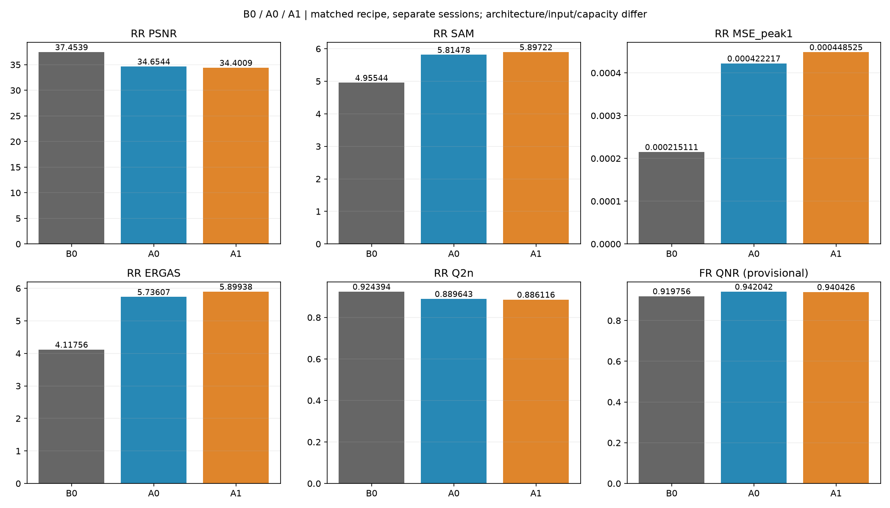
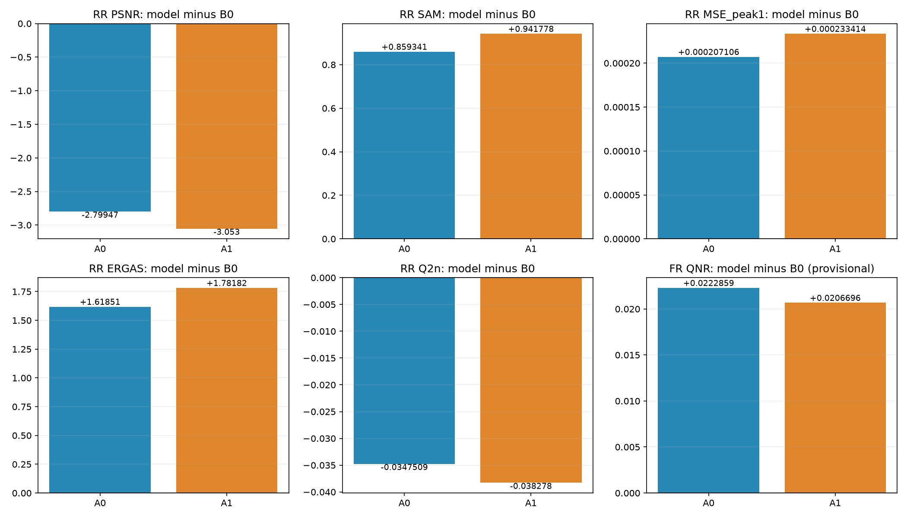
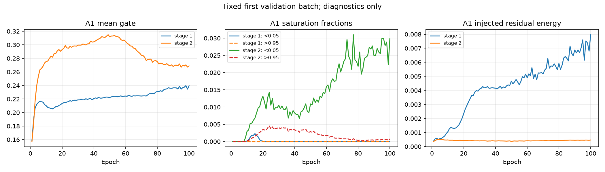

# QB · 단계적 Haar 복원 A0/A1 · Kaggle 결과

[실험 목록](../../README.md#experiments) · [수치](#results) · [그래프](#graphs) · [이미지](#images) · [가중치](#evidence)

| 비교 기준 | 이번에 바꾼 점 | 관측된 차이 | 판단 |
|---|---|---|---|
| 같은 nominal recipe의 기존 Kaggle B0 복구 SSA-MRN K6 | HR 중심 SSA 경로를 원본 LR MS 중심 두 단계 Haar 복원으로 교체; A0 gate=1, A1 밴드·방향·위치 gate | A0/B0 RR PSNR −2.799468 dB·SAM +0.859341°; A1/A0 PSNR −0.253529 dB·SAM +0.082437°. 잠정 FR QNR은 A0/B0 +0.022286 | RR가 크게 악화해 현재 구조 채택 보류. A1 gate의 추가 이득 없음; FR 상승만으로 개선 판단하지 않음 |

## 1. 목적과 상태

**A0·A1 각각 100에폭 학습, RR 20장·FR 20장 전체 평가 완료.** 2026-10-09 06:28 KST부터 다운로드한 산출물의 검증·보관을 진행했다. Kaggle 라이브 서버 조회, 로컬 재학습 또는 원본 H5로 재추론한 결과가 아니다.

PAN 세부정보를 HR 특징 전체에 처음부터 섞는 대신 MS 분광 경로를 유지하면서 ×2씩 복원하고 필요한 고주파를 주입하는 가설을 검토했다. A0은 주입 gate=1, A1은 밴드×Haar 방향×위치별 sigmoid gate다. 실행은 `A0_QB_s42`(GPU0), `A1_QB_s42`(GPU1)로 병렬 진행했다.

[재현 Python 셀](../../scripts/kaggle_a0_a1_one_cell.py) · [한 셀 노트북](../../notebooks/kaggle_a0_a1_one_cell.ipynb) · [실제 실행 model/worker/metric snapshot](../assets/kaggle_wavelet_a0_a1/code/). 다운로드 snapshot과 재현 셀의 모델·worker 문자열이 정확히 일치한다. 현재 로컬 셀과 snapshot 사이에서 A0의 `1×잔차`를 직접 잔차로 사용하는 표현 차이가 확인돼 **실제 실행 snapshot을 기준으로 셀을 보관**했다. 연구 구조·결과를 사후 변경하지 않았다. metric 기준 commit은 `be02b7cbf03fe00681194ae9fc9419661f24cd56`이며 새 모델은 공식 SSA-MRN 구조가 아니다. 모델/worker는 파일 SHA256으로 식별하고 이 보고서·재현 코드·결과를 같은 Git 커밋에 보관한다. Kaggle Notebook Version ID와 정확한 실행 시작/종료 시각은 제공되지 않아 미기록이다.

## 2. 변경 사항과 평가 조건

| 항목 | 실제 조건 |
|---|---|
| 입력·분할 | QB 4밴드 MS·1밴드 PAN, NCHW DN/2047; train 17,139 / validation 1,905패치 |
| 학습 크기 | MS 16×16 → 중간 32×32 → HR GT 64×64; PAN 64×64 |
| RR / FR | 각각 별도 H5 20장 전체; RR HR256/LR64, FR HR512/LR128 |
| A0 / A1 | 공통 두 단계 복원; A0 gate=1, A1 stage별 128→12 1×1 Conv+sigmoid |
| 분광·주파수 경로 | 각 단계 MS encoder → 학습 LL·MS 고주파; PAN 고정 Haar pyramid → 공동 조건 잔차; IWT로 ×2 |
| LL | `2×현재 MS + learned low head`; 관측 MS를 GT LL이라고 가정하지 않음 |
| 초기화 | PAN residual head=0, LL residual head=0; A1 gate weight=0/bias=−2; MS high head는 일반 초기화 |
| 용량 | width64, MS residual blocks3/stage; A0 927,928 / A1 931,024 parameters; gate 추가 3,096(+0.334%) |
| 학습 | final HR MSE, Adam foreach LR1e−4·betas(0.9,0.999)·eps1e−8·weight decay0; scheduler 없음; 100에폭·seed42·batch=micro32 |
| 실행 | Tesla T4×2, PyTorch2.11.0+cu128·CUDA12.8·Python3.13.15; AMP FP16/GradScaler·channels-last·deterministic=True·TF32=False·compile=False |
| 데이터 공급 | PAN/MS/GT train·val FP32 GPU 상주; 기존 CPU randperm 순서를 전 에폭 미리 생성·GPU 적재; 배치 GPU index_select |
| 선택·평가 | 최소 FP32 validation MSE의 best; 두 모델 best/latest epoch100; FP32 whole scene, 출력 clipping 없음 |
| 정합·마스크·증강 | 제공 H5 그대로; 추가 정합·crop·mask·augmentation·관측 보정·보조 손실 없음 |
| 입력 경로 차이 | B0는 제공 LMS+PAN+MS; A는 원본 MS+PAN. LMS는 A 학습 입력에 없고 FR metric 참조에만 사용 |

[데이터 SHA256·shape](../assets/kaggle_wavelet_a0_a1/data_manifest.json) · [실행 환경](../assets/kaggle_wavelet_a0_a1/environment.json) · [검증 근거](../assets/kaggle_wavelet_a0_a1/verification.json).

**변인통제 범위:** A0/A1의 공통 가중치 초기화 SHA256과 100에폭 실제 순서가 일치한다. 원 실행의 [baseline_control.json](../assets/kaggle_wavelet_a0_a1/baseline_control.json)은 B0 미검증 상태이며 이를 유지했다. 이번 보관 때 이미 Git에 있는 [Kaggle B0](../assets/kaggle_band_gated_hf/results.json)의 train/val/RR/FR 해시·shape, nominal 학습 조건, 환경, metric 소스와 실제 배치 순서, checkpoint 내부 config·history·epoch·optimizer를 **사후 대조**했다. 실행 전에 B0 검증이 끝났거나 B0를 이번에 재학습했다고 표시하지 않는다.

53,600 nominal batch 중 실제 Adam 업데이트는 **B0 53,585 / A0 53,588 / A1 53,586**이다. AMP GradScaler의 skip 수가 15/12/14로 달라 realized update count가 완전히 같은 실험이 아니며 bitwise parity도 아니다. validation batch를 FP32로 계산하는 규약은 같지만 누적 구현은 새 worker다. 따라서 **같은 nominal recipe·별도 세션·구조/입력/용량 차이**의 관측 비교다. 다른 구조인 B0와 초기 가중치·계산량이 같다고 주장하지 않는다.

## 3. 정량 결과

전체 20장마다 장면별 지표를 계산한 산술평균이다. RR PSNR은 각 밴드 peak2047 PSNR을 평균한 장면 값의 평균, SAM은 각 장면 유효 픽셀의 도 단위 평균, MSE는 DN2047 정규화 원소 MSE다. validation PSNR은 peak1 밴드 평균이며 RR test 수치와 구분한다.

| 모델 | Best epoch | Best val MSE | RR PSNR dB ↑ | RR SAM ° ↓ | RR MSE peak1 ↓ | ERGAS ↓ | SCC ↑ | Q2n/Q4 ↑ |
|---|---:|---:|---:|---:|---:|---:|---:|---:|
| B0 복구 SSA-MRN K6 | 100 | 0.000173089051 | 37.453879 | 4.955443 | 0.000215111127 | 4.117561 | 0.977016 | 0.924394 |
| A0 고정 gate | 100 | 0.000261464855 | 34.654411 | 5.814784 | 0.000422216963 | 5.736073 | 0.950825 | 0.889643 |
| A1 학습 gate | 100 | 0.000275191967 | 34.400882 | 5.897221 | 0.000448525178 | 5.899378 | 0.947986 | 0.886116 |

| 모델 | FR Dλ ↓ | FR Ds ↓ | FR QNR ↑ · 잠정 |
|---|---:|---:|---:|
| B0 복구 SSA-MRN K6 | 0.041631 | 0.040765 | 0.919756 |
| A0 고정 gate | 0.022586 | 0.036485 | 0.942042 |
| A1 학습 gate | 0.024911 | 0.035979 | 0.940426 |

| 비교 | ΔPSNR dB | ΔSAM ° | ΔMSE peak1 | ΔQNR · 잠정 |
|---|---:|---:|---:|---:|
| A0 − B0 | -2.799468 | +0.859341 | +2.071058360e-04 | +0.022286 |
| A1 − B0 | -3.052997 | +0.941778 | +2.334140506e-04 | +0.020670 |
| A1 − A0 | -0.253529 | +0.082437 | +2.630821468e-05 | -0.001616 |

A0/B0의 RR MSE는 **96.28%**, A1/B0는 **108.51%** 증가했다. A1/A0는 **6.23%** 증가했다. RR 지표는 모든 핵심 평균에서 악화했지만 FR Dλ·Ds·QNR은 B0 대비 개선됐다. FR은 GT가 없고 metric MATLAB 정합성이 미검증이므로 HR 정답 정확도 개선을 의미하지 않는다.

[원 실행 전체 지표](../assets/kaggle_wavelet_a0_a1/results.json) · [A0/A1 paired 비교](../assets/kaggle_wavelet_a0_a1/paired_comparison.json) · [사후 B0/직전 후보 비교](../assets/kaggle_wavelet_a0_a1/posthoc_comparison.json). 원 실행 JSON의 B0 미검증 기록은 수정하지 않았다.

실측 train+validation 누적은 A0 **19.01분**, A1 **19.16분**이다. checkpoint·cache·preflight·test·ZIP 시간은 제외되며 전체 세션 시간이 아니다. 두 프로세스가 병렬이므로 합해 총 경과 시간으로 표시하지 않는다. 저장된 peak PyTorch allocation은 약1.70GiB로 GPU 전체 사용률이나 전체 VRAM 사용량을 뜻하지 않는다. 작은 새 구조와 B0의 실행 시간을 최적화 효과로 분리해 주장하지 않는다.

## 4. 직전 연구와 수치 차이

직전 구조 후보는 [QB 밴드별 gate 고주파](kaggle_band_gated_hf.md)의 `band_gated_hf`다. 같은 QB 파일·seed·nominal recipe이지만 **전체 구조·MS/LMS 입력 경로·모수 용량·별도 실행 세션이 다르므로 gate 하나의 효과 비교가 아니다.** 이번 A0/A1의 gate ablation은 3절의 A1−A0에 한정한다.

| 현재 모델 | 지표 | 직전 band_gated_hf | 현재 | 관측 차이 |
|---|---|---:|---:|---:|
| A0 | RR PSNR dB | 37.278888 | 34.654411 | -2.62447644 |
| A0 | RR SAM ° | 4.964272 | 5.814784 | +0.850512 |
| A0 | RR MSE peak1 | 0.000222832780 | 0.000422216963 | +0.000199384183 |
| A1 | RR PSNR dB | 37.278888 | 34.400882 | -2.87800556 |
| A1 | RR SAM ° | 4.964272 | 5.897221 | +0.932949031 |
| A1 | RR MSE peak1 | 0.000222832780 | 0.000448525178 | +0.000225692397 |

원 논문의 출판 표 숫자를 동일 조건 대조군으로 쓰지 않았다. B0는 Git에 보존된 복구 SSA-MRN K6 재현 결과이며 공개 attention/논문 설명 차이와 metric parity 제한이 남아 있다.

## 5. 그래프

100에폭 실측 곡선이다. best가 마지막100에폭이며 두 validation MSE가 계속 감소하는 추세여서 이 학습량만으로 수렴을 단정하지 않는다.

사후 검증한 B0와 A0/A1의 전체 RR/FR 평균 및 차이다. 별도 세션·구조/입력/용량 차이와 realized AMP update 차이를 함께 해석한다.

진단은 **첫 고정 validation batch**에 한정된다. A1 마지막 gate 평균은 coarse stage **0.23946**, fine stage **0.26893**이다. gate<0.05 비율은0%/2.984%, gate>0.95는0%/0.0745%로, 전체 gate가0 또는1에 포화됐다고 볼 근거가 없다. raw residual head가 보상할 수 있으므로 gate 값만으로 PAN 기여를 판단하지 않는다. 실제 주입 에너지는 coarse에서 A1 **0.007967** 대 A0 **0.004669**, fine에서 A1 **0.000466** 대 A0 **0.000668**다. 작은 gate가 무조건 주입 에너지 감소나 좋은 성능을 뜻하지 않는다.

## 6. 결과 이미지 예시

수치 평가 전에 seed42로 고정한 서로 다른 RR scene row **1·8·11·13·19**를 오름차순으로 보존한다. tile은 whole scene이다. [selection.json](../assets/kaggle_wavelet_a0_a1/selection.json)에 seed·scene·tile·순서가 있다.

모든 이미지는 **LR MS · PAN · 예측 · GT** 4패널이다. RGB0-based[2,1,0] 가정, 같은 장면 GT의1–99 percentile을 모든 MS 패널에 공통 적용하고 LR만 최근접 확대한다. PAN은 별도 grayscale 범위다. baseline은 수치 비교에 남기고 이 새 구조의 패널에 추가하지 않는다. FR에는 GT가 없다.

### A0_QB_s42

나머지 고정 4장면

### A1_QB_s42

나머지 고정 4장면

## 7. 가중치와 검증 근거

**실제 best/latest 원본4개와 RR/FR 다중밴드 예측80개를 이 브랜치의 Git 커밋에 포함**한다. checkpoint 내부 config·optimizer·scaler·RNG·history는 원본 그대로다. `.pt`·`.npz` ignore를 정확한 파일 경로로만 override해 stage하며 입력 H5·불필요 cache·로그·ZIP 중복본은 추가하지 않는다.

| 가중치 | Epoch | 보관 | SHA256 |
|---|---:|---|---|
| A0_QB_s42 best | 100 | [원본 .pt](../assets/kaggle_wavelet_a0_a1/runs/A0_QB_s42/best.pt) | `18fd2fa335fa5583311090ce864bcc9c08fee024f0f4ac93c1554fa6849e5304` |
| A0_QB_s42 latest | 100 | [원본 .pt](../assets/kaggle_wavelet_a0_a1/runs/A0_QB_s42/latest.pt) | `5ec6f4574fdd417f1a65d0fbd5c33dd58d4e0efe56b35cc76ca05c94d0d241e3` |
| A1_QB_s42 best | 100 | [원본 .pt](../assets/kaggle_wavelet_a0_a1/runs/A1_QB_s42/best.pt) | `3a28902fb93999f478565c0c7b252944d43acb1ac1c09f59e195b7c71a9cf604` |
| A1_QB_s42 latest | 100 | [원본 .pt](../assets/kaggle_wavelet_a0_a1/runs/A1_QB_s42/latest.pt) | `2233584a91d17ff008362b902ffc34bbec7274be80cbf7ee86509aa6d6c53088` |

- [원본 artifact manifest](../assets/kaggle_wavelet_a0_a1/artifact_manifest.json): 원 실행324개 산출물의 byte size·SHA256 전부 대조.
- [검증 결과](../assets/kaggle_wavelet_a0_a1/verification.json): torch.save ZIP CRC·제한된 tensor decoder로 내부 epoch/config/history, 유한 model/optimizer/RNG tensor,20+20개 지표·80개 예측·10개 패널·200개 gate 기록을 확인. 모델 forward 재실행 검증은 아니다.
- [보관 manifest](../assets/kaggle_wavelet_a0_a1/repository_manifest.json): 원 실행 snapshot와 보관 때 추가한 비교·compact CSV·검증 산출물을 구분하고 저장된 파일 해시를 기록.
- [A0 compact curves](../assets/kaggle_wavelet_a0_a1/runs/A0_QB_s42/curves.csv) · [A1 compact curves](../assets/kaggle_wavelet_a0_a1/runs/A1_QB_s42/curves.csv): 실측100에폭.
- [A0 gate compact](../assets/kaggle_wavelet_a0_a1/runs/A0_QB_s42/gate_compact.csv) · [A1 gate compact](../assets/kaggle_wavelet_a0_a1/runs/A1_QB_s42/gate_compact.csv): epoch/stage 요약. 전체 밴드·방향값은 원본 gate JSON에 보존.
- [A0 predictions](../assets/kaggle_wavelet_a0_a1/runs/A0_QB_s42/predictions/) · [A1 predictions](../assets/kaggle_wavelet_a0_a1/runs/A1_QB_s42/predictions/): 전체20 RR+20 FR.
- [검증 코드](../../scripts/verify_wavelet_archive.py) · [그래프/요약 코드](../../scripts/summarize_wavelet_results.py) · [실행 안내](../operations/kaggle_a0_a1.md).

원본 다운로드 폴더·ZIP·기존 학습 폴더는 삭제하지 않았다. 원 데이터는 별도 Kaggle H5이며 파일 해시로 식별한다. GPU 이용률 시계열·전체 세션 wall time·Kaggle 버전ID·실행 code git commit은 원본에 없어 만들지 않았다.

## 8. 한계와 다음 판단

현재100에폭·seed42에서 **A0/A1 모두 B0보다 RR가 크게 악화하고 A1이 A0보다 추가로 악화**했다. 현재 구현은 채택 보류다. 잠정 FR QNR 상승은 RR 저하를 상쇄하는 종합 개선 증거가 아니며 실제 HR 정확도를 검증하지 않는다.

단일 시드, 이미 선행 구조 탐색에 사용한 QB test, 신규 MS 중심 경로와 용량 변화, AMP의 서로 다른 realized updates, validation 감소 추세, FR/Q2n/SCC MATLAB parity 미검증이 제한이다. 원인 후보는 초기 MS high head·LL 설계·복원 경로·학습량 등이며 이 결과로 어느 하나를 원인으로 확정할 수 없다. A2(PAN 제거 후 재학습)와 동일 용량 MS 대조군을 아직 실행하지 않아 PAN의 순기여도 확정할 수 없다.

후속은 독립 validation 기준으로 MS 경로·초기화·학습 예산을 점검하고, 새 seed·다른 센서에서 반증한다. FP32 대조 또는 실제 업데이트 수 기록을 추가하면 AMP 차이를 더 명확히 통제할 수 있다. 이번 정리는 기존 완료 결과의 검증·보관이며 새 학습이나 이전 실행 폴더 삭제를 수행하지 않았다.
