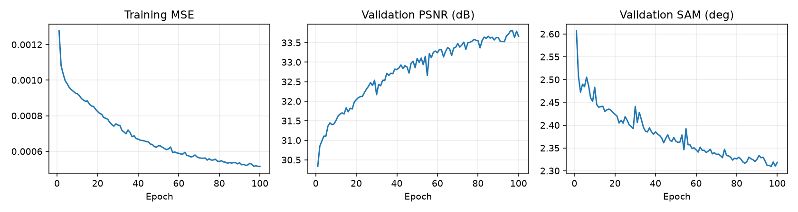
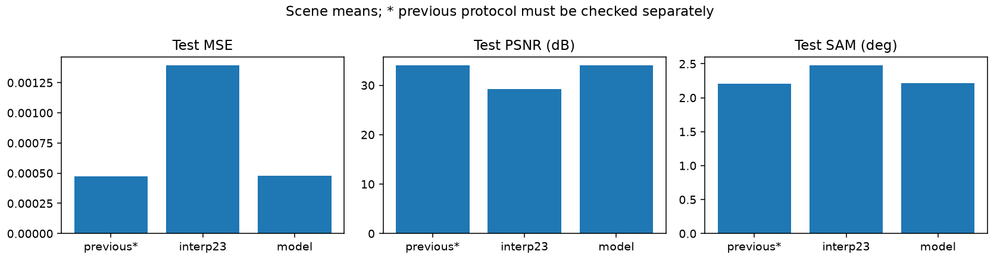
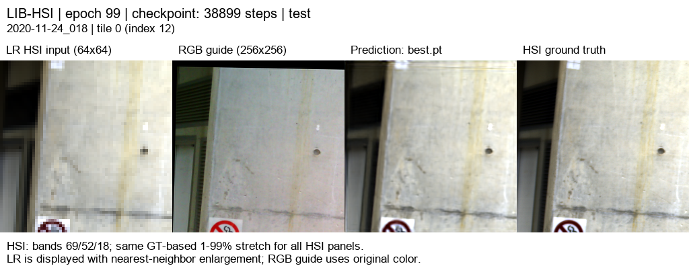
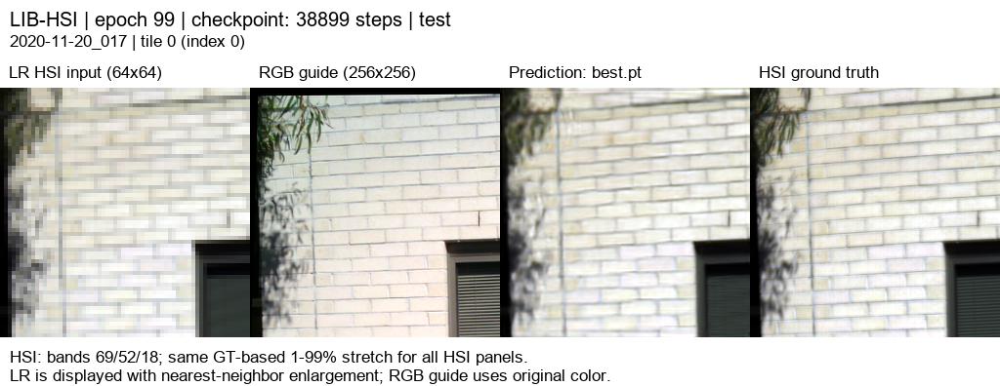
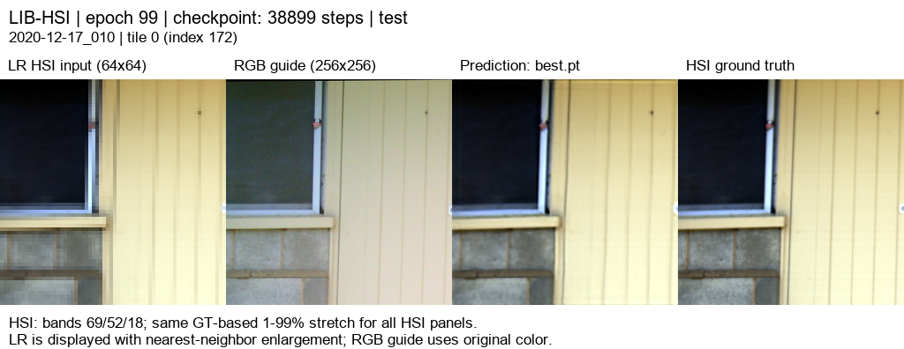
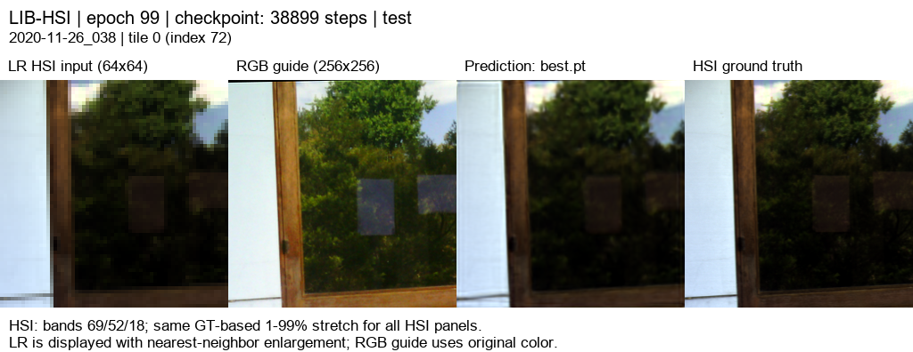
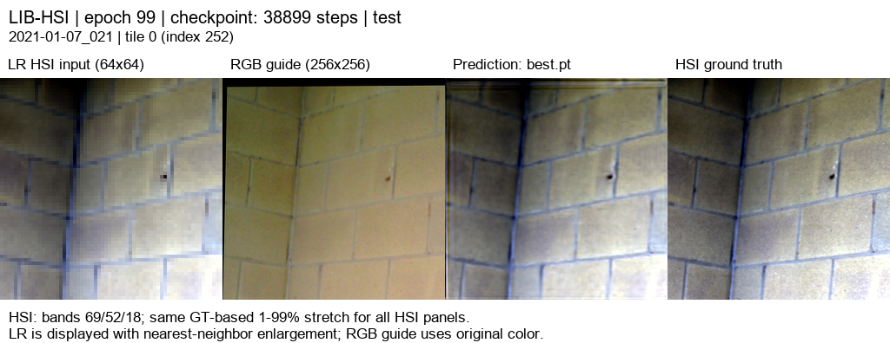

# RGB 06 · RGB별 17특징 23탭 타일

[이전 실험 목록](../previous_experiments.md) · [현재 연구](../../README.md)

## 1. 목적과 상태

완료: 100/100 epoch. validation 기준 best checkpoint를 전체 test 75장면에 평가했습니다.

RGB04의 구조를 기준으로 latent feature 수만 12 → 17로 변경하여,
17특징 구성이 12특징 대비 더 나은 RGB 유도 HSI 복원 성능을 보이는지 검증했습니다.

이번 실험은 feature 수 자체의 영향을 확인하기 위한 통제 실험입니다.
K, resampling, loss, 데이터 분할, 학습 및 평가 조건은 RGB04와 동일하게 유지했습니다.

## 2. 선행연구 근거

본 실험의 17특징 설정은 HYDRA의 latent-size ablation 결과를 참고했습니다.

HYDRA는 RGB 입력을 직접 고차원 HSI로 복원하는 대신,
Teacher가 HSI를 저차원 latent space로 압축하고
Student가 RGB에서 해당 latent representation을 예측하도록 학습합니다.

특히 HYDRA의 ablation study에서는
LIB-HSI의 latent size를 13, 17, 34로 비교했으며,
최종 refinement 단계에서 latent size 17이 가장 좋은 성능을 기록했습니다.

| LIB-HSI latent size | MRAE ↓ | RMSE ↓ | PSNR dB ↑ |
|---:|---:|---:|---:|
| 13 | 0.4211 | 0.0120 | 39.64 |
| **17** | **0.3004** | **0.0091** | **42.24** |
| 34 | 0.3201 | 0.0125 | 41.84 |

HYDRA 저자들은 latent size가 성능에 영향을 주며,
HySpecNet-11k와 LIB-HSI에서는 17이 가장 좋은 설정이었다고 보고했습니다.

다만 HYDRA는 Teacher–Student 기반 spectral reconstruction 구조이고,
본 연구는 LR HSI + HR RGB를 이용하는 SSA-MRN 기반 공간 초해상도 구조이므로
17이라는 latent size가 동일하게 최적일 것이라고 가정할 수는 없습니다.

따라서 본 실험에서는 HYDRA의 결과를 직접 적용하는 것이 아니라,
SSA-MRN 구조에서도 17특징이 유효한지 별도로 검증했습니다.

## 3. 변경 사항과 평가 조건

### RGB04 대비 변경 사항

- latent feature: 12 → 17
- 204밴드 → 17특징 grouped 압축
- 특징 1개당 담당 밴드 수: 17밴드 → 12밴드

### 동일하게 유지한 조건

- K=4
- R/G/B 각각 독립 core
- 3개 decoder
- 밴드별 학습 fusion
- 내부 평균 축소 / 23tap 확대
- HSI 합성 축소: area ×4
- loss: MSE
- HR patch: 256×256
- LR HSI: 64×64
- train layout: quadrants
- eval layout: tiles
- seed: 42
- 동일 alignment manifest 및 valid mask
- LIB-HSI train / validation / test = 393 / 45 / 75 장면

### RGB04와 RGB06의 특징 분할 차이

RGB04:

204 bands → 12 features  
204 / 12 = 17 bands per feature

RGB06:

204 bands → 17 features  
204 / 17 = 12 bands per feature

즉 RGB06은 RGB04보다 latent feature 수를 늘려
각 feature가 담당하는 spectral band 범위를 더 좁게 나눕니다.

- RGB04: 특징 수는 적지만 각 특징이 더 넓은 분광 범위를 요약
- RGB06: 특징 수는 많고 각 특징이 더 좁은 분광 범위를 표현
- RGB06은 더 세분화된 spectral representation을 가지지만,
  그 자체가 성능 향상을 보장하지는 않음

## 4. 정량 결과

| 방법 | 특징 수 | 밴드/특징 | MSE ↓ | PSNR dB ↑ | SAM ° ↓ |
|---|---:|---:|---:|---:|---:|
| 23tap baseline | - | - | 0.0013944695 | 29.2259 | 2.4790 |
| RGB04 | 12 | 17 | 0.0004733597 | 34.0530 | 2.2057 |
| RGB06 | 17 | 12 | 0.0004804674 | 33.9817 | 2.2156 |

## 5. RGB04 대비 변화

| 지표 | RGB04 · 12특징 | RGB06 · 17특징 | 변화량 | 결과 |
|---|---:|---:|---:|---|
| MSE ↓ | 0.0004733597 | 0.0004804674 | +0.0000071077 | 소폭 악화 |
| PSNR dB ↑ | 34.0530 | 33.9817 | -0.0713 dB | 소폭 악화 |
| SAM ° ↓ | 2.2057 | 2.2156 | +0.0099° | 소폭 악화 |

선행연구 HYDRA에서는 LIB-HSI와 HySpecNet-11k에서
latent size 17이 더 좋은 spectral reconstruction 성능을 보였습니다.

이에 따라 SSA-MRN에서도 feature 수를 12에서 17로 늘렸지만,
본 실험에서는 RGB04의 12특징 모델보다 성능이 소폭 감소했습니다.

- PSNR: 약 0.0713 dB 감소
- SAM: 약 0.0099° 증가
- MSE: 약 0.00000711 증가

따라서 HYDRA에서 관찰된 latent size 17의 이점이
SSA-MRN 구조에 그대로 일반화되지는 않았습니다.

가능한 이유는 두 구조의 latent representation 방식과 학습 목적이 다르기 때문입니다.

HYDRA는 비선형 autoencoder 기반 latent space를 Teacher가 먼저 학습한 뒤
Student가 RGB를 그 latent space에 매핑하는 구조입니다.

반면 본 RGB06은 RGB04의 grouped spectral compression 구조에서
feature 수만 12 → 17로 변경한 방식입니다.

즉 동일한 숫자 17을 사용하더라도
latent space의 의미와 학습 방식은 서로 다릅니다.

## 6. 그래프

[100 epoch 수치](../../experiments/results/rgb06_triple17/curves.json)

test 결과는 best checkpoint 선택에 사용하지 않았습니다.

## 7. 결과 이미지 예시

사전에 고정된 서로 다른 test 5장면의 tile 0을 사용했습니다.
왼쪽부터 **LR HSI · RGB guide · 예측 · 정답**입니다.

[장면 선택 기록](../../experiments/results/rgb06_triple17/selection.json)

### 예시 1

### 예시 2

### 예시 3

### 예시 4

### 예시 5

[204밴드 뷰어](../assets/rgb06_triple17/band_viewer/index.html)

## 8. 가중치와 검증 근거

- [전체 test 수치](../../experiments/results/rgb06_triple17/test/metrics.json)
- [100 epoch compact curves](../../experiments/results/rgb06_triple17/curves.json)
- [장면 선택 기록](../../experiments/results/rgb06_triple17/selection.json)
- [평가 조건 및 체크포인트 정보](../../experiments/results/rgb06_triple17/report_manifest.json)

100 epoch 학습 후 validation 기준 best checkpoint를 사용하여
전체 test 75장면을 평가했습니다.

최종 test 결과:

- model_mse = 0.00048046737347770215
- model_psnr_db = 33.98166623675857
- model_sam_deg = 2.2155550078127657
- interp23_mse = 0.0013944694617427232
- interp23_psnr_db = 29.225854156323553
- interp23_sam_deg = 2.479011763972004

## 9. 한계와 다음 판단

이번 실험은 RGB04의 구조에서 latent feature 수만
12 → 17로 변경한 단일 seed 비교입니다.

HYDRA에서는 LIB-HSI에서 latent size 17이 더 좋은 결과를 보였지만,
본 SSA-MRN 구조에서는 17특징 모델이 RGB04의 12특징 모델보다
PSNR과 SAM 모두 소폭 낮았습니다.

따라서 현재 조건에서는 12특징 구성을 기준으로 유지합니다.

다만 두 구조의 latent representation 방식이 다르므로
HYDRA의 latent-size 결과와 본 실험을 직접적으로 동일한 현상으로 해석하지 않습니다.