# Windows K4 손실 탐색 · QB 완료 결과

[실험 목록](../../README.md#experiments) · [수치](#results) · [그래프](#graphs) · [이미지](#images) · [가중치](#evidence)

| 비교 기준 | 이번에 바꾼 점 | 관측된 차이 | 판단 |
|---|---|---|---|
| 같은 Windows QB K4·시드42·100에폭 기준선 | MSE + 0.1 × edge 손실 | validation MSE 소폭 감소, RR PSNR·MSE 악화, SAM·잠정 FR QNR 개선 | 지표 혼재로 종합 채택 보류, K4 기준선 유지 |

## 1. 목적과 상태

**전체 계획 940에폭 완료**, 마지막 학습 종료는 **2026-10-10 05:28:35 KST**입니다. K4/K6 기준선 6개 × 100에폭, 손실 후보 9개 × 30에폭, 선택 후보 추가70에폭을 모두 확인했습니다. 08:23 확인 시 컨트롤러는 `finished`, 학습 Python 프로세스는 없었습니다.

별도 WMI 평가 프로세스에서 QB K4 기준선·최종 후보의 **RR20장·FR20장 전체**를 각각 평가했고, 08:26:52 KST 종료를 확인했습니다. 원본 best/latest20개, 실제 학습 이력·코드·선택 근거·전체 지표·고정 장면 이미지를 함께 보관합니다. **GF2·WV3와 K6 기준선의 test 평가는 이번 범위에 포함하지 않았습니다.**

## 2. 변경 사항과 평가 조건

| 항목 | 조건 |
|---|---|
| 모델·장치 | SSA-MRN 복원 코드, K4, PAN1밴드·QB MS4밴드, RTX3060 Ti8GB, CUDA FP32·결정론 |
| 데이터 | 기존 QB train/validation H5, 정규화 peak2047, 제공 LMS 유지; 학습 패치64×64 |
| 학습 | seed42, Adam lr=1e-4, effective batch32, micro batch4, 모든 후보 동일 조건 |
| 선별 | 기본 GT MSE에 spectral / consistency / edge 중 하나 추가, 계수0.001 / 0.01 / 0.1 |
| 최종 후보 | 30에폭 내 best validation MSE 최소 후보 하나; latest의 model·Adam·CPU/CUDA/DataLoader RNG로 추가70에폭 |
| test 가중치 | validation으로 선택한 best; 기준선·edge 최종 모두98에폭, latest100에폭은 평가 선택에 사용하지 않음 |
| RR·FR | QB 제공 H5 전체 각20장, 전체 장면 추론·평가, 타일 분할·추론 crop 없음 |
| 장면 예시 | seed42, RR index1·8·11·13·19, test 추론·지표 관측 전에 고정 |

기본 MSE는 전체 패치에 적용합니다. spectral은 픽셀별 밴드 벡터의 `1−cosine similarity`, edge는 수직·수평 인접 픽셀 차분의 GT 대비 MSE 합입니다. **활성화함수는 바꾸지 않았습니다.**

consistency는 [QB 관측 검증](observation_validation.md)의 공식 MATLAB MTF 대응 프로파일을 사용합니다. train17139패치별 뒤집기 위상을 고정하고 LR 경계5픽셀을 제외합니다. 프로파일 SHA-256은 `76f6169d85a210a47cd19452035e2c274e7a975683f699f9982a9ecf65f92f6b`입니다. 관측 RMSE 약2.24e-13DN은 연산 구현 검증값이며 성능 개선량이 아닙니다.

K4는 [3센서 K4/K6 통제 비교](windows_k_baselines.md)의 validation 다수결2:1로 선택했습니다. 손실·계수·best epoch도 **validation으로만 선택**했고 이번 test 관측으로 선택을 바꾸지 않았습니다. 정답이 있는 축소 해상도를 RR, 고해상도 정답 없이 왜곡 지표로 평가하는 원래 해상도를 FR로 구분합니다.

## 3. 정량 결과

### 30에폭 손실 선별 · validation

같은 QB K4 기준선의 **첫30에폭 내 best MSE**는 0.000211557418입니다. 후보를 100에폭 기준선과 바로 비교하지 않습니다. 모든 선별 후보의 best는30에폭이므로 더 오래 학습했을 때 후보 순위가 달라질 가능성은 남습니다.

| 손실 | 계수 | best / 완료 에폭 | best validation MSE ↓ | 기준선30 대비 차이 |
|---|---:|---:|---:|---:|
| spectral | 0.001 | 30 / 30 | 0.000217158374 | +5.600955921e-06 |
| spectral | 0.01 | 30 / 30 | 0.000221974931 | +1.041751277e-05 |
| spectral | 0.1 | 30 / 30 | 0.000240032138 | +2.847471974e-05 |
| consistency | 0.001 | 30 / 30 | 0.000214979357 | +3.421938736e-06 |
| consistency | 0.01 | 30 / 30 | 0.000215695702 | +4.138283881e-06 |
| consistency | 0.1 | 30 / 30 | 0.000214237029 | +2.679611028e-06 |
| edge | 0.001 | 30 / 30 | 0.000215292836 | +3.735418477e-06 |
| edge | 0.01 | 30 / 30 | 0.000211552381 | -5.037048062e-09 |
| edge | 0.1 | 30 / 30 | 0.000211332375 | -2.250426114e-07 |

**edge0.1**이 후보9개 중 가장 낮아 연장 학습 대상으로 선택됐습니다. 기준선30 대비 약0.106% 감소이며 매우 작은 차이입니다. [컨트롤러 선별 원본](../assets/windows_losses/screening_selection.json)

### 동일100에폭 학습량 · validation

| 모델 | best / 완료 에폭 | best validation MSE ↓ | 기준선 대비 |
|---|---:|---:|---:|
| QB K4 기본 MSE | 98 / 100 | 0.000171861819 | — |
| QB K4 MSE + edge0.1 | 98 / 100 | 0.000171472949 | -3.888700591e-07 (-0.226%) |

### 전체 QB test · RR20장 / FR20장

아래는 모델마다 동일20장을 평가한 **장면별 지표의 산술평균**입니다. RR PSNR은 peak2047에서 밴드별 PSNR 평균을 사용하며 global MSE에서 계산한 PSNR과 다릅니다. MSE_peak1은2047로 정규화한 값입니다.

| 지표 | K4 기준선 | K4 + edge0.1 | 후보−기준선 |
|---|---:|---:|---:|
| RR PSNR ↑ | 37.4577403869 | 37.3916829026 | -0.0660574843 |
| RR SAM ↓ | 4.95544885127 | 4.94359235477 | -0.0118564965 |
| RR ERGAS ↓ | 4.11206300344 | 4.14413443017 | +0.0320714267 |
| RR SCC ↑ | 0.976999643109 | 0.976501270389 | -0.00049837272 |
| RR Q2n ↑ | 0.92300077616 | 0.921804308559 | -0.0011964676 |
| RR MSE_peak1 ↓ | 0.000213909186449 | 0.000217485407118 | +3.57622067e-06 |
| FR D_lambda ↓ | 0.0526745319555 | 0.0459665941598 | -0.0067079378 |
| FR D_s ↓ | 0.0453759906594 | 0.0419234839949 | -0.00345250666 |
| FR QNR ↑ | 0.90458869202 | 0.914416808138 | +0.00982811612 |

PSNR·MSE·ERGAS·SCC·Q2n은 악화했고 SAM은 소폭 개선됐습니다. FR Dλ·Ds는 감소하고 QNR은 증가했습니다. **FR는 MATLAB PAN resize 일치성이 미검증인 잠정값이며, 고해상도 정답 정확도의 직접 증거가 아닙니다.** 전체 장면별 원본·데이터 H5 해시·형상은 [metrics.json](../assets/windows_losses/metrics.json)에 있습니다.

## 4. 직전 연구와 수치 차이

같은 서버·QB·K4·seed42·100에폭의 자체 기준선 대비 **RR PSNR −0.066057dB, SAM −0.011856°, MSE +3.576221e-6**, **잠정 FR QNR +0.009828**입니다. validation MSE의 약0.226% 개선이 RR test 정확도 개선으로 이어지지 않았습니다.

따라서 edge0.1을 전반적 개선 손실로 확정하지 않습니다. 비교 기준은 K4 기본 MSE 모델을 유지하고, edge0.1은 SAM·FR 개선과 RR 정확도 악화의 절충 후보로 보관합니다. Linux K6 구조 개선과 서버·설정이 다르므로 수치를 합쳐 구조+손실 효과로 해석하지 않습니다.

## 5. 그래프

원본 학습·validation MSE와 **MSE에서 유도한 global validation PSNR**입니다. 유도 PSNR은 실제 밴드별 PSNR 측정값과 구분합니다. 매에폭 validation SAM을 기록하지 않았으므로 SAM 곡선을 만들지 않았습니다. 최종 후보 이력은 선별1~30과 이어 학습31~100을 합쳤고 중복 에폭을 제외했습니다.

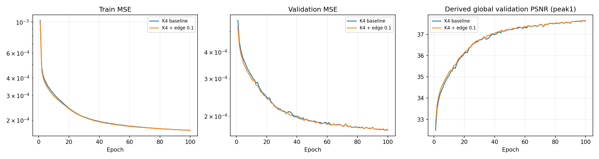

점선은 같은 기준선의 첫30에폭 best입니다.

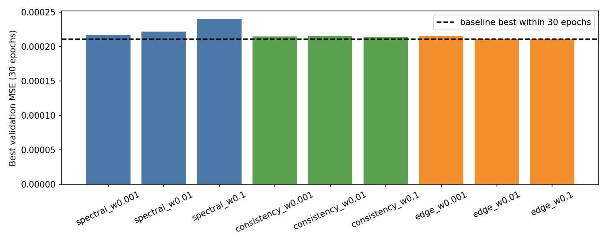

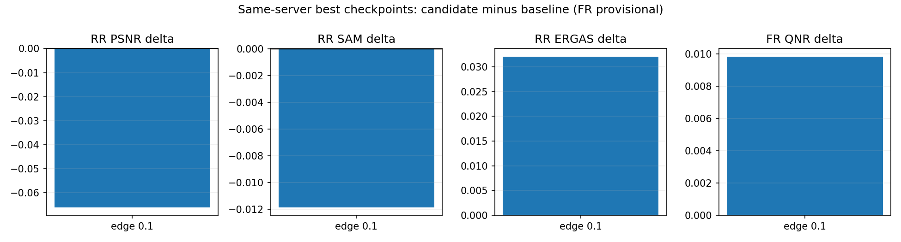

## 6. 결과 이미지 예시

고정 RR index1·8·11·13·19의 전체 장면입니다. 왼쪽부터 **LR MS · PAN · 예측 · GT**이며 LR은 최근접 확대, MS 패널은 GT의 밴드별1~99백분위 공통 대비입니다. 시각화용 RGB는0기준 밴드2·1·0이고 추론은 모든4밴드입니다. 원래 획득 장면 ID는 제공되지 않아 H5 index로 기록했습니다. FR에는 GT를 생성하지 않았습니다.

**장면1 · 기준선**

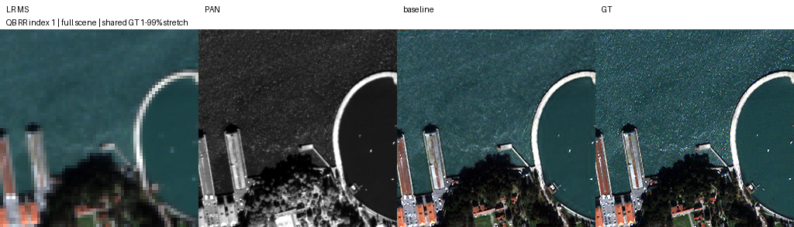

**장면1 · edge0.1**

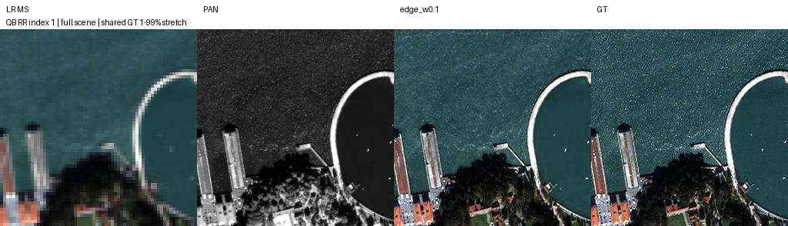

고정 RR 장면8 · 기준선과 edge0.1

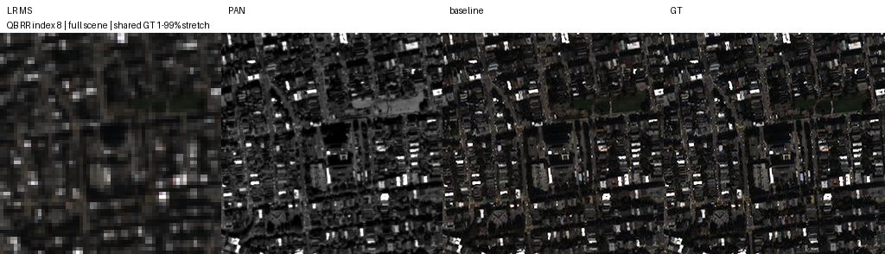

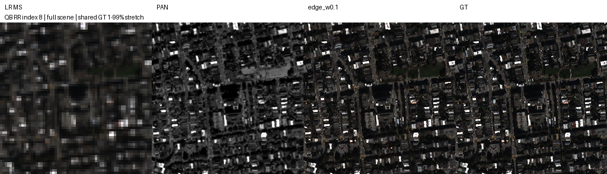

고정 RR 장면11 · 기준선과 edge0.1

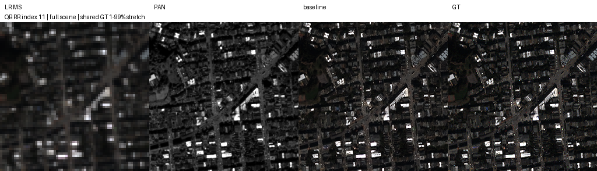

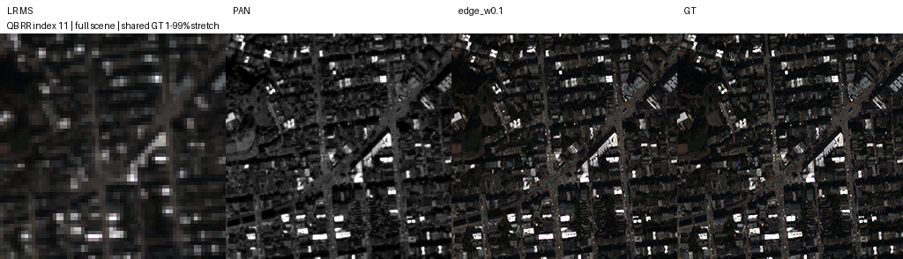

고정 RR 장면13 · 기준선과 edge0.1

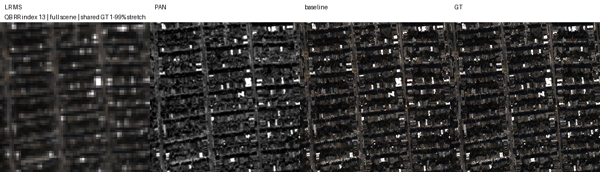

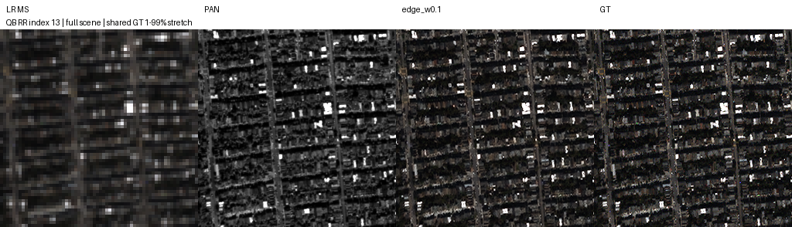

고정 RR 장면19 · 기준선과 edge0.1

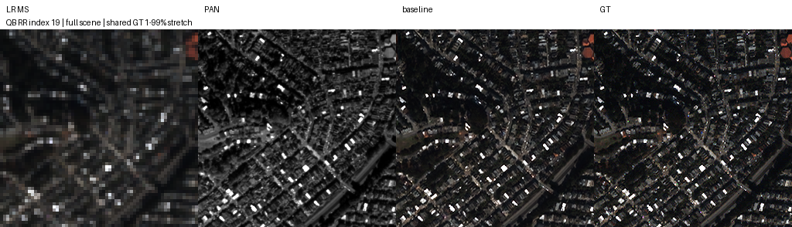

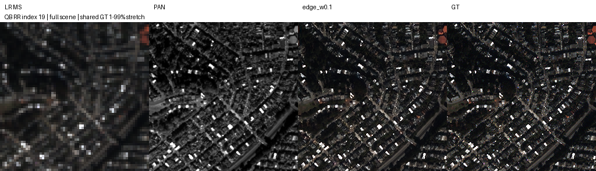

[사전 장면 선택 기록](../assets/windows_losses/scene_selection.json)의 모든5장면에 기준선·후보4패널 이미지를 보관했습니다. 일부 예시의 외관으로 전체 평가를 대신하지 않습니다.

## 7. 가중치와 검증 근거

**원본 best/latest20개**를 아래 Git 경로에 포함합니다. model·config·epoch·best MSE·Adam·CPU/CUDA/DataLoader RNG를 유지했고 추론 전용 파일로 변환하지 않았습니다. 각파일의 원본 SHA-256·크기·에폭은 [metrics.json](../assets/windows_losses/metrics.json), 실행 캐시5개를 제외한 원본88개 inventory는 [report_manifest.json](../assets/windows_losses/report_manifest.json)에 있습니다.

| 후보 | best / latest 에폭 | 원본 best | 원본 latest |
|---|---:|---|---|
| spectral 0.001 | 30 / 30 | [best](../assets/windows_losses/runs/02_spectral_w0.001_s42/best.pt) | [latest](../assets/windows_losses/runs/02_spectral_w0.001_s42/latest.pt) |
| spectral 0.01 | 30 / 30 | [best](../assets/windows_losses/runs/02_spectral_w0.01_s42/best.pt) | [latest](../assets/windows_losses/runs/02_spectral_w0.01_s42/latest.pt) |
| spectral 0.1 | 30 / 30 | [best](../assets/windows_losses/runs/02_spectral_w0.1_s42/best.pt) | [latest](../assets/windows_losses/runs/02_spectral_w0.1_s42/latest.pt) |
| consistency 0.001 | 30 / 30 | [best](../assets/windows_losses/runs/03_consistency_w0.001_s42/best.pt) | [latest](../assets/windows_losses/runs/03_consistency_w0.001_s42/latest.pt) |
| consistency 0.01 | 30 / 30 | [best](../assets/windows_losses/runs/03_consistency_w0.01_s42/best.pt) | [latest](../assets/windows_losses/runs/03_consistency_w0.01_s42/latest.pt) |
| consistency 0.1 | 30 / 30 | [best](../assets/windows_losses/runs/03_consistency_w0.1_s42/best.pt) | [latest](../assets/windows_losses/runs/03_consistency_w0.1_s42/latest.pt) |
| edge 0.001 | 30 / 30 | [best](../assets/windows_losses/runs/04_edge_w0.001_s42/best.pt) | [latest](../assets/windows_losses/runs/04_edge_w0.001_s42/latest.pt) |
| edge 0.01 | 30 / 30 | [best](../assets/windows_losses/runs/04_edge_w0.01_s42/best.pt) | [latest](../assets/windows_losses/runs/04_edge_w0.01_s42/latest.pt) |
| edge 0.1 | 30 / 30 | [best](../assets/windows_losses/runs/04_edge_w0.1_s42/best.pt) | [latest](../assets/windows_losses/runs/04_edge_w0.1_s42/latest.pt) |
| 최종 edge 연장 0.1 | 98 / 100 | [best](../assets/windows_losses/runs/05_final_candidate/best.pt) | [latest](../assets/windows_losses/runs/05_final_candidate/latest.pt) |

기존 기준선 원본12개는 [별도 기준선 보관](windows_k_baselines.md#evidence)에 그대로 유지합니다. 이번 평가 QB 기준선 best 해시는 기존 Git 파일과 일치합니다. [기준선 참조·100에폭 이력](../assets/windows_losses/baseline_reference.json)

평가 스크립트는 학습 실행 소스 inventory를 전후 확인하고 모델을 strict 로딩했습니다. 보관용 `source/`에는 실제 실행 코드·공식 network.py·QB 프로파일·평가 metric 구현을 복사했습니다. 학습 checkout과 현재 저장소 HEAD의 일치를 가정하지 않습니다. 원본 소스·Windows CRLF는 보관 파일에 그대로 유지합니다.

- 서버 원본: `C:\CtrS-budget-suite\SSA-MRN\experiments\controlled_suite_v2`
- 평가·보관 복사본: `C:\Users\trainer\windows_losses_20261010`
- 전송 ZIP: `C:\Users\trainer\windows_losses_20261010.zip`, SHA-256 `fb84f2033a7ed129fdb34a5fec5e76a556f3fe1bb2531725f530cb7cf051434f`
- [로컬·원격 검증 스크립트](../../scripts/verify_windows_losses.py) · [독립 평가·복구 실행 안내](../operations/windows_loss_review.md)

기존 실행 폴더·인계 경로 `C:\CtrS-controlled-suite`는 유지했습니다. 이번 작업에서 폴더 삭제·새 학습·서버 종료를 진행하지 않았습니다. 푸시 후 원격 복구 검증 결과는 별도 기록으로 추가합니다.

## 8. 한계와 다음 판단

**K4 기본 MSE 기준선을 유지하고 edge0.1의 종합 채택은 보류합니다.** 반복시드·다른 센서에서 SAM·FR 개선이 재현되는지, RR 정확도 손실을 줄일 수 있는지는 별도 실험 대상입니다. 이번 결과만으로 구조+손실의 결합 효과를 확정하지 않습니다.

시드42 하나,30에폭 선별 한계, 공개 QB test 재사용 이력을 함께 고려합니다. 시험 H520개 항목을 평가했지만 서로 독립된 원래 획득 장면20개라고 주장하지 않습니다. MATLAB Q2n/SCC·FR 구현 동등성도 완전히 검증되지 않았습니다. GF2·WV3와 K6의 전체 test 평가는 미완료입니다.

후속 학습은 사용자 승인 후 별도 실행 폴더에서 진행합니다. 기존 후보를 test 순위로 다시 선정하거나 현재 결과를 성공으로 단정하지 않습니다.
