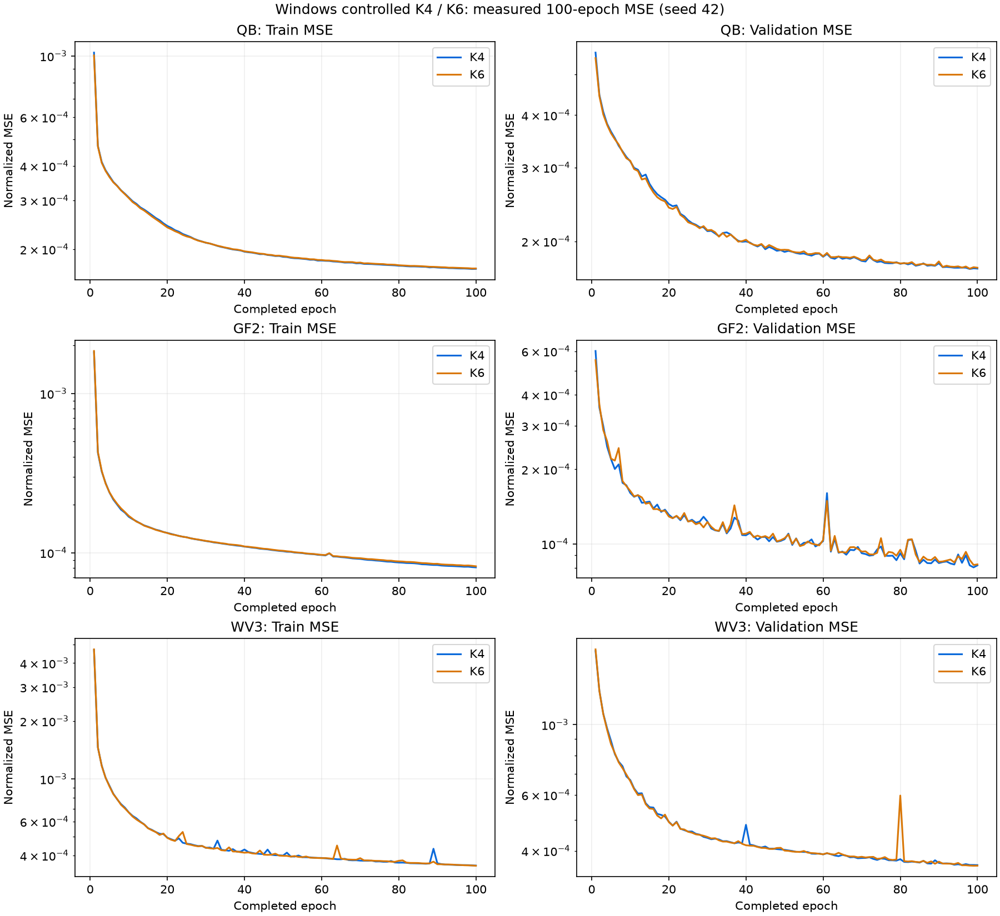

# Windows K4/K6 기준선 · 3센서 통제 비교

[실험 목록](../../README.md#experiments) · [수치](#results) · [그래프](#graphs) · [이미지](#images) · [가중치](#evidence)

| 비교 기준 | 이번에 바꾼 점 | 관측된 차이 | 판단 |
|---|---|---|---|
| 같은 Windows GPU·센서·분할·시드의 기준선 | SSAI 내부 차원 K4→K6 | validation에서 QB·GF2는 K4, WV3는 K6가 낮음 | 사전 규칙의 다수결 2:1로 손실 탐색 K4 선택 |

## 1. 목적과 상태

서로 다른 장치로 수행했던 과거 K4/K6 재현을 보완하는 **동일 환경 기준선 학습**입니다. QB·GF2·WV3 각각 K4/K6, 총 6개 모두 100에폭 완료했습니다. 2026-10-09 21:11 KST에 완료 기록·학습 이력과 실행 컨트롤러를 확인했습니다. 손실 탐색은 계속 실행 중입니다.

이번 보고서는 **학습 완료·validation 선택·원본 가중치 보관**의 중간 전달입니다. 독립 RR/FR test 평가와 성능 개선 확정은 아직 수행하지 않았습니다. GPU를 사용하는 추가 평가를 실행 중인 손실 학습에 겹쳐 시작하지 않았습니다.

## 2. 변경 사항과 평가 조건

| 항목 | 조건 |
|---|---|
| 서버 | Windows OpenSSH, RTX 3060 Ti 8GB, CUDA FP32·결정론 설정 |
| 입력 | PAN 1밴드, QB/GF2 MS 4밴드, WV3 MS 8밴드, 제공 LMS 유지 |
| 데이터 | 기존 PanCollection train/validation H5, 센서별 고정 분할·정규화 |
| 변경 변수 | SSAI 내부 특징 차원 K=4 또는 6, 모델 크기 변경 포함 |
| 최적화 | Adam, 고정 lr=1e-4, effective batch 32, micro batch 4의 gradient 누적 |
| 학습량 | 시드 42, 각 100에폭, 6개 직렬 실행, 기본 MSE |
| 가중치 선택 | best=min validation MSE, latest=마지막 완료 에폭 100 |

K에 따라 모수 배열의 크기가 다르므로 같은 시드가 모든 초기 가중치의 일치를 뜻하지는 않습니다. 실제 설정과 train/validation 경로는 run별 `config.json`과 [계획](../assets/windows_k_baselines/plan.json)에 남겼습니다. 체크포인트 안의 설정은 수정하지 않았습니다.

소스 inventory는 학습 중 고정된 파일들의 SHA-256이며 보관 시 서버 파일과 전부 일치했습니다. 실제 코드 복사본은 `docs/assets/windows_k_baselines/source/`에, 원래 Windows 경로를 포함한 inventory는 [source_hashes.json](../assets/windows_k_baselines/source_hashes.json)에 있습니다. 복사본은 실행 소스와 바이트가 같으며 현재 저장소 HEAD와 동일하다고 추정하지 않습니다.

## 3. 정량 결과

**낮을수록 좋은 best validation MSE**입니다. 차이는 K6−K4이며, 센서별 정규화가 달라 센서 간 원시 MSE를 합쳐 선택하지 않습니다.

| 센서 | K4 best validation MSE ↓ | K6 best validation MSE ↓ | 차이 K6−K4 | 센서별 선택 |
|---|---:|---:|---:|---|
| QB | 0.000171861819 | 0.000172164394 | +3.025750400e-07 | K4 |
| GF2 | 0.000080382687 | 0.000082206216 | +1.823529548e-06 | K4 |
| WV3 | 0.000360564225 | 0.000358851370 | -1.712855549e-06 | K6 |

사전에 고정한 센서별 다수결 규칙으로 **K4를 선택**했습니다. 동률은 K4이며 test는 선택에 사용하지 않았습니다. [컨트롤러 선택 원본](../assets/windows_k_baselines/baseline_selection.json)

## 4. 직전 연구와 수치 차이

위 표는 같은 서버에서 K를 비교한 validation 차이입니다. 과거 K4/CUDA A6000와 K6/DirectML Radeon 재현은 장치가 달라 이번 대조군으로 사용하지 않습니다. Linux K6 구조 연구와도 환경·micro batch가 달라 하나의 반복시드 평균으로 묶지 않습니다.

RR/FR PSNR·SAM·test MSE 차이는 **평가 전이므로 N/A**입니다. validation MSE의 우세를 모든 test 지표의 개선이나 K4의 보편적 우위로 해석하지 않습니다.

## 5. 그래프

각 run의 실제 `history.jsonl` 1~100에폭 기록으로 만든 MSE 곡선입니다. 센서별 y축 범위를 구분하고 로그 축을 사용했습니다. validation PSNR·SAM은 매 에폭 측정하지 않았으므로 곡선을 만들지 않았습니다.

두 번째 그래프는 **검증 비교**이며 test 성능 그래프가 아닙니다.

## 6. 결과 이미지 예시

독립 RR/FR 평가와 사전 고정 5장면의 예측 이미지는 아직 생성하지 않았습니다. 후속 평가 때 각 센서의 장면 ID·순서·seed를 고정하고 LR MS · PAN · 예측 · 정답을 공통 대비로 표시합니다. FR에는 고해상도 GT를 만들지 않습니다.

## 7. 가중치와 검증 근거

**실제 학습된 원본 best/latest 12개를 Git에 포함**했습니다. 추론용으로 변환하지 않았으며 model·config·epoch·best MSE·Adam·CPU/CUDA RNG·DataLoader RNG를 포함하는 재개 체크포인트입니다. 모든 run의 원본 설정·완료 JSON·100에폭 기록과 실제 학습 소스도 함께 보관했습니다.

| 모델 | best / latest 에폭 | 원본 best | 원본 latest |
|---|---|---|---|
| QB K4 | 98 / 100 | [best.pt](../assets/windows_k_baselines/runs/01_QB_k4_s42/best.pt) | [latest.pt](../assets/windows_k_baselines/runs/01_QB_k4_s42/latest.pt) |
| QB K6 | 98 / 100 | [best.pt](../assets/windows_k_baselines/runs/01_QB_k6_s42/best.pt) | [latest.pt](../assets/windows_k_baselines/runs/01_QB_k6_s42/latest.pt) |
| GF2 K4 | 99 / 100 | [best.pt](../assets/windows_k_baselines/runs/01_GF2_k4_s42/best.pt) | [latest.pt](../assets/windows_k_baselines/runs/01_GF2_k4_s42/latest.pt) |
| GF2 K6 | 99 / 100 | [best.pt](../assets/windows_k_baselines/runs/01_GF2_k6_s42/best.pt) | [latest.pt](../assets/windows_k_baselines/runs/01_GF2_k6_s42/latest.pt) |
| WV3 K4 | 100 / 100 | [best.pt](../assets/windows_k_baselines/runs/01_WV3_k4_s42/best.pt) | [latest.pt](../assets/windows_k_baselines/runs/01_WV3_k4_s42/latest.pt) |
| WV3 K6 | 99 / 100 | [best.pt](../assets/windows_k_baselines/runs/01_WV3_k6_s42/best.pt) | [latest.pt](../assets/windows_k_baselines/runs/01_WV3_k6_s42/latest.pt) |

[파일별 크기·SHA-256·체크포인트 검증 기록](../assets/windows_k_baselines/manifest.json) · [가중치와 기록 검증 스크립트](../../scripts/verify_windows_k_baselines.py)

서버에서 CPU `torch.load(weights_only=True)`로 12개 모두 설정·에폭·최저 validation MSE·원본 상태 키를 확인했고, 내려받은 46개 파일을 서버 SHA-256과 대조했습니다. 코드·데이터·공용 환경을 수정하지 않았습니다. 원본 서버 결과와 `C:\CtrS-controlled-suite` 인계 경로는 유지합니다. 원격 푸시 후 복구 검증은 별도 기록으로 남깁니다.

## 8. 한계와 다음 판단

단일 시드 42의 validation 결과입니다. K4는 이번 3센서 선택 규칙에 따른 손실 탐색 설정이며 모든 센서·지표의 최종 우승 모델을 뜻하지 않습니다.

현재 K4로 QB 손실 9개를 선별 중이며 최우수 후보를 latest 30→100에폭으로 이어 학습합니다. [전체 계획과 확인 상태](windows_controlled.md)에 따라 최종 후보를 같은 학습량의 QB 기준선과 평가합니다. 학습 중단·재시작·조건 변경은 이번 전달에 포함하지 않았습니다. 원격 보관과 복구 검증 후에도 실제 참조가 남은 서버 폴더를 임의 정리하지 않습니다.
