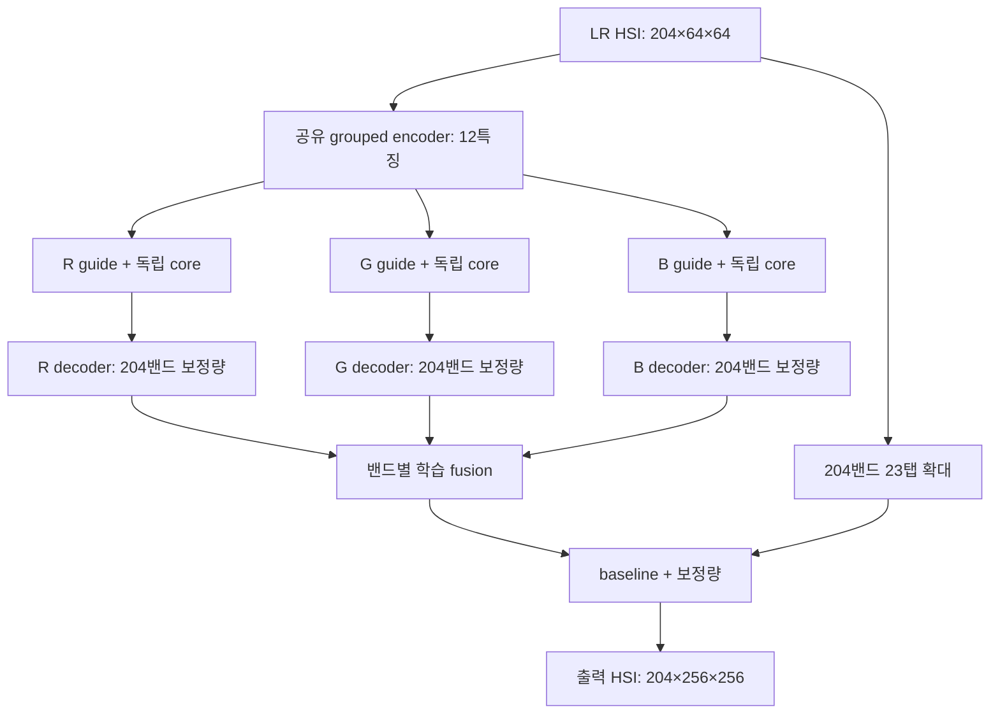
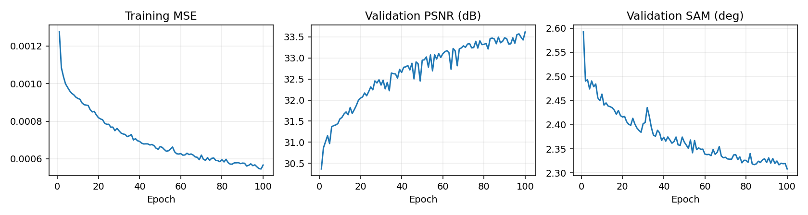
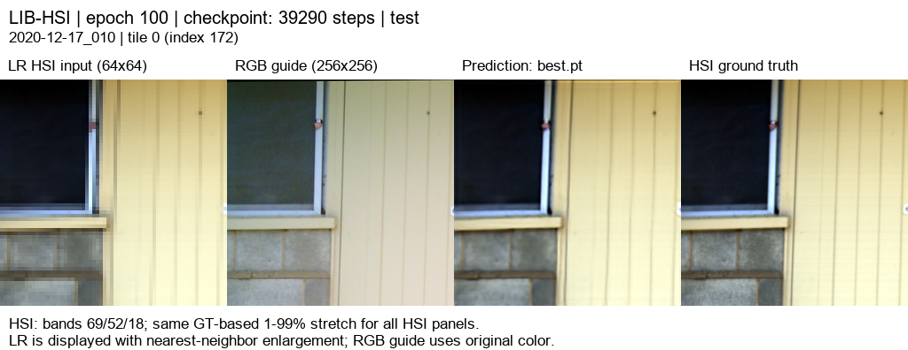

# SSA-MRN 연구 설명 · PAN–MS 재현에서 RGB별 12특징 HSI 복원까지

[현재 연구와 최신 결과](../../README.md) · [재현 연구](../reproduction.md) · [이전 RGB–HSI 실험](../previous_experiments.md)

문서 갱신: 2026-10-05. 실제 재현·확장 코드와 저장된 평가 결과를 기준으로 작성했습니다. 내부 23탭과 Bilinear의 완료 결과를 구분합니다. 최신 완료 결과는 README에서 확인합니다.

최신 RGB06은 12밴드씩 묶은 **17특징 + 분광 손실**입니다. 아래 12특징 설명은 이전 구조의 연산 설명이며 최신 변경·결과는 문서 끝과 [RGB06 보고서](../experiments/rgb06_triple17_spectral.md)를 참고합니다.

## 핵심 요약

기존 PAN–MS 팬샤프닝 모델의 실행과 학습·평가를 복원한 뒤, RGB 3채널과 HSI 204밴드를 이용하는 공간 초해상도로 확장했습니다. RGB04·05 구조는 HSI를 인접한 17밴드씩 12개 특징으로 학습 압축하고, R·G·B 각각의 독립 SSA-MRN 경로에서 204밴드 보정량을 생성합니다. 세 보정량을 밴드별로 융합해 204밴드의 23탭 보간 결과에 더합니다.

최근 완료 모델은 LIB-HSI test 75장면의 합성 ×4 평가에서 23탭 baseline보다 PSNR 4.5639 dB 상승, SAM 0.2601° 감소를 보였습니다. 내부 확대·축소를 PAN–MS 재현과 동일한 Bilinear로 변경한 실험을 완료했으며 직전 모델보다 PSNR 0.2633 dB 감소, SAM 0.0132° 증가했습니다. 이 결과는 합성 축소 조건의 복원 성능이며 실제 센서 HR-HSI 정확도를 입증한 결과는 아닙니다.

## 1. 연구 목적과 용어

RGB 픽셀은 R·G·B 세 값으로 표현됩니다. HSI 픽셀은 여러 파장에서 측정한 스펙트럼으로 표현되며, 현재 LIB-HSI에는 204밴드가 있습니다.

- RGB: `[R, G, B]`
- HSI: `[h₁, h₂, …, h₂₀₄]`
- 공간 해상도: 작은 경계와 구조를 얼마나 구분할 수 있는가.
- 분광 정보: 같은 위치의 파장별 값과 그 상대적인 형태.

연구 질문은 **고해상도 RGB의 공간 정보를 이용해 저해상도 HSI를 확대하면서, 204밴드 스펙트럼을 보존할 수 있는가**입니다. 연구 분야로는 RGB 유도 초분광 공간 초해상도 또는 RGB–HSI 영상 융합에 해당합니다.

## 2. 기존 PAN–MS 재현 연구

### 2.1 원래의 문제와 재현 범위

PAN–MS 팬샤프닝은 고해상도 단일 채널 PAN과 저해상도 다중분광 MS를 결합해 HRMS를 만드는 문제입니다. PAN은 공간 구조를, MS는 분광 관측값을 제공합니다. [공식 SSA-MRN 저장소](https://github.com/zhouchuanxu/SSA-MRN), [논문](https://doi.org/10.1109/JSTARS.2025.3543827)을 출발점으로 모델을 복구하고 학습·평가 파이프라인을 구성했습니다.

공식 forward는 저해상도 `ms`를 참조하면서 입력 인자로 받지 않는 문제가 있었습니다. [재현 래퍼](../../src/ssamrn/models/ssa_mrn.py)는 이를 명시적으로 전달하면서 원 모듈과 연산을 유지합니다.

재현 코드의 세 입력은 다음과 같습니다. 공간 크기는 설명용 예시이며 네트워크가 256에만 고정된 것은 아닙니다.

| 입력/출력 | 의미 | 4밴드, HR 256 예시 |
|---|---|---|
| PAN | 고해상도 가이드 | 1×256×256 |
| MS | 원래의 저해상도 분광 영상 | 4×64×64 |
| LMS | MS를 PAN 크기로 확대한 초기 영상 | 4×256×256 |
| HRMS | 복원 출력 | 4×256×256 |

**LMS는 학습 결과나 새 관측값이 아니라 보간 입력입니다.** 이전 저장 배열과 공식 보간 코드의 대조에서 23탭 `interp23` 계열임을 확인했으며 일반 Bicubic과 구분합니다. 이번 설명 작성에서 해당 배열 대조를 다시 수행한 것은 아닙니다. PAN–MS 학습 H5의 PAN/GT 패치는 64×64, MS는 16×16이었으며 시험 영상 크기와 구분합니다.

### 2.2 단계별 알고리즘

**① 가이드의 저주파 정보 생성.** PAN을 ¼로 축소했다가 재확대합니다. 원래 PAN과 공간 크기는 같지만 세부 정보는 줄어든 영상을 만들어 MS와 가까운 공간 수준의 정보도 제공합니다. 재현 코드의 내부 확대·축소는 Bilinear, `align_corners=True`입니다.

**② 초기 특징 추출.** LMS, 원래 PAN, 축소·재확대한 PAN의 특징을 결합합니다. 합성곱과 4개의 잔차 블록을 거쳐 공간·분광 정보를 공동으로 처리하고 LMS와 내부 잔차 결합을 수행합니다.

**③ 밴드별 SSAI.** 공통 분광 특징과 각 밴드를 결합하고 PAN 가이드 특징과의 상호작용으로 공간 가중치를 계산합니다. 같은 PAN 경계도 밴드에 따라 활용 방식이 다를 수 있으므로 밴드별 경로를 둡니다.

SSAI는 Spectral–Spatial Attention Integration입니다. 실제 재현은 공개 코드의 **원소별 곱, 공간축 전치, 공간 softmax**를 유지합니다. 논문에서 설명하는 어텐션 행렬곱과 완전히 같은 연산이라고 표현하지 않습니다.

**④ 여러 공간 해상도에서 처리.** HR가 256인 예시에서 256, 128, 64 격자의 SSAI 처리를 수행하고, 낮은 해상도에서 처리한 출력을 128과 256으로 확대하면서 이전 특징과 융합합니다. 세부 구조와 더 넓은 규모의 정보를 함께 이용하는 Multi-Resolution 구조입니다.

**⑤ HRMS 출력.** 단계적 융합의 결과를 네트워크 출력으로 반환합니다. 재현 모델에 내부 잔차 연결은 있지만, 확장 모델의 최종 `HSI baseline + 보정량` 구조와 구분합니다.

### 2.3 K=4·K=6 결과와 재현 한계

K는 SSAI 내부의 가이드·분광 특징 투영 차원입니다. 공개 구현은 K=4, 논문 기록은 K=6이므로 두 설정의 결과를 확보했습니다.

| 센서 | K4 RR PSNR ↑ | K6 RR PSNR ↑ | K4 RR SAM ↓ | K6 RR SAM ↓ |
|---|---:|---:|---:|---:|
| QuickBird | 37.3608 | 37.5040 | 4.9557° | 4.9350° |
| Gaofen2 | 46.3520 | 45.8631 | 0.9668° | 1.0035° |
| WorldView3 | 37.3894 | 37.6326 | 3.5277° | 3.4504° |

각 센서의 RR 시험 영상 20개 평균입니다. K4는 CUDA/A6000, K6는 DirectML/Radeon에서 학습하여 K만 바꾼 통제 실험은 아닙니다. K6이 모든 센서에서 우세하지도 않습니다. FR에는 HR 정답 없이 QNR/Dλ/Ds를 사용하며 RR 정답 기반 지표와 구분합니다.

PSNR 기준 peak·집계 방식, SCC 경계, Q2n MATLAB 일치성, FR PAN 축소 구현 차이가 남아 있습니다. 따라서 **공개 구현 기반 재현을 완료했다**고 설명하고 논문 구현·평가를 완전히 동일하게 재현했다고 주장하지 않습니다. PAN–MS PSNR과 RGB–HSI PSNR도 범위·집계가 달라 직접 비교하지 않습니다.

상세 수치·한계: [K4 보고서](../experiments/pan_k4.md), [K6 보고서](../experiments/pan_k6.md).

## 3. RGB–HSI 확장이 필요한 이유

| 항목 | PAN–MS 재현 | 현재 RGB–HSI |
|---|---|---|
| 가이드 | PAN 1채널 | RGB 3채널 |
| 분광 관측 | 주로 4·8밴드 | 204밴드 |
| 특징 처리 | 원 밴드별 SSAI | 압축 특징별 SSAI |
| 최종 출력 | 네트워크 HRMS 출력 | 204밴드 baseline + 보정량 |

204밴드에 원 밴드별 구조를 직접 적용하면 처리 경로와 중간 특징이 커집니다. RGB 또한 204밴드 전체를 직접 관측하지 못하므로, HSI의 관측값을 유지하면서 RGB를 공간 보정의 가이드로 이용합니다. 이는 기존 SSA-MRN의 단순 채널 변경을 넘어 입력·출력과 계산 경로를 바꾸는 확장입니다.

## 4. 데이터와 평가 문제 구성

### 4.1 LIB-HSI 및 타일

LIB-HSI는 원래 건물 외벽 재료의 분류·분할을 위해 공개된 데이터입니다. 우리는 이를 공간 초해상도 문제로 재구성합니다. [데이터셋 논문](https://arxiv.org/abs/2212.02749)

| 항목 | 설정/확인 수량 |
|---|---:|
| 전체 RGB–HSI 쌍 | 513장면 |
| 학습 / 검증 / 시험 | 393 / 45 / 75장면 |
| 원 공간 크기 / HSI 밴드 | 512×512 / 204 |
| 현재 HR 타일 / 합성 LR | 256×256 / 64×64 |
| 학습 / 검증 / 시험 타일 | 1,572 / 180 / 300 |

512 장면을 비중첩 256 타일 4개로 나눕니다. **타일이 많아도 독립 장면 수는 393/45/75개입니다.** 제공 분할의 촬영 위치·인접 장면 독립성은 별도 검증 대상입니다.

### 4.2 합성 축소 정량 평가

실제 관측 HSI보다 공간 해상도가 높은 정답은 확보되지 않았습니다. 관측 HSI의 256 타일을 평가용 GT로 두고, 4×4 평균 영역 축소로 64 LR 입력을 만듭니다.

```text
관측 HSI 256×256×204 ──→ 평가용 GT
             └── area ×4 축소 → 입력 HSI 64×64×204
대응 RGB 256×256×3 ─────→ 공간 가이드
```

이 평가는 관측 해상도를 기준으로 한 합성 ×4 복원입니다. 실제 센서의 관측 해상도보다 높은 HSI의 정확도를 증명하지 않습니다.

### 4.3 정합과 마스크

고정 projective 정합 manifest를 이용해 RGB를 HSI 격자에 대응시키고, 변환 후 유효하지 않은 영역은 마스크로 제외합니다. HR-HSI 참조 정보를 정합 추정에 활용했으므로, 실제 LR-HSI만 주어진 배포 상황에서 동일한 전처리 성능을 보장하지 않습니다.

[데이터 감사](../../references/rgb_hsi_datasets.md), [데이터 로더](../../src/ssamrn/data/lib_hsi.py), [정합 근거](../../experiments/results/lib_registration/projective_alignment.json).

## 5. RGB별 12특징 모델의 세부 구조

### 5.1 학습 가능한 분광 압축: 204→12

204 = 12×17입니다. 인접한 17밴드씩 그룹을 만들고 grouped 1×1 convolution으로 각 그룹을 한 특징으로 변환합니다.

```text
밴드 1~17 → 특징 1
밴드 18~34 → 특징 2
…
밴드 188~204 → 특징 12
```

j번째 특징은 해당 그룹의 17개 값에 학습 가중치와 편향을 적용한 선형 조합입니다. **17밴드의 단순 평균이 아닙니다.** 이 encoder는 공간 크기를 바꾸지 않아 `204×64×64 → 12×64×64`가 됩니다.

#### 학습하면서 무엇이 바뀌나?

각 그룹의 특징값은 `z = w₁x₁ + … + w₁₇x₁₇ + b`로 계산합니다. 단순 평균은 모든 가중치가 항상 `1/17`이지만, 현재 encoder의 가중치와 편향은 최종 204밴드 복원 오차를 줄이도록 학습 중 업데이트됩니다. 음수 가중치도 가능하고 가중치 합이 1일 필요도 없어, 정확히는 **학습 가능한 선형 조합**입니다. 같은 그룹의 모든 픽셀에 공통 가중치를 적용합니다.

`현재 가중치로 특징 생성 → RGB와 함께 최종 HSI 복원 → 정답과 오차 계산 → 역전파로 가중치·편향 수정`을 반복합니다. 원본 HSI 값은 변경하지 않습니다. 학습 완료 후 테스트에서는 저장된 가중치를 고정합니다.

12특징에 204밴드 정보가 모두 보존된다고 가정하지 않습니다. 이 압축 경로는 **보정량**을 만들고, 별도의 보간 경로가 204밴드 기본 영상을 전달합니다.

### 5.2 같은 HSI 특징을 RGB별 독립 core에 입력

초기 grouped12는 R/G/B에 4특징씩 배정했습니다. 현재 triple12는 R/G/B 각각이 12특징 전체를 처리합니다.

- 공유: HSI를 12특징으로 만드는 encoder.
- 독립: R·G·B 각각의 SSA-MRN core와 decoder.
- 각 core 입력: 해당 guide `1×256×256`, 23탭 확대 특징 `12×256×256`, LR 특징 `12×64×64`.
- 각 core 처리: 256→128→64→128→256의 다중 해상도 경로.

설계 가설은 특정 분광 그룹을 한 RGB 채널에만 배정하는 제약을 줄이면 활용 가능한 공간 정보가 늘어날 수 있다는 것입니다. 구조 자체의 효과는 동일 조건의 비교로 검증해야 합니다.

| 숫자 | 서로 다른 의미 |
|---|---|
| 204 | 최종 HSI 밴드 수 |
| 12 | 압축된 분광 특징 수 |
| K=4 | 각 SSAI 경로 내부 투영 특징 차원 |
| 3 | RGB별 독립 core 수 |

### 5.3 각 경로의 204밴드 보정량 생성

각 core의 12채널 출력을 별도 grouped decoder로 204채널 보정량으로 확장합니다. 특징 하나가 해당 그룹 17밴드의 보정량으로 변환됩니다.

```text
R core → R decoder → ΔR: 204밴드
G core → G decoder → ΔG: 204밴드
B core → B decoder → ΔB: 204밴드
```

그룹 제약은 계산을 줄이지만 보정량의 표현력을 제한할 수 있습니다. 압축 시 구분하기 어려운 분광 변화가 복원 성능을 제한하는지는 검증 대상입니다.

### 5.4 밴드별 RGB 보정량 융합

각 밴드의 ΔR/ΔG/ΔB를 grouped 1×1 convolution으로 결합합니다.

`ΔH_b = α_R,b × ΔR_b + α_G,b × ΔG_b + α_B,b × ΔB_b + β_b`

계수는 학습되며 초기에는 RGB 경로를 동일 비중으로 시작합니다. 학습 후 고정 평균은 아니며, 현재 계수는 **밴드별 학습 계수**입니다. 픽셀마다 별도로 결정되는 동적 RGB 선택 가중치는 아닙니다.

### 5.5 최종 출력: 204밴드 baseline + 보정량

**예측 HSI = 204밴드 LR-HSI의 23탭 확대 + 학습된 204밴드 보정량**

204밴드 전체의 보간 결과를 유지하고, 12특징은 보정 경로에서 활용합니다. 따라서 204밴드 결과를 12밴드 영상으로 대체하는 구조가 아닙니다.



연산 근거: [RGB 모델](../../src/ssamrn/models/rgb_grouped.py), [23탭 보간](../../src/ssamrn/models/interp23.py).

## 6. 학습과 지표

| 항목 | 현재 설정 |
|---|---|
| 손실 | 유효 영역의 전체 204밴드 MSE |
| Optimizer / 학습률 | Adam / 1e-4 |
| 최대 epoch / 학습 배치 | 100 / 4 |
| 증강 | RGB·HSI·마스크 동시 좌우/상하 반전 |
| best 선택 | 검증 장면 평균 MSE 최소 |
| 최종 평가 | 별도 test 75장면 |
| 장치·연산 | RTX 3060 Ti 8GB, CUDA, AMP |

학습 손실은 유효 영역에서 예측과 GT의 제곱 차이를 모든 밴드에 대해 평균한 값입니다. SAM 손실을 추가한 학습은 아직 하지 않았습니다.

- PSNR: 전체 값 오차, 높을수록 좋음. 현재 RGB–HSI는 data range=1.
- SAM: 픽셀별 204밴드 벡터 사이의 각도, 낮을수록 좋음. zero GT 스펙트럼은 제외.
- 장면 안에서 오차를 집계한 뒤 장면별 지표를 평균. 타일 수를 독립 장면 수로 사용하지 않음.

MSE를 줄이면서 스펙트럼 방향의 오차가 커질 수 있으므로 PSNR과 SAM을 함께 봅니다. 100 epoch는 학습 예산이며 데이터 부족으로 결정되는 값이 아닙니다. best 선택과 최종 test를 구분합니다.

## 7. 확보한 결과와 해석

### 7.1 연구 이력

| 연구 | 주요 변경 | Test PSNR ↑ | Test SAM ↓ |
|---|---|---:|---:|
| 초기 RGB–HSI | 204→8 dense, Bicubic, 128타일 | 32.3048 | 2.3161° |
| 정합 보정 | translation, 256타일 | 32.4817 | 2.3121° |
| grouped12 | 17밴드씩 압축, K4, 23탭, full256 | 30.7574 | 2.0893° |
| RGB별 triple12 | RGB별 12특징, 256 tiles | 34.0530 | 2.2057° |

**연구 이력이며 통제된 순위표가 아닙니다.** 정합·축소·특징 수·K·평가 방법이 단계마다 달라졌습니다. full256은 512 장면을 256으로 축소한 평가인 반면 tiles는 원 해상도의 256 부분영역 평가입니다. triple12−grouped12의 PSNR +3.2956 dB와 SAM +0.1164°를 구조만의 효과로 해석할 수 없습니다.

### 7.2 최근 완료 triple12 vs 같은 입력의 baseline

| 방법 | MSE ↓ | PSNR ↑ | SAM ↓ |
|---|---:|---:|---:|
| 23탭 보간 | 0.0013944695 | 29.2259 dB | 2.4790° |
| RGB별 triple12 | 0.0005064195 | 33.7897 dB | 2.2190° |
| 차이 | 약 63.7% 감소 | +4.5639 dB | −0.2601° |

이는 정합된 LIB-HSI의 합성 area ×4 조건에서 학습 모델이 23탭 보간보다 전체 값 오차와 분광 각도 오차를 줄였음을 보여줍니다. 이 비교만으로 RGB별 독립 경로가 개선의 원인임을 분리해 증명하지는 않습니다. HSI-only 및 동일 타일 조건의 단일 core 비교가 필요합니다.

[전체 75장면 수치](../../experiments/results/rgb05_triple12_bilinear/test/metrics.json), [완료 실험 보고서](../experiments/rgb05_triple12_bilinear.md).



### 7.3 결과 그림이 보여주는 범위



왼쪽부터 LR HSI, RGB guide, 예측, GT입니다. HSI 0-based 69/52/18 밴드를 R/G/B 표시 채널로 사용하고, 모든 HSI 패널에 동일 GT 기반 1–99% 대비 범위를 적용합니다. 지표는 대비 조정 전의 전체 204밴드로 계산합니다.

그림은 선택한 3밴드의 공간 구조를 보여줍니다. 전체 밴드의 성능은 밴드별 영상·오차 지도·스펙트럼 곡선·전체 지표에서 확인해야 합니다. 사전 선택한 [test 예시 5종](../experiments/rgb05_triple12_bilinear.md#6-결과-이미지-예시)을 함께 보존합니다.

## 8. 후속 실험: 내부 보간의 영향 분리

| 연산 | 완료 triple12 | 후속 triple12 |
|---|---|---|
| HSI 합성 LR | area ×4 | 동일 |
| 204밴드 baseline / 초기 특징 LMS | 23탭 | 동일 |
| core 내부 guide·특징 축소 | 평균 풀링 | Bilinear |
| core 내부 guide·특징 확대 | 23탭 | Bilinear |
| Bilinear 좌표 설정 | — | align_corners=True |
| 구조 / 파라미터 | triple12 / 1,950,186 | 동일 |
| train·validation·test / 타일 | 393·45·75 / 256 tiles | 동일 |

연구 질문은 **동일 구조·평가 조건에서 내부 resampling 연산이 공간·분광 복원에 미치는 영향**입니다. Bilinear가 더 좋다고 전제하지 않으며, 재현 모델과 달라진 연산을 통제해 검사합니다. area 입력 축소·분광 압축·최종 residual까지 원 PAN–MS와 같아진 것은 아닙니다.

최종 best epoch 100의 동일 test 75장면 평가에서 PSNR은 34.0530→33.7897 dB, SAM은 2.2057→2.2190°였습니다. 이번 학습에서는 내부 Bilinear 변경이 개선으로 이어지지 않았습니다. 장면 ID·순서·baseline·평가 프로토콜을 대조했으며 단일 seed라는 한계가 있습니다. [완료 보고서](../experiments/rgb05_triple12_bilinear.md).

## 9. 성과와 다음 검증

### 확보한 성과

1. 공식 PAN–MS 모델의 실행 복구와 학습·평가 파이프라인 구축.
2. K4·K6 결과 확보 및 논문/공개 구현 차이 기록.
3. RGB 3채널·HSI 204밴드 확장과 학습 가능한 12특징 압축.
4. RGB별 독립 core·decoder 및 밴드별 fusion 구현.
5. 완료 모델에서 같은 조건의 baseline 대비 PSNR·SAM 개선 확인.
6. 내부 보간의 영향을 분리하는 후속 실험 구성.

### 다음 검증

| 비교·분석 | 확인할 질문 |
|---|---|
| 같은 타일 조건의 단일 vs triple core | 독립 RGB 경로 자체가 도움이 되는가? |
| HSI-only | RGB guide의 실제 기여는 얼마나 되는가? |
| 내부 23탭 vs Bilinear | resampling 영향은 무엇인가? |
| 여러 seed | 단일 학습의 우연에 의존하는가? |
| 밴드별 지표·스펙트럼 | 특정 밴드 오차가 평균에 가려지는가? |
| 정합 오차 추가 | 센서 정렬 오차에 얼마나 민감한가? |
| 실제 LR 격자로 재투영 | 출력이 관측 HSI와 일관되는가? |

현재 검증 범위는 합성 공간 초해상도입니다. 구조의 우수성과 실제 센서 환경에서의 정확도는 추가 검증 대상입니다.

## 보충: 기존 재현과 현재 모델의 최종 출력 차이

기존 PAN–MS 재현에도 LMS를 내부 특징에 더하는 잔차 연산이 있습니다. 기존 모델이 처음부터 모든 값을 생성한다는 의미는 아닙니다. 기존 모델은 마지막 네트워크 출력 자체를 HRMS로 사용하고, 현재 확장 모델은 마지막 출력 지점에 `204밴드 23탭 보간 HSI + 학습된 204밴드 보정량`이라는 직접 경로를 둡니다.

특정 픽셀·밴드의 보간 값이 0.40이고 예측 보정량이 +0.03이면 최종 값은 0.43입니다. 보정량은 음수도 가능합니다. 별도의 보정량 정답을 제공하지 않고, 더한 최종 영상과 HSI 정답의 오차로 학습합니다. 보정량이 0이면 보간 결과가 그대로 출력됩니다. 이 구조 자체가 선명도 개선을 보장하는 것은 아니므로 동일 조건 비교가 필요합니다.


## 11. 최신 완료 · 17특징과 분광 방향 손실

204밴드를 인접12밴드씩 학습 압축해17특징으로 만들고 RGB별 독립 SSA-MRN 경로와204밴드 decoder/fusion을 사용합니다. 내부 평균 축소·23탭 확대를 복구했으며 입력 baseline과 최종204밴드 잔차 구조는 유지합니다.

정합 마스크 MSE에 λ=0.01의(1−cos) 스펙트럼 방향 손실을 더합니다. GT·예측 모두 norm>1e−6인 픽셀만 분광 항에 포함합니다. best 선택은 validation MSE입니다.

동일 test75장면에서 PSNR34.0611 dB/SAM2.2006°입니다. 12특징·23탭 대비 +0.0081 dB/−0.0051°로 차이가 작습니다. 여러 변경과 단일seed이므로 분광 손실만의 개선으로 주장하지 않습니다. [수치·그래프·5예시·204밴드 뷰어](../experiments/rgb06_triple17_spectral.md).
