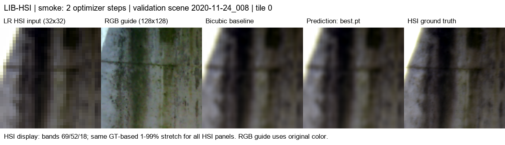
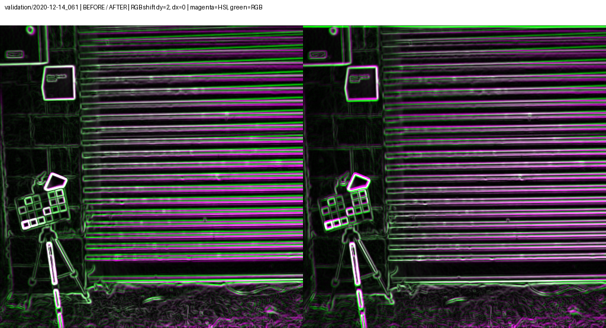

# LIB-HSI RGB–HSI 확장 연구

기존 PAN–MS SSA-MRN을 기반으로 RGB 유도 HSI 공간 초해상도 모델을 구현했습니다.
LIB-HSI에서 100 epoch 학습과 best 가중치의 전체 시험 평가를 완료했습니다.

## 모델 변경

| 항목 | 기존 PAN–MS | LIB RGB–HSI |
|---|---|---|
| 고해상도 guide | PAN 1채널 | RGB 3채널 |
| 저해상도 입력 | MS 4밴드 | HSI 204밴드 |
| SSA 처리 채널 | 실제 MS 밴드 | 학습 가능한 latent feature 8개 |
| 출력 | HR MS 4밴드 | HR HSI 204밴드 |
| 공간 배율 | x4 | 합성 x4 |

204밴드 LR HSI를 1×1 convolution으로 8채널에 투영하고, 보간한 feature와 RGB를
3단계 SSA-MRN에서 융합했습니다. RGB guide 입력은 3채널, SSAI 내부 차원은 K=6으로
설정했습니다. 1×1 decoder로 204밴드 보정값을 복원하고 bicubic HSI에 더하도록 구성했습니다.
latent feature는 특정 파장 밴드를 의미하지 않습니다. 기존 PAN–MS 모델의 기본 동작은
유지했으며, 확장 모델은 새 가중치로 초기화했습니다.

## 실험 구성

- LIB 배포 split인 train 393 / validation 45 / test 75쌍을 유지했습니다.
- 512×512 RGB와 204밴드 HSI를 사용했습니다. ENVI BIL HSI는 제공 코드와 동일하게
  시계 방향 90도 회전했으며, GT 반사율은 [0,1]로 clip했습니다.
- 128×128 GT를 antialiased bicubic으로 x4 축소해 32×32 LR HSI를 생성했습니다.
  별도 Gaussian blur는 적용하지 않았습니다.
- 학습은 장면별 random crop 4개와 공동 flip으로 epoch당 1,572패치를 사용했습니다.
  검증과 시험은 장면별 비중첩 타일 16개로 전체 영역을 평가하도록 구성했습니다.
- 204밴드 MSE로 학습하고, 검증 장면 평균 MSE가 가장 낮은 `best.pt`를 재개와 평가에
  사용하도록 설정했습니다. 기본 설정은 100 epochs, lr=1e-4, 유효 배치 4, seed=42입니다.
- PSNR은 data range=1의 장면 전체 MSE를 기준으로 장면 평균을 계산했습니다.
  SAM은 GT spectrum norm ≤1e-6인 픽셀을 제외했으며, 평가 시 예측값은 clip하지 않았습니다.

원본 RGB와 HSI의 해상도가 같아 **합성 공간 초해상도**로 구성했습니다.
실제 저해상도 센서에 대한 일반화, RGB–HSI 정합 정확도, 촬영 위치·날짜 단위 split 누출은
추가 검증이 필요합니다. Agro/BUSI 로더와 통합 학습은 이번 구현에 포함하지 않았습니다.

## 학습 속도 최적화

| 변경 | 목적 및 검증 |
|---|---|
| 실제 batch 1×누적 4 → batch 4×누적 1 | 유효 배치 4를 유지하면서 GPU 병렬 처리를 늘렸습니다. |
| SSA 8개 분기를 grouped convolution과 batched softmax로 통합 | 반복 연산을 줄였으며, 기존 분기와 출력·gradient 일치를 검증했습니다. |
| BIL 부분 읽기와 장면별 캐시 | 필요한 행을 64행 구간으로 읽어 전체 큐브 읽기·회전을 줄였습니다. float32를 유지하고 원래 로더와 픽셀 일치를 확인했습니다. |
| persistent workers 2개, prefetch 2, pinned memory, 별도 CUDA stream | 데이터 읽기·전처리·GPU 전송을 겹쳤습니다. 같은 장면의 패치를 배치로 묶어 재읽기를 줄였습니다. |
| float32 GPU x4 열화 | CPU 전처리 부담을 줄였으며, CPU/CUDA 결과 일치를 검증했습니다. |
| AMP, fused Adam, cuDNN autotuning | GPU 연산을 최적화했습니다. channels_last는 측정에서 느려 비활성화했습니다. |
| GPU 검증 지표 누적 및 step별 CPU 동기화 축소 | 매 step의 loss.item()과 지표 전송으로 생기는 대기를 줄였습니다. |

crop·flip·장면 순서는 seed/epoch/index로 생성해 재개 순서를 유지하도록 구성했습니다.
AMP와 autotuning으로 비트 단위 동일 결과를 보장하지는 않습니다.

## 측정 결과와 한계

Ryzen 5600X, RTX 3060 Ti 8GB, RAM 16GB, Samsung T7 Shield에서
PyTorch 2.7.1+cu128로 측정했습니다.

| 측정 | 결과 |
|---|---:|
| 이전 학습 로그의 epoch 시간 | 약 1,050초 |
| 최적화 후 전체 데이터 검증 epoch 1 / 2 | 114.75초 / 108.53초 |
| 새 본학습 epoch 1 / 2 | 117.92초 / 111.53초 |
| 최적화 검증의 peak allocated GPU memory | 약 1,453MiB |
| 큐브 요청 읽기량(전체 읽기 → 부분 읽기) | 약 87.26 → 71.57GiB/epoch |
| I/O 제외 CUDA 처리량(기존 batch 1 → grouped batch 4) | 13.3 → 150.0패치/초 |

전체 데이터와 패치 수를 유지한 상태에서 속도 향상을 확인했습니다. 다만 이전 로그와
새 실행은 완전히 통제된 동일 조건 비교가 아니므로 모든 차이를 코드 변경의 효과로
해석할 수는 없습니다. 요청 읽기량은 OS cache를 반영한 실제 디스크 전송량과 다르며,
최적화 후에도 데이터 읽기 대기가 남았습니다.

본학습 첫 두 epoch의 validation PSNR은 30.429 / 30.548dB로 bicubic 30.061dB보다
높았습니다. SAM은 모델 2.446 / 2.450°, bicubic 2.441°로 아직 개선되지 않았습니다.
전체 시험 평가에서 PSNR 32.3048 dB, SAM 2.3161°를 확인했습니다. 상세 결과와 이미지는 [README](../README.md#100-epoch-학습-결과)에 정리했습니다. SSIM/ERGAS, HSI-only ablation과 여러 seed 비교는 추가 검증이 필요합니다.
측정 상세는 [benchmark JSON](benchmarks/lib_rgb_hsi_optimization.json)에 기록했습니다.

## 초기 실행 확인 이미지

optimizer 2회 실행 후 저장한 best 가중치로 validation 128×128 패치를 시각화했습니다.
왼쪽부터 LR HSI, RGB guide, bicubic, prediction, HSI GT입니다.
HSI는 0-based bands 69/52/18과 공통 GT 기반 1–99% stretch로 표시했습니다.
최적화 본학습 완료 모델의 결과가 아닌 초기 실행 확인 자료입니다.

## RGB–HSI 정합 보정

HSI의 90도 회전 이후에도 남는 위치 차이를 검사하도록 `scripts/register_lib.py`를 추가했습니다.
HSI 표시용 가시광 밴드(69/52/18)와 RGB의 경계 강도를 비교하고, ±12픽셀 안의
정수 평행이동을 추정했습니다. 네 구역 중 세 구역 이상에서 이동량이 2픽셀 이내로
일치하고, 경계 NCC가 0.25 이상이며 0.01 이상 개선되는 경우만 RGB를 보정했습니다.
경계값에 걸린 이동이나 불확실한 장면은 원본을 유지했습니다.

보정량은 학습 전에 장면별 JSON으로 고정했습니다. HSI GT와 204밴드 스펙트럼은
재보간하지 않았으며 RGB만 이동했습니다. 학습 패치는 유효 영역에서 선택하고,
검증·시험에서는 이동으로 생긴 빈 테두리를 모델과 Bicubic 모두의 MSE·PSNR·SAM에서
제외했습니다. 기존 정합 없는 결과와 평가 영역이 다르므로 수치를 직접 혼합하지 않습니다.

정합 설정 `configs/lib_rgb_hsi_aligned.json`은 별도 결과 폴더를 사용합니다.
VS Code의 `LIB: train aligned (new run)`으로 새 학습을 시작할 수 있습니다.
기존 정합 없는 가중치의 재개는 설정 및 manifest 해시 검사로 차단했습니다.

현재 방식은 **정수 픽셀의 평행이동**만 다룹니다. 서브픽셀 이동, 회전·스케일,
비선형 왜곡과 장면 깊이에 따른 시차는 보정하지 않았습니다. 자동 점수는 정합의
완전성을 증명하지 않으며, 보정 거절 장면은 육안 검토가 필요합니다.
또한 정합 추정에 HR HSI를 사용하므로 시험 정합은 GT 기반 전처리입니다.
실제 LR HSI 센서 환경의 정합 성능으로 주장하지 않으며, 해당 환경에서는 LR HSI만으로
추정하는 별도 프로토콜이 필요합니다. 기존 100 epoch 시험 결과는 정합 보정 전 결과입니다.

전체 513개 장면을 검사하여 162개에 보정을 적용했습니다. 적용 이동 범위는 세로 −6~+5픽셀, 가로 −2~+1픽셀입니다. 경계 NCC 중앙값은 0.5760에서 0.5905로 변화했습니다. 아래 예시는 개선 폭이 가장 큰 검증 장면을 선택했으며 전체를 대표하지 않습니다.

보라색은 HSI 경계, 초록색은 RGB 경계이며 왼쪽은 보정 전, 오른쪽은 보정 후입니다. 자동 측정 결과는 [장면별 manifest](../experiments/results/lib_registration/alignment.json)에 기록했습니다.
## 64×64 → 256×256 실험 설정

정합 보정을 사용하는 별도 설정 `configs/lib_rgb_hsi_aligned_256.json`을 추가했습니다.
원본 512×512 HSI에서 256×256 GT 패치를 자르고, 동일한 antialiased bicubic x4 열화로
64×64 LR HSI를 생성합니다. RGB guide와 출력은 256×256입니다.

실제 batch 4, gradient accumulation 1(유효 배치 4),
검증 batch 2, worker별 prefetch 1로 설정했습니다. 장면별 학습 패치 수는 4개를 유지하고,
검증·시험은 장면별 256×256 비중첩 타일 4개를 사용합니다. 정합으로 생긴 빈 테두리는
기존과 동일하게 평가에서 제외합니다. 128 패치 실험보다 패치 면적이 4배이며,
타일 경계와 문맥이 달라 지표가 달라질 수 있습니다.

학습 결과는 `lib_rgb_hsi_aligned_256_b4`에 별도 저장하며 기존 128 패치 가중치로 재개하지 않습니다.
이전 batch 1×누적 4 설정은 실제 CUDA에서 train 2장면·validation 1장면의 제한된 1 epoch를 완료했습니다. batch 4 설정도 train 8장면·validation 2장면에서 2 epoch 학습·검증을 통과했습니다. 최대 할당 GPU 메모리는 약 1,928MiB, 예약 메모리는 약 2,750MiB였습니다. 같은 소규모 측정의 두 번째 epoch에서 batch 1×누적 4는 10.10패치/초, batch 4×누적 1은 8.09패치/초로 batch 4의 속도 향상은 확인하지 못했습니다. 순차 실행의 OS cache 및 시작 비용 영향을 받는 제한된 측정이며 전체 학습 속도를 보장하지 않습니다. [측정 기록](benchmarks/lib_256_batch_comparison.json)을 함께 저장했습니다.
이는 실행·메모리 검증이며 학습 성능 검증 결과는 아닙니다.
## 장시간 실행의 CUDA 예약 메모리 증가 수정

기존 전송 코드가 iterator마다 새 CUDA stream을 생성해 stream별 allocator cache가
반복 생성되는 문제를 재현했습니다. 모델 없이 batch 4의 204밴드 256×256 데이터를
12회 전송해도 예약 메모리가 458→5,474MiB로 증가했습니다. 사용 중인 tensor 메모리는
반복 종료 후 0으로 돌아와 모델·gradient 누적과 구분했습니다.

장치별 전송 stream을 한 번 생성하고 학습·검증·epoch 전환에서 재사용하도록 수정했습니다.
동일 실험에서 예약 메모리는 472MiB로 안정화됐으며, 실제 train 8장면·validation 2장면의
12 epoch 검증에서는 2 epoch 이후 2,262MiB를 유지했습니다. 학습 프로토콜과 가중치 구조는
변경하지 않았습니다. 현재 할당·예약 메모리도 로그에 추가했고, iterator 반복의 stream 재사용과
메모리 안정화를 확인하는 CUDA 회귀 테스트를 추가했습니다.

[재현 및 검증 기록](benchmarks/lib_cuda_stream_memory.json)을 저장했습니다.
전체 100 epoch의 장시간 검증을 대신하는 결과는 아니며, GPU 공유 메모리 사용 여부와
속도 저하의 모든 원인을 분리 측정한 결과도 아닙니다. PyTorch의 [stream별 메모리 재사용 규칙](https://docs.pytorch.org/docs/stable/generated/torch.Tensor.record_stream.html)을 따랐습니다.
