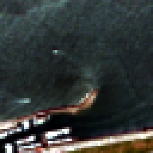
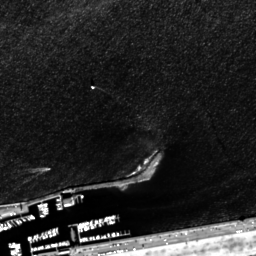

# QuickBird 스모크 테스트 결과

`test_qb_multiExm1.h5`의 첫 번째 샘플(`index=0`) **전체**를 사용합니다. H5의 샘플 자체는 PAN·LMS 256×256, MS 64×64로 구성된 패치이며 위성 원본 장면 전체는 아닙니다. 32×32 실행은 그 패치의 왼쪽 위를 자르는 대신 PAN·LMS를 32×32, MS를 8×8로 면적 보간해 축소합니다. 256×256 실행은 원래 크기 그대로 사용합니다.

| 실행 크기 | 입력 MS RGB 합성 | 입력 PAN | 출력 MS RGB 합성 | 출력 원본 4밴드 |
| --- | --- | --- | --- | --- |
| 32: MS 8×8, PAN 32×32 | [ms_input_rgb_32.png](./ms_input_rgb_32.png) | [pan_input_32.png](./pan_input_32.png) | [random_output_preview_32.png](./random_output_preview_32.png) | [random_output_32.npy](./random_output_32.npy) |
| 256: MS 64×64, PAN 256×256 | [ms_input_rgb_256.png](./ms_input_rgb_256.png) | [pan_input_256.png](./pan_input_256.png) | [random_output_preview_256.png](./random_output_preview_256.png) | [random_output_256.npy](./random_output_256.npy) |

입력 MS 4밴드와 출력 MS 4밴드의 PNG는 [QuickBird 제품 가이드](https://engineering.purdue.edu/~bethel/qbguide.pdf)에 나온 Blue·Green·Red·NIR 순서를 H5에도 적용한다고 **가정**하고, 3·2·1번 밴드를 R·G·B로 합성했습니다. H5에는 밴드 이름 메타데이터가 없습니다. 저해상도 MS는 화면 비교를 위해 최근접 보간으로 출력 크기까지 확대했으며, **모델 입력은 표에 적힌 8×8 또는 64×64 그대로**입니다. PNG는 각각 대비를 조정한 표시용이므로 절대 색값 비교에 쓰지 않습니다.

| 입력 MS RGB (64×64 → 보기용 256×256) | 입력 PAN (256×256) | 출력 MS RGB (256×256) |
| --- | --- | --- |
|  |  |  |

모델은 학습된 체크포인트 없이 `seed=0`으로 무작위 초기화했습니다. **출력은 실행 확인용이며 복원 품질이나 논문 성능을 보여주지 않습니다.** `.npy` 파일에는 전체 4밴드가 `float32`, `C×H×W`로 저장됩니다.

재실행은 `SSA-MRN/`에서 다음 명령을 사용합니다.

```bash
python scripts/smoke_test.py --size 32 --seed 0
python scripts/smoke_test.py --size 256 --seed 0
```

입력 데이터는 `data/raw/QuickBird/test_qb_multiExm1.h5`이며, 실행 시 같은 이름의 결과 파일을 덮어씁니다. 학습 후 실제 복원 결과는 별도 실험 폴더와 체크포인트·설정·평가 지표를 함께 기록해야 합니다.
