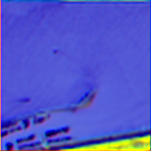

# QuickBird 스모크 테스트 결과

`test_qb_multiExm1.h5`의 첫 번째 샘플(`index=0`)을 사용해 복구 모델의 실행과 파일 저장을 확인한 결과입니다. 학습된 체크포인트는 사용하지 않았고, 모델은 `seed=0`으로 무작위 초기화했습니다. **복원 품질이나 논문 성능을 보여주는 결과가 아닙니다.**

| 입력 크기(PAN/LMS) | 4밴드 배열 | 화면 확인용 PNG |
| --- | --- | --- |
| 32×32 | [random_output_32.npy](./random_output_32.npy) | [random_output_preview_32.png](./random_output_preview_32.png) |
| 256×256 | [random_output_256.npy](./random_output_256.npy) | [random_output_preview_256.png](./random_output_preview_256.png) |

`.npy`는 모델 출력 전체 4밴드를 `float32`, `C×H×W`로 저장합니다. PNG는 앞의 3밴드를 대비 조정해 표시한 이미지로, 센서 보정된 RGB 영상이 아닙니다.



재실행은 `SSA-MRN/`에서 다음 명령을 사용합니다.

```bash
python scripts/smoke_test.py --crop 32 --seed 0
python scripts/smoke_test.py --crop 256 --seed 0
```

입력 데이터는 `data/raw/QuickBird/test_qb_multiExm1.h5`이며, 실행 시 같은 이름의 결과 파일을 덮어씁니다. 학습 후 실제 복원 결과는 별도 실험 폴더와 체크포인트·설정·평가 지표를 함께 기록해야 합니다.
