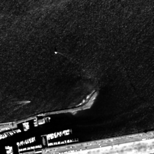
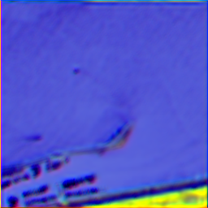

# QuickBird 스모크 테스트

## 목적

무작위 초기화 모델의 입력·출력 크기와 실행 경로를 확인한 기록입니다. **학습 결과나 복원 품질을 보여주지 않습니다.** 입력은 `test_qb_multiExm1.h5`의 첫 패치(`index=0`)이며, 위성 원본 장면 전체가 아닙니다.

## 실행 조건과 결과

원래 패치는 PAN·LMS 256×256, MS 64×64입니다. `--size 32`는 PAN·LMS를 32×32, MS를 8×8로 면적 보간해 축소합니다. `--size 256`은 전체 패치를 그대로 사용합니다. 모델은 `seed=0`으로 초기화했습니다.

| 실행 크기 | 입력 MS | PAN·출력 | 저장 파일 접미사 |
| --- | ---: | ---: | --- |
| 32 | 8×8 | 32×32 | `_32` |
| 256 | 64×64 | 256×256 | `_256` |

  

각 크기의 입력 MS·PAN·출력 미리보기 PNG와 전체 4밴드 `random_output_*.npy`가 이 폴더에 있습니다. MS는 화면 비교를 위해서만 확대했습니다. RGB는 H5에서도 Blue·Green·Red·NIR 순서가 유지됐다고 **가정**해 합성했으며, PNG 대비는 각각 조정했습니다. 색값을 직접 비교하지 마세요. `.npy`는 `float32`, `C×H×W` 배열입니다.

## 재실행

`SSA-MRN/`에서 입력 H5를 `data/raw/QuickBird/test_qb_multiExm1.h5`에 둔 뒤 실행합니다. 같은 이름의 결과 파일은 덮어써집니다.

```bash
python scripts/smoke_test.py --size 32 --seed 0
python scripts/smoke_test.py --size 256 --seed 0
```
